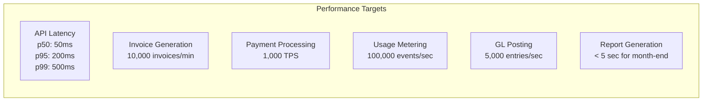

# ERP-Finance Technical Specifications

## Document Information

| Field | Value |
|-------|-------|
| Module | ERP-Finance |
| Document Type | Technical Specifications |
| Version | 1.0.0 |
| Last Updated | 2026-02-23 |

## System Requirements

### Hardware Requirements (Production)

| Component | Minimum | Recommended |
|-----------|---------|-------------|
| CPU | 16 cores | 32+ cores |
| RAM | 32 GB | 64 GB |
| Storage (OLTP) | 500 GB SSD | 2 TB NVMe |
| Storage (OLAP) | 1 TB | 5 TB |
| Network | 1 Gbps | 10 Gbps |

### Software Dependencies

| Dependency | Version | Purpose |
|-----------|---------|---------|
| Go | 1.22+ | Gateway, GL, AP, AR, Tax, Expense, Treasury, Budget |
| Rust | 1.75+ | Billing engine, payments engine |
| Python | 3.12+ | Asset management, AI services |
| PostgreSQL | 16+ | Primary database |
| Redis | 7+ | Caching, rate limiting |
| ClickHouse | 24+ | OLAP analytics |
| NATS | 2.10+ | Event streaming (JetStream) |
| MinIO | Latest | Object storage |

## API Specifications

### Base URLs and Versioning

All APIs follow RESTful conventions with `/v1/` prefix. The gateway service runs on port 8090 and routes to internal services.

### Core Endpoints

```
GET  /healthz                    -- Health check
GET  /v1/capabilities            -- Module capabilities

# General Ledger
GET  /v1/general-ledger          -- GL operations root
POST /v1/general-ledger/accounts -- Create chart of account entry
GET  /v1/general-ledger/accounts -- List accounts
POST /v1/general-ledger/journals -- Create journal entry
GET  /v1/general-ledger/journals -- List journal entries
GET  /v1/general-ledger/trial-balance -- Generate trial balance
POST /v1/general-ledger/period-close  -- Close accounting period

# Accounts Payable
GET  /v1/accounts-payable         -- AP operations root
POST /v1/accounts-payable/vendors -- Create vendor
POST /v1/accounts-payable/invoices -- Create AP invoice
POST /v1/accounts-payable/matching -- 3-way match
POST /v1/accounts-payable/payment-runs -- Execute payment run
GET  /v1/accounts-payable/aging   -- AP aging report

# Accounts Receivable
GET  /v1/accounts-receivable      -- AR operations root
POST /v1/accounts-receivable/invoices -- Create AR invoice
POST /v1/accounts-receivable/credit-notes -- Create credit note
GET  /v1/accounts-receivable/aging -- AR aging report
POST /v1/accounts-receivable/dunning -- Execute dunning run

# Billing
GET  /health                      -- Billing health check
GET  /api/v1/plans                -- List plans
POST /api/v1/plans                -- Create plan
GET  /api/v1/plans/:id            -- Get plan
PUT  /api/v1/plans/:id            -- Update plan
GET  /api/v1/subscriptions        -- List subscriptions
POST /api/v1/subscriptions        -- Create subscription
GET  /api/v1/subscriptions/:id    -- Get subscription
POST /api/v1/subscriptions/:id/cancel -- Cancel subscription
POST /api/v1/usage                -- Record usage
GET  /api/v1/usage/:subscription_id -- Get usage
GET  /api/v1/invoices             -- List invoices
GET  /api/v1/invoices/:id         -- Get invoice
POST /api/v1/invoices/generate    -- Generate invoices

# Payments
GET  /health                       -- Payments health check
POST /api/v1/payments/initiate     -- Initiate payment
POST /api/v1/payments/verify       -- Verify payment
POST /api/v1/payments/webhook      -- Webhook handler
GET  /api/v1/transactions          -- List transactions
GET  /api/v1/transactions/:id      -- Get transaction
POST /api/v1/refunds               -- Create refund
GET  /api/v1/refunds               -- List refunds
POST /api/v1/wallets               -- Create wallet
GET  /api/v1/wallets               -- List wallets
GET  /api/v1/wallets/:id           -- Get wallet
POST /api/v1/wallets/:id/topup     -- Top up wallet
POST /api/v1/transfers             -- Create transfer

# Asset Management
GET  /api/v1/assets                -- List assets
POST /api/v1/assets                -- Create asset
GET  /api/v1/assets/:id            -- Get asset
PUT  /api/v1/assets/:id            -- Update asset
GET  /api/v1/assets/:id/depreciation -- Get depreciation schedule
POST /api/v1/assets/:id/depreciation -- Generate depreciation schedule
GET  /api/v1/maintenance           -- List maintenance records
POST /api/v1/maintenance           -- Create maintenance record
POST /api/v1/ai/health/:id        -- AI health analysis
POST /api/v1/ai/predictive/:id    -- Predictive maintenance
POST /api/v1/ai/depreciation/:id  -- Depreciation optimization
POST /api/v1/ai/fleet             -- Fleet analysis
POST /api/v1/ai/ask               -- AI Q&A

# Tax Management
GET  /v1/tax-management            -- Tax operations root
POST /v1/tax-management/calculate  -- Calculate tax
GET  /v1/tax-management/rates      -- Get tax rates
POST /v1/tax-management/returns    -- Submit tax return

# Expense Management
GET  /v1/expense-management        -- Expense operations root
POST /v1/expense-management/claims -- Submit expense claim
POST /v1/expense-management/receipts -- Upload receipt (OCR)
GET  /v1/expense-management/approvals -- Pending approvals

# Treasury
GET  /v1/treasury                   -- Treasury operations root
GET  /v1/treasury/cash-position     -- Cash position
POST /v1/treasury/reconciliation    -- Bank reconciliation
GET  /v1/treasury/fx-rates          -- FX rates

# Budget
GET  /v1/budget                     -- Budget operations root
POST /v1/budget/plans               -- Create budget plan
GET  /v1/budget/variance            -- Variance analysis
POST /v1/budget/scenarios           -- Create scenario
```

### Authentication

All business endpoints require a valid JWT token from ERP-IAM:

```
Authorization: Bearer <jwt_token>
X-Tenant-ID: <tenant_uuid>
```

### Request/Response Standards

All endpoints return JSON with standard envelope:

```json
{
  "data": {},
  "meta": {
    "request_id": "req_abc123",
    "timestamp": "2026-02-23T10:00:00Z"
  },
  "pagination": {
    "page": 1,
    "per_page": 20,
    "total": 150,
    "total_pages": 8
  }
}
```

### Error Response Format

```json
{
  "error": {
    "code": "INVOICE_NOT_FOUND",
    "message": "Invoice with ID abc-123 not found",
    "details": [],
    "request_id": "req_abc123"
  }
}
```

## Data Type Specifications

### Monetary Values

All monetary values use **integer representation in smallest currency unit** (cents for USD, kobo for NGN) to avoid floating-point precision issues. The `rust_decimal::Decimal` type is used in Rust services, and `NUMERIC(19,4)` in PostgreSQL.

### Date/Time Standards

- All timestamps in UTC, stored as `TIMESTAMP WITH TIME ZONE`
- Date-only fields use `DATE` type
- API responses use ISO 8601 format: `2026-02-23T10:00:00Z`
- Accounting periods use `YYYY-MM` format

### Identifier Standards

- All entity IDs use UUID v7 (time-ordered) for database-friendly sequential inserts
- Payment IDs use prefixed format: `pay_<24chars>` for Stripe compatibility
- Invoice numbers use sequential format: `INV-XXXXXX`
- Transaction references use format: `TXN-<uuid_v7>`

## Performance Specifications



### Concurrency and Rate Limits

| Operation | Rate Limit | Burst |
|-----------|-----------|-------|
| API reads | 1,000 req/sec/tenant | 2,000 |
| API writes | 100 req/sec/tenant | 200 |
| Usage events | 10,000 events/sec/tenant | 50,000 |
| Invoice generation | 100 invoices/sec/tenant | 500 |
| Payment initiation | 50 req/sec/tenant | 100 |
| Report generation | 10 req/min/tenant | 20 |

### Database Connection Pools

| Service | Max Connections | Idle Timeout |
|---------|----------------|--------------|
| Billing Service | 10 | 30 min |
| Payments Service | 10 | 30 min |
| Asset Management | configurable | 30 min |
| Go Services | 25 each | 30 min |

## Event Specifications

### CloudEvents Envelope

```json
{
  "specversion": "1.0",
  "id": "evt_abc123",
  "source": "erp.finance.billing",
  "type": "erp.finance.billing.created",
  "time": "2026-02-23T10:00:00Z",
  "datacontenttype": "application/json",
  "data": {
    "tenant_id": "uuid",
    "entity_id": "uuid",
    "entity_type": "invoice",
    "action": "created",
    "payload": {}
  }
}
```

### Event Topic Naming Convention

Pattern: `erp.<module>.<entity>.<action>`

Published Topics:
- `erp.finance.general-ledger.{created|updated|deleted|listed|read}`
- `erp.finance.accounts-payable.{created|updated|deleted|listed|read}`
- `erp.finance.accounts-receivable.{created|updated|deleted|listed|read}`
- `erp.finance.billing.{created|updated|deleted|listed|read}`
- `erp.finance.payments.{created|updated|deleted|listed|read}`
- `erp.finance.asset-management.{created|updated|deleted|listed|read}`
- `erp.finance.tax-management.{created|updated|deleted|listed|read}`
- `erp.finance.expense-management.{created|updated|deleted|listed|read}`
- `erp.finance.treasury.{created|updated|deleted|listed|read}`
- `erp.finance.budget.{created|updated|deleted|listed|read}`

## Depreciation Method Specifications

The asset management service supports 5 core depreciation methods (with 2 additional variants):

| Method | Formula | Use Case |
|--------|---------|----------|
| Straight-Line | (Cost - Salvage) / Life | Standard, uniform depreciation |
| Declining Balance | Book Value x (1 / Life) | Accelerated, front-loaded |
| Double Declining | Book Value x (2 / Life) | Aggressive acceleration |
| Sum-of-Years Digits | (Cost - Salvage) x (Remaining / SumOfYears) | Moderate acceleration |
| Units of Production | (Cost - Salvage) x (Units / TotalUnits) | Usage-based depreciation |
| MACRS | IRS tax schedules | US tax compliance |
| Component | Per-component tracking | Complex assets (buildings) |
