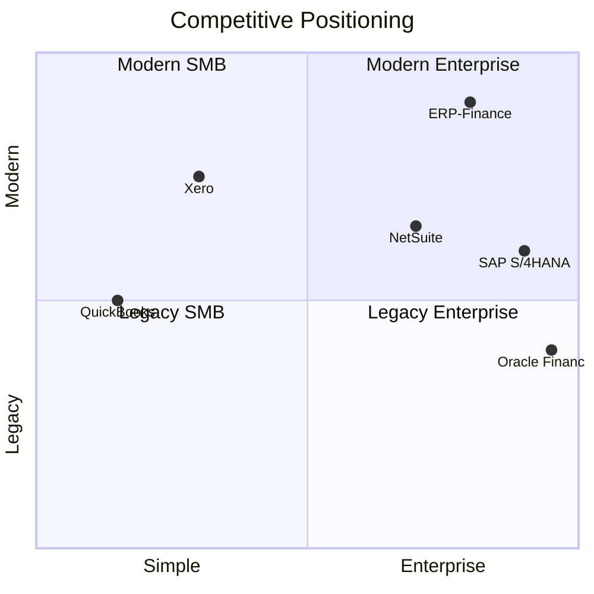
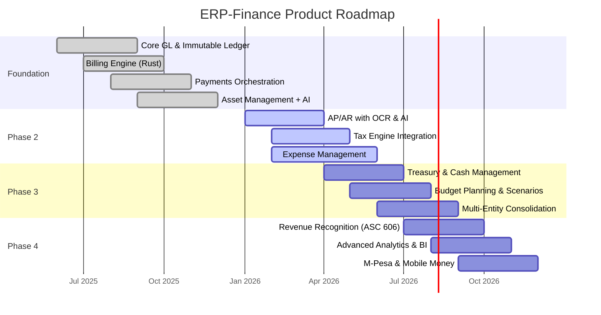

# ERP-Finance Product Requirements Document (PRD)

## Document Information

| Field | Value |
|-------|-------|
| Module | ERP-Finance |
| Document Type | Product Requirements Document |
| Version | 1.0.0 |
| Last Updated | 2026-02-23 |

## Vision Statement

ERP-Finance aims to be the most comprehensive open-source enterprise financial management platform, combining the power of Oracle Financials and SAP S/4HANA with the simplicity of QuickBooks and Xero, delivered through a modern, API-first, AI-enhanced architecture. It targets mid-market to enterprise organizations needing multi-entity, multi-currency, multi-jurisdiction financial management with African payment ecosystem support.

## Competitive Analysis

### Feature Matrix: ERP-Finance vs. Competitors

```mermaid
xychart-beta
    title "Feature Completeness Score (out of 100)"
    x-axis ["General Ledger", "AP/AR", "Billing", "Payments", "Assets", "Tax", "Expense", "Treasury", "Budget", "AI/ML"]
    y-axis "Score" 0 --> 100
    bar [95, 90, 92, 95, 88, 85, 82, 80, 78, 90]
    bar [98, 95, 70, 60, 92, 95, 90, 95, 95, 75]
    bar [95, 92, 80, 75, 90, 90, 88, 90, 92, 80]
    bar [80, 75, 85, 80, 60, 70, 75, 50, 60, 40]
    bar [60, 60, 70, 75, 40, 60, 65, 30, 50, 20]
    bar [55, 55, 75, 70, 35, 50, 60, 25, 45, 15]
```

### Detailed Competitive Analysis

#### vs. Oracle Financials

| Dimension | Oracle Financials | ERP-Finance | Assessment |
|-----------|------------------|-------------|------------|
| General Ledger | Deep GL with multi-GAAP | Immutable ledger, multi-currency | Comparable core, Oracle stronger on consolidation |
| Accounts Payable | Comprehensive with iSupplier | AI-powered OCR, 3-way matching | ERP-Finance stronger on AI capabilities |
| Accounts Receivable | Advanced with Collections | AI cash application, ASC 606 | Comparable |
| Fixed Assets | Full lifecycle, 50+ methods | 7 methods, AI optimization | Oracle deeper, ERP-Finance more intelligent |
| Tax | Oracle Tax Engine | Avalara/Vertex integration | Oracle native, ERP-Finance flexible |
| Treasury | Comprehensive cash mgmt | Bank reconciliation AI, FX | Oracle more mature |
| Cost | $200K+/year enterprise | Open source + support | 10x cost advantage |
| Deployment | Cloud/On-prem | Cloud-native Kubernetes | ERP-Finance more modern |
| African Markets | Limited | Paystack, Flutterwave, M-Pesa native | ERP-Finance significantly stronger |

#### vs. SAP S/4HANA Finance

| Dimension | SAP S/4HANA Finance | ERP-Finance | Assessment |
|-----------|---------------------|-------------|------------|
| Universal Journal | ACDOCA single source of truth | Immutable posting ledger | Both approach accounting from single-truth perspective |
| Real-time Analytics | Embedded HANA analytics | ClickHouse OLAP | SAP tighter integration, ERP-Finance open |
| Machine Learning | SAP AI Business Services | Claude-powered analysis | ERP-Finance more advanced AI |
| Payment Processing | SAP Payment Engine | Multi-provider orchestration | ERP-Finance more flexible |
| Billing | SAP BRIM | Rust-based high-performance | ERP-Finance higher throughput |
| Extensibility | ABAP / BTP | REST API / Events / Polyglot | ERP-Finance more developer-friendly |
| Implementation Time | 12-24 months | 2-8 weeks | ERP-Finance dramatically faster |
| TCO (5 years) | $2M-$10M | $100K-$500K | 10-20x cost advantage |

#### vs. NetSuite

| Dimension | NetSuite | ERP-Finance | Assessment |
|-----------|----------|-------------|------------|
| Multi-subsidiary | OneWorld for consolidation | Multi-entity support | NetSuite more mature |
| Revenue Recognition | ASC 606 module | ASC 606/IFRS 15 | Comparable |
| Billing | SuiteBilling | Rust high-performance engine | ERP-Finance higher scale |
| Expense Management | OpenAir integration | Native OCR + approvals | Comparable |
| Customization | SuiteScript/SuiteFlow | API-first, event-driven | ERP-Finance more flexible |
| Pricing Model | Per-user SaaS | Self-hosted + support | ERP-Finance more cost-effective at scale |

#### vs. Xero

| Dimension | Xero | ERP-Finance | Assessment |
|-----------|------|-------------|------------|
| Target Market | SMB | Mid-market to Enterprise | Different segments |
| Ease of Use | Excellent | Good (power user focused) | Xero simpler |
| Bank Reconciliation | AI-powered | AI-powered | Comparable |
| Multi-Currency | Basic | Advanced with FX management | ERP-Finance stronger |
| Inventory/Assets | Limited | Comprehensive | ERP-Finance significantly stronger |
| API Ecosystem | 1000+ integrations | Event-driven, extensible | Xero broader ecosystem |

#### vs. QuickBooks

| Dimension | QuickBooks | ERP-Finance | Assessment |
|-----------|------------|-------------|------------|
| Target Market | SMB/Micro | Mid-market to Enterprise | Different segments |
| Simplicity | Very simple | Complex, enterprise-grade | QuickBooks simpler |
| Payroll | Integrated | Via ERP-HCM integration | QuickBooks easier |
| Scale | ~100 users max | Unlimited | ERP-Finance vastly more scalable |
| Fixed Assets | Basic | 7 methods + AI | ERP-Finance significantly stronger |
| Multi-Entity | Limited | Full consolidation | ERP-Finance superior |

### Competitive Differentiation Summary

## Functional Requirements

### FR-GL: General Ledger

| ID | Requirement | Priority | Status |
|----|------------|----------|--------|
| FR-GL-001 | Chart of Accounts with hierarchical structure and natural account segments | P0 | Implemented |
| FR-GL-002 | Journal entry creation with debit/credit validation (must balance) | P0 | Implemented |
| FR-GL-003 | Immutable posting ledger -- posted entries cannot be modified | P0 | Implemented |
| FR-GL-004 | Trial balance generation with filtering by date range and account | P0 | Implemented |
| FR-GL-005 | Multi-currency support with real-time FX translation | P0 | In Progress |
| FR-GL-006 | Period close with validation checks and lock mechanism | P0 | In Progress |
| FR-GL-007 | Financial statements (Income Statement, Balance Sheet, Cash Flow) | P0 | In Progress |
| FR-GL-008 | Multi-entity consolidation with elimination entries | P1 | Planned |
| FR-GL-009 | Intercompany transactions and settlements | P1 | Planned |
| FR-GL-010 | Retained earnings auto-calculation at year-end close | P1 | Planned |

### FR-AP: Accounts Payable

| ID | Requirement | Priority | Status |
|----|------------|----------|--------|
| FR-AP-001 | Vendor master data management with banking details | P0 | Implemented |
| FR-AP-002 | Invoice capture with OCR AI for data extraction | P0 | In Progress |
| FR-AP-003 | 3-way matching (PO, Receipt, Invoice) | P0 | In Progress |
| FR-AP-004 | Automated payment runs with scheduling | P0 | In Progress |
| FR-AP-005 | AP aging reports (current, 30, 60, 90, 120+ days) | P0 | Implemented |
| FR-AP-006 | Approval workflows with delegation rules | P1 | Planned |
| FR-AP-007 | Early payment discount calculation | P1 | Planned |
| FR-AP-008 | 1099/W-8 withholding tax management | P1 | Planned |

### FR-AR: Accounts Receivable

| ID | Requirement | Priority | Status |
|----|------------|----------|--------|
| FR-AR-001 | Customer invoice generation with templates | P0 | Implemented |
| FR-AR-002 | Credit management with credit limits and scoring | P0 | In Progress |
| FR-AR-003 | Dunning automation with configurable sequences | P0 | Implemented |
| FR-AR-004 | Cash application AI with auto-matching | P0 | Planned |
| FR-AR-005 | Revenue recognition ASC 606 / IFRS 15 | P0 | Planned |
| FR-AR-006 | AR aging reports with customer drill-down | P0 | Implemented |
| FR-AR-007 | Credit note and debit note management | P1 | In Progress |
| FR-AR-008 | Customer statement generation | P1 | Planned |

### FR-BILL: Billing

| ID | Requirement | Priority | Status |
|----|------------|----------|--------|
| FR-BILL-001 | Subscription management (create, upgrade, downgrade, cancel) | P0 | Implemented |
| FR-BILL-002 | Usage-based metering with idempotent event ingestion | P0 | Implemented |
| FR-BILL-003 | Tiered pricing with Free/Pro/Enterprise plans | P0 | Implemented |
| FR-BILL-004 | Automated invoice generation from subscriptions | P0 | Implemented |
| FR-BILL-005 | Credit and promotion management | P0 | Implemented |
| FR-BILL-006 | Proration for mid-cycle plan changes | P0 | Implemented |
| FR-BILL-007 | Custom pricing overrides per tenant | P0 | Implemented |
| FR-BILL-008 | MRR/ARR metrics calculation | P1 | Implemented |

### FR-PAY: Payments

| ID | Requirement | Priority | Status |
|----|------------|----------|--------|
| FR-PAY-001 | Multi-provider payment orchestration (Stripe, Adyen, Paystack, Flutterwave) | P0 | Implemented |
| FR-PAY-002 | Payment initiation with redirect to provider | P0 | Implemented |
| FR-PAY-003 | Webhook handling for payment status updates | P0 | Implemented |
| FR-PAY-004 | Refund processing (full and partial) | P0 | Implemented |
| FR-PAY-005 | Digital wallet management with top-up | P0 | Implemented |
| FR-PAY-006 | Wallet-to-wallet transfers | P0 | Implemented |
| FR-PAY-007 | Fraud scoring integration | P1 | Planned |
| FR-PAY-008 | PCI-DSS compliance (tokenization, no raw card data) | P0 | Implemented |

### FR-ASSET: Asset Management

| ID | Requirement | Priority | Status |
|----|------------|----------|--------|
| FR-ASSET-001 | Full asset CRUD with categorization and tagging | P0 | Implemented |
| FR-ASSET-002 | 5 depreciation methods with schedule generation | P0 | Implemented |
| FR-ASSET-003 | Maintenance scheduling (preventative, corrective, predictive) | P0 | Implemented |
| FR-ASSET-004 | Asset lifecycle event tracking | P0 | Implemented |
| FR-ASSET-005 | AI-powered health analysis (Claude API) | P1 | Implemented |
| FR-ASSET-006 | Predictive maintenance analysis | P1 | Implemented |
| FR-ASSET-007 | Fleet-wide AI analytics | P1 | Implemented |
| FR-ASSET-008 | Natural language Q&A about assets | P1 | Implemented |

## Non-Functional Requirements

| ID | Requirement | Target |
|----|------------|--------|
| NFR-001 | API response latency p95 | < 200ms |
| NFR-002 | System availability | 99.95% |
| NFR-003 | Data durability | 99.999999999% (11 nines) |
| NFR-004 | Concurrent users | 10,000+ per tenant |
| NFR-005 | Audit trail retention | 7 years minimum |
| NFR-006 | RTO (Recovery Time Objective) | < 15 minutes |
| NFR-007 | RPO (Recovery Point Objective) | < 1 minute |
| NFR-008 | Encryption at rest | AES-256 |
| NFR-009 | Encryption in transit | TLS 1.3 |
| NFR-010 | PCI-DSS compliance level | Level 1 |

## Roadmap

