# ERP-Finance Data Models

## Document Information

| Field | Value |
|-------|-------|
| Module | ERP-Finance |
| Document Type | Data Models |
| Version | 1.0.0 |
| Last Updated | 2026-02-23 |

## Data Model Overview

```mermaid
flowchart TB
    subgraph GL["General Ledger Domain"]
        COA["Chart of Accounts"]
        JE["Journal Entries"]
        JEL["Journal Entry Lines"]
        FP["Fiscal Periods"]
        FC["Financial Consolidation"]
    end

    subgraph Billing["Billing Domain"]
        PLANS["Plans"]
        SUBS["Subscriptions"]
        USAGE["Usage Records"]
        INV["Invoices"]
        INVL["Invoice Line Items"]
    end

    subgraph Payments["Payments Domain"]
        TXN["Transactions"]
        WAL["Wallets"]
        PM["Payment Methods"]
        REF["Refunds"]
    end

    subgraph Assets["Asset Management Domain"]
        AST["Assets"]
        MR["Maintenance Records"]
        DR["Depreciation Records"]
        LE["Lifecycle Events"]
    end

    subgraph APAR["AP/AR Domain"]
        VEN["Vendors"]
        CUST["Customers"]
        API2["AP Invoices"]
        ARI["AR Invoices"]
    end

    SUBS --> PLANS
    USAGE --> SUBS
    INV --> SUBS
    INVL --> INV
    TXN --> PM
    REF --> TXN
    WAL --> TXN
    MR --> AST
    DR --> AST
    LE --> AST
    JEL --> JE
    JEL --> COA
    JE --> FP
    API2 --> VEN
    ARI --> CUST
```



## Billing Domain Models

### Plan

The plan model defines subscription tiers with pricing:

```
Table: plans
- id: UUID (PK, v7)
- name: VARCHAR(255) NOT NULL
- description: TEXT
- price: BIGINT NOT NULL (smallest currency unit)
- currency: VARCHAR(3) DEFAULT 'NGN'
- billing_period: VARCHAR(20) DEFAULT 'monthly'
- features: JSONB DEFAULT '[]'
- limits: JSONB DEFAULT '{}'
- status: VARCHAR(20) DEFAULT 'active'
- created_at: TIMESTAMPTZ DEFAULT NOW()
```

### Subscription

```
Table: subscriptions
- id: UUID (PK, v7)
- tenant_id: UUID NOT NULL (FK -> tenants)
- plan_id: UUID NOT NULL (FK -> plans)
- status: VARCHAR(20) NOT NULL ['active','trialing','past_due','canceled','unpaid']
- current_period_start: TIMESTAMPTZ NOT NULL
- current_period_end: TIMESTAMPTZ NOT NULL
- cancel_at_period_end: BOOLEAN DEFAULT false
- canceled_at: TIMESTAMPTZ
- trial_end: TIMESTAMPTZ
- created_at: TIMESTAMPTZ DEFAULT NOW()
- updated_at: TIMESTAMPTZ DEFAULT NOW()
```

### Usage Record

```
Table: usage_records
- id: UUID (PK, v7)
- subscription_id: UUID NOT NULL (FK -> subscriptions)
- metric: VARCHAR(100) NOT NULL
- quantity: BIGINT NOT NULL
- timestamp: TIMESTAMPTZ DEFAULT NOW()
- metadata: JSONB DEFAULT '{}'
- idempotency_key: VARCHAR(255) UNIQUE
```

### Invoice

```
Table: invoices
- id: UUID (PK, v7)
- subscription_id: UUID NOT NULL (FK -> subscriptions)
- invoice_number: VARCHAR(50) UNIQUE NOT NULL
- period_start: DATE NOT NULL
- period_end: DATE NOT NULL
- subtotal: BIGINT NOT NULL
- tax: BIGINT DEFAULT 0
- total: BIGINT NOT NULL
- currency: VARCHAR(3) DEFAULT 'NGN'
- status: VARCHAR(20) DEFAULT 'draft' ['draft','open','paid','void','uncollectible']
- due_date: DATE NOT NULL
- paid_at: TIMESTAMPTZ
- created_at: TIMESTAMPTZ DEFAULT NOW()
```

### Invoice Line Item

```
Table: invoice_items
- id: UUID (PK, v7)
- invoice_id: UUID NOT NULL (FK -> invoices)
- description: TEXT NOT NULL
- quantity: BIGINT NOT NULL
- unit_price: BIGINT NOT NULL
- amount: BIGINT NOT NULL
- item_type: VARCHAR(20) ['subscription','usage','credit','adjustment']
```

## Payments Domain Models

### Transaction

```
Table: transactions
- id: UUID (PK, v7)
- reference: VARCHAR(100) UNIQUE NOT NULL
- amount: NUMERIC(19,4) NOT NULL
- currency: VARCHAR(3) DEFAULT 'NGN'
- status: VARCHAR(20) DEFAULT 'pending'
- transaction_type: VARCHAR(20) NOT NULL
- customer_id: UUID (FK -> customers)
- customer_email: VARCHAR(255)
- payment_method: VARCHAR(50)
- provider: VARCHAR(50) ['stripe','adyen','paystack','flutterwave','mpesa']
- provider_reference: VARCHAR(255)
- metadata: JSONB DEFAULT '{}'
- created_at: TIMESTAMPTZ DEFAULT NOW()
- updated_at: TIMESTAMPTZ DEFAULT NOW()
- completed_at: TIMESTAMPTZ
```

### Wallet

```
Table: wallets
- id: UUID (PK, v7)
- customer_id: UUID NOT NULL
- balance: NUMERIC(19,4) DEFAULT 0
- currency: VARCHAR(3) DEFAULT 'NGN'
- status: VARCHAR(20) DEFAULT 'active'
- created_at: TIMESTAMPTZ DEFAULT NOW()
- updated_at: TIMESTAMPTZ DEFAULT NOW()
```

### Payment Method

```
Table: payment_methods
- id: UUID (PK, v7)
- customer_id: UUID NOT NULL
- method_type: VARCHAR(20) NOT NULL ['card','bank_account','wallet','crypto']
- provider: VARCHAR(50) NOT NULL
- token: VARCHAR(255) NOT NULL (tokenized reference)
- last_four: VARCHAR(4)
- brand: VARCHAR(50)
- is_default: BOOLEAN DEFAULT false
- exp_month: SMALLINT
- exp_year: SMALLINT
- created_at: TIMESTAMPTZ DEFAULT NOW()
```

### Refund

```
Table: refunds
- id: UUID (PK, v7)
- transaction_id: UUID NOT NULL (FK -> transactions)
- amount: NUMERIC(19,4) NOT NULL
- reason: TEXT
- status: VARCHAR(20) DEFAULT 'pending'
- provider_reference: VARCHAR(255)
- created_at: TIMESTAMPTZ DEFAULT NOW()
```

## Asset Management Domain Models

### Asset

```
Table: assets
- id: SERIAL (PK)
- name: VARCHAR(255) NOT NULL
- asset_tag: VARCHAR(50) UNIQUE NOT NULL
- description: TEXT
- category: ENUM('machinery','vehicle','it_equipment','furniture','building','tool','other')
- status: ENUM('acquired','in_service','under_maintenance','idle','decommissioned','disposed')
- manufacturer: VARCHAR(255)
- model_number: VARCHAR(255)
- serial_number: VARCHAR(255) UNIQUE
- location: VARCHAR(255)
- department: VARCHAR(255)
- assigned_to: VARCHAR(255)
- purchase_price: FLOAT NOT NULL
- purchase_date: DATE NOT NULL
- warranty_expiry: DATE
- salvage_value: FLOAT DEFAULT 0.0
- useful_life_years: INTEGER DEFAULT 5
- depreciation_method: ENUM('straight_line','declining_balance','double_declining','sum_of_years','units_of_production')
- operating_hours: FLOAT DEFAULT 0.0
- max_operating_hours: FLOAT
- condition_score: FLOAT DEFAULT 100.0
- created_at: TIMESTAMP DEFAULT NOW()
- updated_at: TIMESTAMP DEFAULT NOW()
```

### Maintenance Record

```
Table: maintenance_records
- id: SERIAL (PK)
- asset_id: INTEGER NOT NULL (FK -> assets)
- title: VARCHAR(255) NOT NULL
- description: TEXT
- maintenance_type: ENUM('preventative','corrective','predictive','condition_based','emergency')
- priority: ENUM('low','medium','high','critical')
- status: ENUM('scheduled','in_progress','completed','overdue','cancelled')
- scheduled_date: DATE NOT NULL
- completed_date: DATE
- cost: FLOAT DEFAULT 0.0
- technician: VARCHAR(255)
- notes: TEXT
- is_recurring: BOOLEAN DEFAULT false
- recurrence_interval_days: INTEGER
- next_due_date: DATE
- created_at: TIMESTAMP DEFAULT NOW()
- updated_at: TIMESTAMP DEFAULT NOW()
```

### Depreciation Record

```
Table: depreciation_records
- id: SERIAL (PK)
- asset_id: INTEGER NOT NULL (FK -> assets)
- period_start: DATE NOT NULL
- period_end: DATE NOT NULL
- period_number: INTEGER NOT NULL
- opening_book_value: FLOAT NOT NULL
- depreciation_amount: FLOAT NOT NULL
- accumulated_depreciation: FLOAT NOT NULL
- closing_book_value: FLOAT NOT NULL
- method: ENUM('straight_line','declining_balance','double_declining','sum_of_years','units_of_production')
- created_at: TIMESTAMP DEFAULT NOW()
```

### Lifecycle Event

```
Table: lifecycle_events
- id: SERIAL (PK)
- asset_id: INTEGER NOT NULL (FK -> assets)
- phase: ENUM('planning','acquisition','deployment','operation','maintenance','decommission','disposal')
- event_date: DATE NOT NULL
- description: TEXT NOT NULL
- performed_by: VARCHAR(255)
- cost: FLOAT DEFAULT 0.0
- metadata_json: TEXT
- created_at: TIMESTAMP DEFAULT NOW()
```

## Domain Value Objects

### Money (Payments Domain)

```rust
pub struct Money {
    pub amount: Decimal,   // rust_decimal for precision
    pub currency: String,  // ISO 4217
}
```

### PaymentId (Payments Domain)

```rust
pub struct PaymentId(String);  // Format: "pay_<24chars>"
```

### Subscription Status State Machine

```mermaid
statechart-v2
    [*] --> Trialing
    [*] --> Active
    Trialing --> Active: Trial converts
    Trialing --> Canceled: Cancel during trial
    Active --> PastDue: Payment fails
    Active --> Canceled: Cancel immediately
    Active --> Paused: Pause subscription
    PastDue --> Active: Payment succeeds
    PastDue --> Canceled: Dunning exhausted
    Paused --> Active: Resume
    Paused --> Canceled: Cancel while paused
    Canceled --> [*]
```

## Indexing Strategy

| Table | Index | Type | Purpose |
|-------|-------|------|---------|
| subscriptions | tenant_id | B-tree | Tenant lookup |
| subscriptions | plan_id, status | Composite | Active plan query |
| usage_records | subscription_id, timestamp | Composite | Usage aggregation |
| usage_records | idempotency_key | Unique | Deduplication |
| transactions | reference | Unique | Reference lookup |
| transactions | customer_id, created_at | Composite | Customer history |
| assets | asset_tag | Unique | Tag lookup |
| assets | category, status | Composite | Category filtering |
| invoices | invoice_number | Unique | Number lookup |
| invoices | subscription_id, status | Composite | Invoice queries |
