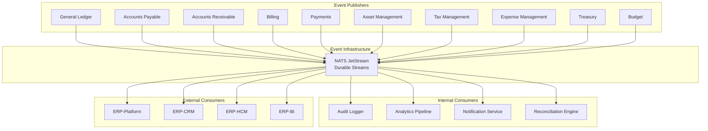
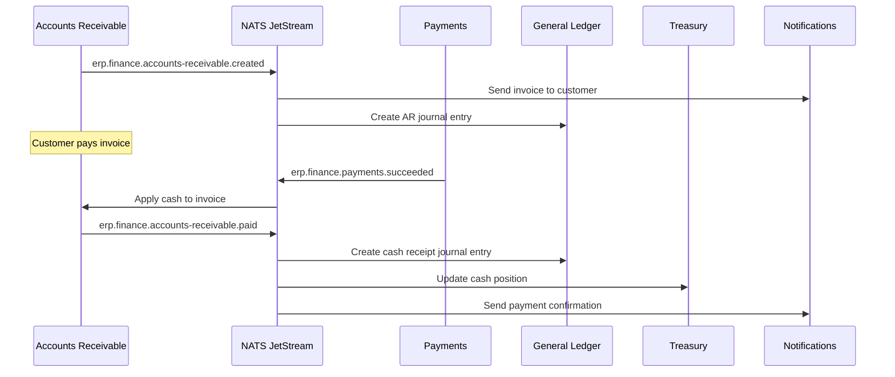

# ERP-Finance Event Catalog

## Document Information

| Field | Value |
|-------|-------|
| Module | ERP-Finance |
| Document Type | Event Catalog |
| Version | 1.0.0 |
| Last Updated | 2026-02-23 |

## Event Architecture



## Event Naming Convention

Pattern: `erp.finance.<entity>.<action>`

All events use the CloudEvents 1.0 specification envelope.

## Event Envelope Schema

```json
{
  "specversion": "1.0",
  "id": "evt_019523a4-5678-7def-8901-234567890abc",
  "source": "erp.finance.<service>",
  "type": "erp.finance.<entity>.<action>",
  "time": "2026-02-23T10:00:00Z",
  "datacontenttype": "application/json",
  "subject": "<entity_id>",
  "tenantid": "<tenant_uuid>",
  "correlationid": "<request_uuid>",
  "data": { }
}
```

## Published Events

### General Ledger Events

| Event Type | Trigger | Data Payload |
|-----------|---------|-------------|
| `erp.finance.general-ledger.created` | Journal entry created | `{journal_id, entries[], total_debit, total_credit}` |
| `erp.finance.general-ledger.updated` | Journal entry updated (draft only) | `{journal_id, changes[]}` |
| `erp.finance.general-ledger.posted` | Journal entry posted (immutable) | `{journal_id, posting_date, fiscal_period}` |
| `erp.finance.general-ledger.reversed` | Reversal entry created | `{journal_id, reversal_of_id, reason}` |
| `erp.finance.general-ledger.period-closed` | Accounting period closed | `{period, closing_date, closing_user}` |
| `erp.finance.general-ledger.account-created` | New account in COA | `{account_id, account_number, name, type}` |

### Accounts Payable Events

| Event Type | Trigger | Data Payload |
|-----------|---------|-------------|
| `erp.finance.accounts-payable.created` | AP invoice recorded | `{invoice_id, vendor_id, amount, due_date}` |
| `erp.finance.accounts-payable.updated` | AP invoice modified | `{invoice_id, changes[]}` |
| `erp.finance.accounts-payable.approved` | AP invoice approved | `{invoice_id, approver_id, approved_at}` |
| `erp.finance.accounts-payable.matched` | 3-way match completed | `{invoice_id, po_id, receipt_id, match_type}` |
| `erp.finance.accounts-payable.paid` | Payment processed | `{invoice_id, payment_id, amount, method}` |
| `erp.finance.accounts-payable.deleted` | AP invoice voided | `{invoice_id, reason}` |

### Accounts Receivable Events

| Event Type | Trigger | Data Payload |
|-----------|---------|-------------|
| `erp.finance.accounts-receivable.created` | AR invoice issued | `{invoice_id, customer_id, amount, due_date}` |
| `erp.finance.accounts-receivable.updated` | AR invoice modified | `{invoice_id, changes[]}` |
| `erp.finance.accounts-receivable.paid` | Payment received | `{invoice_id, payment_id, amount, method}` |
| `erp.finance.accounts-receivable.overdue` | Invoice past due | `{invoice_id, days_overdue, amount_due}` |
| `erp.finance.accounts-receivable.dunning-sent` | Dunning notice sent | `{invoice_id, dunning_level, template}` |
| `erp.finance.accounts-receivable.credit-applied` | Credit note applied | `{credit_note_id, invoice_id, amount}` |

### Billing Events

| Event Type | Trigger | Data Payload |
|-----------|---------|-------------|
| `erp.finance.billing.created` | New subscription created | `{subscription_id, tenant_id, plan_id}` |
| `erp.finance.billing.updated` | Subscription modified | `{subscription_id, changes[]}` |
| `erp.finance.billing.cancelled` | Subscription cancelled | `{subscription_id, reason, at_period_end}` |
| `erp.finance.billing.renewed` | Subscription renewed | `{subscription_id, new_period_start, new_period_end}` |
| `erp.finance.billing.plan-changed` | Plan upgrade/downgrade | `{subscription_id, old_plan, new_plan, proration}` |
| `erp.finance.billing.invoice-generated` | Invoice created | `{invoice_id, subscription_id, total, due_date}` |
| `erp.finance.billing.usage-recorded` | Usage event ingested | `{subscription_id, metric, quantity}` |

### Payment Events

| Event Type | Trigger | Data Payload |
|-----------|---------|-------------|
| `erp.finance.payments.created` | Payment initiated | `{payment_id, amount, currency, provider}` |
| `erp.finance.payments.succeeded` | Payment completed | `{payment_id, provider_reference}` |
| `erp.finance.payments.failed` | Payment failed | `{payment_id, error_code, error_message}` |
| `erp.finance.payments.refunded` | Refund processed | `{refund_id, payment_id, amount}` |
| `erp.finance.payments.wallet-credited` | Wallet topped up | `{wallet_id, amount, source}` |
| `erp.finance.payments.transfer-completed` | Transfer completed | `{from_wallet, to_wallet, amount}` |

### Asset Management Events

| Event Type | Trigger | Data Payload |
|-----------|---------|-------------|
| `erp.finance.asset-management.created` | Asset registered | `{asset_id, asset_tag, category, value}` |
| `erp.finance.asset-management.updated` | Asset modified | `{asset_id, changes[]}` |
| `erp.finance.asset-management.status-changed` | Status transition | `{asset_id, old_status, new_status}` |
| `erp.finance.asset-management.depreciation-run` | Depreciation calculated | `{asset_id, period, amount, book_value}` |
| `erp.finance.asset-management.maintenance-scheduled` | Maintenance planned | `{record_id, asset_id, type, date}` |
| `erp.finance.asset-management.maintenance-completed` | Maintenance done | `{record_id, asset_id, cost}` |
| `erp.finance.asset-management.disposed` | Asset disposed | `{asset_id, disposal_value, method}` |

### Tax Management Events

| Event Type | Trigger | Data Payload |
|-----------|---------|-------------|
| `erp.finance.tax-management.created` | Tax calculation created | `{calculation_id, jurisdiction, rate, amount}` |
| `erp.finance.tax-management.updated` | Tax rate updated | `{jurisdiction, old_rate, new_rate, effective_date}` |
| `erp.finance.tax-management.return-filed` | Tax return submitted | `{return_id, jurisdiction, period, total_tax}` |

### Expense Management Events

| Event Type | Trigger | Data Payload |
|-----------|---------|-------------|
| `erp.finance.expense-management.created` | Expense claim submitted | `{claim_id, employee_id, amount, category}` |
| `erp.finance.expense-management.approved` | Claim approved | `{claim_id, approver_id, approved_amount}` |
| `erp.finance.expense-management.rejected` | Claim rejected | `{claim_id, reason}` |
| `erp.finance.expense-management.reimbursed` | Reimbursement processed | `{claim_id, payment_id, amount}` |

### Treasury Events

| Event Type | Trigger | Data Payload |
|-----------|---------|-------------|
| `erp.finance.treasury.created` | Treasury operation created | `{operation_id, type, amount}` |
| `erp.finance.treasury.reconciled` | Bank reconciliation completed | `{reconciliation_id, bank_account, matched, unmatched}` |
| `erp.finance.treasury.fx-booked` | FX transaction booked | `{fx_id, from_currency, to_currency, rate, amount}` |

### Budget Events

| Event Type | Trigger | Data Payload |
|-----------|---------|-------------|
| `erp.finance.budget.created` | Budget plan created | `{budget_id, period, type, total}` |
| `erp.finance.budget.approved` | Budget approved | `{budget_id, approver_id}` |
| `erp.finance.budget.variance-alert` | Variance threshold exceeded | `{budget_id, line_item, variance_pct}` |

## Event Flow: Invoice-to-Cash



## Consumer Group Configuration

| Stream | Consumer Group | Delivery Policy | Max Ack Pending |
|--------|---------------|----------------|-----------------|
| FINANCE_GL | audit-logger | All | 1000 |
| FINANCE_GL | analytics-pipeline | All | 5000 |
| FINANCE_PAYMENTS | reconciliation-engine | All | 500 |
| FINANCE_BILLING | invoice-generator | New | 100 |
| FINANCE_ALL | platform-sync | All | 2000 |
