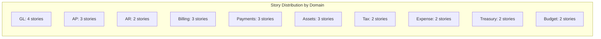

# ERP-Finance User Stories

## Document Information

| Field | Value |
|-------|-------|
| Module | ERP-Finance |
| Document Type | User Stories |
| Version | 1.0.0 |
| Last Updated | 2026-02-23 |

## Personas

| Persona | Role | Description |
|---------|------|-------------|
| Ade | CFO | Chief Financial Officer overseeing all finance operations |
| Funke | Controller | Manages GL, period close, and financial reporting |
| Chidi | AP Clerk | Processes vendor invoices and payment runs |
| Ngozi | AR Manager | Manages customer invoicing and collections |
| Emeka | Billing Ops | Manages subscriptions, plans, and billing cycles |
| Amara | Payments Manager | Oversees payment processing and reconciliation |
| Tunde | Asset Manager | Manages physical and digital asset fleet |
| Yemi | Tax Analyst | Handles multi-jurisdiction tax compliance |
| Kemi | Expense Approver | Reviews and approves employee expense claims |
| Bola | Treasurer | Manages cash, banking, and FX operations |
| Seun | Budget Analyst | Creates budgets and tracks variance |

## General Ledger Stories

### US-GL-001: Create Chart of Accounts
**As** Funke (Controller), **I want** to set up a hierarchical chart of accounts with natural account segments, **so that** all financial transactions are categorized consistently across the organization.

**Acceptance Criteria:**
- Can create accounts with type (Asset, Liability, Equity, Revenue, Expense)
- Accounts support hierarchical parent-child relationships
- Account numbers follow configurable numbering scheme
- Accounts can be flagged as active/inactive
- Bulk import from CSV/Excel supported

### US-GL-002: Post Journal Entry
**As** Funke (Controller), **I want** to create and post journal entries that are immutable once posted, **so that** the integrity of the financial record is maintained for audit purposes.

**Acceptance Criteria:**
- Journal entries must balance (total debits = total credits)
- Draft entries can be edited; posted entries cannot
- Multi-currency entries auto-translate to functional currency
- Supporting documents can be attached
- Posting emits event for downstream consumers

### US-GL-003: Generate Trial Balance
**As** Funke (Controller), **I want** to generate a trial balance for any date range, **so that** I can verify that all accounts balance and prepare for financial reporting.

### US-GL-004: Close Accounting Period
**As** Funke (Controller), **I want** to close an accounting period with validation checks, **so that** no further transactions can be posted to a closed period.

## Accounts Payable Stories

### US-AP-001: Capture Vendor Invoice with OCR
**As** Chidi (AP Clerk), **I want** to upload a vendor invoice PDF and have AI extract the key fields, **so that** I can process invoices faster with fewer manual data entry errors.

**Acceptance Criteria:**
- Upload PDF/image of invoice
- AI extracts: vendor name, invoice number, date, line items, amounts, tax
- Extracted data presented for review and correction
- Confidence scores shown per field
- One-click creation of AP invoice from extracted data

### US-AP-002: Three-Way Matching
**As** Chidi (AP Clerk), **I want** the system to automatically match purchase orders, goods receipts, and vendor invoices, **so that** I can identify discrepancies before approving payment.

**Acceptance Criteria:**
- Automatic matching when all three documents exist
- Tolerance thresholds for amount/quantity variances
- Exceptions flagged for manual review
- Match status visible on invoice detail page

### US-AP-003: Execute Payment Run
**As** Chidi (AP Clerk), **I want** to execute a payment run that selects all approved invoices due within a date range, **so that** vendors are paid on time and efficiently.

## Accounts Receivable Stories

### US-AR-001: Issue Customer Invoice
**As** Ngozi (AR Manager), **I want** to generate professional customer invoices with configurable templates, **so that** customers receive clear and branded billing documents.

### US-AR-002: Automated Dunning
**As** Ngozi (AR Manager), **I want** the system to automatically send dunning notices on a configurable schedule, **so that** overdue invoices are followed up without manual intervention.

**Acceptance Criteria:**
- Configurable dunning sequences (e.g., 7, 14, 30, 60 days)
- Email templates per dunning level
- Escalation from reminder to warning to final notice
- Dunning history tracked per customer
- Pause dunning for specific customers

## Billing Stories

### US-BILL-001: Create Subscription Plan
**As** Emeka (Billing Ops), **I want** to create pricing plans with tiered features and usage limits, **so that** customers can self-select the appropriate tier.

### US-BILL-002: Record Usage for Metered Billing
**As** Emeka (Billing Ops), **I want** usage events to be idempotently recorded and aggregated, **so that** customers are billed accurately for their actual consumption.

**Acceptance Criteria:**
- Usage events accepted with idempotency keys
- Duplicate events silently ignored
- Real-time usage dashboards available
- Hourly/daily/monthly aggregation pipelines
- Overage charges calculated against plan limits

### US-BILL-003: Handle Plan Upgrade with Proration
**As** Emeka (Billing Ops), **I want** plan changes to be prorated based on the remaining billing period, **so that** customers are fairly charged when upgrading or downgrading mid-cycle.

## Payment Stories

### US-PAY-001: Initiate Multi-Provider Payment
**As** Amara (Payments Manager), **I want** to route payments to the optimal provider based on currency and region, **so that** transaction success rates are maximized and costs minimized.

### US-PAY-002: Process Refund
**As** Amara (Payments Manager), **I want** to process full or partial refunds against completed transactions, **so that** customer disputes are resolved promptly.

### US-PAY-003: Manage Digital Wallets
**As** Amara (Payments Manager), **I want** customers to have digital wallets with top-up and transfer capabilities, **so that** in-platform transactions are instant and free.

## Asset Management Stories

### US-ASSET-001: Register New Asset
**As** Tunde (Asset Manager), **I want** to register new assets with full details including financial, operational, and location data, **so that** every asset in the organization is tracked.

### US-ASSET-002: AI Health Analysis
**As** Tunde (Asset Manager), **I want** AI to analyze an asset's health based on maintenance history, age, and condition score, **so that** I can make informed decisions about maintenance and replacement.

**Acceptance Criteria:**
- AI analyzes: maintenance compliance, depreciation status, failure risk factors
- Returns health score 0-100, risk level, and actionable recommendations
- Confidence score provided for transparency
- Analysis runs in under 10 seconds

### US-ASSET-003: Generate Depreciation Schedule
**As** Tunde (Asset Manager), **I want** to generate depreciation schedules using any of the 5 supported methods, **so that** asset book values are calculated correctly for financial reporting.

## Expense Management Stories

### US-EXP-001: Submit Expense with Receipt OCR
**As** an Employee, **I want** to photograph a receipt and have AI extract the details, **so that** I can submit expense claims quickly from my mobile device.

### US-EXP-002: Approve Expense Claim
**As** Kemi (Expense Approver), **I want** to review and approve/reject expense claims with all supporting documentation, **so that** only valid expenses are reimbursed.

## Treasury Stories

### US-TREAS-001: AI Bank Reconciliation
**As** Bola (Treasurer), **I want** AI to match bank statement lines to GL transactions, **so that** monthly reconciliation is completed in minutes instead of days.

### US-TREAS-002: Cash Position Dashboard
**As** Bola (Treasurer), **I want** a real-time view of cash positions across all bank accounts and currencies, **so that** I can manage liquidity effectively.

## Budget Stories

### US-BUD-001: Create Budget Plan
**As** Seun (Budget Analyst), **I want** to create budgets using top-down, bottom-up, or zero-based methods, **so that** the organization's financial planning is rigorous and flexible.

### US-BUD-002: Variance Analysis
**As** Seun (Budget Analyst), **I want** to compare actual spending against budget with automatic variance calculation, **so that** I can identify and address overspending early.

