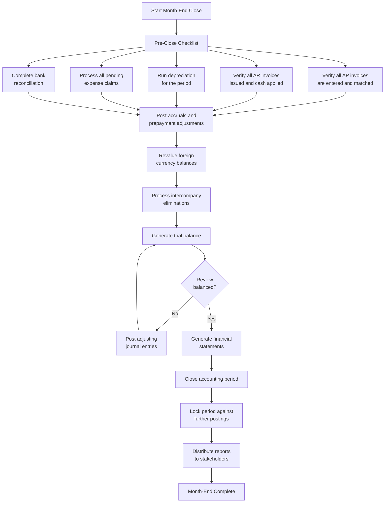
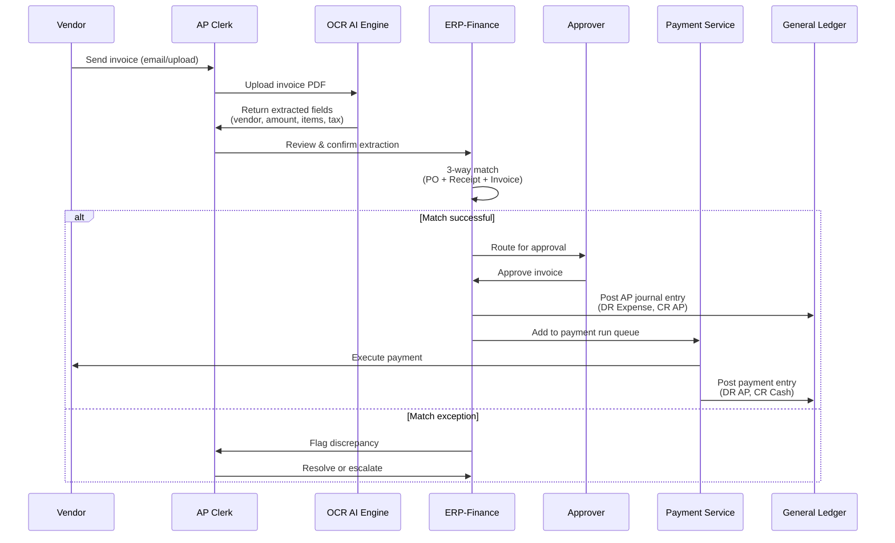
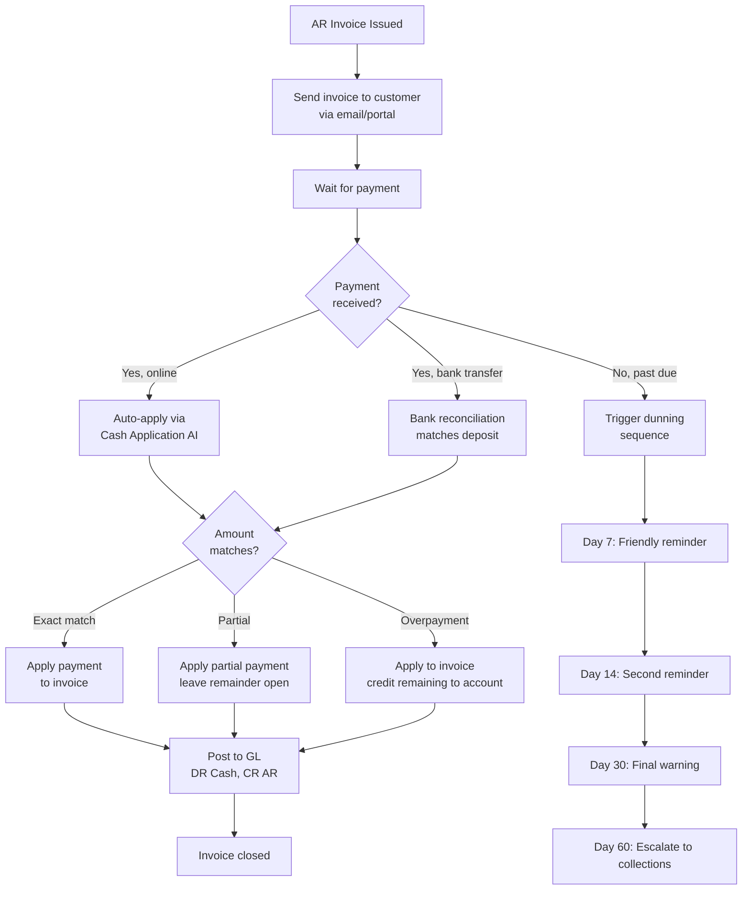
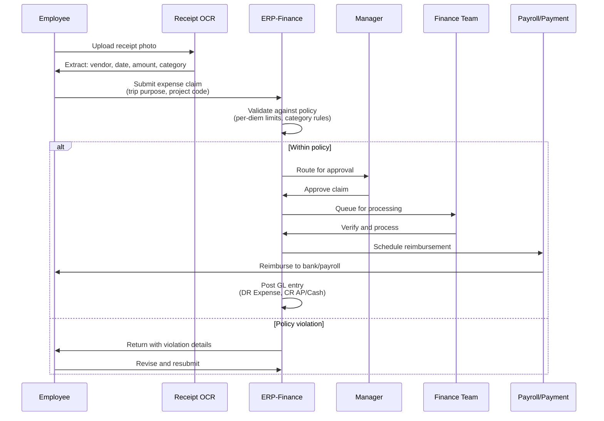
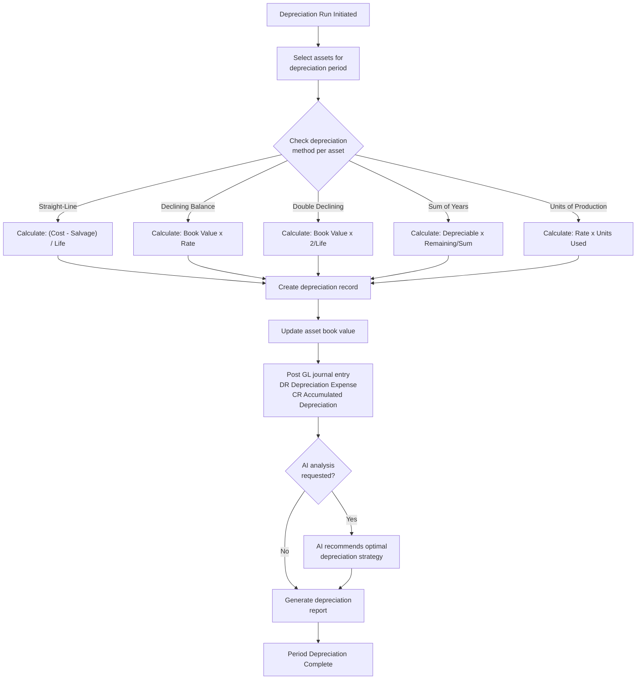
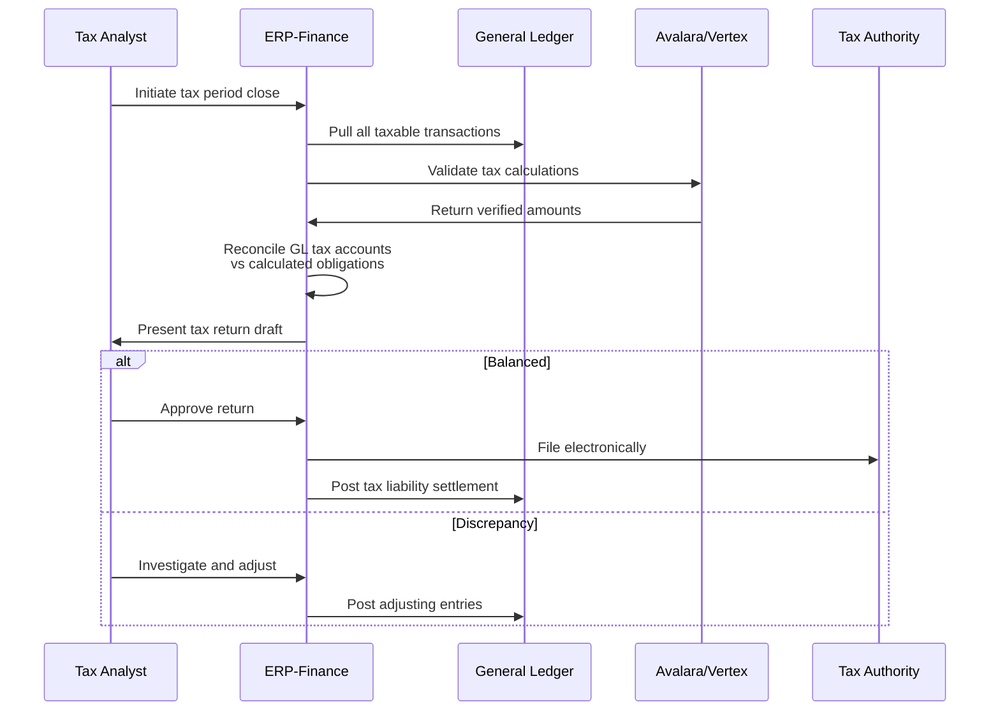
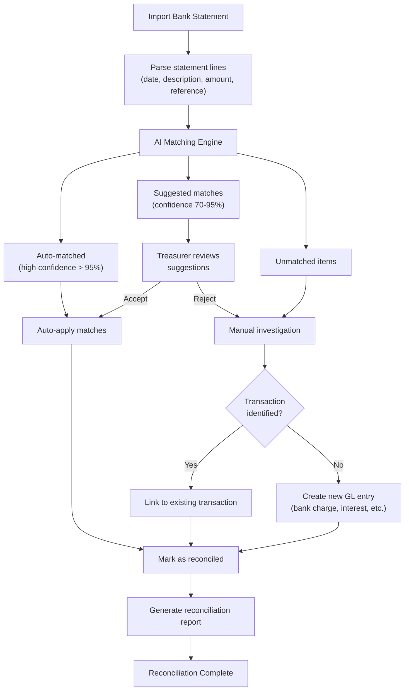
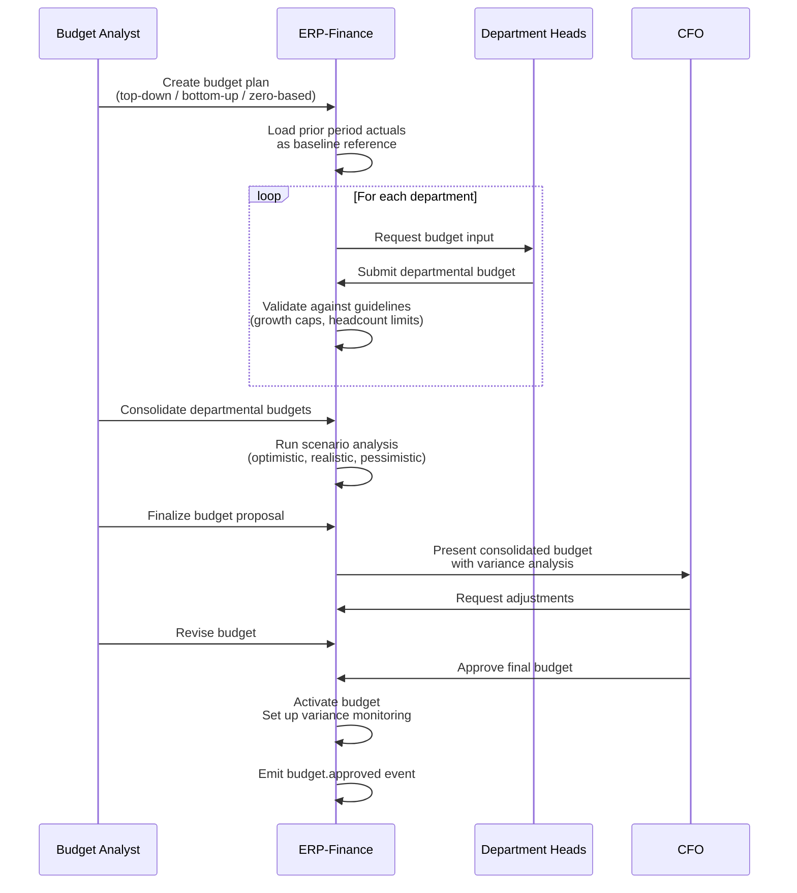
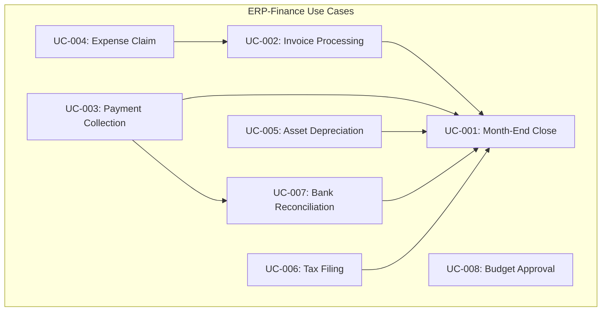

# ERP-Finance Use Cases

## Document Information

| Field | Value |
|-------|-------|
| Module | ERP-Finance |
| Document Type | Use Cases |
| Version | 1.0.0 |
| Last Updated | 2026-02-23 |

## UC-001: Month-End Close

### Overview
The month-end close process ensures all financial transactions for a period are complete, accurate, and properly reported.

### Actors
- Controller (primary)
- AP Clerk, AR Manager, Asset Manager (supporting)

### Flow

### Preconditions
- All sub-ledgers (AP, AR, Asset) have completed their period processing
- Bank statements received for all accounts
- FX rates updated to period-end rates

### Success Criteria
- Trial balance balances (total debits = total credits)
- All reconciling items documented
- Financial statements generated (Income Statement, Balance Sheet, Cash Flow)
- Period locked with audit trail

---

## UC-002: Invoice Processing (AP)

### Overview
End-to-end processing of a vendor invoice from receipt through payment.

### Actors
- AP Clerk (primary), Approver (secondary)

### Flow

### Business Rules
- Invoices over $10,000 require manager approval
- Invoices over $50,000 require VP Finance approval
- 3-way match tolerance: 2% on quantity, 5% on unit price
- Duplicate invoice detection based on vendor + invoice number + date

---

## UC-003: Payment Collection (AR)

### Overview
Collecting payment on outstanding customer invoices through multiple channels.

### Actors
- AR Manager (primary), Customer (external)

### Flow

---

## UC-004: Expense Claim

### Overview
Employee submits an expense claim with receipts through approval to reimbursement.

### Actors
- Employee (primary), Manager (approver), Finance Team (processor)

### Flow

### Business Rules
- Per-diem meal limits by city/country
- Hotel rates capped per policy tier
- Mileage reimbursement at standard rate
- Receipts required for expenses over $25
- Corporate card transactions auto-imported

---

## UC-005: Asset Depreciation

### Overview
Calculate and record depreciation for fixed assets using the appropriate method.

### Actors
- Asset Manager (primary), Controller (reviewer)

### Flow

---

## UC-006: Tax Filing

### Overview
Calculate and file tax returns for multiple jurisdictions (VAT/GST/Sales Tax).

### Actors
- Tax Analyst (primary), External Tax Engine (Avalara/Vertex)

### Flow

---

## UC-007: Bank Reconciliation

### Overview
AI-powered matching of bank statement lines to internal GL transactions.

### Actors
- Treasurer (primary), AI Reconciliation Engine (automated)

### Flow

---

## UC-008: Budget Approval

### Overview
Create, review, and approve organizational budgets using various methodologies.

### Actors
- Budget Analyst (creator), Department Heads (reviewers), CFO (approver)

### Flow

### Post-Approval
- Monthly variance analysis automatically generated
- Alert when actual spending exceeds budget by configurable threshold (e.g., 10%)
- Quarterly budget reforecast cycle supported
- Rolling 12-month forecast maintained

---

## Use Case Summary

