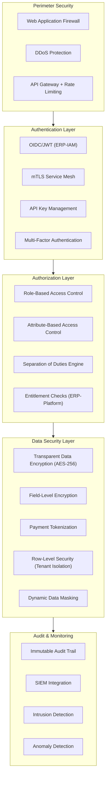
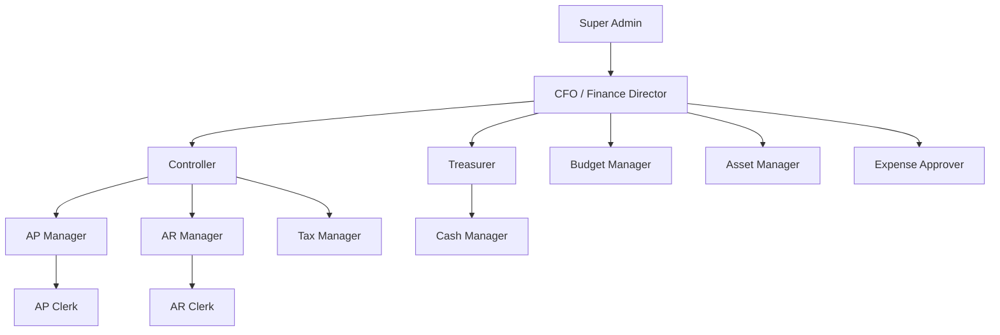
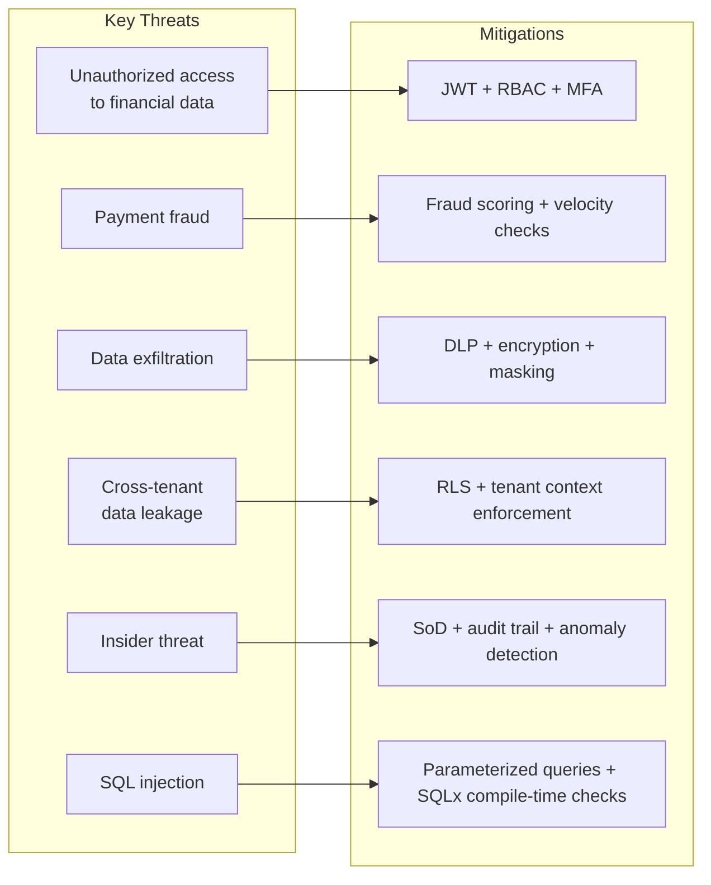

# ERP-Finance Security Architecture

## Document Information

| Field | Value |
|-------|-------|
| Module | ERP-Finance |
| Document Type | Security Architecture |
| Version | 1.0.0 |
| Last Updated | 2026-02-23 |

## Security Overview

ERP-Finance handles the most sensitive data in the enterprise -- financial transactions, payment credentials, bank account details, and tax information. The security architecture is designed to meet PCI-DSS Level 1, SOX compliance, and GDPR requirements simultaneously.

## Security Architecture



## Authentication

### JWT Token Validation

All requests to business endpoints must include a valid JWT from ERP-IAM:

```
Authorization: Bearer <jwt>
X-Tenant-ID: <tenant_uuid>
```

Token claims are validated:
- `iss`: Must match ERP-IAM issuer URL
- `aud`: Must include `erp-finance`
- `exp`: Must not be expired
- `tenant_id`: Must match `X-Tenant-ID` header
- `sub`: User identifier for audit trail

### Service-to-Service Authentication

Internal services use mutual TLS (mTLS) with certificates managed by the service mesh. NATS connections authenticate via NKey or JWT.

## Authorization Model

### Role Hierarchy



### Permission Matrix

| Permission | CFO | Controller | AP Clerk | AR Clerk | Auditor |
|-----------|-----|-----------|----------|----------|---------|
| GL: View journals | Yes | Yes | Read own | Read own | Read all |
| GL: Post journal | Yes | Yes | No | No | No |
| GL: Close period | Yes | Yes | No | No | No |
| AP: Create invoice | Yes | Yes | Yes | No | No |
| AP: Approve payment | Yes | Yes | No | No | No |
| AP: Execute payment run | Yes | No | No | No | No |
| AR: Issue invoice | Yes | Yes | No | Yes | No |
| AR: Apply credit | Yes | Yes | No | Yes | No |
| Billing: Manage plans | Yes | No | No | No | No |
| Payments: Process refund | Yes | Yes | No | No | No |
| Assets: Dispose asset | Yes | Yes | No | No | No |
| Reports: All | Yes | Yes | Limited | Limited | Yes |

### Separation of Duties

Critical financial operations require different users for initiation and approval:

| Operation | Initiator | Approver |
|-----------|-----------|----------|
| Journal entry > $100K | Any user with GL access | Controller or CFO |
| Payment run execution | AP Clerk | AP Manager or CFO |
| Vendor master data change | AP Clerk | AP Manager |
| Credit note > $10K | AR Clerk | AR Manager |
| Budget approval | Budget Analyst | CFO |
| Asset disposal | Asset Manager | Controller |

## Data Protection

### Encryption Standards

| Data Class | At Rest | In Transit | Key Management |
|-----------|---------|-----------|---------------|
| Financial transactions | AES-256 (TDE) | TLS 1.3 | AWS KMS / Vault |
| Payment card data | AES-256 + tokenization | TLS 1.3 | PCI HSM |
| Bank account numbers | Field-level AES-256 | TLS 1.3 | Vault |
| Tax identifiers (TIN) | Field-level AES-256 | TLS 1.3 | Vault |
| Employee SSN/NIN | Field-level AES-256 | TLS 1.3 | Vault |
| Audit logs | AES-256 (immutable) | TLS 1.3 | AWS KMS |

### PCI-DSS Compliance

The payments service is designed for PCI-DSS Level 1 compliance:

- **No raw card data stored**: All card data tokenized via payment providers
- **Network segmentation**: Payments service runs in isolated Kubernetes namespace
- **Access logging**: All access to payment data logged with immutable audit trail
- **Vulnerability scanning**: Quarterly ASV scans, annual penetration testing
- **Encryption**: TLS 1.3 for all payment data in transit

### Row-Level Security

PostgreSQL RLS policies enforce tenant isolation:

```sql
CREATE POLICY tenant_isolation ON journal_entries
    USING (tenant_id = current_setting('app.current_tenant')::uuid);

ALTER TABLE journal_entries ENABLE ROW LEVEL SECURITY;
```

## Audit Trail

### Immutable Audit Log

Every financial operation creates an immutable audit record:

```json
{
  "audit_id": "aud_019523a4...",
  "timestamp": "2026-02-23T10:00:00Z",
  "tenant_id": "uuid",
  "user_id": "uuid",
  "action": "gl.journal_entry.posted",
  "resource_type": "journal_entry",
  "resource_id": "uuid",
  "changes": {
    "before": {},
    "after": {"status": "posted", "amount": 50000}
  },
  "ip_address": "192.168.1.100",
  "user_agent": "ERP-Finance/1.0",
  "session_id": "sess_abc123"
}
```

### Retention Policy

- Financial audit logs: 7 years (regulatory requirement)
- Access logs: 3 years
- API request logs: 1 year
- Debug/trace logs: 90 days

## AIDD Security Guardrails

```yaml
autonomous_actions:
  - read_only_queries
  - low_risk_notifications
supervised_actions:
  - data_mutations
  - workflow_automation
  - bulk_operations
prohibited_actions:
  - cross_tenant_data_access
  - irreversible_delete_without_backup
  - privilege_escalation
controls:
  require_human_in_the_loop_for_high_risk: true
  decision_logging: true
  rollback_window_hours: 24
```

## Threat Model


