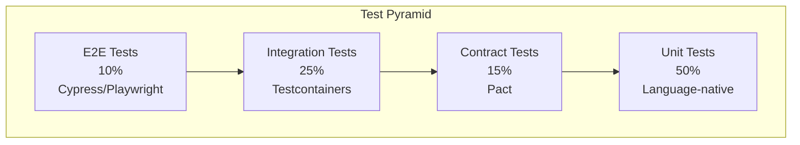
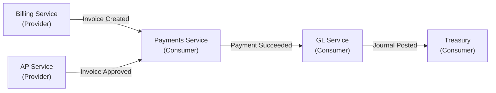
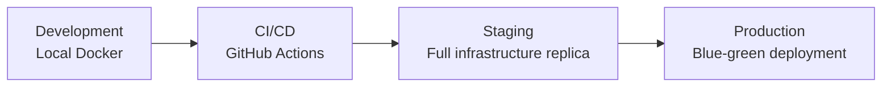

# ERP-Finance Testing Strategy

## Document Information

| Field | Value |
|-------|-------|
| Module | ERP-Finance |
| Document Type | Testing Strategy |
| Version | 1.0.0 |
| Last Updated | 2026-02-23 |

## Testing Philosophy

Financial software demands the highest testing rigor. A single calculation error can cascade through financial statements, tax filings, and regulatory reports. ERP-Finance employs a multi-layered testing strategy with emphasis on property-based testing for financial calculations, contract testing for service integration, and chaos testing for resilience.

## Test Pyramid



## Unit Testing

### Rust Services (Billing & Payments)

The billing and payments engines use Rust's built-in test framework with property-based testing:

```rust
// Example: Payment workflow test (existing in codebase)
#[test]
fn test_payment_workflow() {
    let mut p = Payment::create("CUST001", Money::usd(Decimal::new(100, 0)));
    p.process(PaymentMethod { ... }).unwrap();
    p.succeed().unwrap();
    assert_eq!(p.status(), &PaymentStatus::Succeeded);
}

// Subscription test (existing in codebase)
#[test]
fn test_subscription() {
    let mut s = Subscription::create("CUST001", "PLAN_PRO",
        Money::usd(Decimal::new(49, 0)), BillingCycle::Monthly);
    assert!(s.is_active());
    s.cancel(true);
    assert!(s.cancel_at_period_end);
}
```

Key unit test areas:
- Proration calculations for plan changes
- Credit application logic (oldest-first expiry ordering)
- Dunning state machine transitions
- Usage aggregation accuracy
- Overage pricing calculations

### Python Services (Asset Management)

```python
# Example: Depreciation calculation tests (existing in codebase)
def test_straight_line_depreciation():
    amounts = _straight_line(cost=100000, salvage=10000, life_years=5)
    assert len(amounts) == 5
    assert all(a == 18000.0 for a in amounts)
    assert sum(amounts) == 90000.0

def test_double_declining_depreciation():
    amounts = _double_declining(cost=100000, salvage=10000, life_years=5)
    assert amounts[0] > amounts[1]  # Decreasing pattern
    assert sum(amounts) <= 90000.0   # Never below salvage
```

### Go Services

All Go services use `testing` package with table-driven tests:

```go
func TestJournalEntryMustBalance(t *testing.T) {
    tests := []struct {
        name    string
        debits  int64
        credits int64
        wantErr bool
    }{
        {"balanced", 10000, 10000, false},
        {"unbalanced", 10000, 9999, true},
        {"zero entry", 0, 0, true},
    }
    for _, tt := range tests {
        t.Run(tt.name, func(t *testing.T) {
            // test implementation
        })
    }
}
```

## Integration Testing

### Database Integration

Using Testcontainers to spin up real PostgreSQL instances:

- Billing: SQLx migrations + full CRUD cycle
- Payments: Transaction lifecycle (initiate -> verify -> refund)
- Assets: SQLAlchemy model persistence + depreciation schedule generation

### Event Integration

- NATS JetStream integration tests verify event publishing and consumption
- Event schema validation ensures CloudEvents envelope compliance
- Consumer group behavior tested for at-least-once delivery

## Contract Testing

### Inter-Service Contracts



Each arrow represents a Pact contract:
- Provider side verifies it produces conforming events
- Consumer side verifies it can handle the event schema
- Breaking schema changes caught before deployment

## Financial Calculation Tests

### Property-Based Testing

Financial calculations use property-based testing to verify invariants:

| Property | Test |
|----------|------|
| Debits equal credits | For any set of journal entry lines, sum(debits) = sum(credits) |
| Depreciation never exceeds cost minus salvage | For any method, accumulated_depreciation <= cost - salvage |
| Invoice total = subtotal - discount + tax | For any invoice with any combination of line items |
| Proration is proportional | Mid-cycle charge / full charge ~= remaining days / total days |
| Credit application is ordered | Credits expiring soonest are applied first |
| Wallet balance never negative | For any sequence of debits/credits |
| Refund never exceeds payment | For any refund request |

## Performance Testing

### Load Test Scenarios

| Scenario | Tool | Target |
|----------|------|--------|
| Billing invoice generation | k6 | 10,000 invoices/min |
| Payment initiation | Gatling | 1,000 TPS |
| Usage event ingestion | Custom Rust harness | 100,000 events/sec |
| GL journal posting | k6 | 5,000 entries/sec |
| Report generation (month-end) | k6 | < 5 seconds |
| Concurrent bank reconciliation | k6 | 50 parallel sessions |

### Soak Testing

24-hour soak test simulating production workload:
- Steady-state: 500 TPS mixed operations
- Memory leak detection via heap profiling
- Database connection pool stability
- Event backpressure handling

## Security Testing

| Test Type | Frequency | Tool |
|-----------|-----------|------|
| SAST (Static Analysis) | Every PR | Semgrep, cargo-audit, Bandit |
| DAST (Dynamic Analysis) | Weekly | OWASP ZAP |
| Dependency Scanning | Daily | Dependabot, cargo-deny |
| Penetration Testing | Annually | External firm |
| PCI-DSS ASV Scan | Quarterly | Approved scanning vendor |

## Test Environments



## Coverage Targets

| Service | Unit | Integration | E2E | Overall |
|---------|------|-------------|-----|---------|
| Billing (Rust) | 85% | 75% | 60% | 80% |
| Payments (Rust) | 85% | 75% | 60% | 80% |
| Asset Mgmt (Python) | 80% | 70% | 55% | 75% |
| GL (Go) | 80% | 70% | 55% | 75% |
| AP/AR (Go) | 80% | 70% | 55% | 75% |
| Tax (Go) | 85% | 75% | 60% | 80% |
