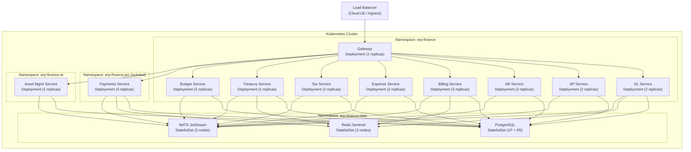
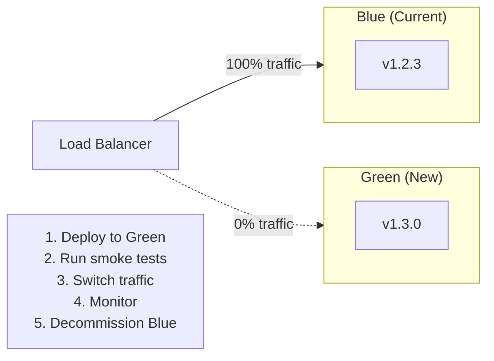
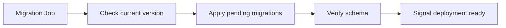

# ERP-Finance Deployment Guide

## Document Information

| Field | Value |
|-------|-------|
| Module | ERP-Finance |
| Document Type | Deployment Guide |
| Version | 1.0.0 |
| Last Updated | 2026-02-23 |

## Deployment Architecture



## Container Images

| Service | Base Image | Size | Build |
|---------|-----------|------|-------|
| Gateway | golang:1.22-alpine (multi-stage) | ~15 MB | `go build -ldflags="-s -w"` |
| Billing | rust:1.75-slim (multi-stage) | ~20 MB | `cargo build --release` |
| Payments | rust:1.75-slim (multi-stage) | ~22 MB | `cargo build --release` |
| Asset Mgmt | python:3.12-slim | ~150 MB | `pip install --no-cache-dir` |
| Go Services | golang:1.22-alpine (multi-stage) | ~15 MB each | `go build -ldflags="-s -w"` |

## Deployment Strategy

### Blue-Green Deployment



For database migrations, we use **expand-contract** pattern:
1. **Expand**: Add new columns/tables (backward compatible)
2. **Migrate**: Deploy new code that uses both old and new schema
3. **Contract**: Remove old columns after successful deployment

### Canary Releases

For high-risk changes (billing calculations, payment routing):
1. Deploy to 5% of traffic
2. Monitor error rates and latency for 30 minutes
3. Gradually increase to 25%, 50%, 100%
4. Auto-rollback if error rate exceeds threshold

## Kubernetes Manifests

### Billing Service Deployment

```yaml
apiVersion: apps/v1
kind: Deployment
metadata:
  name: billing-service
  namespace: erp-finance
  labels:
    app: billing-service
    module: erp-finance
spec:
  replicas: 3
  selector:
    matchLabels:
      app: billing-service
  template:
    metadata:
      labels:
        app: billing-service
    spec:
      containers:
      - name: billing
        image: erp/finance-billing:1.0.0
        ports:
        - containerPort: 8089
        env:
        - name: DATABASE_URL
          valueFrom:
            secretKeyRef:
              name: finance-db-credentials
              key: url
        - name: NATS_URL
          value: nats://nats.erp-finance-data:4222
        resources:
          requests:
            cpu: 500m
            memory: 256Mi
          limits:
            cpu: 2000m
            memory: 1Gi
        livenessProbe:
          httpGet:
            path: /health
            port: 8089
          initialDelaySeconds: 10
          periodSeconds: 30
        readinessProbe:
          httpGet:
            path: /health
            port: 8089
          initialDelaySeconds: 5
          periodSeconds: 10
      topologySpreadConstraints:
      - maxSkew: 1
        topologyKey: kubernetes.io/hostname
        whenUnsatisfiable: DoNotSchedule
```

### Horizontal Pod Autoscaler

```yaml
apiVersion: autoscaling/v2
kind: HorizontalPodAutoscaler
metadata:
  name: billing-service-hpa
  namespace: erp-finance
spec:
  scaleTargetRef:
    apiVersion: apps/v1
    kind: Deployment
    name: billing-service
  minReplicas: 3
  maxReplicas: 20
  metrics:
  - type: Resource
    resource:
      name: cpu
      target:
        type: Utilization
        averageUtilization: 70
  - type: Resource
    resource:
      name: memory
      target:
        type: Utilization
        averageUtilization: 80
```

## Database Deployment

### PostgreSQL High Availability

- Primary + 2 synchronous replicas
- Automatic failover via Patroni or CloudNativePG operator
- Point-in-time recovery enabled with WAL archiving
- Automated backups every 6 hours, retained for 30 days

### Migration Strategy

All migrations run as Kubernetes Jobs before deployment:



## Monitoring & Observability

### Health Endpoints

Every service exposes:
- `/healthz` or `/health` -- Liveness check
- `/readyz` -- Readiness check (includes dependency checks)
- `/metrics` -- Prometheus metrics

### Key Metrics

| Metric | Alert Threshold |
|--------|----------------|
| API latency p99 | > 1 second |
| Error rate | > 1% |
| Database connection pool utilization | > 80% |
| Event processing lag | > 1000 messages |
| Invoice generation rate | < 100/min (degraded) |
| Payment failure rate | > 5% |

## Rollback Procedure

1. Identify issue via monitoring alerts
2. Switch load balancer to previous (blue) deployment
3. Verify previous version is healthy
4. Investigate root cause on green deployment
5. If database migration involved, run rollback migration
6. Document incident and update runbook

## Environment Matrix

| Environment | Purpose | Database | Replicas |
|-------------|---------|----------|----------|
| Development | Local development | Local PostgreSQL | 1 each |
| CI | Automated testing | Testcontainers | 1 each |
| Staging | Pre-production | Managed PostgreSQL | 2 each |
| Production | Live | Managed PostgreSQL (HA) | 3+ each |
| DR | Disaster recovery | Cross-region replica | 2 each |
