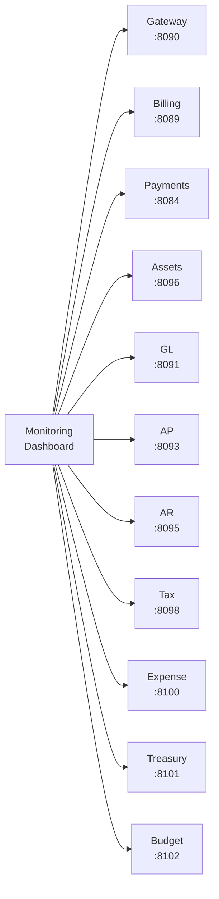
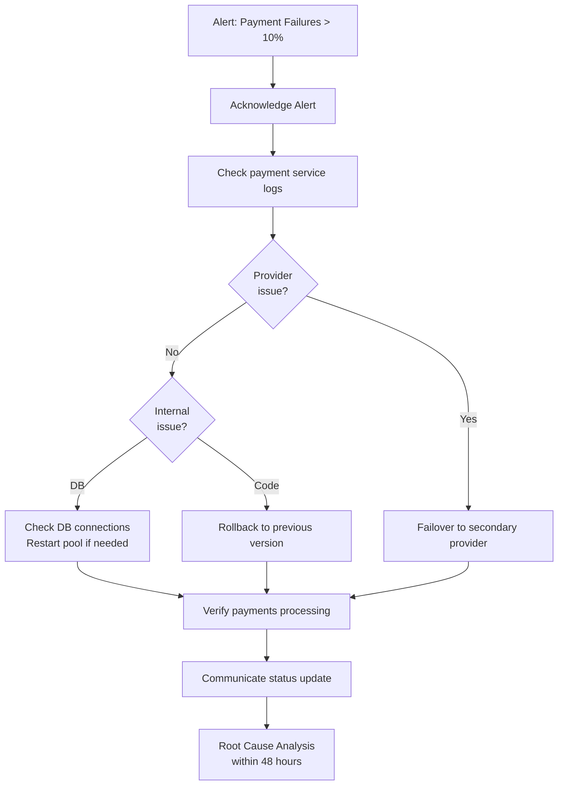

# ERP-Finance Operations Runbook

## Document Information

| Field | Value |
|-------|-------|
| Module | ERP-Finance |
| Document Type | Operations Runbook |
| Version | 1.0.0 |
| Last Updated | 2026-02-23 |

## Service Health Checks

### Quick Health Verification

```bash
# Gateway
curl -s http://finance-gateway:8090/healthz | jq .

# Billing Service
curl -s http://billing-service:8089/health | jq .

# Payments Service
curl -s http://payments-service:8084/health | jq .

# Asset Management
curl -s http://asset-management:8096/health | jq .
```

### Full Service Status Matrix



## Common Operations

### OP-001: Monthly Invoice Generation

**Trigger**: First business day of each month or on-demand.

**Steps**:
1. Verify all active subscriptions are current
2. Trigger invoice generation: `POST /api/v1/invoices/generate`
3. Monitor response for count of generated invoices
4. Verify invoices in database
5. Check event bus for `erp.finance.billing.invoice-generated` events

**Rollback**: Void generated invoices if calculation error detected.

### OP-002: Payment Provider Failover

**Trigger**: Primary payment provider (e.g., Paystack) returns > 10% failure rate.

**Steps**:
1. Alert fires: `payment_provider_failure_rate > 10%`
2. Check provider status page for outage confirmation
3. Update routing configuration to redirect to secondary provider
4. Monitor success rate recovery
5. Revert to primary when provider confirms resolution

### OP-003: Database Maintenance

**Trigger**: Scheduled weekly or on-demand.

**Steps**:
1. Verify no active month-end close in progress
2. Run VACUUM ANALYZE on high-churn tables:
   - `usage_records` (high insert volume)
   - `transactions` (high insert volume)
   - `audit_logs` (append-only)
3. Update table statistics
4. Check and rebuild bloated indexes
5. Verify replication lag < 100ms

### OP-004: Event Stream Recovery

**Trigger**: NATS consumer lag exceeds 10,000 messages.

**Steps**:
1. Identify lagging consumer group
2. Check consumer health and error logs
3. If consumer crashed: restart consumer pods
4. If processing bottleneck: scale consumer replicas
5. Monitor lag reduction
6. Investigate dead letter queue for failed messages

## Incident Response

### SEV-1: Payment Processing Failure



### SEV-2: Month-End Close Blocked

**Symptoms**: Period close fails validation checks.

**Steps**:
1. Review validation errors in close report
2. Common issues:
   - Unposted draft journal entries -> post or void
   - Unreconciled bank accounts -> complete reconciliation
   - Open AP invoices without approval -> escalate for approval
3. Re-run period close after resolving blockers

### SEV-3: Data Inconsistency Between GL and Sub-Ledgers

**Steps**:
1. Run reconciliation report: GL balance vs. AP sub-ledger + AR sub-ledger
2. Identify missing journal entries
3. Check event bus for failed/dropped events
4. Replay events from dead letter queue if applicable
5. Post correcting journal entries if needed
6. Document discrepancy and root cause

## Scaling Operations

### Scaling Billing During Invoice Generation

During bulk invoice generation (month-end):

```bash
# Scale billing replicas
kubectl scale deployment billing-service -n erp-finance --replicas=10

# Monitor progress
watch -n 5 'curl -s http://billing-service:8089/metrics | grep invoice_generation'

# Scale back after completion
kubectl scale deployment billing-service -n erp-finance --replicas=3
```

### Database Read Replica Scaling

For heavy reporting periods:

```bash
# Add read replicas via CloudNativePG
kubectl patch cluster finance-pg -n erp-finance-data \
  --type merge -p '{"spec":{"instances":5}}'
```

## Backup & Recovery

### Backup Schedule

| Data | Frequency | Retention | Method |
|------|-----------|-----------|--------|
| PostgreSQL | Every 6 hours | 30 days | pg_basebackup + WAL archiving |
| Redis | Hourly RDB | 7 days | RDB snapshot to S3 |
| MinIO (documents) | Daily | 1 year | Cross-region replication |
| NATS streams | Continuous | 90 days | JetStream replication |

### Point-in-Time Recovery

```bash
# Restore PostgreSQL to specific timestamp
pg_restore --target-time="2026-02-23 10:00:00+00" \
  --target-action=promote \
  /backups/erp_finance_latest.backup
```

### Disaster Recovery

- **RPO**: < 1 minute (synchronous WAL replication)
- **RTO**: < 15 minutes (automated failover)
- **DR Test**: Quarterly, full failover exercise

## Maintenance Windows

| Maintenance Type | Window | Frequency | Impact |
|-----------------|--------|-----------|--------|
| Database vacuum | Sat 02:00-04:00 UTC | Weekly | Minimal (online) |
| Security patches | Sun 02:00-06:00 UTC | Monthly | Brief restarts |
| Major upgrades | Sat 22:00-Sun 06:00 UTC | Quarterly | Planned downtime |
| Certificate rotation | N/A (automated) | 30 days before expiry | None |

## Contact Escalation

| Level | Contact | Response Time |
|-------|---------|---------------|
| L1 | On-call SRE | 15 minutes |
| L2 | Finance Platform Team | 30 minutes |
| L3 | Senior Engineering | 1 hour |
| Executive | VP Engineering + CFO | 2 hours (SEV-1 only) |
