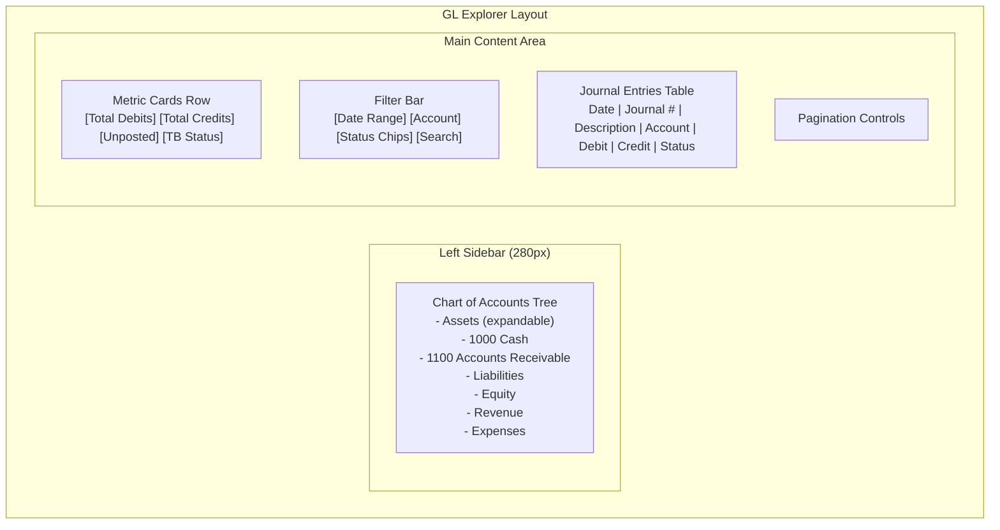
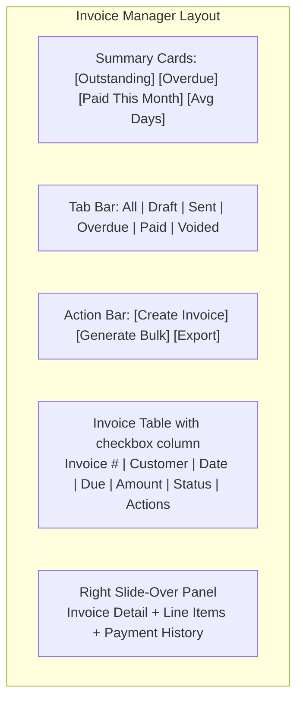
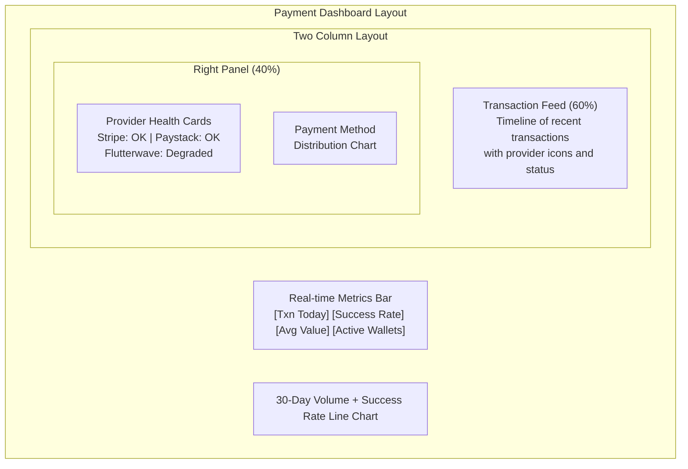
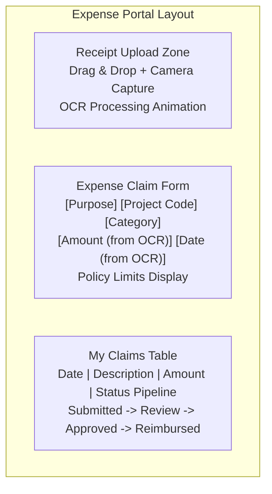
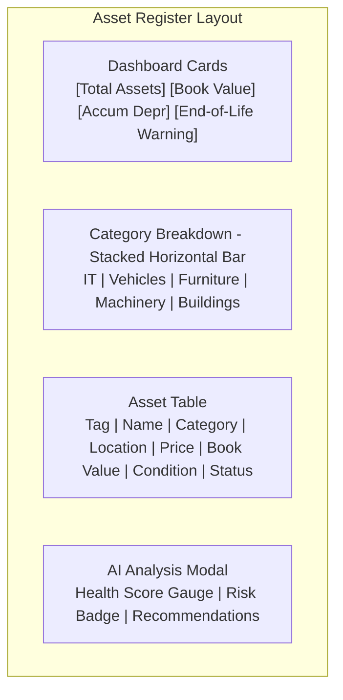
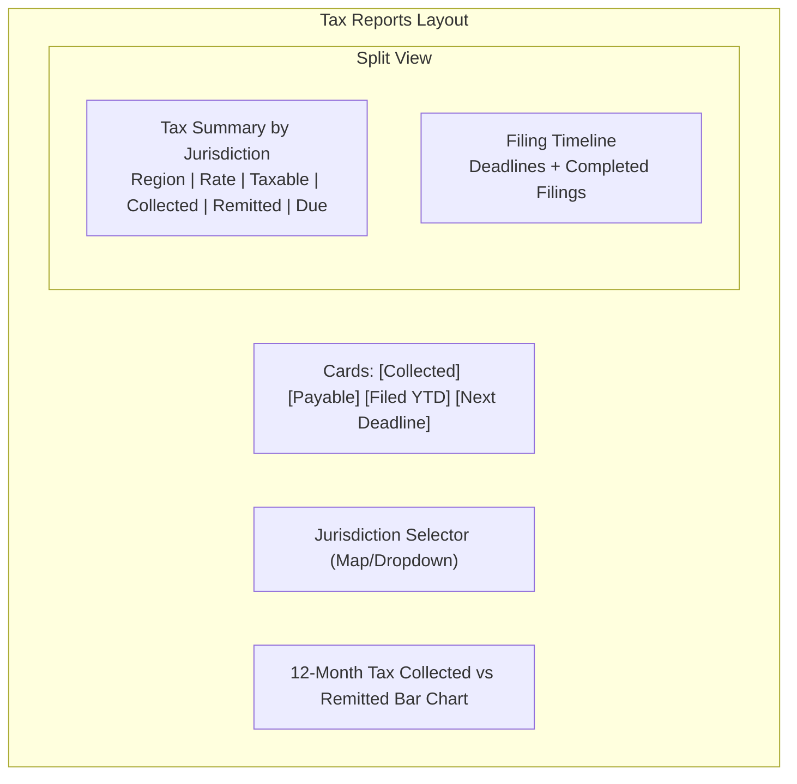
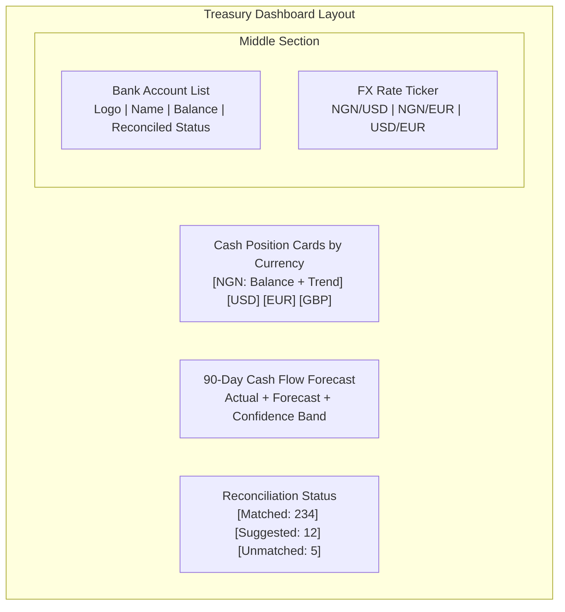
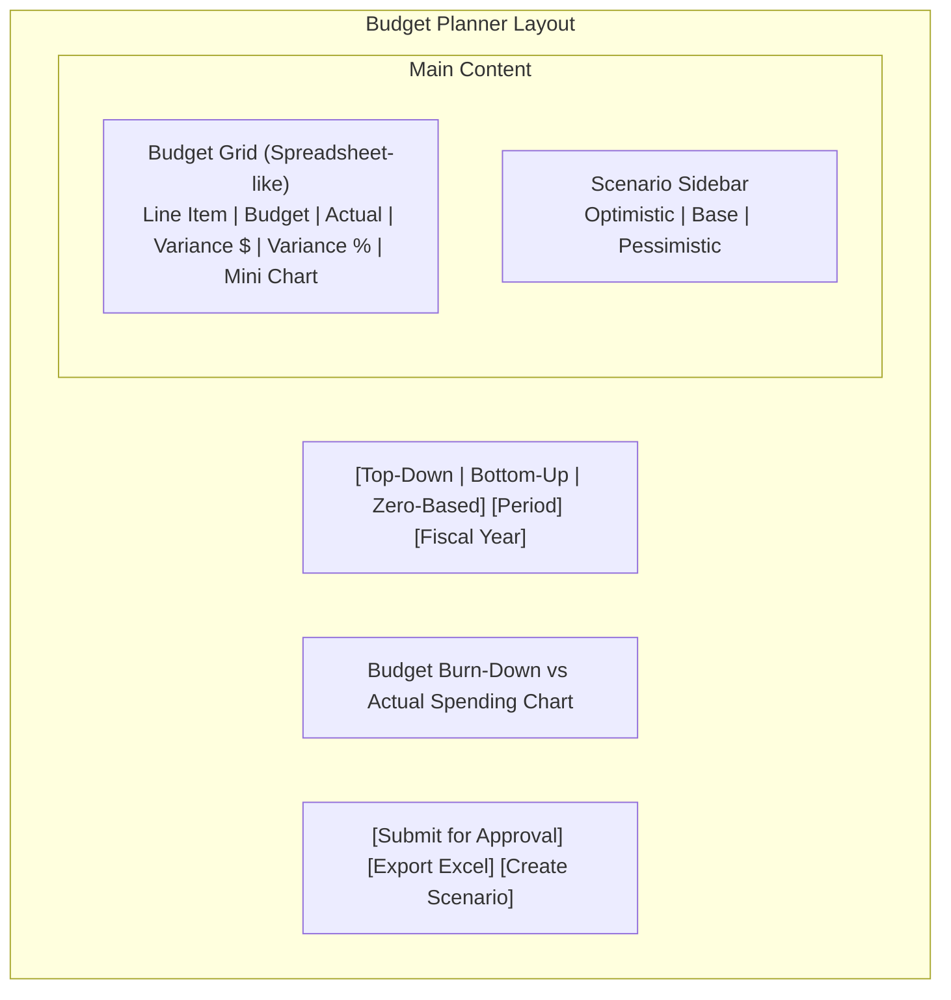
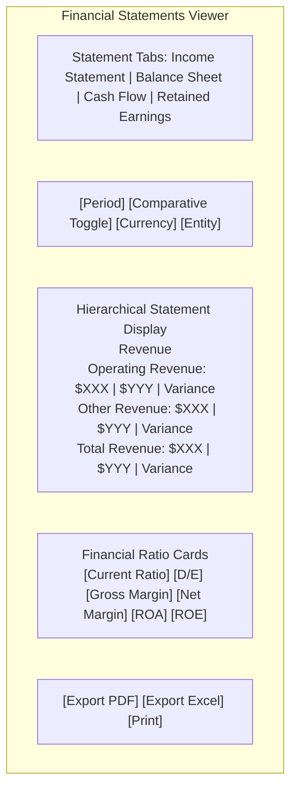
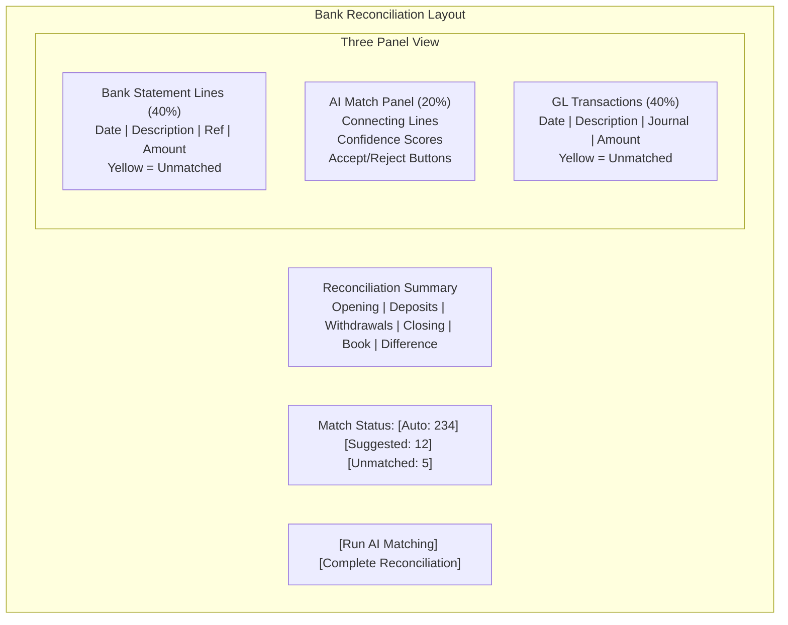

# ERP-Finance Figma Design Prompts

## Document Information

| Field | Value |
|-------|-------|
| Module | ERP-Finance |
| Document Type | Figma Design Prompts |
| Version | 1.0.0 |
| Last Updated | 2026-02-23 |

## Design System Foundation

All screens follow the ERP design system: neutral background (#F8F9FA), primary blue (#2563EB), success green (#16A34A), warning amber (#D97706), danger red (#DC2626). Typography: Inter for UI, JetBrains Mono for financial figures. 8px spacing grid. Cards with 1px border (#E5E7EB) and 8px border-radius.

## Screen 1: General Ledger Explorer

### Prompt

Design an enterprise General Ledger explorer screen for ERP-Finance. The layout uses a left sidebar showing a hierarchical Chart of Accounts tree (collapsible by account type: Assets, Liabilities, Equity, Revenue, Expenses). Each account node shows account number, name, and current balance. The main content area shows a journal entries table with columns: Date, Journal #, Description, Account, Debit, Credit, Status (Draft/Posted/Reversed), and Posted By. Above the table, include filter controls: date range picker, account selector dropdown, status filter chips, and a search box. At the top-right, show key metrics cards: Total Debits (current period), Total Credits (current period), Unposted Entries count, and Trial Balance Status (balanced/unbalanced indicator). Include a prominent "New Journal Entry" button. The bottom of the screen has pagination. Financial figures use monospace font right-aligned with thousand separators. Posted entries show a lock icon. Use subtle green/red coloring for credit/debit columns.

---

## Screen 2: Invoice Manager

### Prompt

Design an invoice management dashboard for ERP-Finance. The top section shows four summary cards: Total Outstanding, Overdue Amount (red accent), Paid This Month (green accent), and Average Days to Pay. Below, display a tab bar with tabs: All Invoices, Draft, Sent, Overdue, Paid, Voided. The main table shows: Invoice #, Customer Name, Issue Date, Due Date, Amount, Status (color-coded badge), and Actions (View, Send, Void). Include a multi-select checkbox column for bulk actions (Bulk Send, Bulk Export PDF). A right-side slide-over panel appears when clicking an invoice, showing full invoice details with line items, payment history, dunning history, and a "Record Payment" button. The top-right has "Create Invoice" and "Generate Bulk Invoices" buttons. Include a search bar and filters for customer, date range, and amount range.

---

## Screen 3: Payment Dashboard

### Prompt

Design a payment processing dashboard for ERP-Finance. The top shows a real-time metrics bar: Transactions Today (count + volume), Success Rate (percentage with trend arrow), Average Transaction Value, and Active Wallets. Below is a two-column layout. Left column (60%): Transaction feed as a timeline showing recent transactions with provider icon (Stripe/Paystack/Flutterwave), amount, currency flag, status indicator (green dot for success, red for failed, yellow for pending), customer email, and timestamp. Each entry is clickable for details. Right column (40%): Payment provider health status cards showing each provider's current status (operational/degraded/down), success rate, and average latency. Below the providers, show a donut chart of payment method distribution (Card, Bank Transfer, Wallet, M-Pesa). At the bottom, show a 30-day line chart of daily transaction volume and success rate overlay.

---

## Screen 4: Expense Portal

### Prompt

Design an employee expense portal for ERP-Finance. The screen has three main areas. Top: A drag-and-drop receipt upload zone with camera icon for mobile capture, supporting PDF and images. When a receipt is uploaded, show an OCR processing animation, then display extracted fields (vendor, date, amount, category) in editable form fields with confidence indicators (green checkmark for high confidence, yellow for medium). Middle: Expense claim form with fields for trip/purpose, project code (searchable dropdown), category (meal, transport, lodging, etc.), and notes. Below the form, show the current expense policy limits (per-diem rates by category). Bottom: My Claims table showing recent submissions with Status column using a pipeline visualization (Submitted -> Manager Review -> Finance Review -> Approved -> Reimbursed). Each row shows claim date, description, amount, and status with the current stage highlighted.

---

## Screen 5: Asset Register

### Prompt

Design a fixed asset register screen for ERP-Finance. The top section shows dashboard cards: Total Assets (count), Total Book Value, Total Accumulated Depreciation, and Assets Near End-of-Life (warning accent). Below, show a visual breakdown using a horizontal stacked bar chart showing assets by category (IT Equipment, Vehicles, Furniture, Machinery, Buildings) colored by status (In Service = green, Under Maintenance = yellow, Idle = gray, Decommissioned = red). The main table shows: Asset Tag, Name, Category (icon + text), Location, Purchase Price, Current Book Value, Condition Score (0-100 as colored progress bar), Status (badge), and Actions (View, Depreciate, Maintain, AI Analyze). Clicking "AI Analyze" shows a modal with AI health analysis results including health score gauge, risk level badge, and recommendation cards. Include filters for category, status, location, and department.

---

## Screen 6: Tax Reports

### Prompt

Design a tax reporting dashboard for ERP-Finance. The top row shows cards: Tax Collected (current period), Tax Payable, Tax Filed (YTD), and Next Filing Deadline (with countdown). Below, show a jurisdiction selector as a world map with pins or a dropdown for region selection. The main area is split: Left side shows a tax summary table grouped by jurisdiction (e.g., Nigeria VAT, US Sales Tax, EU VAT) with columns: Jurisdiction, Rate, Taxable Amount, Tax Collected, Tax Remitted, Balance Due. Right side shows a vertical timeline of filing deadlines and completed filings with status badges (Filed, Pending, Overdue). At the bottom, show a 12-month bar chart comparing tax collected vs. tax remitted by month. Include an "Export Tax Return" button and "Integrate with Avalara" toggle.

---

## Screen 7: Treasury Dashboard

### Prompt

Design a treasury management dashboard for ERP-Finance. The top row shows real-time cash position cards per currency (NGN, USD, EUR, GBP) with current balance, 24-hour change indicator (up/down arrow with percentage), and a sparkline chart showing 7-day trend. Below left: Bank account list with bank logo, account name, last 4 digits, current balance, and last reconciled date. A green checkmark for reconciled, yellow exclamation for pending reconciliation. Below right: FX rate ticker showing live exchange rates for key currency pairs with bid/ask spread. Middle section: Cash flow forecast chart showing 90-day projection with actual (solid line), forecast (dashed line), and confidence band (shaded area). The forecast area shows optimistic, base, and pessimistic scenarios as three lines. Bottom: Bank reconciliation status showing matched (green), suggested matches (yellow), and unmatched (red) items with counts.

---

## Screen 8: Budget Planner

### Prompt

Design a budget planning and variance analysis screen for ERP-Finance. The top shows toggle buttons for budget type: Top-Down, Bottom-Up, Zero-Based. Below, a period selector (monthly/quarterly/annual) and fiscal year dropdown. The main area is a spreadsheet-like grid with columns: Budget Line Item (hierarchical, collapsible), Budget Amount, Actual Amount, Variance ($), Variance (%), and a mini bar chart showing budget vs. actual. Color-code variance: green for under budget, red for over budget, with intensity proportional to variance percentage. Include a right sidebar for scenario comparison showing three columns (Optimistic, Base, Pessimistic) with total amounts and key assumptions. At the bottom, show a cumulative spending chart: budget burn-down (dashed line) vs. actual spending (solid line) over the fiscal year. Include "Submit for Approval" and "Export to Excel" buttons.

---

## Screen 9: Financial Statements Viewer

### Prompt

Design a financial statements viewer for ERP-Finance. The top has a tab bar for statement type: Income Statement, Balance Sheet, Cash Flow Statement, and Retained Earnings. Below, a control bar with: Reporting Period selector (month/quarter/year), Comparative Period toggle (show prior period alongside), Currency selector, and Entity selector for multi-entity consolidation. The main area displays the financial statement in a professional, print-ready format with hierarchical sections (e.g., Revenue > Operating Revenue > Product Revenue). Each section is collapsible. Show both current period and comparative period columns with variance column. Grand totals are bold with a top border. At the bottom, show key financial ratios in cards: Current Ratio, Debt-to-Equity, Gross Margin %, Net Profit Margin %, ROA, ROE. Include "Export PDF", "Export Excel", and "Print" buttons in the top-right. Add a "Notes to Financial Statements" expandable section at the bottom.

---

## Screen 10: Bank Reconciliation

### Prompt

Design a bank reconciliation screen for ERP-Finance. The layout is a three-panel view. Left panel (40%): Bank statement lines imported from the bank feed, showing date, description, reference, and amount. Unmatched items have a yellow background. Right panel (40%): Internal GL transactions (cash account), showing date, description, journal reference, and amount. Unmatched items also have yellow background. Center panel (20%): AI-suggested matches shown as connecting lines between left and right items, with a confidence score badge. Users can click to accept or reject each match. At the top, show reconciliation summary: Opening Balance, Total Deposits, Total Withdrawals, Closing Balance (from bank), Book Balance, and Difference (highlighted if non-zero). Include a "Run AI Matching" button that triggers the AI reconciliation engine with a progress indicator. Below the three panels, show a summary: Auto-Matched (green count), Suggested (yellow count), Unmatched (red count), and a "Complete Reconciliation" button that is only enabled when difference is zero.

