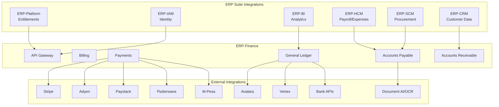
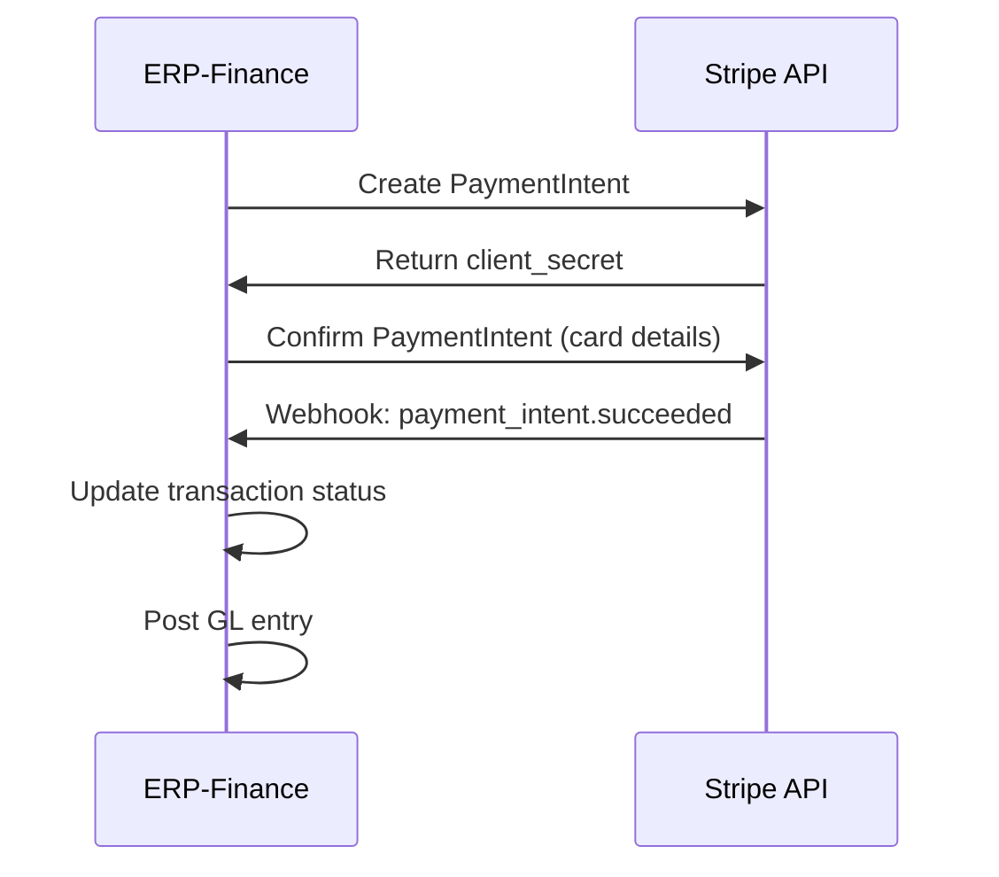
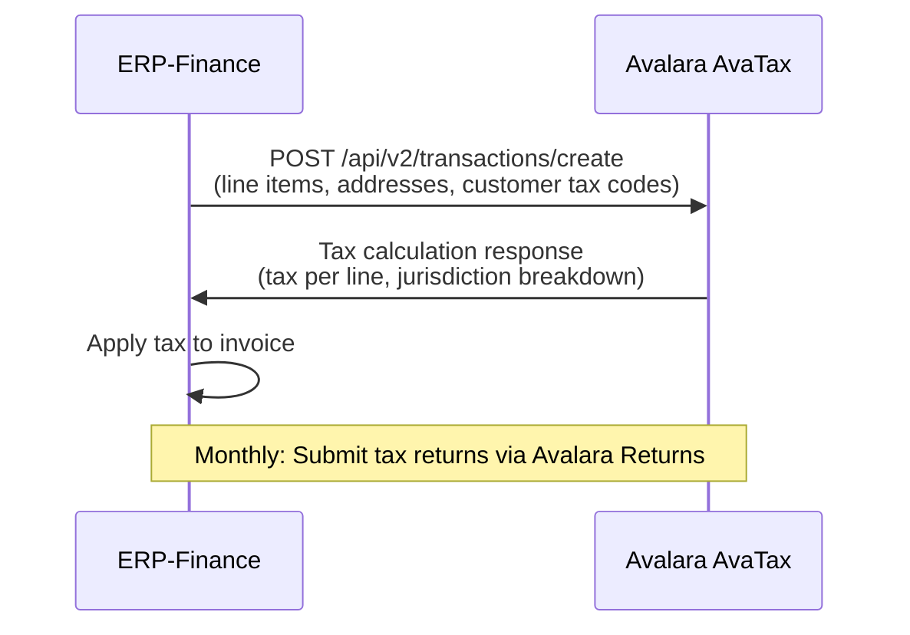
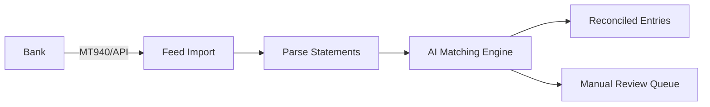

# ERP-Finance Integration Guide

## Document Information

| Field | Value |
|-------|-------|
| Module | ERP-Finance |
| Document Type | Integration Guide |
| Version | 1.0.0 |
| Last Updated | 2026-02-23 |

## Integration Architecture



## ERP Suite Integrations

### ERP-Platform Integration

**Purpose**: Entitlement verification and subscription management.

**Contract**:
- Finance checks entitlements on every API request
- Platform events trigger capability enablement/disablement
- SKU: `erp.finance` with standalone and suite modes

**Events Consumed**:
- `erp.platform.entitlement.granted` -- Enable finance capabilities
- `erp.platform.entitlement.revoked` -- Disable finance capabilities

**Events Published**:
- `erp.finance.usage.reported` -- Report usage metrics back to platform

### ERP-IAM Integration

**Purpose**: Authentication and authorization.

**Protocol**: OIDC with JWT tokens.

**Configuration**:
```yaml
identity_provider: ERP-Directory
oidc_issuer: https://iam.erp.example.com
audience: erp-finance
scopes: [openid, profile, finance:read, finance:write]
```

### ERP-CRM Integration

**Purpose**: Customer data synchronization for AR invoicing.

**Events Consumed**:
- `erp.crm.customer.created` -- Create AR customer master
- `erp.crm.customer.updated` -- Update customer details
- `erp.crm.deal.won` -- Trigger billing subscription creation

**Events Published**:
- `erp.finance.invoice.overdue` -- CRM can trigger collections workflow
- `erp.finance.payment.received` -- Update CRM deal status

### ERP-HCM Integration

**Purpose**: Employee expense management and payroll journal entries.

**Events Consumed**:
- `erp.hcm.employee.created` -- Create expense submitter profile
- `erp.hcm.payroll.processed` -- Post payroll journal entries to GL
- `erp.hcm.employee.terminated` -- Close pending expense claims

**Events Published**:
- `erp.finance.expense.reimbursed` -- Notify HCM of reimbursement

### ERP-SCM Integration

**Purpose**: Purchase order to AP invoice matching.

**Events Consumed**:
- `erp.scm.purchase-order.created` -- Register PO for 3-way matching
- `erp.scm.goods-receipt.confirmed` -- Register receipt for 3-way matching

**Events Published**:
- `erp.finance.ap.invoice.matched` -- PO fully matched and approved
- `erp.finance.ap.payment.completed` -- Vendor payment processed

## External Payment Provider Integrations

### Stripe Integration



### Paystack Integration

The payments service natively supports Paystack for NGN transactions:

```
POST /api/v1/payments/initiate
-> Generates Paystack authorization URL
-> Customer redirected to Paystack checkout
-> Webhook callback updates transaction status
```

### Flutterwave Integration

Similar flow to Paystack, supporting NGN, GHS, KES, ZAR, and other African currencies.

### M-Pesa Integration

For mobile money payments in East Africa (Kenya, Tanzania):
- STK push for customer-initiated payments
- B2C for disbursements and refunds
- Transaction status polling for confirmation

## Tax Engine Integrations

### Avalara AvaTax



### Vertex Integration

Alternative tax engine for enterprises with Vertex O Series:
- Real-time tax determination API
- Tax journal posting integration
- Returns automation

## Banking Integrations

### Bank Feed Import

- **Format Support**: MT940, BAI2, OFX, CSV
- **Protocols**: SFTP, API (Open Banking)
- **Frequency**: Real-time (Open Banking) or daily batch (SFTP)

### Bank Reconciliation Flow



## Webhook Configuration

### Inbound Webhooks

| Provider | Endpoint | Authentication |
|----------|----------|---------------|
| Stripe | `/api/v1/webhooks/stripe` | Webhook signature verification |
| Paystack | `/api/v1/payments/webhook` | IP whitelist + secret verification |
| Flutterwave | `/api/v1/webhooks/flutterwave` | Secret hash verification |
| Bank feeds | `/api/v1/webhooks/banking` | mTLS + API key |

### Outbound Webhooks

ERP-Finance can notify external systems via configurable webhooks:

```json
{
  "url": "https://external-system.example.com/finance-webhook",
  "events": ["invoice.created", "payment.succeeded", "payment.failed"],
  "secret": "whsec_xxx",
  "retry_policy": {
    "max_attempts": 5,
    "backoff": "exponential"
  }
}
```

## Integration Contracts

### Event Backbone

```yaml
runtime_contracts:
  entitlements: ERP-Platform
  identity: ERP-IAM
  events: NATS
```

All cross-module communication uses NATS JetStream with CloudEvents envelope, ensuring:
- At-least-once delivery
- Ordered delivery within stream
- Consumer acknowledgment with timeout
- Dead letter queue for failed processing
