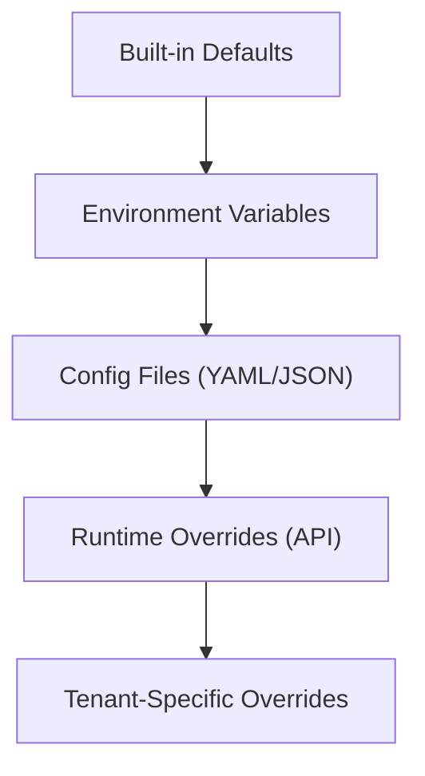

# ERP-Finance Configuration Reference

## Document Information

| Field | Value |
|-------|-------|
| Module | ERP-Finance |
| Document Type | Configuration Reference |
| Version | 1.0.0 |
| Last Updated | 2026-02-23 |

## Configuration Hierarchy



## Module Manifest

File: `/erp/module.manifest.yaml`

```yaml
api_version: v1
module_id: erp_finance
repository: ERP-Finance
sku: erp.finance
subscription:
  standalone: true
  suite: true
integration:
  control_plane: ERP-Platform
  identity_provider: ERP-Directory
  event_backbone: NATS
aidd:
  guardrails_file: erp/aidd.guardrails.yaml
```

## Capabilities Configuration

File: `/configs/capabilities.json`

```json
{
  "module": "ERP-Finance",
  "capabilities": [
    "billing",
    "payments",
    "fixed_assets",
    "general_ledger",
    "ap",
    "ar",
    "tax",
    "expense",
    "treasury",
    "budgeting_forecasting"
  ]
}
```

## Module Dependencies

File: `/configs/module_dependencies.yaml`

```yaml
module: ERP-Finance
dependencies:
  - ERP-Billing
  - ERP-Payments
  - ERP-Asset-Management
  - ERP-General-Ledger
  - ERP-AP-AR
  - ERP-Tax-Management
  - ERP-Expense-Management
runtime_contracts:
  entitlements: ERP-Platform
  identity: ERP-IAM
  events: NATS
```

## Environment Variables

### Gateway Service

| Variable | Default | Description |
|----------|---------|-------------|
| PORT | 8090 | HTTP listen port |
| LOG_LEVEL | info | Logging level |
| CONFIG_PATH | configs/capabilities.json | Capabilities file path |

### Billing Service (Rust)

| Variable | Default | Required | Description |
|----------|---------|----------|-------------|
| DATABASE_URL | - | Yes | PostgreSQL connection string |
| PORT | 8089 | No | HTTP listen port |
| RUST_LOG | info | No | Rust log filter |
| NATS_URL | - | No | NATS connection URL |
| REDIS_URL | - | No | Redis connection URL |

### Payments Service (Rust)

| Variable | Default | Required | Description |
|----------|---------|----------|-------------|
| DATABASE_URL | - | Yes | PostgreSQL connection string |
| PORT | 8084 | No | HTTP listen port |
| NATS_URL | - | No | NATS connection URL |
| PAYSTACK_SECRET_KEY | - | No | Paystack API secret |
| FLUTTERWAVE_SECRET_KEY | - | No | Flutterwave API secret |
| STRIPE_SECRET_KEY | - | No | Stripe API secret |
| ADYEN_API_KEY | - | No | Adyen API key |

### Asset Management Service (Python)

| Variable | Default | Required | Description |
|----------|---------|----------|-------------|
| DATABASE_URL | sqlite:///./assets.db | No | Database URL |
| ANTHROPIC_API_KEY | - | No | Claude API key for AI features |
| AI_MODEL | claude-sonnet-4-20250514 | No | AI model identifier |
| APP_NAME | Asset Management System | No | Application name |
| APP_VERSION | 1.0.0 | No | Application version |

## AIDD Guardrails Configuration

File: `/erp/aidd.guardrails.yaml`

```yaml
version: 1
module: ERP-Finance
autonomous_actions:
  - read_only_queries
  - low_risk_notifications
supervised_actions:
  - data_mutations
  - workflow_automation
  - bulk_operations
prohibited_actions:
  - cross_tenant_data_access
  - irreversible_delete_without_backup
  - privilege_escalation
controls:
  require_human_in_the_loop_for_high_risk: true
  decision_logging: true
  rollback_window_hours: 24
```

## Financial Configuration

### Currency Settings

```yaml
currencies:
  functional_currency: NGN
  supported_currencies:
    - NGN  # Nigerian Naira
    - USD  # US Dollar
    - EUR  # Euro
    - GBP  # British Pound
    - GHS  # Ghanaian Cedi
    - KES  # Kenyan Shilling
    - ZAR  # South African Rand
  fx_rate_source: ecb  # European Central Bank
  fx_rate_refresh: 3600  # seconds
```

### Accounting Settings

```yaml
accounting:
  fiscal_year_start: "01-01"  # January 1st
  accounting_method: accrual
  rounding_mode: half_even  # Banker's rounding
  decimal_places: 2
  period_close:
    require_reconciliation: true
    require_approval: true
    auto_accrue: true
```

### Billing Settings

```yaml
billing:
  invoice_prefix: "INV"
  invoice_sequence_start: 1000
  default_payment_terms: 30  # days
  dunning_schedule: [7, 14, 30, 60]  # days after due
  proration_method: daily  # daily or monthly
  tax_rate_default: 0.075  # 7.5% VAT (Nigeria)
```

### Payment Settings

```yaml
payments:
  default_currency: NGN
  provider_priority:
    NGN: [paystack, flutterwave]
    USD: [stripe, adyen]
    EUR: [adyen, stripe]
    KES: [mpesa, flutterwave]
  fraud_scoring:
    enabled: true
    threshold: 0.7  # Block if score > 0.7
  retry_policy:
    max_attempts: 3
    backoff_base: 2  # seconds
    backoff_multiplier: 2
```

### Asset Management Settings

```yaml
assets:
  depreciation:
    default_method: straight_line
    run_frequency: monthly
    auto_calculate: true
  maintenance:
    overdue_check_frequency: daily
    auto_generate_recurring: true
    alert_days_before: 7
  ai:
    enabled: true
    model: claude-sonnet-4-20250514
    max_tokens: 4096
    analysis_cache_hours: 24
```

## Feature Flags

| Flag | Default | Description |
|------|---------|-------------|
| `ff.billing.usage_metering` | true | Enable usage-based billing |
| `ff.payments.mpesa` | false | Enable M-Pesa integration |
| `ff.payments.crypto` | false | Enable cryptocurrency payments |
| `ff.assets.ai_analysis` | true | Enable AI-powered asset analysis |
| `ff.gl.multi_currency` | true | Enable multi-currency GL |
| `ff.tax.avalara` | false | Enable Avalara integration |
| `ff.tax.vertex` | false | Enable Vertex integration |
| `ff.expense.ocr` | true | Enable receipt OCR |
| `ff.treasury.ai_recon` | true | Enable AI bank reconciliation |
| `ff.budget.scenarios` | true | Enable scenario planning |
