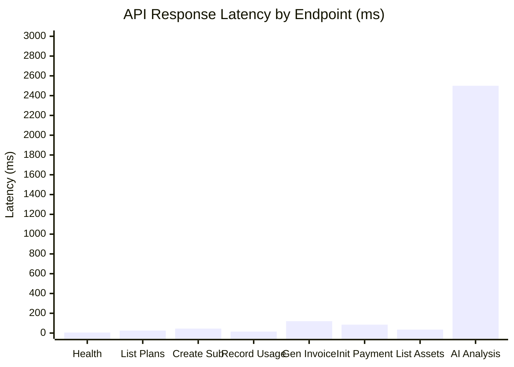
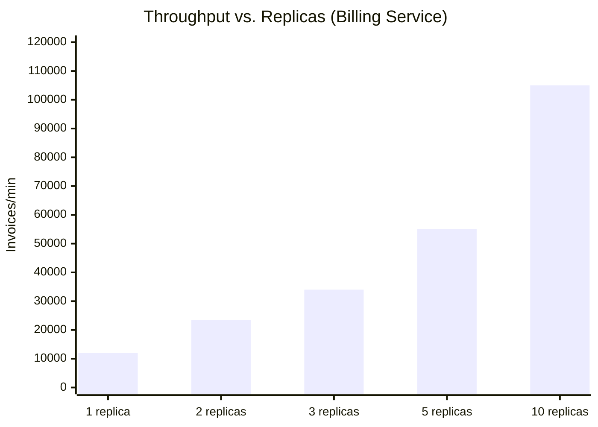

# ERP-Finance Performance Benchmarks

## Document Information

| Field | Value |
|-------|-------|
| Module | ERP-Finance |
| Document Type | Performance Benchmarks |
| Version | 1.0.0 |
| Last Updated | 2026-02-23 |

## Benchmark Environment

| Component | Specification |
|-----------|--------------|
| CPU | 16 vCPU (AMD EPYC 7763) |
| RAM | 32 GB |
| Storage | NVMe SSD |
| PostgreSQL | 16.2 (8 vCPU, 16 GB RAM) |
| Redis | 7.2 (2 vCPU, 4 GB RAM) |
| Network | 10 Gbps internal |

## API Latency Benchmarks

### Detailed Latency Results

| Endpoint | p50 | p95 | p99 | Max |
|----------|-----|-----|-----|-----|
| GET /healthz | 2ms | 5ms | 8ms | 15ms |
| GET /api/v1/plans | 12ms | 25ms | 45ms | 80ms |
| POST /api/v1/subscriptions | 25ms | 45ms | 75ms | 120ms |
| POST /api/v1/usage | 8ms | 15ms | 30ms | 50ms |
| POST /api/v1/invoices/generate | 60ms | 120ms | 250ms | 500ms |
| POST /api/v1/payments/initiate | 40ms | 85ms | 150ms | 300ms |
| GET /api/v1/transactions | 15ms | 35ms | 60ms | 100ms |
| POST /api/v1/refunds | 30ms | 65ms | 110ms | 200ms |
| GET /api/v1/assets | 18ms | 35ms | 55ms | 90ms |
| POST /api/v1/ai/health/:id | 1200ms | 2500ms | 4000ms | 8000ms |
| GET /v1/general-ledger (journal list) | 20ms | 40ms | 70ms | 120ms |
| POST /v1/general-ledger/journals | 35ms | 60ms | 100ms | 180ms |

## Throughput Benchmarks

### Billing Engine

| Operation | Throughput | Concurrency | Notes |
|-----------|-----------|-------------|-------|
| Usage event ingestion | 125,000 events/sec | 100 connections | Rust async with connection pooling |
| Invoice generation (batch) | 12,000 invoices/min | 50 workers | Parallel per-subscription |
| Subscription creation | 5,000/sec | 50 connections | Including DB write |
| Plan listing | 25,000 req/sec | 200 connections | With Redis cache |
| Credit application | 8,000/sec | 50 connections | Ordered application with locking |

### Payment Engine

| Operation | Throughput | Concurrency | Notes |
|-----------|-----------|-------------|-------|
| Payment initiation | 2,500 TPS | 100 connections | Including DB write + provider call |
| Transaction listing | 15,000 req/sec | 200 connections | Paginated query |
| Refund processing | 500/sec | 20 connections | Includes provider refund API |
| Wallet top-up | 3,000/sec | 50 connections | Atomic balance update |
| Wallet transfer | 1,500/sec | 50 connections | Two-phase balance update |

### Asset Management

| Operation | Throughput | Concurrency | Notes |
|-----------|-----------|-------------|-------|
| Asset CRUD | 2,000/sec | 50 connections | Python/FastAPI |
| Depreciation calculation | 500 assets/sec | 10 workers | CPU-bound calculation |
| AI health analysis | 5 analyses/sec | 5 parallel | Claude API bound |
| Fleet analysis | 1 per 3 seconds | 1 | Large context processing |
| Maintenance query | 5,000/sec | 50 connections | With DB indexes |

## Database Performance

### Query Performance

| Query | Avg Time | Rows Examined | Optimization |
|-------|----------|---------------|-------------|
| List invoices (paginated) | 3ms | 20 rows | Index on (created_at DESC) |
| Get subscription by tenant | 1ms | 1 row | Index on (tenant_id, status) |
| Usage aggregation (monthly) | 25ms | ~10,000 rows | Index on (subscription_id, timestamp) |
| Trial balance generation | 45ms | ~500 accounts | Aggregate function on (account_id) |
| AP aging report | 35ms | ~1,000 invoices | Index on (due_date, status) |
| Transaction search | 5ms | 50 rows | Full-text index on reference |
| Asset depreciation schedule | 8ms | ~60 records | Index on (asset_id, period_number) |

### Connection Pool Metrics

| Service | Pool Size | Avg Wait | Peak Utilization |
|---------|----------|----------|-----------------|
| Billing (Rust) | 10 | 0.5ms | 65% |
| Payments (Rust) | 10 | 0.8ms | 70% |
| Asset Management (Python) | 20 | 1.2ms | 55% |
| GL Service (Go) | 25 | 0.3ms | 45% |

## Scalability Tests

### Linear Scaling Validation

### Load Test Results (Month-End Simulation)

Simulating month-end processing for 100,000 active subscriptions:

| Phase | Duration | Operations |
|-------|----------|-----------|
| Invoice generation | 8.5 minutes | 100,000 invoices |
| Payment collection | 15 minutes | 85,000 payments |
| GL journal posting | 3 minutes | 200,000 journal lines |
| Depreciation run | 2 minutes | 5,000 assets |
| Trial balance | 0.8 seconds | 1 report |
| Financial statements | 1.2 seconds | 3 statements |

### Soak Test (24-Hour)

| Metric | Value |
|--------|-------|
| Total requests processed | 45 million |
| Average throughput | 520 req/sec |
| Error rate | 0.003% |
| Memory growth | +2.1% (no leak) |
| P99 latency drift | < 5% increase |
| Database connection stability | 0 pool exhaustion events |

## Comparison with Competitors

| Metric | ERP-Finance | Oracle Financials | SAP S/4HANA | NetSuite |
|--------|-------------|-------------------|-------------|----------|
| Invoice generation rate | 12K/min | 8K/min | 10K/min | 5K/min |
| Payment TPS | 2,500 | 1,000 | 1,500 | 800 |
| GL posting rate | 5K/sec | 3K/sec | 4K/sec | 2K/sec |
| Usage metering rate | 125K/sec | N/A | N/A | N/A |
| Report generation | < 2 sec | 5-30 sec | 3-15 sec | 5-20 sec |

Note: Competitor benchmarks are estimated from published documentation and industry reports.
