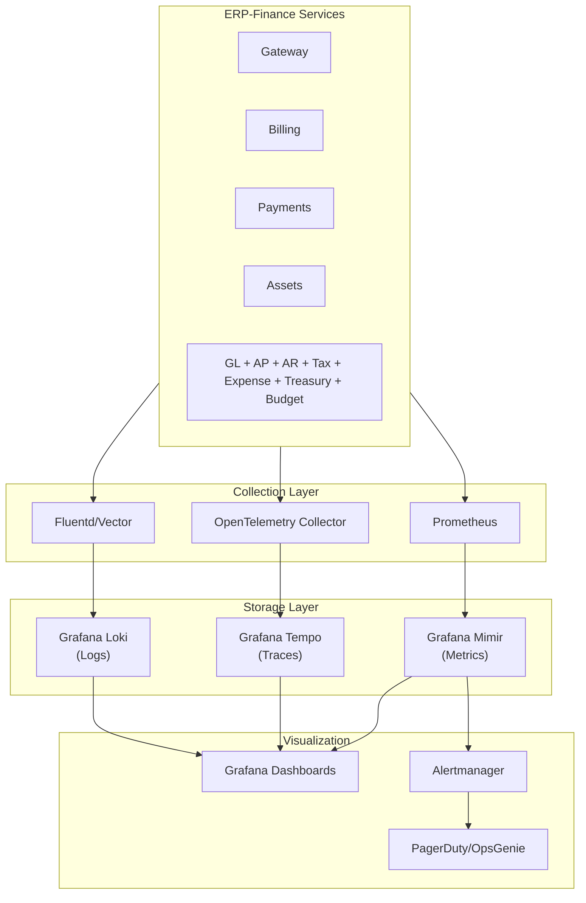
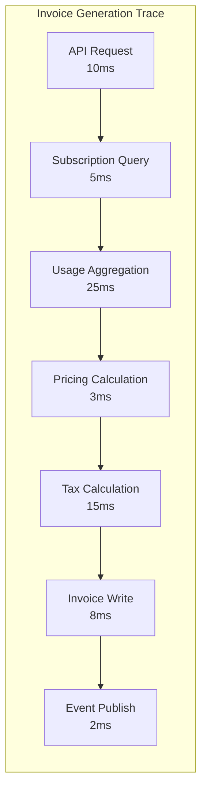
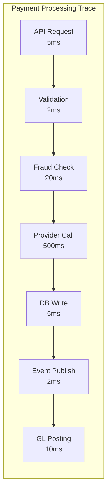

# ERP-Finance Monitoring & Observability

## Document Information

| Field | Value |
|-------|-------|
| Module | ERP-Finance |
| Document Type | Monitoring & Observability |
| Version | 1.0.0 |
| Last Updated | 2026-02-23 |

## Observability Stack



## Key Metrics (RED Method)

### Rate Metrics

| Metric | Description | Alert Threshold |
|--------|-------------|----------------|
| `finance_api_requests_total` | Total API requests by service and endpoint | N/A (monitoring) |
| `finance_invoices_generated_total` | Invoices generated count | < 100/min (degraded) |
| `finance_payments_processed_total` | Payments processed count | < 10/min (degraded) |
| `finance_usage_events_ingested_total` | Usage events received | < 1000/sec (degraded) |
| `finance_gl_entries_posted_total` | GL entries posted | N/A (monitoring) |

### Error Metrics

| Metric | Description | Alert Threshold |
|--------|-------------|----------------|
| `finance_api_errors_total` | API errors by status code | > 1% of requests |
| `finance_payment_failures_total` | Payment processing failures | > 5% of attempts |
| `finance_db_errors_total` | Database errors | Any occurrence |
| `finance_event_publish_failures` | Event publishing failures | > 0.1% |
| `finance_provider_errors{provider}` | External provider errors | > 10% per provider |

### Duration Metrics

| Metric | Description | Alert Threshold |
|--------|-------------|----------------|
| `finance_api_duration_seconds` | API response time histogram | p99 > 1s |
| `finance_invoice_generation_seconds` | Invoice generation time | p99 > 5s |
| `finance_payment_processing_seconds` | Payment round-trip time | p99 > 10s |
| `finance_db_query_seconds` | Database query duration | p99 > 500ms |
| `finance_ai_analysis_seconds` | AI analysis duration | p99 > 10s |

## Distributed Tracing

### Trace Propagation

All services propagate W3C Trace Context headers:

```
traceparent: 00-0af7651916cd43dd8448eb211c80319c-b7ad6b7169203331-01
tracestate: erp=finance
```

### Critical Trace Paths





## Dashboards

### Finance Operations Dashboard

Key panels:
- Real-time transaction volume (time-series graph)
- Payment success rate by provider (stacked area)
- Invoice generation rate (gauge + trend)
- Active subscriptions count (stat panel)
- Revenue metrics: MRR, ARR (stat panels)
- Top 10 errors (table)
- Service health status (traffic light)

### Financial Health Dashboard

Key panels:
- GL posting rate (counter)
- Trial balance status (pass/fail indicator)
- Open AP invoices by aging bucket (bar chart)
- Open AR invoices by aging bucket (bar chart)
- Cash position by currency (stat panels)
- Budget variance (heat map)

## Alerting Rules

### Critical (SEV-1) -- Page immediately

```yaml
- alert: PaymentServiceDown
  expr: up{job="payments-service"} == 0
  for: 2m
  labels:
    severity: critical
  annotations:
    summary: "Payments service is down"

- alert: HighPaymentFailureRate
  expr: rate(finance_payment_failures_total[5m]) / rate(finance_payments_processed_total[5m]) > 0.1
  for: 5m
  labels:
    severity: critical

- alert: DatabaseConnectionExhausted
  expr: finance_db_pool_active / finance_db_pool_max > 0.95
  for: 2m
  labels:
    severity: critical
```

### Warning (SEV-2) -- Alert channel

```yaml
- alert: HighAPILatency
  expr: histogram_quantile(0.99, finance_api_duration_seconds) > 1
  for: 10m
  labels:
    severity: warning

- alert: EventProcessingLag
  expr: finance_event_consumer_lag > 5000
  for: 15m
  labels:
    severity: warning

- alert: InvoiceGenerationSlow
  expr: rate(finance_invoices_generated_total[5m]) < 100
  for: 10m
  labels:
    severity: warning
```

## Log Standards

### Structured Logging Format

All services emit structured JSON logs:

```json
{
  "timestamp": "2026-02-23T10:00:00.123Z",
  "level": "info",
  "service": "billing-service",
  "trace_id": "0af7651916cd43dd",
  "span_id": "b7ad6b7169203331",
  "tenant_id": "550e8400-e29b-41d4-a716-446655440000",
  "message": "Invoice generated",
  "invoice_id": "uuid",
  "amount": 49900,
  "duration_ms": 120
}
```

### Log Levels

| Level | Usage | Retention |
|-------|-------|-----------|
| ERROR | Unrecoverable failures | 1 year |
| WARN | Recoverable issues, degraded behavior | 6 months |
| INFO | Business operations (invoice, payment, etc.) | 3 months |
| DEBUG | Detailed execution flow | 7 days |
| TRACE | Wire-level detail (request/response bodies) | 24 hours |

## SLI/SLO Definitions

| Service Level Indicator | SLO Target | Measurement |
|------------------------|-----------|-------------|
| API Availability | 99.95% | Successful responses / total requests |
| API Latency (p95) | < 200ms | 95th percentile response time |
| Payment Success Rate | > 98% | Successful payments / total attempts |
| Invoice Generation | 100% accuracy | Generated amount = calculated amount |
| Event Processing | < 5s lag | Consumer lag in NATS |
| Data Durability | 99.999999999% | Zero data loss over evaluation period |
