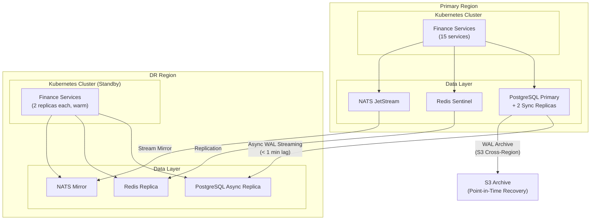
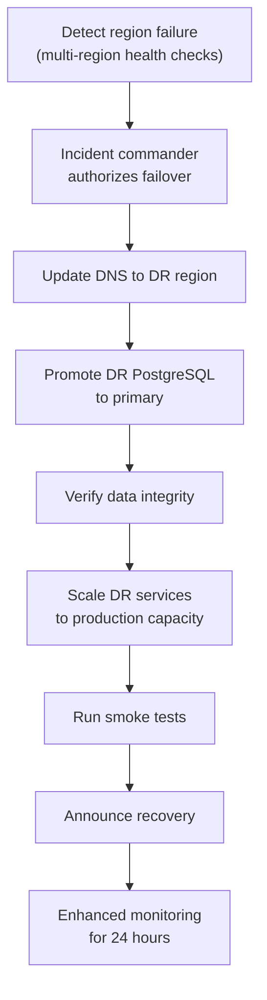

# ERP-Finance Disaster Recovery Plan

## Document Information

| Field | Value |
|-------|-------|
| Module | ERP-Finance |
| Document Type | Disaster Recovery Plan |
| Version | 1.0.0 |
| Last Updated | 2026-02-23 |

## Recovery Objectives

| Metric | Target | Justification |
|--------|--------|---------------|
| RPO (Recovery Point Objective) | < 1 minute | Synchronous replication for financial data |
| RTO (Recovery Time Objective) | < 15 minutes | Automated failover with pre-provisioned standby |
| MTTR (Mean Time to Recovery) | < 30 minutes | Including diagnosis and verification |

## DR Architecture

## Failure Scenarios

### Scenario 1: Single Service Failure

**Impact**: One financial service unavailable.
**Detection**: Health check fails, Kubernetes restarts pod.
**Recovery**: Automatic (Kubernetes self-healing). RTO: < 30 seconds.

### Scenario 2: Database Primary Failure

**Impact**: All write operations blocked.
**Detection**: Patroni/CloudNativePG detects primary failure.
**Recovery**:
1. Patroni promotes synchronous replica to primary (automatic)
2. Services reconnect to new primary
3. RTO: < 60 seconds

### Scenario 3: Full Region Failure

**Impact**: Complete loss of primary region.
**Detection**: Multi-region health checks fail.
**Recovery**:

RTO: < 15 minutes.

### Scenario 4: Data Corruption

**Impact**: Financial data integrity compromised.
**Detection**: Reconciliation checks, anomaly detection.
**Recovery**:
1. Identify scope of corruption
2. Point-in-time recovery from WAL archive to last known good state
3. Replay events from NATS JetStream for gap
4. Manual verification of financial balances
5. RTO: 1-4 hours depending on scope

## Backup Strategy

### Backup Schedule

| Data | Method | Frequency | Retention | Storage |
|------|--------|-----------|-----------|---------|
| PostgreSQL (full) | pg_basebackup | Every 6 hours | 30 days | S3 Cross-Region |
| PostgreSQL (WAL) | Continuous archiving | Continuous | 30 days | S3 Cross-Region |
| Redis (RDB) | Snapshot | Hourly | 7 days | S3 |
| MinIO (documents) | Cross-region replication | Continuous | 1 year | S3 Cross-Region |
| NATS streams | JetStream replication | Continuous | 90 days | Local + Remote |
| Configuration | Git repository | Every change | Forever | Git remote |

### Backup Verification

- **Weekly**: Automated restore test to isolated environment
- **Monthly**: Full DR drill restoring from backups
- **Quarterly**: Complete failover exercise to DR region

## Financial Data Protection

### Immutable Ledger Protection

The General Ledger's immutable posting design provides inherent protection:
- Posted journal entries cannot be modified or deleted
- Any correction requires a reversing entry
- Full audit trail maintained
- This means even partial data recovery preserves financial integrity

### Reconciliation After Recovery

After any recovery event:
1. Run trial balance -- verify debits equal credits
2. Reconcile GL to sub-ledgers (AP, AR, Asset)
3. Compare bank balances to GL cash accounts
4. Verify subscription billing state matches invoice records
5. Check payment transaction status with providers

## Communication Plan

| Audience | Channel | Timing | Responsible |
|----------|---------|--------|-------------|
| Engineering | Slack #finance-incident | Immediate | On-call SRE |
| Finance team | Email + Slack | Within 15 minutes | Product lead |
| Customers (if impacted) | Status page | Within 30 minutes | Communications |
| Executive team | Email + call | Within 1 hour (SEV-1) | VP Engineering |
| Auditors | Formal incident report | Within 48 hours | Compliance team |

## DR Testing Schedule

| Test Type | Frequency | Duration | Participants |
|-----------|-----------|----------|-------------|
| Tabletop exercise | Quarterly | 2 hours | Engineering + Finance |
| Automated failover test | Monthly | 30 minutes | SRE team |
| Full DR failover | Semi-annually | 4 hours | All teams |
| Backup restore verification | Weekly | Automated | CI/CD pipeline |
