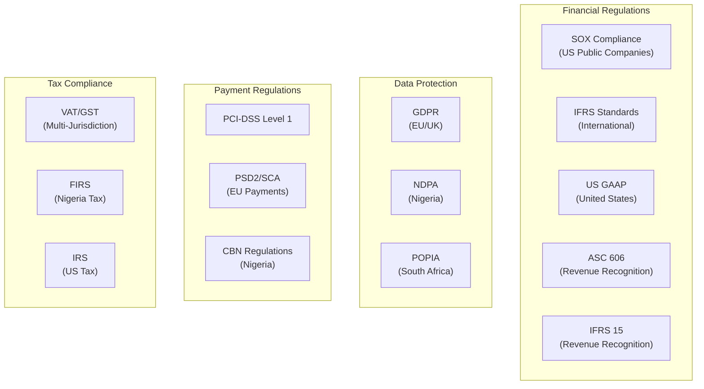
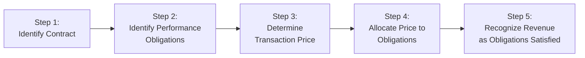

# ERP-Finance Compliance & Regulatory Guide

## Document Information

| Field | Value |
|-------|-------|
| Module | ERP-Finance |
| Document Type | Compliance & Regulatory |
| Version | 1.0.0 |
| Last Updated | 2026-02-23 |

## Regulatory Landscape

## SOX Compliance

### Internal Controls over Financial Reporting (ICFR)

ERP-Finance implements the following SOX-relevant controls:

| Control | Implementation |
|---------|---------------|
| **Segregation of Duties** | RBAC enforcement: initiator != approver for all financial transactions > threshold |
| **Access Controls** | JWT + RBAC + MFA; quarterly access reviews |
| **Change Management** | All changes via Git PRs with approvals; automated deployment pipeline |
| **Data Integrity** | Immutable posting ledger; database triggers prevent modification of posted entries |
| **Audit Trail** | Every financial operation logged with user, timestamp, before/after state |
| **Period Controls** | Accounting periods locked after close; no backdating allowed |
| **Reconciliation** | Automated daily reconciliation of GL to sub-ledgers |
| **Backup & Recovery** | RPO < 1 min, RTO < 15 min; tested quarterly |

### SOX Audit Support

The system provides:
- Complete audit trail export for any date range
- User access reports by role and permission
- Change logs for all configuration and master data
- Journal entry approval workflows with full documentation
- Segregation of duties violation reports

## Revenue Recognition (ASC 606 / IFRS 15)

### Five-Step Model Implementation

| Step | ERP-Finance Implementation |
|------|---------------------------|
| Identify Contract | Subscription creation with plan binding |
| Identify Performance Obligations | Billing line items mapped to deliverables |
| Determine Transaction Price | Pricing engine with discounts and credits |
| Allocate Price | Stand-alone selling price allocation |
| Recognize Revenue | Point-in-time (one-time) or over-time (subscription) |

## PCI-DSS Compliance

### Cardholder Data Environment (CDE) Scope

ERP-Finance minimizes PCI scope through **tokenization**:

- **No raw card data** enters ERP-Finance systems
- All card processing delegated to PCI-compliant providers (Stripe, Adyen, Paystack)
- Only tokenized references stored in the payments database
- Payments service runs in isolated Kubernetes namespace with network policies

### PCI-DSS Control Summary

| Requirement | Control | Status |
|-------------|---------|--------|
| Build secure network | Network segmentation, WAF, firewall | Implemented |
| Protect cardholder data | Tokenization, no raw PAN storage | Implemented |
| Vulnerability management | Quarterly ASV scans, patching | Active |
| Access control | RBAC, MFA, least privilege | Implemented |
| Monitor and test | Logging, IDS, pen testing | Active |
| Security policy | Documented and reviewed annually | Current |

## GDPR / Data Protection

### Data Processing

| Data Category | Lawful Basis | Retention | Erasure Support |
|---------------|-------------|-----------|-----------------|
| Customer financial records | Contractual necessity | 7 years (regulatory) | Anonymization after retention |
| Employee expense data | Contractual necessity | 7 years | Anonymization after retention |
| Payment transaction data | Contractual + legal obligation | 7 years | Not erasable (regulatory) |
| Usage metering data | Legitimate interest | 3 years | Aggregation + deletion |
| AI analysis results | Consent | 1 year | Full deletion |

### Data Subject Rights

| Right | Implementation |
|-------|---------------|
| Access | Export API for all personal data |
| Rectification | Update API for correctable fields |
| Erasure | Anonymization for non-regulated data; explanation for regulated |
| Portability | JSON/CSV export of all financial data |
| Restriction | Processing pause flag on customer record |

## Tax Compliance

### Multi-Jurisdiction Support

| Jurisdiction | Tax Type | Rate | Filing Frequency |
|-------------|----------|------|-----------------|
| Nigeria | VAT | 7.5% | Monthly |
| Nigeria | CIT | 30% | Annual |
| Nigeria | WHT | Various | Monthly |
| South Africa | VAT | 15% | Bi-monthly |
| Kenya | VAT | 16% | Monthly |
| EU Members | VAT | 17-27% | Monthly/Quarterly |
| United States | Sales Tax | State-dependent | Monthly/Quarterly |
| United Kingdom | VAT | 20% | Quarterly |

### Tax Engine Integration

- **Avalara**: Real-time tax calculation for US multi-state sales tax
- **Vertex**: Enterprise tax engine for complex multinational scenarios
- **Native Engine**: Built-in calculation for simple jurisdictions (flat-rate VAT)

## Accounting Standards

### Chart of Accounts Compliance

The chart of accounts structure supports:
- **IFRS**: International Financial Reporting Standards classification
- **US GAAP**: Generally Accepted Accounting Principles
- **OHADA**: Organisation pour l'Harmonisation en Afrique du Droit des Affaires
- **Customizable**: User-defined account hierarchies for local requirements

### Financial Reporting Standards

| Report | Standard | Frequency |
|--------|----------|-----------|
| Income Statement | IAS 1 / ASC 220 | Monthly |
| Balance Sheet | IAS 1 / ASC 210 | Monthly |
| Cash Flow Statement | IAS 7 / ASC 230 | Monthly |
| Changes in Equity | IAS 1 | Quarterly |
| Notes to Financial Statements | IAS 1 | Annual |

## Compliance Monitoring

### Automated Compliance Checks

| Check | Frequency | Action on Failure |
|-------|-----------|-------------------|
| SoD violation scan | Real-time | Block transaction + alert |
| Access review reminder | Quarterly | Notify managers |
| Period close validation | Monthly | Block close until resolved |
| Tax rate update check | Weekly | Alert tax team |
| Backup verification | Weekly | Alert SRE team |
| Certificate expiry check | Daily | Auto-renew / alert |
| PCI ASV scan | Quarterly | Remediate findings |
