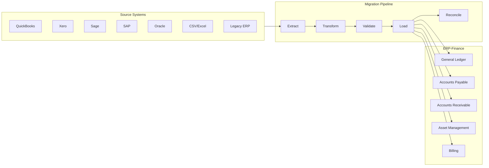
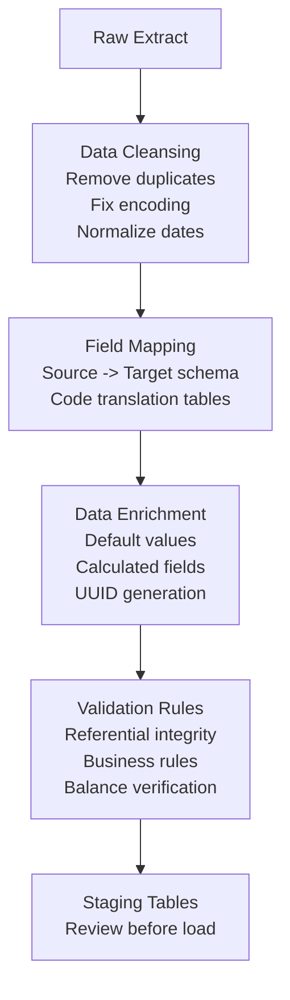
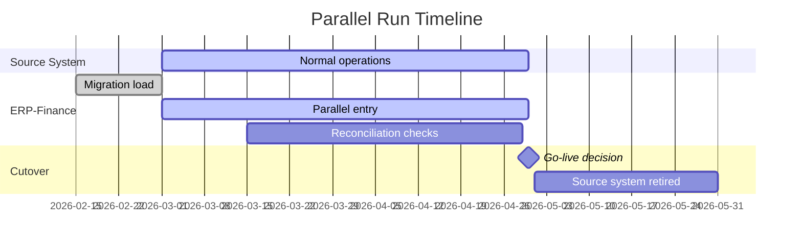

# ERP-Finance Data Migration Guide

## Document Information

| Field | Value |
|-------|-------|
| Module | ERP-Finance |
| Document Type | Data Migration Guide |
| Version | 1.0.0 |
| Last Updated | 2026-02-23 |

## Migration Overview



## Migration Phases

### Phase 1: Assessment and Planning

| Activity | Duration | Output |
|----------|----------|--------|
| Source system analysis | 1-2 weeks | Data dictionary mapping |
| Data quality assessment | 1 week | Quality report with issues |
| Volume estimation | 2 days | Resource requirements |
| Migration strategy selection | 1 week | Cutover plan |
| Rollback plan | 2 days | Documented rollback procedures |

### Phase 2: Data Extraction

**Chart of Accounts Migration**:
- Extract account hierarchy from source
- Map source account types to ERP-Finance types (Asset, Liability, Equity, Revenue, Expense)
- Preserve account numbering or create new scheme
- Flag inactive/closed accounts

**Open Balances Migration**:
- Extract trial balance as of cutover date
- Verify debits = credits
- Create opening journal entry in ERP-Finance

**Historical Transactions** (optional):
- Extract journal entries for specified period (typically 2-3 years)
- Include supporting sub-ledger detail

### Phase 3: Data Transformation



### Phase 4: Data Load

**Load Order** (respecting foreign key dependencies):

1. **Reference Data**: Currencies, tax codes, fiscal periods, COA
2. **Master Data**: Vendors, customers, employees, asset records
3. **Transactional Data**: Opening balances, open invoices, open POs
4. **Historical Data**: Historical journals, payment history, depreciation schedules

### Phase 5: Reconciliation

After migration, verify:

| Check | Method | Tolerance |
|-------|--------|-----------|
| Trial balance matches source | Compare totals | Exact (0 difference) |
| AP aging matches source | Compare aging buckets | < 0.01% variance |
| AR aging matches source | Compare aging buckets | < 0.01% variance |
| Asset book values match | Per-asset comparison | < $1 per asset |
| Bank balances match | GL vs. bank statement | Exact |
| Customer count matches | Count comparison | Exact |
| Vendor count matches | Count comparison | Exact |

## Migration Templates

### Chart of Accounts CSV Template

```csv
account_number,account_name,account_type,parent_account,currency,status,description
1000,Cash and Equivalents,asset,,NGN,active,Cash accounts
1010,Cash - Operating,asset,1000,NGN,active,Operating cash account
1020,Cash - Savings,asset,1000,NGN,active,Savings account
2000,Accounts Payable,liability,,NGN,active,Vendor payables
```

### Vendor Master CSV Template

```csv
vendor_id,name,tax_id,payment_terms,currency,bank_name,bank_account,email,address
V001,Acme Supplies,RC123456,30,NGN,First Bank,0012345678,ap@acme.ng,"Lagos, Nigeria"
```

### Opening Balance Journal Template

```csv
account_number,debit,credit,description,reference
1010,5000000.00,0.00,Opening balance - Cash,OB-2026
2000,0.00,2500000.00,Opening balance - AP,OB-2026
3000,0.00,2500000.00,Opening balance - Equity,OB-2026
```

## Rollback Procedure

If migration fails or data issues are discovered post-migration:

1. Stop all user access to ERP-Finance
2. Document discovered issues
3. Restore database from pre-migration backup
4. Revert DNS/routing to source system
5. Analyze root cause and fix migration scripts
6. Schedule re-migration window

## Parallel Run Strategy

For risk mitigation, run source and ERP-Finance in parallel for 1-2 accounting periods:



## Post-Migration Validation

| Validation | Owner | Deadline |
|-----------|-------|----------|
| Trial balance reconciliation | Controller | Day 1 |
| AP aging verification | AP Manager | Day 2 |
| AR aging verification | AR Manager | Day 2 |
| Asset register verification | Asset Manager | Day 3 |
| Bank balance verification | Treasurer | Day 1 |
| Tax balance verification | Tax Analyst | Day 3 |
| First month-end close | Controller | Month 1 |
| First financial statements | CFO | Month 1 |
