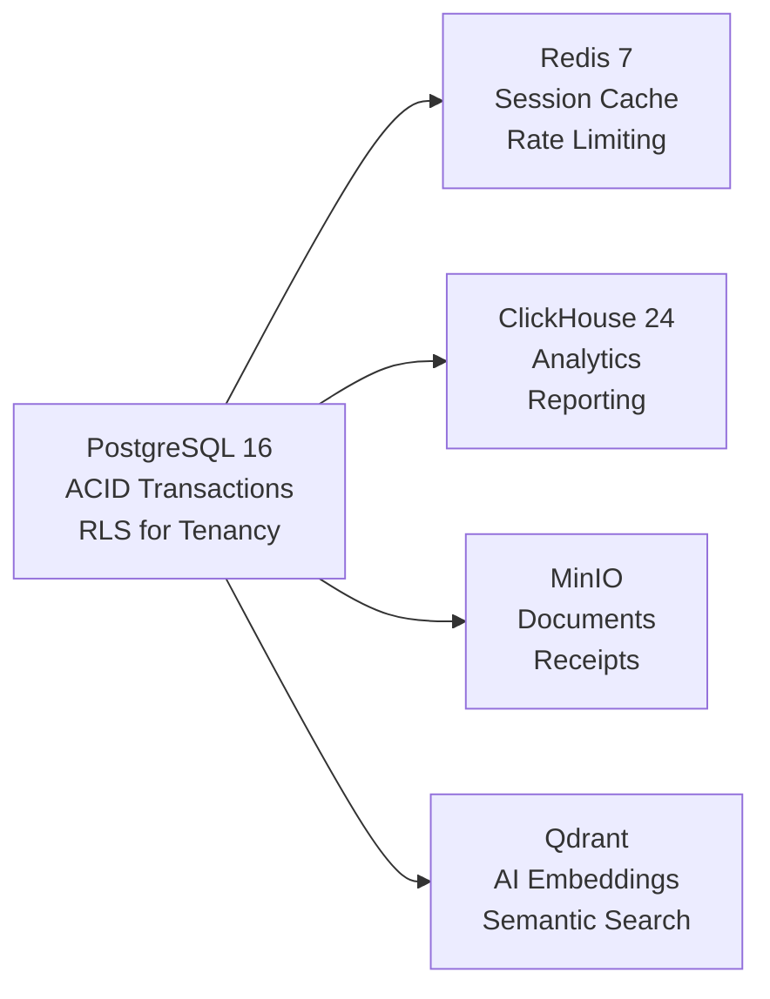
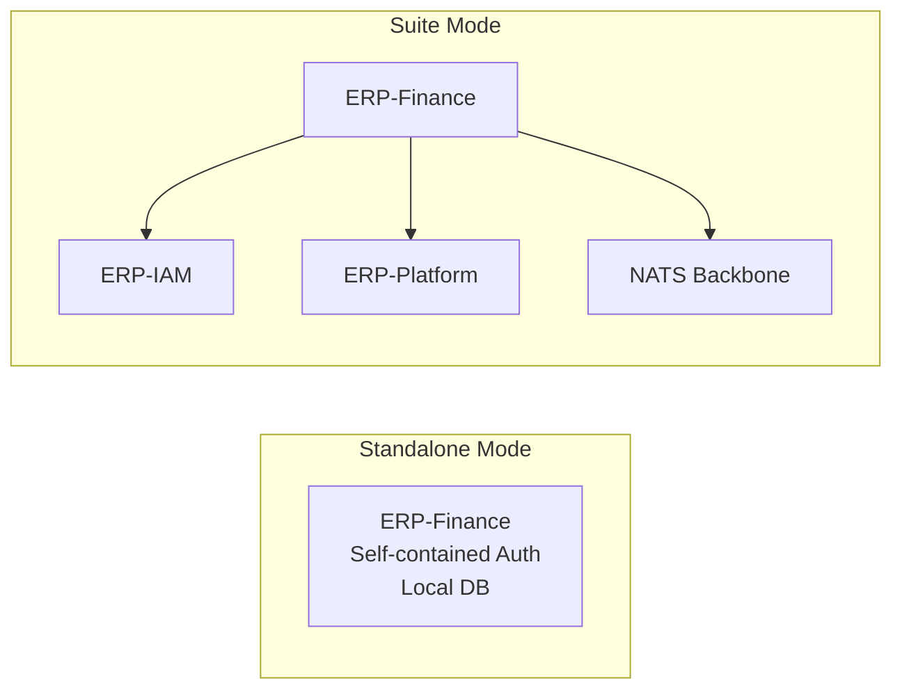

# ERP-Finance Architecture Decision Records

## Document Information

| Field | Value |
|-------|-------|
| Module | ERP-Finance |
| Document Type | Architecture Decision Records |
| Version | 1.0.0 |
| Last Updated | 2026-02-23 |

## ADR-001: Polyglot Language Choice

**Status**: Accepted

**Context**: ERP-Finance consolidates services from multiple origins with different performance profiles. Billing and payments require extreme throughput. Asset management needs AI integration. General financial services need rapid development.

**Decision**: Polyglot by domain constraints and existing service maturity.
- **Rust** (Axum/SQLx/Tokio): Billing and payments engines -- high throughput, memory safety, zero-cost abstractions
- **Python** (FastAPI/SQLAlchemy): Asset management -- AI SDK integration (Anthropic Claude), rapid data science iteration
- **Go** (net/http): Gateway and general services -- simple deployment, fast compilation, excellent concurrency

**Consequences**:
- Higher operational complexity (3 language runtimes)
- Each service uses best-in-class tooling for its domain
- Team requires polyglot skills
- Mitigated by standardized API contracts and event schemas

---

## ADR-002: Database Selection

**Status**: Accepted

**Context**: Financial systems require ACID compliance, complex querying, and high durability. Additionally, analytics workloads and AI features have different data access patterns.

**Decision**: PostgreSQL primary, Redis cache, ClickHouse OLAP, MinIO object store, Qdrant vectors.

**Consequences**:
- PostgreSQL provides financial-grade ACID with Row-Level Security
- ClickHouse handles analytics without loading OLTP
- MinIO avoids cloud vendor lock-in for object storage
- Multiple databases increase operational complexity but optimize for access patterns

---

## ADR-003: Immutable Posting Ledger

**Status**: Accepted

**Context**: Financial integrity requires that posted journal entries cannot be altered. This is a fundamental accounting principle and regulatory requirement (SOX, audit standards).

**Decision**: Implement write-only ledger with forward-only state transitions.

- `posting_status`: `DRAFT -> POSTED -> REVERSED` (no backward transitions)
- Database triggers prevent UPDATE/DELETE on posted entries
- Application role has no UPDATE/DELETE grants on `journal_entries`
- Corrections via reversing entries that reference the original

**Consequences**:
- Absolute data integrity for financial records
- Audit trail is inherent in the data model
- Slight increase in data volume (reversals instead of corrections)
- Queries must handle reversed entries for accurate balances

---

## ADR-004: Event-Driven Architecture

**Status**: Accepted

**Context**: Financial operations span multiple domains (billing creates invoices, payments settles them, GL records them). Tight coupling would create a monolithic failure domain.

**Decision**: NATS JetStream as event backbone with CloudEvents specification.

**Consequences**:
- Services are loosely coupled; each can evolve independently
- Eventual consistency between domains (acceptable for finance with proper reconciliation)
- Event replay enables recovery scenarios
- Requires careful event schema versioning

---

## ADR-005: Multi-Provider Payment Orchestration

**Status**: Accepted

**Context**: Operating across Africa and globally requires supporting diverse payment methods (cards, bank transfers, mobile money). No single provider covers all markets.

**Decision**: Abstract payment provider interface with routing logic.

Supported providers:
- Stripe (global cards, US/EU)
- Adyen (global, EU emphasis)
- Paystack (Nigeria, Ghana, South Africa)
- Flutterwave (Pan-African)
- M-Pesa (East Africa mobile money)

**Consequences**:
- Maximum geographic coverage
- Provider failover capability
- Higher integration maintenance cost
- Each provider has unique webhook format (normalized internally)

---

## ADR-006: AI-Powered Asset Management

**Status**: Accepted

**Context**: Traditional asset management relies on manual inspection and fixed maintenance schedules. AI can analyze patterns in maintenance history, operating hours, and condition data to predict failures and optimize depreciation.

**Decision**: Integrate Claude (Anthropic) API for asset analysis features.

Features:
- Asset health analysis
- Predictive maintenance
- Depreciation optimization
- Fleet analysis
- Natural language Q&A

**Consequences**:
- External API dependency (Claude)
- Variable response times (1-8 seconds per analysis)
- Configurable -- can be disabled if API key not provided
- Significant value-add for asset-heavy organizations

---

## ADR-007: Standalone Plus Suite Integration Mode

**Status**: Accepted

**Context**: ERP-Finance must work independently for customers who only need finance capabilities, while also integrating seamlessly into the full ERP suite.

**Decision**: `standalone_plus_suite` mode with conditional integration.

**Consequences**:
- Broader market reach (standalone customers)
- Integration is additive, not required
- Authentication abstraction layer needed (local or IAM)
- Suite benefits (cross-module events) only available in suite mode

---

## ADR-008: Rust for Billing Engine

**Status**: Accepted

**Context**: The billing engine must process millions of usage events and generate thousands of invoices per minute. Memory safety is critical when handling financial calculations.

**Decision**: Implement billing engine in Rust with Axum, SQLx, and Tokio.

**Consequences**:
- Near-zero latency for billing calculations
- Memory safety without garbage collection pauses
- `rust_decimal::Decimal` for precise financial arithmetic (no floating-point errors)
- Compile-time SQL validation with SQLx
- Higher development cost per feature vs. Go/Python
- Exceptional performance justifies the investment for this domain

---

## ADR-009: UUID v7 for Entity Identifiers

**Status**: Accepted

**Context**: Entity IDs must be globally unique, secure (non-guessable), and performant for database indexing.

**Decision**: Use UUID v7 (time-ordered) for all entity identifiers.

**Consequences**:
- Time-ordered UUIDs are B-tree friendly (sequential inserts)
- No central ID generation service needed
- Sortable by creation time (useful for pagination)
- 128-bit IDs use slightly more storage than auto-increment integers
- Worth the tradeoff for distributed system compatibility

---

## ADR-010: Row-Level Security for Multi-Tenancy

**Status**: Accepted

**Context**: Multi-tenant financial data requires absolute isolation. Application-level filtering alone is insufficient -- a single missed WHERE clause could leak data.

**Decision**: PostgreSQL Row-Level Security (RLS) as defense-in-depth.

**Consequences**:
- Database-enforced tenant isolation (impossible to bypass in application code)
- Slight query planning overhead (< 1ms per query)
- Requires `SET app.current_tenant` on every connection
- Combined with application-level filtering for correctness
