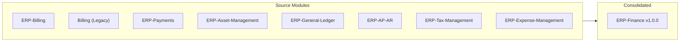

# ERP-Finance Changelog

## Document Information

| Field | Value |
|-------|-------|
| Module | ERP-Finance |
| Document Type | Changelog |
| Version | 1.0.0 |
| Last Updated | 2026-02-23 |

## Version History

### v1.0.0 (2026-02-23) -- Initial Consolidated Release

#### Module Consolidation

The ERP-Finance module was created by consolidating the following independent modules into a single cohesive financial management platform:

#### Commits

| Hash | Date | Type | Description |
|------|------|------|-------------|
| 3eace58 | 2026-02-23 | chore | Isolate imported source trees as nested modules |
| 67b18df | 2026-02-23 | feat | Deep import selected source service directories for consolidation |
| 1608d45 | 2026-02-23 | feat | Apply consolidation merger contracts and module scaffolds |
| aba15b9 | 2026-02-23 | chore | Initialize ERP-Finance |

#### Features Included

**General Ledger**:
- Chart of Accounts management
- Journal entry creation and posting
- Immutable posting ledger
- Trial balance generation
- Period close functionality
- Multi-currency support (in progress)

**Accounts Payable**:
- Vendor master data management
- AP invoice processing
- 3-way matching (PO, Receipt, Invoice)
- Payment run execution
- AP aging reports

**Accounts Receivable**:
- Customer invoicing
- Credit management
- Dunning automation
- AR aging reports
- Credit note management

**Billing Engine** (Rust):
- Subscription management (create, upgrade, downgrade, cancel)
- Usage-based metering with idempotency
- Tiered pricing engine (Free, Pro, Enterprise)
- Invoice generation with proration
- Credit and promotion management
- MRR/ARR calculation

**Payments Engine** (Rust):
- Multi-provider orchestration (Stripe, Adyen, Paystack, Flutterwave)
- Payment initiation and verification
- Webhook processing
- Refund management (full and partial)
- Digital wallet management
- Wallet-to-wallet transfers
- DDD implementation (Aggregates, Value Objects, Domain Events)

**Asset Management** (Python/FastAPI):
- Full asset CRUD with categorization
- 5 depreciation methods (straight-line, declining balance, double-declining, sum-of-years, units of production)
- Maintenance scheduling (preventative, corrective, predictive, condition-based, emergency)
- Asset lifecycle event tracking
- AI-powered health analysis (Claude API)
- Predictive maintenance analysis
- Depreciation optimization recommendations
- Fleet-wide AI analytics
- Natural language Q&A

**Tax Management**:
- Multi-jurisdiction tax rules (VAT/GST/sales tax)
- Tax calculation API
- Avalara/Vertex integration (planned)
- Tax return management

**Expense Management**:
- Expense claim submission
- Receipt OCR scanning
- Approval workflows
- Per-diem rules
- Corporate card reconciliation

**Treasury**:
- Cash management
- Bank reconciliation (AI-powered)
- FX rate management
- Cash forecasting

**Budgeting**:
- Top-down, bottom-up, zero-based budgeting
- Variance analysis
- Scenario planning

#### Infrastructure

- Gateway service (Go, port 8090)
- 15 microservices across Go, Rust, Python
- PostgreSQL primary database
- Redis cache layer
- NATS/Redpanda event backbone
- ClickHouse OLAP analytics
- MinIO object storage
- Qdrant vector store (AI)
- CloudEvents event specification
- AIDD guardrails enforced

#### Breaking Changes

- N/A (initial release)

#### Known Issues

- Treasury cash positioning adapters pending implementation
- Scenario budgeting models partially implemented
- Consolidation engine for multi-entity group reporting planned for v1.1
- M-Pesa integration not yet active (feature-flagged)

---

### Planned: v1.1.0

- Multi-entity consolidation engine
- Revenue recognition (ASC 606/IFRS 15)
- Advanced treasury cash positioning
- Scenario budgeting with rolling forecasts
- M-Pesa payment integration activation

### Planned: v1.2.0

- AI-powered cash application for AR
- Advanced fraud scoring for payments
- Real-time financial dashboards
- Intercompany transaction automation
- XBRL reporting support
