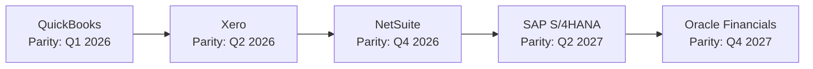

# ERP-Finance Product Roadmap

## Document Information

| Field | Value |
|-------|-------|
| Module | ERP-Finance |
| Document Type | Product Roadmap |
| Version | 1.0.0 |
| Last Updated | 2026-02-23 |

## Strategic Vision

Transform ERP-Finance from a consolidated finance platform into the leading open-source enterprise financial management system, competing directly with Oracle Financials and SAP S/4HANA while maintaining the developer experience of modern SaaS solutions.

## Roadmap Timeline

```mermaid
gantt
    title ERP-Finance Roadmap 2026-2027
    dateFormat  YYYY-Q
    axisFormat  %Y Q%q

    section Foundation (Complete)
    Core GL + Immutable Ledger           :done, 2025-Q2, 2025-Q3
    Billing Engine (Rust)                :done, 2025-Q3, 2025-Q4
    Payments Orchestration               :done, 2025-Q3, 2025-Q4
    Asset Management + AI                :done, 2025-Q4, 2026-Q1
    Module Consolidation                 :done, 2026-Q1, 2026-Q1

    section Phase 2: Core Finance
    AP OCR + 3-Way Matching              :active, 2026-Q1, 2026-Q2
    AR Cash Application AI               :active, 2026-Q1, 2026-Q2
    Tax Engine Integration (Avalara)     :active, 2026-Q1, 2026-Q2
    Expense OCR + Workflows              :active, 2026-Q1, 2026-Q2

    section Phase 3: Enterprise
    Multi-Entity Consolidation           :2026-Q2, 2026-Q3
    Revenue Recognition (ASC 606)        :2026-Q2, 2026-Q3
    Treasury + Bank Connectivity         :2026-Q2, 2026-Q3
    Budget Scenarios + Rolling Forecast  :2026-Q3, 2026-Q3

    section Phase 4: Intelligence
    AI Financial Analyst                 :2026-Q3, 2026-Q4
    Predictive Cash Flow                 :2026-Q3, 2026-Q4
    Anomaly Detection                    :2026-Q3, 2026-Q4
    Natural Language Reporting           :2026-Q4, 2027-Q1

    section Phase 5: Global
    M-Pesa + Mobile Money                :2026-Q3, 2026-Q4
    XBRL Reporting                       :2026-Q4, 2027-Q1
    Multi-GAAP Support                   :2026-Q4, 2027-Q1
    Real-time Consolidation              :2027-Q1, 2027-Q2
```

## Phase Details

### Phase 2: Core Finance Enhancement (Q1-Q2 2026)

| Feature | Description | Value |
|---------|-------------|-------|
| AP Invoice OCR | AI-powered extraction from vendor invoice PDFs | 80% reduction in data entry time |
| 3-Way Matching Automation | Auto-match PO + Receipt + Invoice | Eliminate manual verification |
| AR Cash Application AI | AI matches bank deposits to open invoices | 90% auto-match rate target |
| Avalara Tax Integration | Real-time tax calculation for US multi-state | Compliance automation |
| Expense OCR | Receipt scanning with auto-categorization | Mobile-first expense submission |

### Phase 3: Enterprise Features (Q2-Q3 2026)

| Feature | Description | Value |
|---------|-------------|-------|
| Multi-Entity Consolidation | Combine financials across subsidiaries | Group reporting compliance |
| Revenue Recognition | ASC 606 / IFRS 15 five-step model | Audit-ready revenue accounting |
| Treasury Management | Cash positioning, bank connectivity | Real-time liquidity visibility |
| Scenario Budgeting | What-if analysis with rolling forecasts | Better financial planning |

### Phase 4: AI Intelligence (Q3-Q4 2026)

| Feature | Description | Value |
|---------|-------------|-------|
| AI Financial Analyst | Natural language queries on financial data | Democratize financial analysis |
| Predictive Cash Flow | ML-based cash flow forecasting | Proactive liquidity management |
| Anomaly Detection | Automated identification of unusual transactions | Fraud prevention + error detection |
| NL Reporting | Generate financial reports from natural language | Instant custom reporting |

### Phase 5: Global Expansion (Q4 2026 - Q1 2027)

| Feature | Description | Value |
|---------|-------------|-------|
| M-Pesa Integration | Mobile money for East Africa | Tap 50M+ M-Pesa users |
| XBRL Reporting | Machine-readable financial reporting | Regulatory filing automation |
| Multi-GAAP | Parallel books (IFRS + local GAAP) | Multinational compliance |
| Real-time Consolidation | Live group financial view | Instant CFO visibility |

## Success Metrics

| Metric | Current | Q2 2026 | Q4 2026 | Q2 2027 |
|--------|---------|---------|---------|---------|
| Services deployed | 15 | 15 | 18 | 20 |
| API endpoints | 50+ | 120+ | 200+ | 300+ |
| Depreciation methods | 5 | 7 | 7 | 7 |
| Payment providers | 4 | 5 | 7 | 10 |
| Tax jurisdictions | 5 | 20 | 50+ | 100+ |
| AI-powered features | 5 | 10 | 20 | 30 |
| Concurrent users | 1,000 | 5,000 | 10,000 | 25,000 |

## Competitive Parity Timeline


