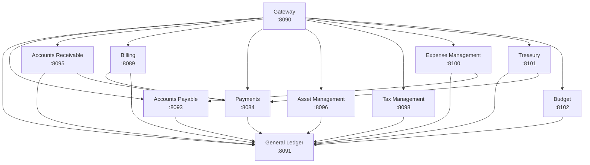
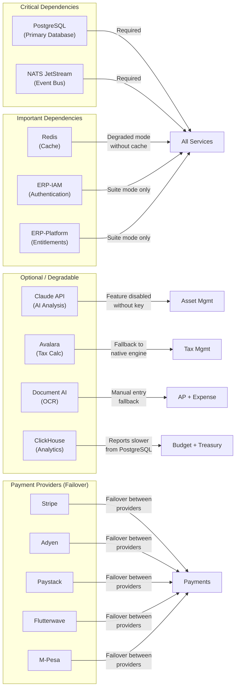
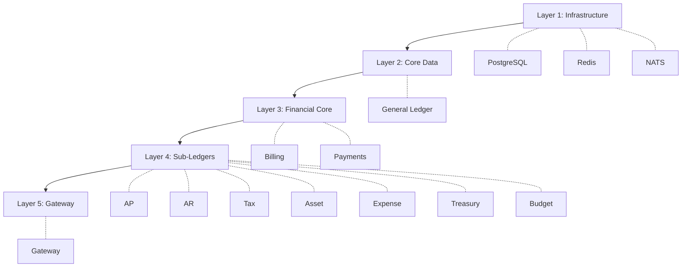

# ERP-Finance Service Dependencies

## Document Information

| Field | Value |
|-------|-------|
| Module | ERP-Finance |
| Document Type | Service Dependencies |
| Version | 1.0.0 |
| Last Updated | 2026-02-23 |

## Internal Service Dependency Graph



## Dependency Matrix

| Service | Depends On | Depended By |
|---------|-----------|-------------|
| Gateway | All services | External clients |
| General Ledger | PostgreSQL, Redis, NATS | AP, AR, Billing, Payments, Asset, Tax, Expense, Treasury, Budget |
| Accounts Payable | GL, PostgreSQL, NATS, OCR | Expense Management |
| Accounts Receivable | GL, Payments, PostgreSQL, NATS | - |
| Billing | Payments, GL, PostgreSQL, Redis, NATS | - |
| Payments | GL, PostgreSQL, NATS, Payment Providers | Billing, AR, Treasury |
| Asset Management | GL, PostgreSQL, Qdrant, Claude API | - |
| Tax Management | GL, PostgreSQL, NATS, Avalara/Vertex | - |
| Expense Management | GL, AP, PostgreSQL, MinIO, NATS, OCR | - |
| Treasury | GL, Payments, PostgreSQL, NATS, Bank APIs | - |
| Budget | GL, PostgreSQL, ClickHouse, NATS | - |

## External Dependency Map



## Failure Impact Analysis

| Dependency Failure | Impact | Mitigation |
|-------------------|--------|-----------|
| PostgreSQL down | Full outage -- all services unable to persist | HA cluster with auto-failover (< 60s) |
| NATS down | Events queued; eventual consistency delayed | NATS cluster (3 nodes); services continue with local queue |
| Redis down | Cache miss; increased DB load | Graceful degradation; direct DB queries |
| Claude API down | AI features unavailable | Features disabled; no impact on core finance |
| Stripe down | Payments via Stripe fail | Automatic failover to Adyen/Paystack |
| Paystack down | NGN payments via Paystack fail | Failover to Flutterwave |
| Avalara down | Tax calculation unavailable | Fallback to built-in tax engine |
| ClickHouse down | Analytics queries slower | Fallback to PostgreSQL for reporting |
| MinIO down | Document upload/download fails | Queued for retry; no impact on transactions |
| ERP-IAM down | Suite auth fails | Standalone mode fallback if configured |

## Service Startup Order

Services must start in dependency order:



## Circuit Breaker Configuration

| Dependency | Failure Threshold | Recovery Time | Fallback |
|-----------|-------------------|---------------|----------|
| Stripe API | 5 failures / 30s | 60s half-open | Route to Adyen |
| Paystack API | 5 failures / 30s | 60s half-open | Route to Flutterwave |
| Avalara API | 3 failures / 60s | 120s half-open | Native tax engine |
| Claude API | 2 failures / 60s | 300s half-open | Feature disabled |
| Bank Feed API | 3 failures / 300s | 600s half-open | Manual import |

## Health Check Dependencies

Each service health check verifies its critical dependencies:

```json
{
  "service": "billing-service",
  "status": "healthy",
  "dependencies": {
    "postgresql": {"status": "up", "latency_ms": 2},
    "redis": {"status": "up", "latency_ms": 1},
    "nats": {"status": "up", "latency_ms": 1}
  },
  "uptime_seconds": 86400
}
```
