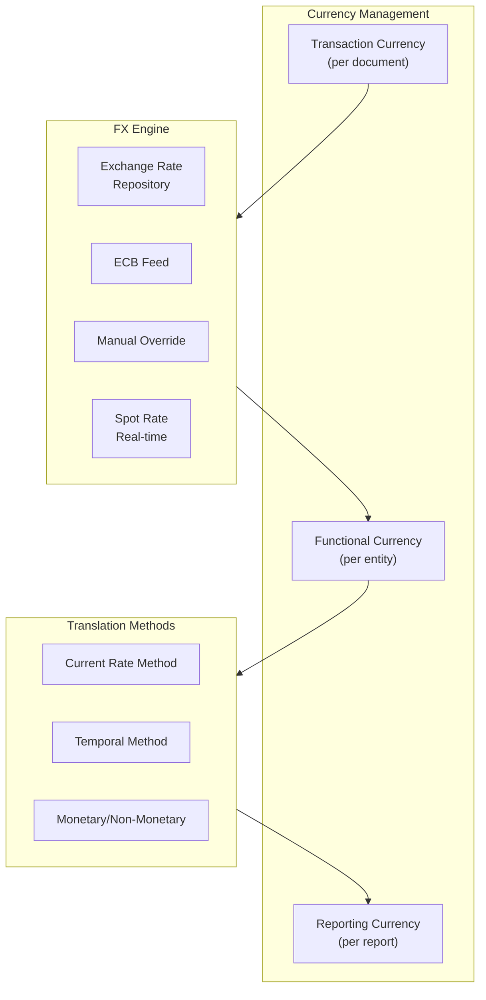
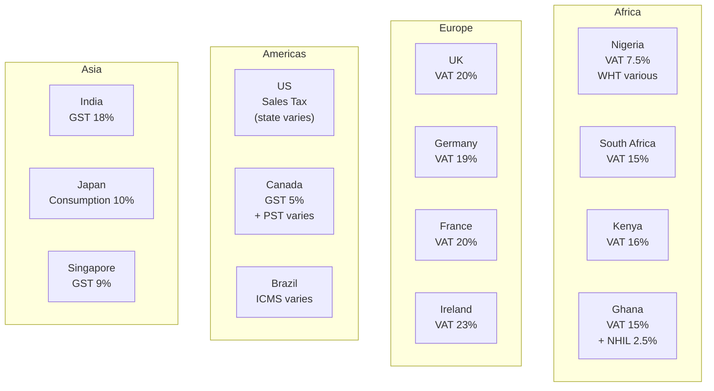
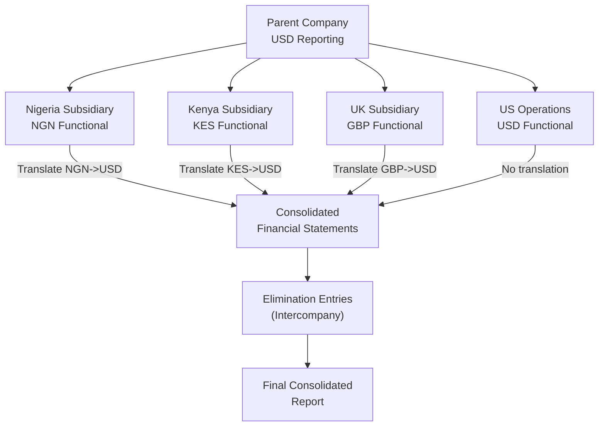

# ERP-Finance Internationalization Guide

## Document Information

| Field | Value |
|-------|-------|
| Module | ERP-Finance |
| Document Type | Internationalization (i18n) |
| Version | 1.0.0 |
| Last Updated | 2026-02-23 |

## Multi-Currency Architecture

## Supported Currencies

| Currency | Code | Symbol | Decimal Places | Region |
|----------|------|--------|----------------|--------|
| Nigerian Naira | NGN | ₦ | 2 | West Africa |
| US Dollar | USD | $ | 2 | Global |
| Euro | EUR | € | 2 | Europe |
| British Pound | GBP | £ | 2 | UK |
| South African Rand | ZAR | R | 2 | Southern Africa |
| Kenyan Shilling | KES | KSh | 2 | East Africa |
| Ghanaian Cedi | GHS | ₵ | 2 | West Africa |
| CFA Franc | XOF | CFA | 0 | West Africa |
| Tanzanian Shilling | TZS | TSh | 2 | East Africa |
| Egyptian Pound | EGP | E£ | 2 | North Africa |
| Japanese Yen | JPY | ¥ | 0 | Asia |
| Chinese Yuan | CNY | ¥ | 2 | Asia |
| Indian Rupee | INR | ₹ | 2 | Asia |

## Multi-Language Support

### UI Localization

| Language | Code | Coverage | Region |
|----------|------|----------|--------|
| English | en-US | 100% | Default |
| English (UK) | en-GB | 100% | UK |
| French | fr-FR | Planned | Francophone Africa |
| Arabic | ar-SA | Planned | MENA |
| Portuguese | pt-BR | Planned | Lusophone Africa |
| Swahili | sw-KE | Planned | East Africa |
| Hausa | ha-NG | Planned | Nigeria |
| Yoruba | yo-NG | Planned | Nigeria |

### Locale-Specific Formatting

| Locale | Number Format | Date Format | Currency Position |
|--------|--------------|-------------|-------------------|
| en-US | 1,234,567.89 | MM/DD/YYYY | $1,234.56 |
| en-GB | 1,234,567.89 | DD/MM/YYYY | £1,234.56 |
| fr-FR | 1 234 567,89 | DD/MM/YYYY | 1 234,56 € |
| de-DE | 1.234.567,89 | DD.MM.YYYY | 1.234,56 € |
| ar-SA | ١٬٢٣٤٬٥٦٧٫٨٩ | YYYY/MM/DD (RTL) | ١٬٢٣٤٫٥٦ ر.س |
| ja-JP | 1,234,567 | YYYY/MM/DD | ¥1,234,567 |

## Multi-Jurisdiction Tax

### Tax Configuration by Region

## Payment Method Localization

| Region | Preferred Methods | Providers |
|--------|------------------|-----------|
| Nigeria | Card, Bank Transfer, USSD | Paystack, Flutterwave |
| Kenya | M-Pesa, Card | M-Pesa, Flutterwave |
| South Africa | Card, EFT, Instant EFT | Paystack, Flutterwave |
| Ghana | Card, Mobile Money | Paystack, Flutterwave |
| US/EU | Card, Bank Transfer, Apple/Google Pay | Stripe, Adyen |
| UK | Card, Open Banking | Stripe, Adyen |

## Accounting Standards by Region

| Region | Primary Standard | COA Template | Fiscal Year |
|--------|-----------------|-------------|-------------|
| Nigeria | IFRS (full) | OHADA/IFRS hybrid | Jan-Dec |
| South Africa | IFRS (full) | SA-specific | Mar-Feb or Jan-Dec |
| Kenya | IFRS for SMEs | KRA template | Jan-Dec |
| US | US GAAP | Standard US | Jan-Dec or custom |
| EU | IFRS (endorsed) | Local GAAP variants | Jan-Dec |
| UK | UK GAAP / IFRS | FRS 102 | Apr-Mar or Jan-Dec |

## Multi-Entity Consolidation

## RTL (Right-to-Left) Support

For Arabic and Hebrew locales:
- UI layout mirrors automatically (CSS `direction: rtl`)
- Financial tables maintain LTR for numbers
- Charts and graphs maintain standard orientation
- Date pickers adapt to locale calendar
- Invoice templates available in RTL format

## Timezone Handling

- All internal timestamps stored in UTC
- User-facing displays converted to user's timezone
- Accounting dates are date-only (no timezone ambiguity)
- Period close uses entity's local midnight as cutoff
- FX rates captured at daily close (New York 5pm ET for most currencies)
