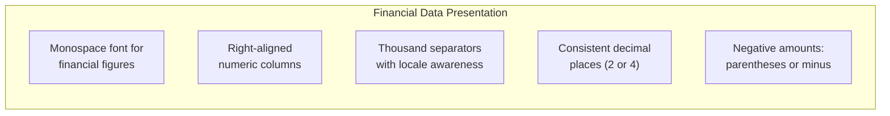

# ERP-Finance Accessibility Guide

## Document Information

| Field | Value |
|-------|-------|
| Module | ERP-Finance |
| Document Type | Accessibility (a11y) |
| Version | 1.0.0 |
| Last Updated | 2026-02-23 |

## Accessibility Standards

ERP-Finance targets **WCAG 2.2 Level AA** compliance for all user-facing interfaces. Financial software accessibility is critical as finance professionals may have visual, motor, or cognitive disabilities.

## Key Accessibility Requirements

### Visual Accessibility

| Requirement | Implementation | Status |
|-------------|---------------|--------|
| Color contrast ratio 4.5:1 | All text meets minimum contrast against backgrounds | Required |
| Color not sole indicator | Status badges use icons + text + color (e.g., posted = lock icon + "Posted" + green) | Required |
| Scalable text | UI supports 200% zoom without loss of functionality | Required |
| High contrast mode | Alternative theme with enhanced contrast ratios | Planned |
| Screen reader compatible | All elements have appropriate ARIA labels | Required |

### Financial Data Accessibility



Financial tables must be:
- Navigable with keyboard (Tab, Arrow keys)
- Have proper table headers (`<th>` with `scope`)
- Include column sorting accessible via keyboard
- Provide row context when using screen readers
- Debit/credit columns labeled clearly (not just color-coded)

### Keyboard Navigation

| Action | Shortcut | Context |
|--------|----------|---------|
| Navigate table rows | Arrow Up/Down | Any financial table |
| Navigate table columns | Arrow Left/Right | Any financial table |
| Open action menu | Enter or Space | Selected row |
| Create new entry | Ctrl+N / Cmd+N | GL, AP, AR, Expense |
| Save draft | Ctrl+S / Cmd+S | Any form |
| Search | Ctrl+K / Cmd+K | Global search |
| Filter toggle | Ctrl+F / Cmd+F | Table views |
| Next tab | Ctrl+Tab | Multi-tab views |

### Form Accessibility

- All form fields have visible labels (not placeholder-only)
- Error messages are descriptive and associated with the specific field
- Required fields clearly indicated with text ("Required"), not just asterisk
- Date pickers support keyboard input (type date directly)
- Currency fields accept formatted and unformatted input
- Autocomplete enabled for vendor/customer name fields

### Chart and Graph Accessibility

Financial charts (trial balance, aging, cash flow) must:
- Include text alternatives (data tables below charts)
- Use patterns in addition to colors for differentiation
- Be keyboard navigable for data point inspection
- Provide summary descriptions for screen readers

### Invoice and Report Accessibility

- Generated PDF invoices include tagged structure for screen readers
- Financial reports available in HTML (accessible) and PDF formats
- Print-optimized CSS maintains readability
- Export to CSV/Excel for screen reader users who prefer spreadsheets

## ARIA Implementation Guide

### Financial Table Example

```html
<table role="grid" aria-label="Journal Entries for February 2026">
  <thead>
    <tr role="row">
      <th scope="col" aria-sort="descending">Date</th>
      <th scope="col">Journal #</th>
      <th scope="col">Description</th>
      <th scope="col" aria-label="Debit Amount">Debit</th>
      <th scope="col" aria-label="Credit Amount">Credit</th>
      <th scope="col">Status</th>
    </tr>
  </thead>
  <tbody>
    <tr role="row" aria-selected="false">
      <td>2026-02-23</td>
      <td>JE-001234</td>
      <td>Monthly rent payment</td>
      <td aria-label="Debit 500,000 Naira">500,000.00</td>
      <td aria-label="Credit 0">-</td>
      <td><span aria-label="Status: Posted">Posted</span></td>
    </tr>
  </tbody>
</table>
```

### Status Badge Pattern

```html
<!-- Accessible status badge: icon + text + color -->
<span class="badge badge-success" role="status">
  <svg aria-hidden="true"><!-- lock icon --></svg>
  <span>Posted</span>
</span>

<!-- Never color-only -->
<!-- BAD: <span style="color: green">●</span> -->
```

## Testing Requirements

| Test | Tool | Frequency |
|------|------|-----------|
| Automated a11y scan | axe-core / Lighthouse | Every PR |
| Keyboard navigation audit | Manual testing | Monthly |
| Screen reader testing | NVDA / VoiceOver | Quarterly |
| Color contrast check | Contrast checker tool | Every design change |
| WCAG compliance audit | Third-party audit | Annually |

## Assistive Technology Compatibility

| Technology | Compatibility Level |
|------------|-------------------|
| NVDA (Windows) | Full |
| JAWS (Windows) | Full |
| VoiceOver (macOS/iOS) | Full |
| TalkBack (Android) | Full |
| Dragon NaturallySpeaking | Supported |
| Switch Access | Supported |
| ZoomText | Full |
