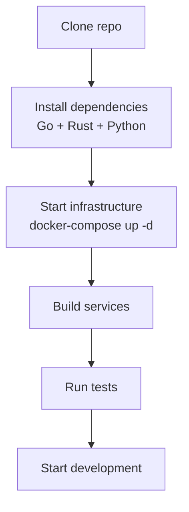

# ERP-Finance Developer Guide

## Document Information

| Field | Value |
|-------|-------|
| Module | ERP-Finance |
| Document Type | Developer Guide |
| Version | 1.0.0 |
| Last Updated | 2026-02-23 |

## Repository Structure

```
ERP-Finance/
├── cmd/
│   └── server/
│       └── main.go               # Gateway service entry point
├── configs/
│   ├── capabilities.json          # Module capabilities
│   └── module_dependencies.yaml   # Module dependency declarations
├── docs/
│   ├── ADR/                       # Architecture Decision Records
│   ├── ARCHITECTURE.md            # Architecture overview
│   ├── API.md                     # API documentation
│   ├── EVENTS.md                  # Event catalog
│   └── ...
├── erp/
│   ├── module.manifest.yaml       # Module manifest
│   └── aidd.guardrails.yaml       # AIDD guardrails
├── imports/
│   ├── billing_core/              # Billing engine (Rust)
│   │   ├── src/
│   │   │   ├── main.rs            # Axum server + handlers
│   │   │   ├── lib.rs             # RevenuePlatform struct
│   │   │   ├── metering.rs        # Usage metering engine
│   │   │   ├── pricing.rs         # Pricing engine
│   │   │   ├── invoicing.rs       # Invoice generator
│   │   │   ├── payments.rs        # Payment processor
│   │   │   ├── subscriptions.rs   # Subscription manager
│   │   │   └── credits.rs         # Credit manager
│   │   ├── web/                   # Frontend (TypeScript)
│   │   └── docs/                  # Service-specific docs
│   ├── billing_legacy/            # Legacy billing (Rust)
│   ├── payments_core/             # Payments engine (Rust)
│   │   ├── src/
│   │   │   ├── main.rs            # Axum server + handlers
│   │   │   ├── lib.rs             # DDD module re-exports
│   │   │   └── domain/
│   │   │       ├── aggregates/    # Payment, Subscription
│   │   │       ├── value_objects/ # PaymentId, Money
│   │   │       └── events/        # Domain events
│   │   └── web/                   # Frontend (TypeScript)
│   └── asset_core/                # Asset management (Python)
│       ├── src/
│       │   ├── main.py            # FastAPI application
│       │   ├── config.py          # Settings
│       │   ├── database.py        # SQLAlchemy setup
│       │   ├── api/               # API routers
│       │   ├── models/            # Database models + Pydantic schemas
│       │   └── services/          # Business logic
│       └── tests/                 # pytest tests
├── services/
│   ├── general-ledger/            # GL service (Go)
│   ├── general-ledger-service/    # GL extended (Go)
│   ├── accounts-payable/          # AP (Go)
│   ├── accounts-payable-service/  # AP extended (Go)
│   ├── accounts-receivable/       # AR (Go)
│   ├── accounts-receivable-service/ # AR extended (Go)
│   ├── billing-service/           # Billing bridge (Go)
│   ├── payments-service/          # Payments bridge (Go)
│   ├── asset-management-service/  # Asset bridge (Go)
│   ├── tax-management/            # Tax (Go)
│   ├── tax-management-service/    # Tax extended (Go)
│   ├── expense-management/        # Expense (Go)
│   ├── expense-management-service/ # Expense extended (Go)
│   ├── treasury-service/          # Treasury (Go)
│   └── budget-service/            # Budget (Go)
├── merge/
│   ├── MERGE_MANIFEST.yaml        # Consolidation manifest
│   └── source-snapshots/          # Original module snapshots
├── go.mod                         # Go module definition
├── Makefile                       # Build commands
└── server                         # Compiled gateway binary
```

## Development Workflow

### Setting Up Local Environment



### Building Services

```bash
# Gateway (Go)
cd /Users/AbiolaOgunsakin1/ERP/ERP-Finance
go build -o server ./cmd/server

# Billing (Rust)
cd imports/billing_core
cargo build --release

# Payments (Rust)
cd imports/payments_core
cargo build --release

# Asset Management (Python)
cd imports/asset_core
pip install -r requirements.txt

# All Go sub-services (example: general-ledger)
cd services/general-ledger
go build -o server ./cmd/server
```

### Running Tests

```bash
# Rust tests
cd imports/billing_core && cargo test
cd imports/payments_core && cargo test

# Python tests
cd imports/asset_core && pytest tests/ -v

# Go tests
cd services/general-ledger && go test ./...
```

## Adding a New Feature

### Example: Adding a New Depreciation Method

1. **Add the enum value** in `imports/asset_core/src/models/database_models.py`:
```python
class DepreciationMethod(str, enum.Enum):
    STRAIGHT_LINE = "straight_line"
    # ... existing methods ...
    MACRS = "macrs"  # New method
```

2. **Implement the calculation** in `imports/asset_core/src/services/depreciation_service.py`:
```python
def _macrs(cost: float, recovery_period: int) -> list[float]:
    # MACRS percentage tables
    tables = {
        5: [20.00, 32.00, 19.20, 11.52, 11.52, 5.76],
        7: [14.29, 24.49, 17.49, 12.49, 8.93, 8.92, 8.93, 4.46],
    }
    percentages = tables.get(recovery_period, tables[7])
    return [round(cost * pct / 100, 2) for pct in percentages]
```

3. **Add API endpoint** if needed in `imports/asset_core/src/api/depreciation.py`

4. **Write tests** in `imports/asset_core/tests/test_depreciation.py`:
```python
def test_macrs_5_year():
    amounts = _macrs(100000, 5)
    assert len(amounts) == 6
    assert abs(sum(amounts) - 100000) < 0.01
```

5. **Emit event** for downstream consumers:
```python
# Publish: erp.finance.asset-management.depreciation-run
```

### Example: Adding a New Payment Provider

1. **Define provider config** in payments service
2. **Implement provider adapter** following the existing pattern
3. **Add to routing configuration**
4. **Implement webhook handler** for provider callbacks
5. **Add feature flag** for gradual rollout
6. **Write integration tests** with provider sandbox

## Code Style Guidelines

### Rust (Billing & Payments)

- Follow Rust 2021 edition idioms
- Use `rust_decimal::Decimal` for all monetary calculations (never `f64`)
- All public functions have doc comments (`///`)
- Error types use `thiserror` for derivation
- Async handlers use Axum extractors (`State`, `Json`, `Path`, `Query`)
- SQLx compile-time query checking enabled

### Python (Asset Management)

- Python 3.12+ with type hints everywhere
- Pydantic v2 for request/response schemas
- SQLAlchemy 2.0 mapped column style
- FastAPI dependency injection for database sessions
- Claude API calls wrapped in try/catch with graceful fallback

### Go (General Services)

- Standard library preferred over frameworks
- Table-driven tests
- Context propagation for tracing
- Structured logging with `slog`
- Error wrapping with `fmt.Errorf("operation: %w", err)`

## Event Publishing Pattern

All services follow the same pattern for event publishing:

```go
// Go service event publishing
event := CloudEvent{
    SpecVersion: "1.0",
    ID:          uuid.NewV7().String(),
    Source:      "erp.finance.general-ledger",
    Type:        "erp.finance.general-ledger.posted",
    Time:        time.Now().UTC(),
    Data:        journalEntryData,
}
nats.Publish("erp.finance.general-ledger.posted", event)
```

## Database Migration Pattern

### Rust Services (SQLx)

Migrations auto-run on startup: `sqlx::migrate!("./migrations").run(&db).await?;`

### Python Services (SQLAlchemy)

Auto-create tables: `Base.metadata.create_all(bind=engine)` in `init_db()`

### Go Services

Use `golang-migrate` with SQL migration files in `migrations/` directory.

## Debugging Tips

| Issue | Debug Approach |
|-------|---------------|
| Journal entry won't balance | Check `gl_journal_entry_lines` -- sum debits vs credits |
| Invoice amount wrong | Trace through pricing engine: base_price + overages - discount |
| Payment stuck in pending | Check provider webhook delivery; verify callback URL |
| AI analysis slow | Check Claude API latency; verify API key validity |
| Event not consumed | Check NATS consumer group; look at dead letter queue |
| Tenant data leakage | Verify RLS policies; check `app.current_tenant` setting |
