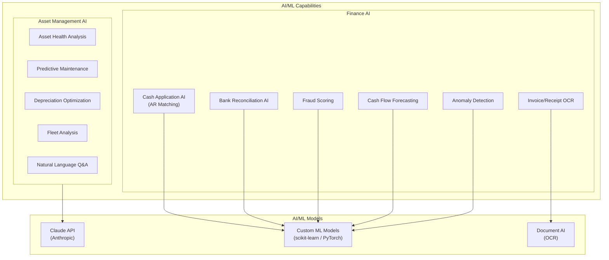
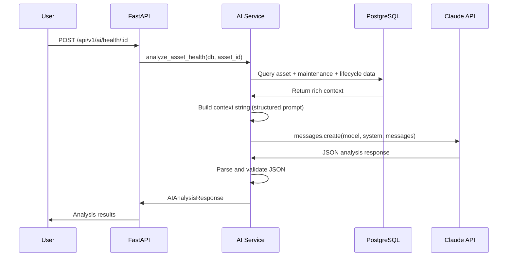
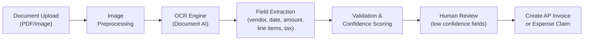
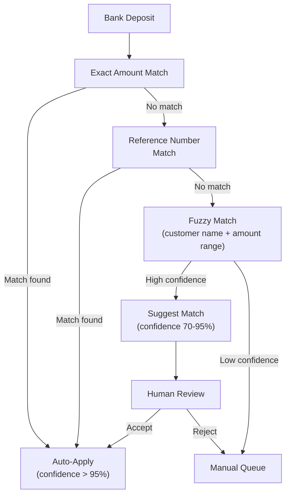
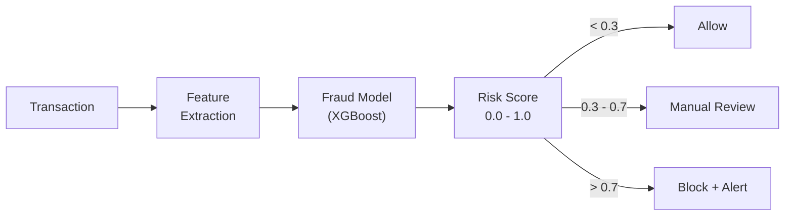

# ERP-Finance AI/ML Specifications

## Document Information

| Field | Value |
|-------|-------|
| Module | ERP-Finance |
| Document Type | AI/ML Specifications |
| Version | 1.0.0 |
| Last Updated | 2026-02-23 |

## AI/ML Overview

ERP-Finance integrates AI capabilities across multiple financial domains, using Anthropic's Claude API as the primary LLM and custom ML models for specific financial tasks.



## Asset Management AI (Claude-Powered)

### Architecture

The asset management service uses the Anthropic Claude API for all AI analysis features. The implementation is in `/imports/asset_core/src/services/ai_service.py`.



### AI Feature: Asset Health Analysis

**Purpose**: Evaluate the overall health of a physical or digital asset based on its maintenance history, condition score, age, and operational data.

**Model**: Claude (configurable, default `claude-sonnet-4-20250514`)

**Input Context Built From**:
- Asset profile (name, category, manufacturer, model, serial, location)
- Financial data (purchase price, book value, salvage value, depreciation)
- Operational data (age, useful life remaining, operating hours, condition score)
- Maintenance history (last 20 records with type, status, cost, priority)
- Lifecycle events (all phase transitions)

**Output Schema**:
```json
{
  "analysis_type": "asset_health",
  "summary": "Brief 2-3 sentence overall assessment",
  "recommendations": ["List of specific actionable recommendations"],
  "risk_level": "low|medium|high|critical",
  "confidence_score": 0.0-1.0,
  "details": {
    "health_score": 0-100,
    "maintenance_compliance": "description",
    "depreciation_status": "description",
    "remaining_value_assessment": "assessment",
    "failure_risk_factors": ["list"],
    "optimization_opportunities": ["list"]
  }
}
```

**Performance**: Average 1.5-3 seconds per analysis.

### AI Feature: Predictive Maintenance

**Purpose**: Predict upcoming maintenance needs based on patterns in maintenance history, operating hours, and condition trends.

**Output**: Predicted failures with probability and timeframe, optimal maintenance windows, cost of inaction estimate, and priority action list.

### AI Feature: Depreciation Optimization

**Purpose**: Recommend optimal depreciation strategy based on asset usage patterns, tax implications, and total cost of ownership.

**Output**: Current method assessment, recommended method with rationale, tax implications, book value projections, and replacement timing.

### AI Feature: Fleet Analysis

**Purpose**: Strategic analysis of the entire asset fleet for portfolio-level optimization.

**Input**: All assets with their current state, book values, condition scores, and maintenance history.

**Output**: Fleet health score, assets requiring attention, budget recommendations, replacement priorities, utilization insights, and cost reduction opportunities.

### AI Feature: Natural Language Q&A

**Purpose**: Allow users to ask questions about assets in plain English.

**Examples**:
- "Which assets are approaching end of life?"
- "What is the total maintenance cost for vehicles this year?"
- "Show me assets with condition score below 60"
- "What is the depreciation impact if we switch all IT equipment to double-declining?"

## Invoice/Receipt OCR

### Architecture



### Extracted Fields

| Field | Extraction Method | Typical Confidence |
|-------|------------------|-------------------|
| Vendor name | NER + header detection | 92% |
| Invoice number | Pattern matching | 95% |
| Invoice date | Date pattern extraction | 94% |
| Due date | Date pattern + terms | 88% |
| Line items | Table detection + parsing | 85% |
| Subtotal | Amount detection near label | 93% |
| Tax amount | Amount detection near "VAT/Tax" | 90% |
| Total | Largest amount or labeled amount | 95% |
| Currency | Symbol detection + context | 97% |

## Cash Application AI (AR)

### Purpose

Automatically match incoming bank deposits to open AR invoices.

### Matching Algorithm



### Matching Features

| Feature | Weight | Description |
|---------|--------|-------------|
| Amount exactness | 0.35 | Exact amount match vs. tolerance |
| Reference number | 0.25 | Invoice number in payment reference |
| Customer name | 0.15 | Fuzzy match on customer name |
| Historical pattern | 0.15 | Customer's typical payment behavior |
| Timing | 0.10 | Payment received near due date |

## Bank Reconciliation AI

### Purpose

Match bank statement lines to GL transactions automatically.

### ML Model Specifications

| Attribute | Value |
|-----------|-------|
| Model type | Gradient Boosted Trees (XGBoost) |
| Training data | Historical reconciliation matches |
| Features | Amount, date proximity, description similarity, reference overlap |
| Output | Match confidence score (0-1) |
| Threshold | > 0.95 auto-match, 0.70-0.95 suggest, < 0.70 manual |
| Retraining | Monthly with new confirmed matches |

## Fraud Scoring

### Purpose

Score payment transactions for fraud risk before processing.

### Risk Factors

| Factor | Weight | Description |
|--------|--------|-------------|
| Transaction velocity | High | Multiple transactions in short period |
| Amount anomaly | High | Significantly larger than historical average |
| Geographic anomaly | Medium | Payment from unusual location |
| Device fingerprint | Medium | New or suspicious device |
| Customer history | Medium | Account age and transaction history |
| Time anomaly | Low | Transaction at unusual time |

### Scoring



## AIDD Guardrails for AI Features

All AI features operate under the module's AIDD guardrails:

```yaml
ai_feature_controls:
  asset_health_analysis:
    action_type: read_only_query
    human_approval: not_required
    logging: required

  predictive_maintenance:
    action_type: read_only_query
    human_approval: not_required
    logging: required

  cash_application_auto_match:
    action_type: data_mutation
    human_approval: required_above_threshold
    threshold: 10000  # USD equivalent
    logging: required

  fraud_blocking:
    action_type: data_mutation
    human_approval: auto_for_high_confidence
    confidence_threshold: 0.95
    logging: required
    rollback_window_hours: 24
```

## Model Versioning and Deployment

| Model | Current Version | Framework | Deployment |
|-------|----------------|-----------|-----------|
| Asset Analysis | Claude API (latest) | Anthropic SDK | API call |
| Cash Application | v2.1.0 | scikit-learn | Container sidecar |
| Bank Reconciliation | v1.3.0 | XGBoost | Container sidecar |
| Fraud Scoring | v3.0.0 | XGBoost | Container sidecar |
| OCR Extraction | Document AI v2 | Cloud Vision | API call |
| Cash Forecasting | v1.0.0 | Prophet/LSTM | Batch job |

## Responsible AI Principles

1. **Transparency**: All AI decisions include confidence scores and explanation
2. **Human-in-the-loop**: High-value financial decisions always require human approval
3. **Auditability**: Every AI recommendation is logged with full context
4. **Fairness**: Models tested for bias across customer segments and geographies
5. **Privacy**: No personally identifiable information sent to external AI services beyond what is necessary
6. **Fallback**: All AI features have manual fallback paths; no critical operation depends solely on AI
