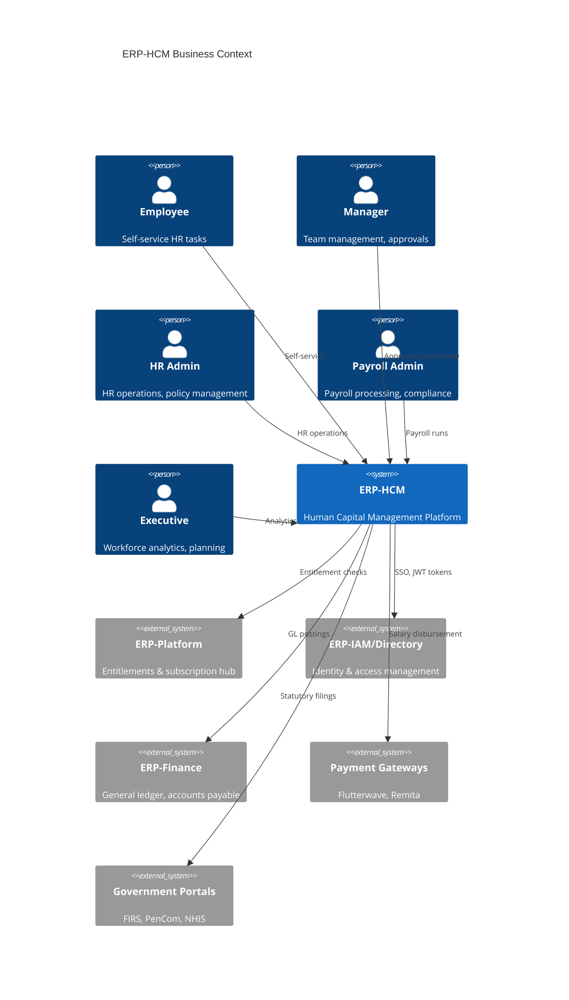
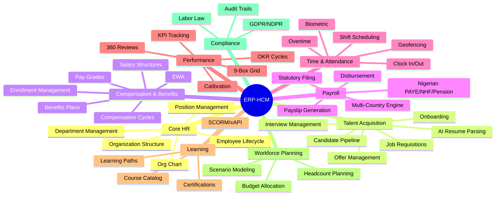
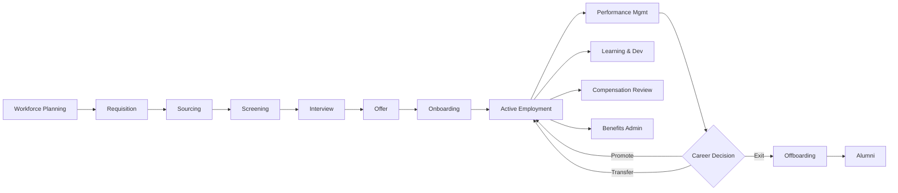
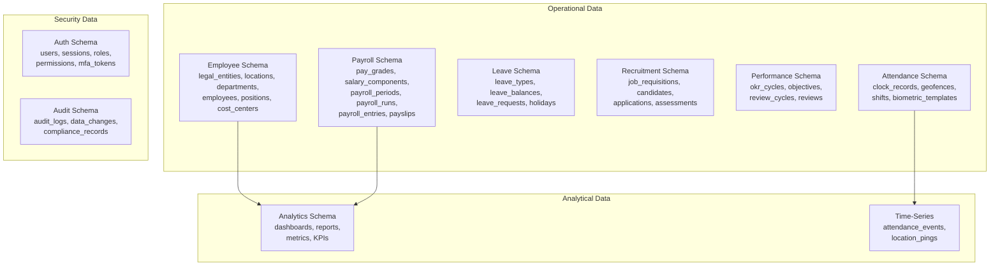
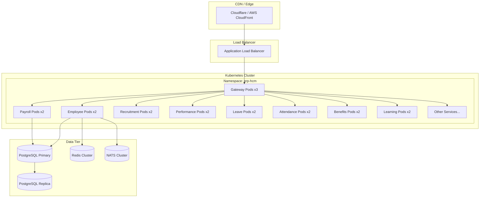
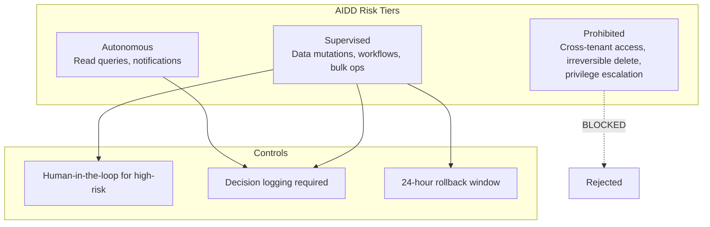
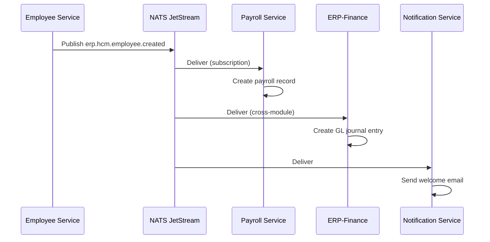
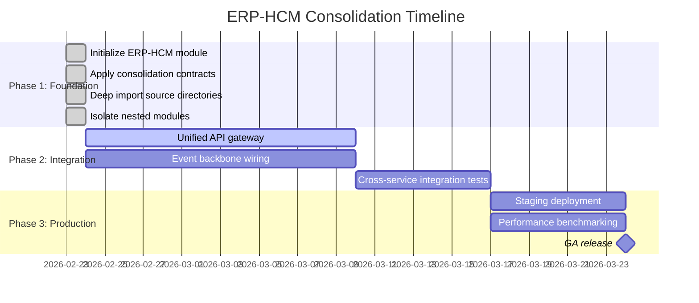

# ERP-HCM Enterprise Architecture

## TOGAF-Aligned Enterprise Architecture Document

### Version: 1.0.0
### Date: 2026-02-23
### Classification: Internal

---

## 1. Architecture Vision

ERP-HCM delivers a unified Human Capital Management platform within the broader ERP product-line architecture. The vision is to provide organizations with a single, comprehensive system for managing the entire employee lifecycle -- from recruitment and onboarding through payroll, performance, learning, and retirement -- while maintaining the flexibility to operate standalone or as part of the integrated ERP suite.

### 1.1 Business Context

### 1.2 Architecture Principles

| Principle | Rationale |
|-----------|-----------|
| Multi-tenant by default | Single deployment serves multiple organizations |
| Event-driven integration | Loose coupling between modules via NATS JetStream |
| AIDD guardrails | AI-driven operations governed by explicit risk tiers |
| Domain isolation | Each service owns its data and business logic |
| API-first design | REST APIs with CloudEvents for async communication |
| Nigerian-first compliance | First-class support for Nigerian tax, pension, labor law |

---

## 2. Business Architecture

### 2.1 Business Capability Map

### 2.2 Value Stream: Hire-to-Retire

### 2.3 Business Process Architecture

| Process | Owner | Frequency | SLA |
|---------|-------|-----------|-----|
| New Hire Onboarding | HR Admin | Per event | 3 business days |
| Monthly Payroll Run | Payroll Admin | Monthly | T-2 before pay date |
| Leave Approval | Manager | Per event | 24 hours |
| Performance Review | HR Admin | Quarterly/Annual | 2 weeks |
| Benefits Enrollment | HR Admin | Annual + life events | 30 days |
| Compliance Audit | Compliance Officer | Quarterly | 5 business days |

---

## 3. Information Systems Architecture

### 3.1 Application Architecture

```mermaid
flowchart TB
    subgraph "Presentation Layer"
        WEB[Next.js 14 Web App]
        MOB[Flutter Mobile App]
        PORTAL[Employee Self-Service Portal]
    end

    subgraph "API Gateway Layer"
        GW[API Gateway<br/>Chi Router + Middleware]
    end

    subgraph "Service Layer"
        EMP[Employee Service]
        PAY[Payroll Service]
        REC[Recruitment Service]
        PERF[Performance Service]
        LV[Leave Service]
        TA[Time & Attendance Service]
        BEN[Benefits Service]
        LMS[Learning Service]
        COMP[Compensation Service]
        WFP[Workforce Planning Service]
        COMPLY[Compliance Service]
        DMS[Document Service]
        FAC[Facilities Service]
        FM[Facilities Management]
    end

    subgraph "Data Layer"
        PG[(PostgreSQL 16)]
        TS[(TimescaleDB)]
        RD[(Redis 7)]
        MS[(Meilisearch)]
    end

    subgraph "Integration Layer"
        NATS[NATS JetStream]
        VAULT[HashiCorp Vault]
        S3[AWS S3]
    end

    subgraph "External Systems"
        IAM[ERP-IAM]
        PLAT[ERP-Platform]
        FIN[ERP-Finance]
        FW[Flutterwave]
        REM[Remita]
    end

    WEB --> GW
    MOB --> GW
    PORTAL --> GW

    GW --> EMP
    GW --> PAY
    GW --> REC
    GW --> PERF
    GW --> LV
    GW --> TA
    GW --> BEN
    GW --> LMS
    GW --> COMP
    GW --> WFP
    GW --> COMPLY
    GW --> DMS
    GW --> FAC
    GW --> FM

    EMP --> PG
    PAY --> PG
    TA --> TS
    EMP --> RD
    REC --> MS

    EMP --> NATS
    PAY --> NATS
    PAY --> FW
    PAY --> REM
    DMS --> S3
    GW --> IAM
    GW --> PLAT
    PAY --> FIN
    EMP --> VAULT
```

### 3.2 Data Architecture

---

## 4. Technology Architecture

### 4.1 Infrastructure View

### 4.2 Technology Standards

| Layer | Standard | Implementation |
|-------|----------|----------------|
| Language | Go 1.24+ | Microservices backend |
| Frontend | Next.js 14 | Server-side rendered web app |
| Mobile | Flutter | Cross-platform mobile |
| Database | PostgreSQL 16 | Primary data store |
| Time-Series | TimescaleDB | Attendance events |
| Cache | Redis 7 | Session, rate-limit, config cache |
| Messaging | NATS JetStream | Event-driven integration |
| Search | Meilisearch | Full-text employee/candidate search |
| API | REST + CloudEvents | Synchronous + asynchronous |
| Auth | RS256 JWT + MFA | Token-based authentication |
| Encryption | AES-256-GCM | Field-level PII encryption |
| Key Management | HashiCorp Vault | Encryption key rotation |
| Monitoring | Prometheus + OTel | Metrics and tracing |
| Logging | zerolog (JSON) | Structured logging |
| Container | Docker (Alpine) | < 20MB images |
| Orchestration | Kubernetes | Production deployment |

---

## 5. Governance

### 5.1 Architecture Decision Records

All significant architectural decisions are documented as ADRs in `docs/ADR/`. Key decisions include:

- **ADR-001**: Go selected as primary backend language for performance and concurrency
- **ADR-002**: PostgreSQL 16 selected for relational data with JSONB support

### 5.2 AIDD Governance Framework

The AIDD guardrails file (`erp/aidd.guardrails.yaml`) establishes three tiers of operational governance:

### 5.3 Compliance Framework

| Standard | Scope | Implementation |
|----------|-------|----------------|
| GDPR | EU employee data | DSR handler, data minimization, encryption |
| NDPR | Nigerian data protection | Consent management, breach notification |
| SOC 2 | Trust services | Audit logging, access controls, encryption |
| PCI DSS | Payment card data | Tokenization via payment gateways |
| NPC | Nigerian pension compliance | Pension calculator, PenCom reporting |

---

## 6. Integration Architecture

### 6.1 Integration Pattern: Event-Driven

### 6.2 Integration Catalog

| Source | Target | Pattern | Protocol | Event |
|--------|--------|---------|----------|-------|
| Employee | Payroll | Event | NATS | employee.created/updated |
| Payroll | Finance | Event | NATS | payroll.paid |
| Employee | IAM | Sync | REST | employee.created |
| Payroll | Payment GW | Request | REST | disbursement |
| Attendance | Payroll | Event | NATS | attendance.summary |
| Leave | Attendance | Event | NATS | leave.approved |
| Recruitment | Employee | Event | NATS | offer.accepted |
| All Services | Analytics | Event | NATS | *.created/*.updated |

---

## 7. Migration and Transition Architecture

### 7.1 Consolidation Transition

### 7.2 Legacy Migration Strategy

Organizations migrating from legacy HR systems should follow a phased approach:

1. **Assessment**: Inventory existing HR data and processes
2. **Data Migration**: Use bulk import engines with validation
3. **Parallel Run**: Run both systems for 1-2 payroll cycles
4. **Cutover**: Switch to ERP-HCM as system of record
5. **Decommission**: Archive legacy system data

---

## 8. Risk Assessment

| Risk | Impact | Probability | Mitigation |
|------|--------|-------------|------------|
| Data loss during migration | High | Low | Preserved source snapshots, rollback window |
| Nigerian tax law changes | Medium | Medium | Configurable tax bands, rapid deployment |
| Cross-tenant data leakage | Critical | Low | Tenant middleware, field-level encryption, AIDD guardrails |
| Service outage during payroll | High | Low | Multi-replica deployment, automated failover |
| Compliance violation | High | Low | Audit logging, DSR automation, encryption |
