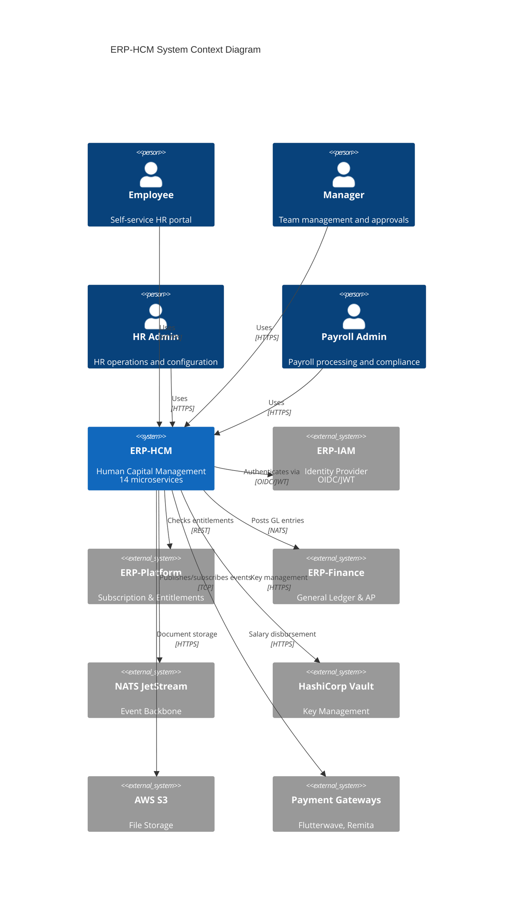
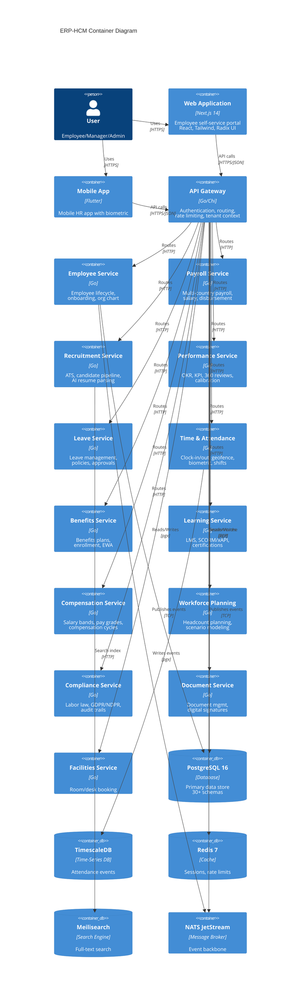
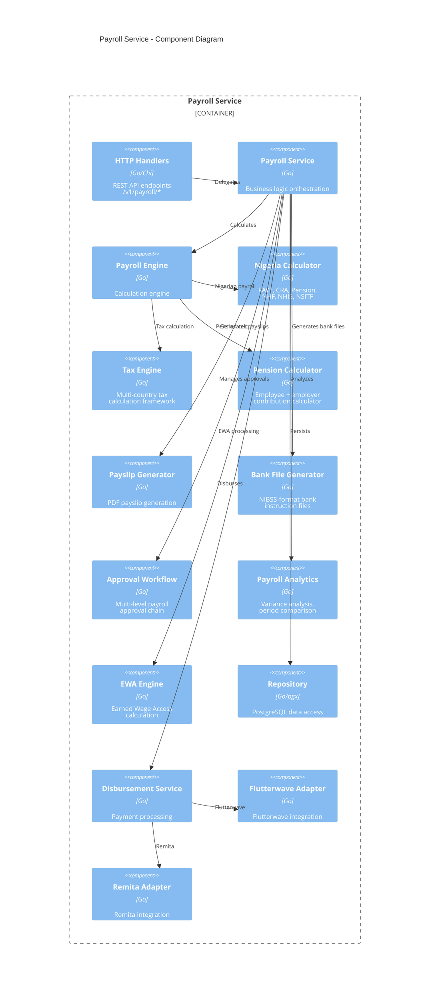
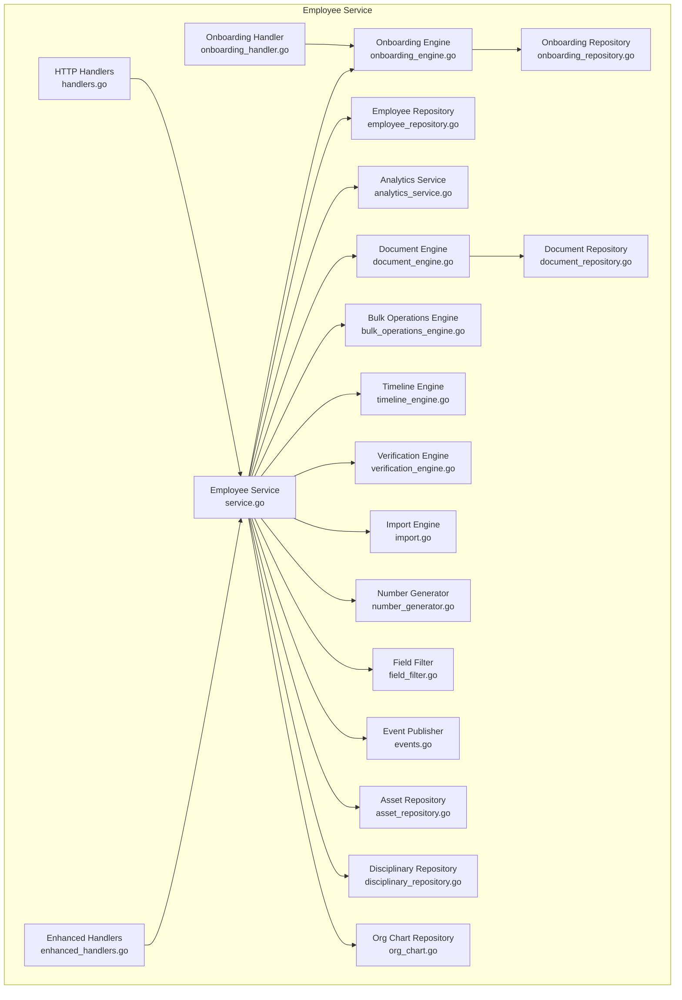
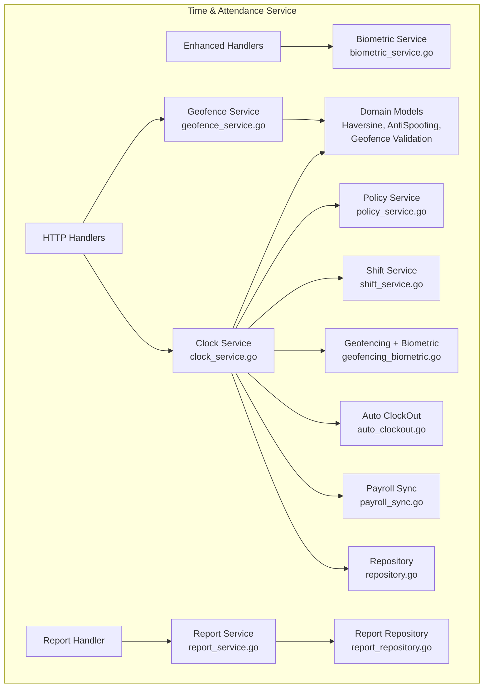
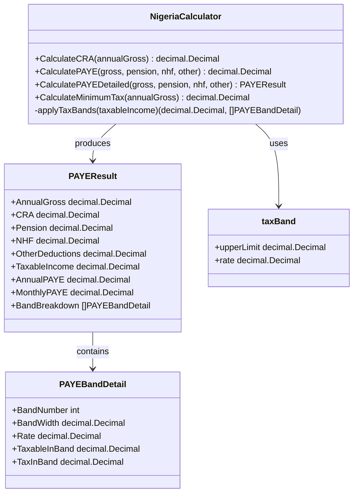
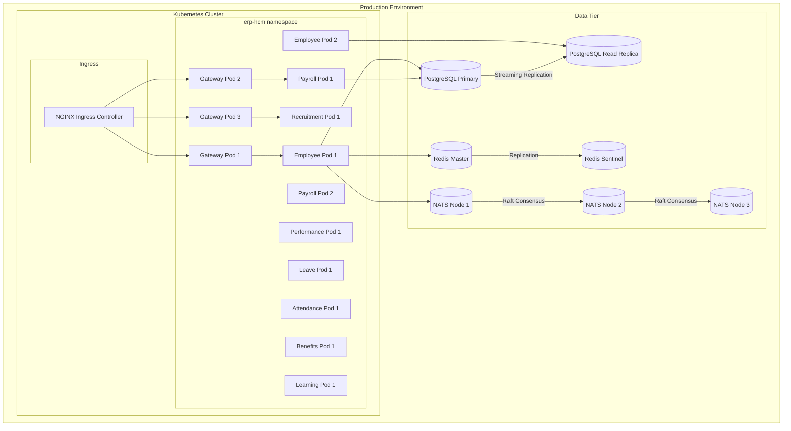
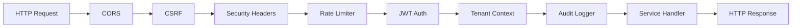
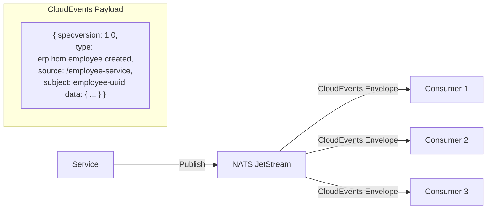
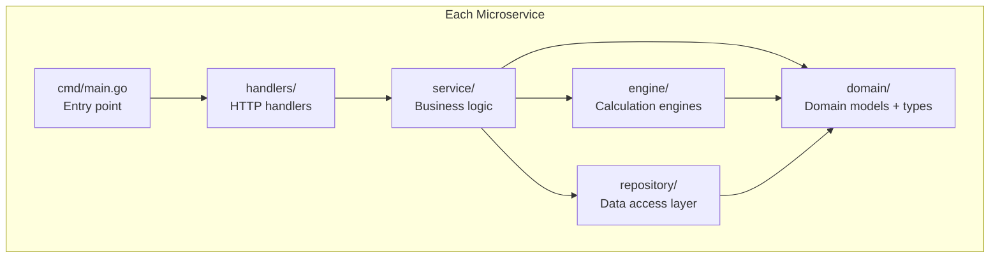

# ERP-HCM Software Architecture (C4 Model)

## Version: 1.0.0 | Date: 2026-02-23

---

## 1. System Context (Level 1)

---

## 2. Container Diagram (Level 2)

---

## 3. Component Diagram (Level 3) -- Payroll Service

---

## 4. Component Diagram (Level 3) -- Employee Service

---

## 5. Component Diagram (Level 3) -- Time & Attendance Service

---

## 6. Code Diagram (Level 4) -- Nigerian PAYE Calculator

---

## 7. Deployment Diagram

---

## 8. Cross-Cutting Concerns

### 8.1 Middleware Pipeline

### 8.2 Event Flow Pattern

### 8.3 Domain-Driven Design Layering

