# ERP-HCM Business Requirements Document (BRD)

## Document Control
| Field | Value |
|-------|-------|
| Document | Business Requirements Document |
| Module | ERP-HCM |
| Version | 1.0.0 |
| Date | 2026-02-23 |
| Status | Approved |

---

## 1. Business Objectives

### 1.1 Primary Objectives

1. **Consolidate HR operations**: Replace fragmented HR tools with a unified platform covering the complete hire-to-retire lifecycle.
2. **Automate payroll compliance**: Eliminate manual tax and statutory calculations, reducing payroll errors by 95%+.
3. **Accelerate hiring**: Reduce time-to-hire through integrated ATS with pipeline automation.
4. **Enable data-driven decisions**: Provide real-time workforce analytics for strategic planning.
5. **Ensure compliance**: Automate labor law, tax, and data protection compliance across jurisdictions.

### 1.2 Business Drivers

- Nigerian organizations spend 40+ hours/month on manual payroll processing
- Fragmented HR systems lead to data inconsistency and compliance risk
- Manual attendance tracking causes 5-15% payroll leakage
- Lack of performance management tools leads to talent attrition
- Regulatory penalties for PAYE/pension non-compliance can exceed NGN 10M/year

---

## 2. Business Rules

### 2.1 Employee Management Rules

| Rule ID | Rule | Priority |
|---------|------|----------|
| BR-EMP-001 | Every employee must have a unique employee number within a tenant | P0 |
| BR-EMP-002 | Employee status transitions must follow the defined state machine (active -> on_leave/suspended/terminated/resigned/retired) | P0 |
| BR-EMP-003 | Probation period must be tracked and confirmation workflow triggered before probation end date | P0 |
| BR-EMP-004 | All employee data changes must be recorded in the audit trail with old/new values | P0 |
| BR-EMP-005 | Manager hierarchy must prevent circular reporting relationships | P0 |
| BR-EMP-006 | Employee termination requires documented reason and approval | P0 |
| BR-EMP-007 | PII fields (bank details, tax ID, national ID) must be encrypted at rest | P0 |

### 2.2 Payroll Business Rules

| Rule ID | Rule | Priority |
|---------|------|----------|
| BR-PAY-001 | Nigerian PAYE must follow PITA graduated tax bands (7%, 11%, 15%, 19%, 21%, 24%) | P0 |
| BR-PAY-002 | CRA = Higher of (NGN 200,000 OR 1% of annual gross) + 20% of annual gross | P0 |
| BR-PAY-003 | Employee pension contribution = 8% of (basic + housing + transport) | P0 |
| BR-PAY-004 | Employer pension contribution = 10% of (basic + housing + transport) | P0 |
| BR-PAY-005 | NHF = 2.5% of basic salary for eligible employees | P0 |
| BR-PAY-006 | Minimum tax of 1% applies when calculated PAYE is less than 1% of gross | P0 |
| BR-PAY-007 | Payroll runs require multi-level approval before disbursement | P0 |
| BR-PAY-008 | Payroll entries store amounts in the smallest currency unit (kobo for NGN) as int64 | P0 |
| BR-PAY-009 | All financial calculations must use decimal arithmetic (shopspring/decimal), not floating-point | P0 |
| BR-PAY-010 | YTD (Year-to-Date) values must be recalculated with each payroll run | P0 |
| BR-PAY-011 | Mid-month hires/exits must be prorated based on working days | P1 |
| BR-PAY-012 | Off-cycle payroll runs (bonus, correction, back pay) must be supported | P1 |

### 2.3 Leave Management Rules

| Rule ID | Rule | Priority |
|---------|------|----------|
| BR-LV-001 | Leave requests must not exceed available balance | P0 |
| BR-LV-002 | Leave approval follows manager hierarchy | P0 |
| BR-LV-003 | Approved leave must update attendance records | P0 |
| BR-LV-004 | Leave balance accrual rules are configurable per leave type | P1 |
| BR-LV-005 | Carry-over policies must be enforced at year end | P1 |

### 2.4 Attendance Rules

| Rule ID | Rule | Priority |
|---------|------|----------|
| BR-TA-001 | Clock-in must be validated against geofence (configurable radius per location) | P0 |
| BR-TA-002 | GPS accuracy exceeding 50 meters must be rejected | P0 |
| BR-TA-003 | Travel exceeding 100km in under 1 hour must trigger teleport detection alert | P0 |
| BR-TA-004 | Multi-device clock-in within the same session must be flagged | P0 |
| BR-TA-005 | Auto clock-out policies must be enforced at configurable cutoff times | P1 |

### 2.5 Multi-Tenancy Rules

| Rule ID | Rule | Priority |
|---------|------|----------|
| BR-MT-001 | All API requests must include valid X-Tenant-ID | P0 |
| BR-MT-002 | Data queries must be scoped to the authenticated tenant | P0 |
| BR-MT-003 | Cross-tenant data access is prohibited except for super-admin via supervised action | P0 |
| BR-MT-004 | Tenant data must be logically isolated in the database | P0 |

---

## 3. Stakeholder Analysis

| Stakeholder | Role | Interest | Influence |
|-------------|------|----------|-----------|
| CHRO | Sponsor | Strategic workforce management | High |
| CFO | Key stakeholder | Payroll cost optimization, compliance | High |
| HR Director | Primary user | Operational HR efficiency | High |
| Payroll Manager | Primary user | Accurate, timely payroll | High |
| IT Director | Enabler | System integration, security | Medium |
| Line Managers | End user | Team management, approvals | Medium |
| Employees | End user | Self-service, transparency | Medium |
| Compliance Officer | Advisor | Regulatory compliance | Medium |
| External Auditors | Reviewer | Audit trail, compliance evidence | Low |

---

## 4. ROI Analysis

### 4.1 Cost Reduction

| Area | Current Cost (Monthly) | With ERP-HCM | Savings |
|------|----------------------|--------------|---------|
| Manual payroll processing (500 employees) | NGN 1,200,000 | NGN 200,000 | 83% |
| Compliance penalties (average) | NGN 500,000 | NGN 50,000 | 90% |
| Manual attendance tracking | NGN 800,000 | NGN 100,000 | 87% |
| Recruitment (agency fees) | NGN 3,000,000 | NGN 1,500,000 | 50% |
| Paper-based HR processes | NGN 400,000 | NGN 50,000 | 87% |
| **Total Monthly** | **NGN 5,900,000** | **NGN 1,900,000** | **68%** |
| **Annual Savings** | | | **NGN 48,000,000** |

### 4.2 Productivity Gains

| Metric | Before | After | Improvement |
|--------|--------|-------|-------------|
| Time to process payroll | 5 days | 4 hours | 93% |
| Time to approve leave | 3 days | < 1 day | 67% |
| Time to onboard new hire | 2 weeks | 3 days | 79% |
| Time to generate compliance report | 1 week | Real-time | 100% |
| Employee self-service queries | 50/day to HR | 10/day to HR | 80% |

### 4.3 Payback Period

For a 500-employee organization:
- Implementation cost: NGN 15,000,000 (one-time)
- Monthly subscription: NGN 1,500,000
- Monthly savings: NGN 4,000,000
- **Payback period: 5.6 months**

### 4.4 3-Year TCO Comparison

| Component | ERP-HCM | Workday | SAP SuccessFactors |
|-----------|---------|---------|---------------------|
| License (3 years, 500 users) | $180,000 | $1,800,000 | $1,440,000 |
| Implementation | $50,000 | $500,000 | $400,000 |
| Training | $15,000 | $100,000 | $80,000 |
| Customization | $20,000 | $200,000 | $150,000 |
| Nigerian payroll addon | Included | $120,000 | $100,000 |
| **Total 3-Year TCO** | **$265,000** | **$2,720,000** | **$2,170,000** |
| **Savings vs. incumbents** | Baseline | 90% cheaper | 88% cheaper |

---

## 5. Functional Requirements Traceability

```mermaid
graph TB
    BO1[Consolidate HR Ops] --> FR1[Employee Service]
    BO1 --> FR2[Leave Service]
    BO1 --> FR3[Document Service]

    BO2[Automate Payroll] --> FR4[Payroll Engine]
    BO2 --> FR5[Nigerian Tax Calculator]
    BO2 --> FR6[Disbursement Service]

    BO3[Accelerate Hiring] --> FR7[Recruitment/ATS]
    BO3 --> FR8[Onboarding Engine]

    BO4[Data-Driven Decisions] --> FR9[Analytics Service]
    BO4 --> FR10[Workforce Planning]
    BO4 --> FR11[Performance Service]

    BO5[Ensure Compliance] --> FR12[Compliance Service]
    BO5 --> FR13[Audit Trail]
    BO5 --> FR14[Encryption Service]
```

---

## 6. Risk Analysis

| Risk | Probability | Impact | Mitigation |
|------|-------------|--------|------------|
| Incorrect tax calculation | Low | Critical | Decimal arithmetic, comprehensive test suite, parallel payroll runs |
| Data breach (PII exposure) | Low | Critical | AES-256-GCM encryption, Vault key management, AIDD guardrails |
| Regulatory non-compliance | Medium | High | Configurable tax bands, rapid deployment for law changes |
| User adoption resistance | Medium | Medium | Intuitive UI, comprehensive training, phased rollout |
| System downtime during payroll | Low | High | HA deployment, automated failover, disaster recovery plan |
| Integration failures | Medium | Medium | Event-driven architecture, retry mechanisms, dead letter queues |

---

## 7. Acceptance Criteria

### 7.1 Payroll Accuracy
- Nigerian PAYE calculation matches manual calculation within NGN 1 (rounding)
- Pension contributions match PenCom published rates
- NHF deductions are exactly 2.5% of basic salary
- YTD reconciliation passes for all employees at year-end

### 7.2 Performance
- Payroll run for 10,000 employees completes within 5 minutes
- API response time P99 < 200ms for read operations
- System supports 5,000 concurrent users without degradation

### 7.3 Security
- All PII encrypted at rest (AES-256-GCM)
- JWT tokens expire within 15 minutes (configurable)
- Account lockout after 5 failed attempts
- Audit trail captures all data mutations

### 7.4 Compliance
- GDPR data subject requests processed within 30 days
- NDPR breach notification within 72 hours
- SOC 2 Type II evidence available for all trust service criteria
