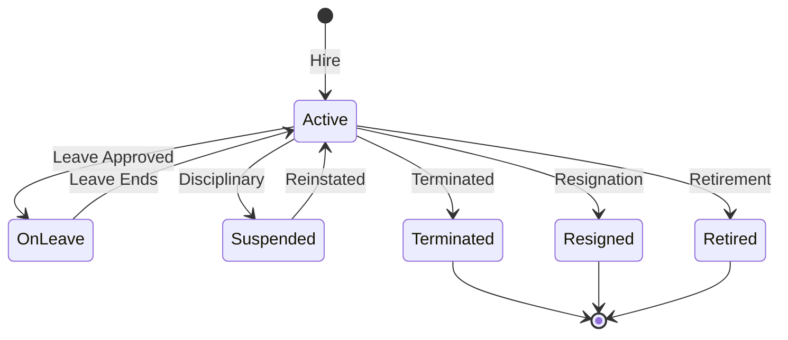
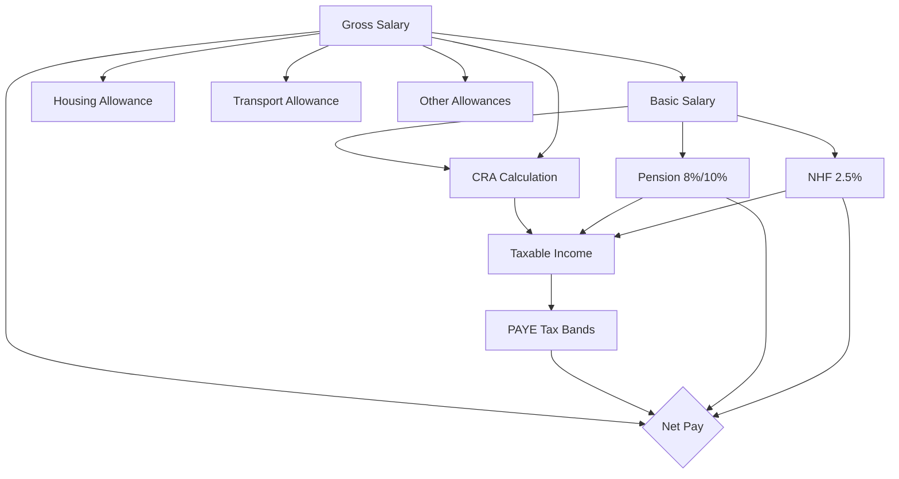
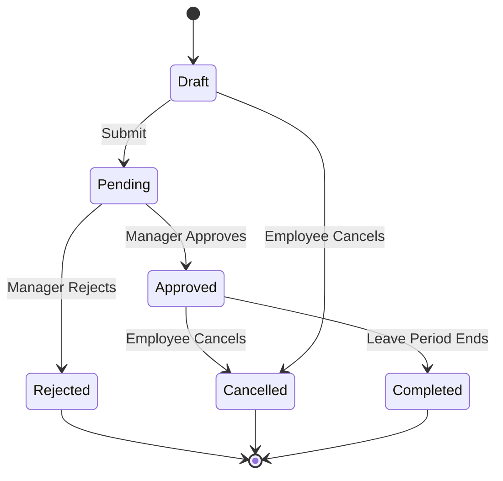
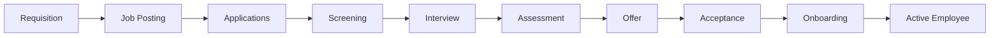
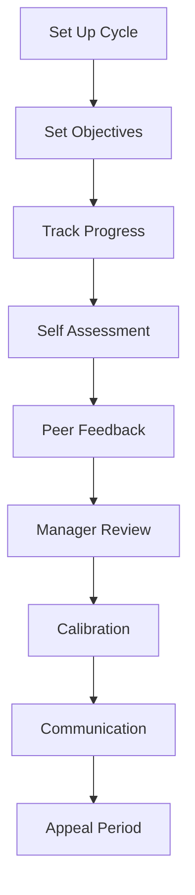

# ERP-HCM Training Manual

## 10-Module Training Curriculum

### Version 1.0.0 | Duration: 40 hours total

---

## Module 1: Platform Overview and Navigation (3 hours)

### 1.1 Learning Objectives
- Understand ERP-HCM's role in the organization
- Navigate the web application confidently
- Customize personal dashboard settings
- Use global search effectively

### 1.2 Topics Covered
1. **What is ERP-HCM?**: Introduction to human capital management, hire-to-retire lifecycle
2. **System architecture overview**: Multi-tenant SaaS, role-based access
3. **Dashboard walkthrough**: Widgets, quick stats, announcements, upcoming events
4. **Navigation**: Sidebar menu, breadcrumbs, page layouts
5. **Profile setup**: Completing your personal profile, uploading photo, setting preferences
6. **Notifications**: Configuring notification channels (email, in-app, push)
7. **Global search**: Using Ctrl+K to search employees, documents, settings

### 1.3 Hands-On Exercise
- Log in and complete personal profile
- Customize dashboard layout
- Use global search to find a colleague and view their public profile

### 1.4 Assessment
- Quiz: 10 multiple-choice questions on navigation and platform concepts
- Practical: Screenshot exercise demonstrating completed profile setup

---

## Module 2: Employee Management (5 hours)

### 2.1 Learning Objectives
- Create and manage employee records
- Understand the employee lifecycle state machine
- Perform bulk operations
- Navigate the org chart

### 2.2 Topics Covered
1. **Employee data model**: Personal info, employment details, bank details, tax info, pension info
2. **Creating employees**: Step-by-step walkthrough, mandatory vs optional fields
3. **Employee number formats**: Auto-generation rules, customization
4. **Lifecycle states**: Active, On Leave, Suspended, Terminated, Resigned, Retired

5. **Onboarding workflow**: Task checklists, document collection, orientation scheduling
6. **Department and position management**: Hierarchy, cost centers, grade levels
7. **Org chart**: Interactive visualization, drill-down, reporting lines
8. **Bulk import**: CSV/Excel template, validation rules, error handling
9. **Field-level access control**: Who can see salary data, PII, sensitive info

### 2.3 Hands-On Exercise
- Create 3 employees with varying employment types
- Perform a department transfer
- Import 10 employees via CSV template
- View and navigate the org chart

### 2.4 Assessment
- Create an employee from scratch and verify all fields
- Demonstrate lifecycle state transition (hire to leave to return)
- Successfully import a batch of employees

---

## Module 3: Payroll Administration (6 hours)

### 3.1 Learning Objectives
- Configure salary structures and components
- Run monthly payroll end-to-end
- Understand Nigerian statutory deductions
- Generate payroll reports and bank files

### 3.2 Topics Covered
1. **Payroll concepts**: Gross salary, basic salary, allowances, deductions, net pay
2. **Salary components**: 22 component types (basic, housing, transport, meal, etc.)
3. **Calculation methods**: Fixed amount, percentage of basic, percentage of gross, formula
4. **Nigerian statutory deductions**:
   - PAYE (Personal Income Tax): Graduated bands (7% to 24%)
   - CRA (Consolidated Relief Allowance)
   - Pension: Employee 8% + Employer 10%
   - NHF: 2.5% of basic salary
   - NHIS, NSITF, ITF

5. **Payroll run workflow**: Period creation, initiation, processing, review, approval, disbursement
6. **Run types**: Regular, off-cycle, bonus, correction, reversal, 13th month, back pay
7. **Proration**: Mid-month hires and exits
8. **Payslip generation**: PDF format, component breakdown
9. **Bank file generation**: NIBSS format for bulk transfers
10. **Reports**: Monthly summary, statutory remittance, variance analysis, YTD

### 3.3 Hands-On Exercise
- Configure a salary structure with 5 components
- Process a monthly payroll for 50 employees
- Review variance report and identify anomalies
- Generate bank file and payslips

### 3.4 Assessment
- Manually verify PAYE calculation for a sample employee against the system
- Run end-to-end payroll and produce all required reports

---

## Module 4: Leave Management (3 hours)

### 4.1 Learning Objectives
- Configure leave types and policies
- Process leave requests as employee and manager
- Manage holiday calendars
- Generate leave reports

### 4.2 Topics Covered
1. **Leave types**: Annual, sick, maternity, paternity, compassionate, study, sabbatical
2. **Leave policies**: Entitlement, accrual, carry-over, pro-ration for new hires
3. **Request workflow**: Submit, approve/reject, cancel, complete

4. **Half-day and hourly leave**: Configuration and usage
5. **Delegation**: Setting a delegatee during absence
6. **Holiday calendars**: Public holidays, location-specific holidays
7. **Reporting**: Leave utilization, balance summary, department view

### 4.3 Hands-On Exercise
- Configure 3 leave types with different policies
- Submit, approve, and reject leave requests
- Set up a holiday calendar for the current year

---

## Module 5: Recruitment and Onboarding (4 hours)

### 5.1 Learning Objectives
- Create and manage job requisitions
- Manage the recruitment pipeline
- Process candidates from application to hire
- Configure onboarding workflows

### 5.2 Topics Covered
1. **Job requisitions**: Creating positions, budget approval, publishing
2. **Pipeline stages**: Applied, Screening, Interview, Assessment, Offer, Hired
3. **Candidate management**: Profile, resume, assessments, interview notes
4. **AI resume parsing**: Automated skill extraction (framework overview)
5. **Interview scheduling**: Calendar integration, panel assignment
6. **Offer management**: Compensation package, approval chain
7. **Onboarding**: Task templates, document collection, welcome workflow

### 5.3 Hands-On Exercise
- Create a job requisition and get it approved
- Add 5 candidates and move them through pipeline stages
- Create and send an offer letter
- Configure an onboarding checklist

---

## Module 6: Performance Management (4 hours)

### 6.1 Learning Objectives
- Set up OKR cycles and objectives
- Conduct performance reviews
- Provide and receive 360-degree feedback
- Use the 9-box talent grid

### 6.2 Topics Covered
1. **OKR framework**: Objectives, Key Results, scoring methodology
2. **Cycle management**: Quarterly, semi-annual, annual cycles
3. **Review types**: Annual, probation, project, 360-degree
4. **Self-assessment**: Employee perspective capture
5. **Manager review**: Rating, written feedback, development recommendations
6. **Peer feedback**: Nomination, anonymous feedback, aggregation
7. **Calibration**: Cross-team fairness, distribution curves
8. **9-box grid**: Performance vs potential plotting
9. **Competency frameworks**: Skill matrices, proficiency levels

### 6.3 Hands-On Exercise
- Create an OKR cycle with 3 objectives and 9 key results
- Complete a full review cycle including self-assessment and manager review

---

## Module 7: Time and Attendance (3 hours)

### 7.1 Learning Objectives
- Configure geofence locations
- Process clock-in/out events
- Manage shifts and schedules
- Handle attendance exceptions

### 7.2 Topics Covered
1. **Geofencing**: Location setup, radius configuration, Haversine distance
2. **Clock-in methods**: GPS, QR code, biometric (fingerprint, face)
3. **Anti-spoofing**: GPS accuracy check, teleport detection, multi-device detection
4. **Shift management**: Creating templates, assigning to employees, rotating shifts
5. **Attendance policies**: Late threshold, absent marking, auto clock-out
6. **Exception handling**: Manual corrections, manager overrides
7. **Payroll integration**: Attendance-based deductions and overtime

### 7.3 Hands-On Exercise
- Configure a geofence for an office location
- Simulate clock-in/out with location data
- Create and assign shift schedules

---

## Module 8: Benefits and Compensation (4 hours)

### 8.1 Learning Objectives
- Configure benefits plans
- Manage enrollment periods
- Set up compensation structures
- Run compensation cycles

### 8.2 Topics Covered
1. **Benefits plans**: Health insurance, life insurance, pension, gym, meals
2. **Enrollment**: Open enrollment, life event enrollment, eligibility rules
3. **Claims processing**: Submission, review, payment
4. **HMO integration**: Provider adapters, plan synchronization
5. **EWA (Earned Wage Access)**: Configuration, eligibility, fee structure
6. **Pay grades and bands**: Grade levels, salary ranges, market benchmarking
7. **Compensation cycles**: Planning, budget allocation, manager proposals, calibration, communication

### 8.3 Hands-On Exercise
- Configure 3 benefits plans with eligibility rules
- Process a benefits enrollment
- Set up pay grades with salary bands
- Run a compensation review cycle

---

## Module 9: Learning Management (3 hours)

### 9.1 Learning Objectives
- Create and manage courses
- Configure SCORM/xAPI packages
- Track learner progress
- Generate completion certificates

### 9.2 Topics Covered
1. **Course catalog**: Categories, descriptions, prerequisites, difficulty levels
2. **Course creation**: Content modules, assessments, completion criteria
3. **SCORM packages**: Upload, configuration, progress tracking
4. **Enrollment management**: Self-enrollment, manager assignment, mandatory courses
5. **Certificate templates**: Design, auto-generation, verification
6. **Learning paths**: Sequenced courses, career development tracks
7. **Reporting**: Completion rates, compliance training status

### 9.3 Hands-On Exercise
- Create a course with 3 modules
- Upload a SCORM package
- Enroll employees and track completion

---

## Module 10: Administration and Reporting (5 hours)

### 10.1 Learning Objectives
- Configure system settings
- Manage security and access control
- Generate cross-functional reports
- Handle compliance requirements

### 10.2 Topics Covered
1. **System configuration**: Organization settings, branding, fiscal year
2. **User management**: Creating accounts, role assignment, MFA setup
3. **Security settings**: Password policies, session management, IP whitelisting
4. **Multi-tenant management**: Tenant creation, data isolation verification
5. **Audit trail**: Searching logs, exporting evidence
6. **Compliance**: GDPR data subject requests, NDPR consent management
7. **Integration configuration**: API keys, webhook endpoints, event subscriptions
8. **Custom reports**: Building reports, scheduling, distribution
9. **Analytics dashboards**: Headcount, attrition, diversity, cost analysis
10. **Backup and recovery**: Understanding RPO/RTO, disaster recovery procedures

### 10.3 Hands-On Exercise
- Configure system settings for a new tenant
- Set up RBAC roles and permissions
- Generate a compliance audit report
- Create a custom workforce analytics dashboard

### 10.4 Final Assessment
- Comprehensive practical exam covering all 10 modules
- Pass mark: 80%
- Certificate of completion issued on pass

---

## Appendix: Training Schedule

| Day | Module | Duration |
|-----|--------|----------|
| Day 1 | Module 1: Platform Overview | 3 hours |
| Day 2 | Module 2: Employee Management | 5 hours |
| Day 3 | Module 3: Payroll Administration | 6 hours |
| Day 4 | Module 4: Leave Management | 3 hours |
| Day 4 | Module 7: Time and Attendance | 3 hours |
| Day 5 | Module 5: Recruitment and Onboarding | 4 hours |
| Day 6 | Module 6: Performance Management | 4 hours |
| Day 7 | Module 8: Benefits and Compensation | 4 hours |
| Day 8 | Module 9: Learning Management | 3 hours |
| Day 8 | Module 10: Administration (Part 1) | 2 hours |
| Day 9 | Module 10: Administration (Part 2) | 3 hours |
| Day 9 | Final Assessment | 2 hours |
