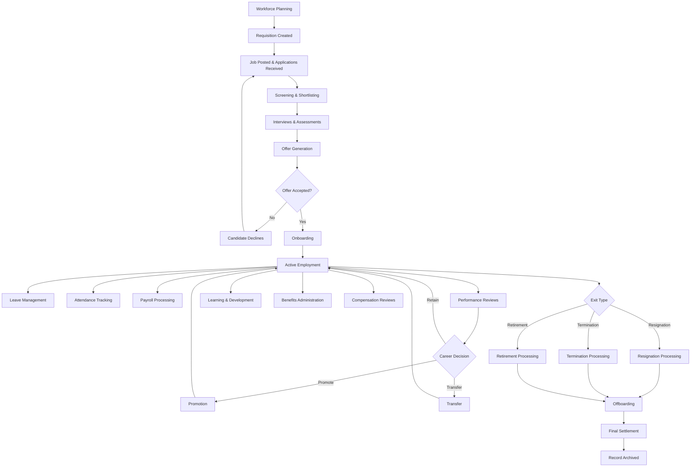
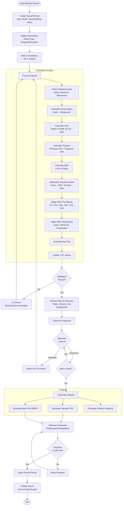
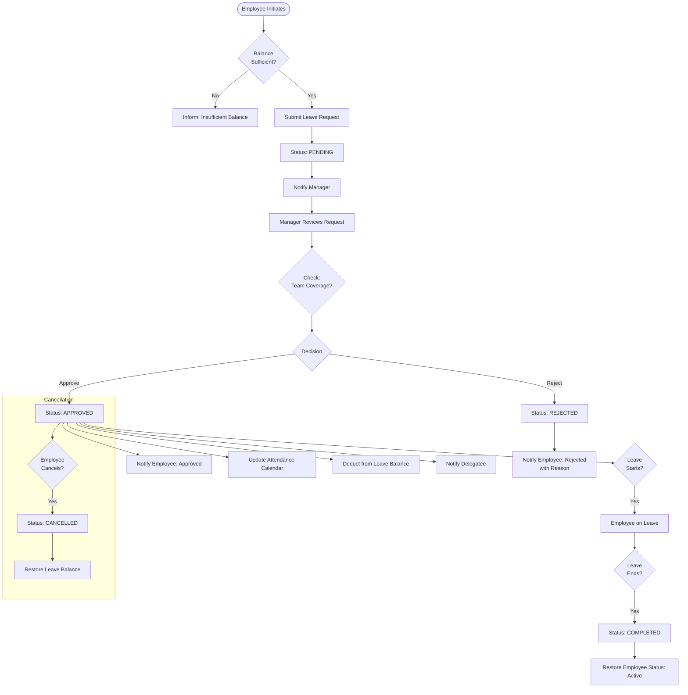
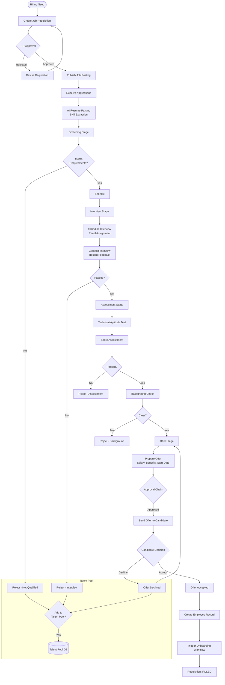
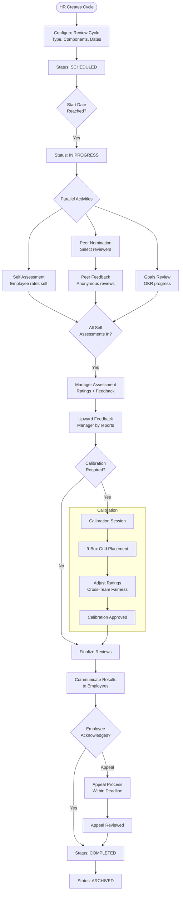
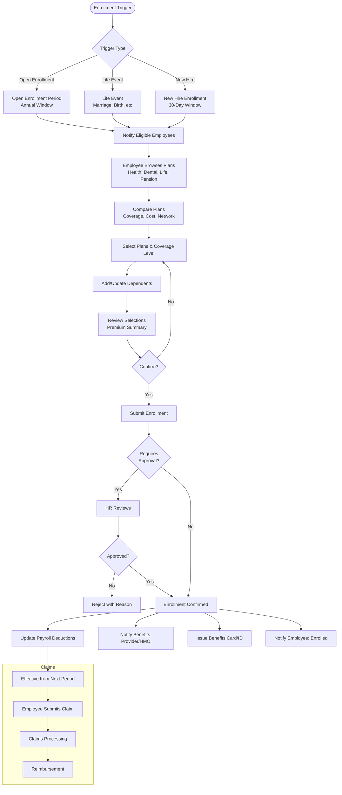
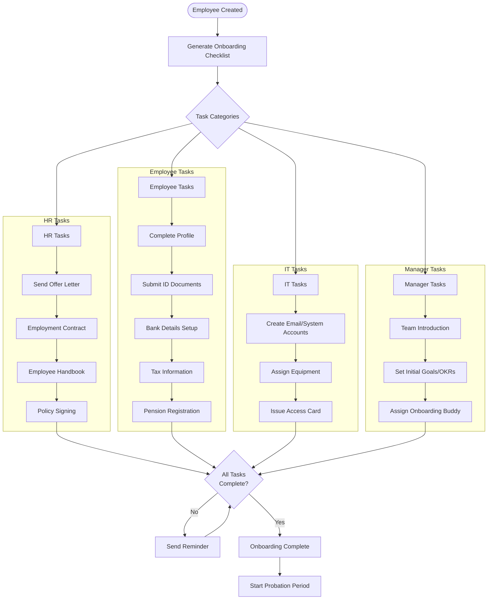
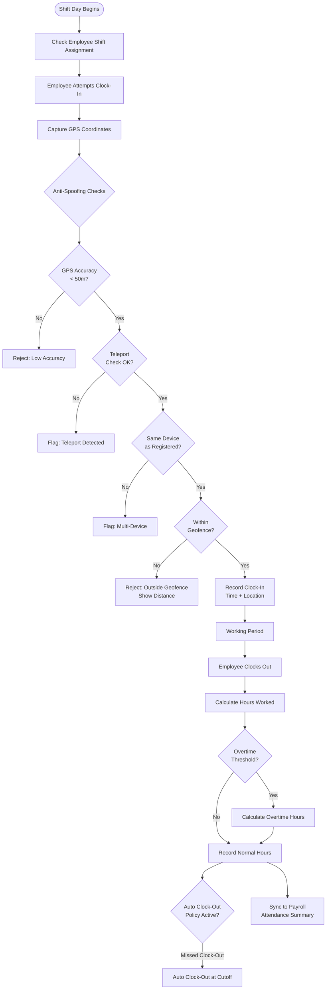

# ERP-HCM Workflow Diagrams

---

## 1. Hire-to-Retire Lifecycle

---

## 2. Payroll Run Workflow

---

## 3. Leave Approval Workflow

---

## 4. Recruitment Pipeline

---

## 5. Performance Review Cycle

---

## 6. Benefits Enrollment Workflow

---

## 7. Onboarding Checklist Workflow

---

## 8. Attendance and Shift Workflow

