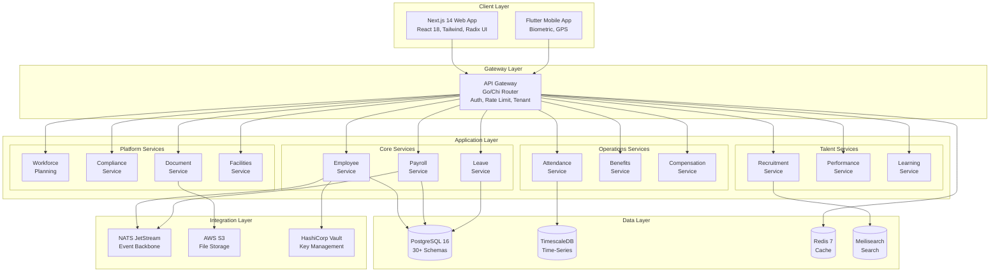
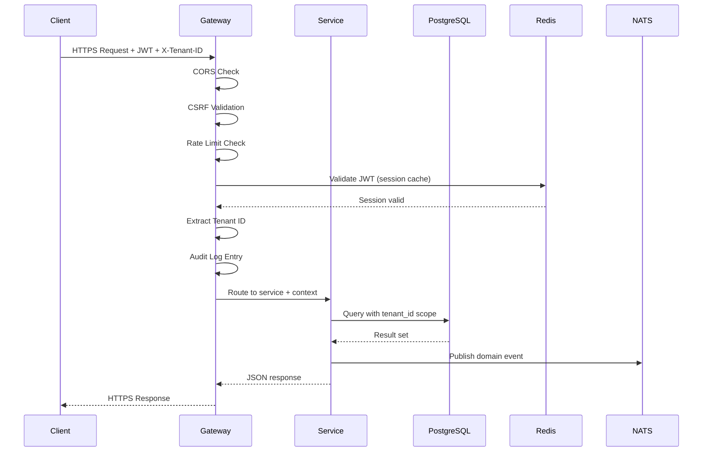
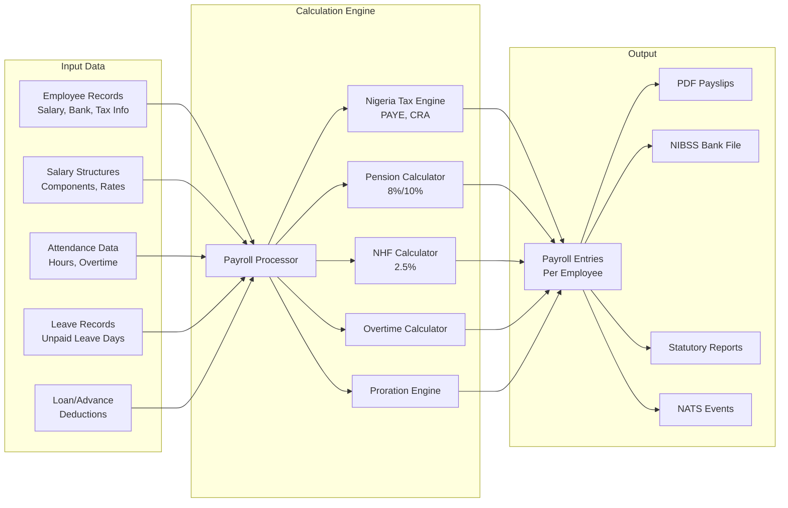
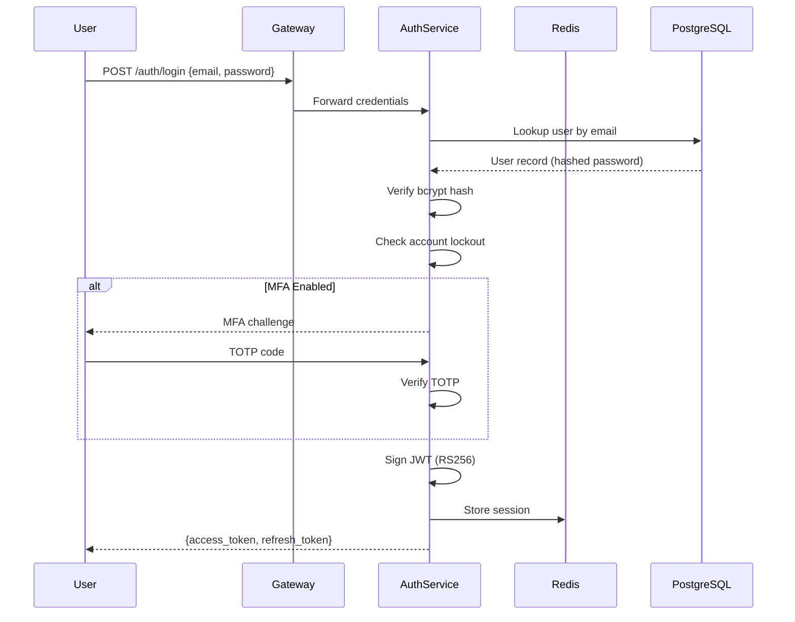
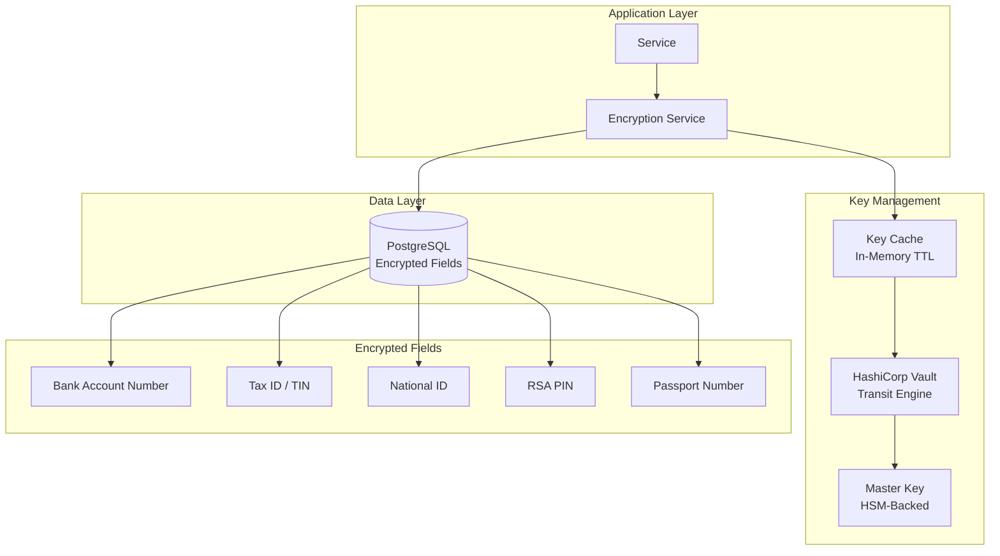
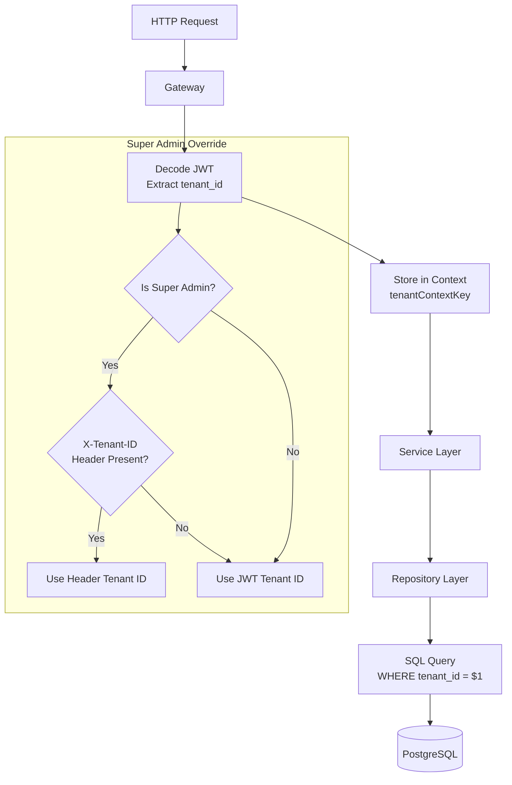
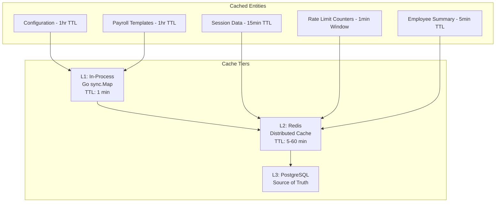
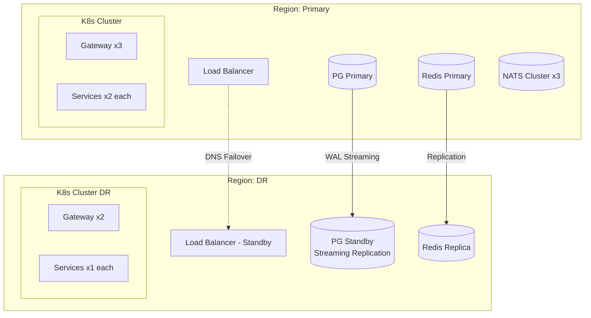
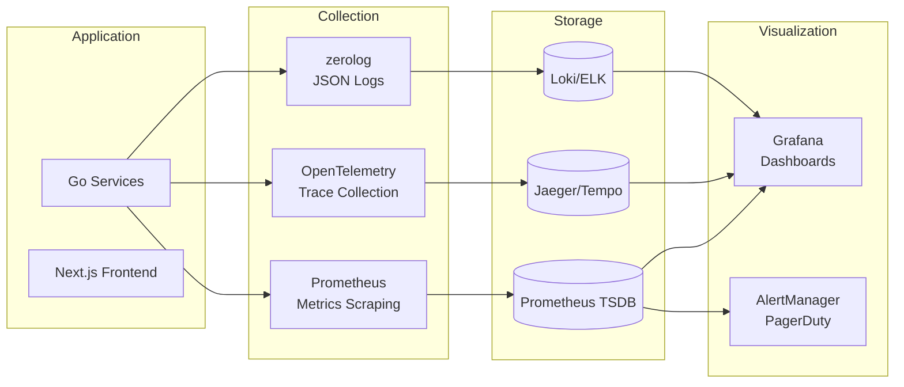

# ERP-HCM High-Level Design (HLD)

## Version 1.0.0 | Date: 2026-02-23

---

## 1. System Overview

ERP-HCM is a multi-tenant, microservices-based Human Capital Management platform built with Go 1.24+ backend services and a Next.js 14 frontend. The system manages the complete employee lifecycle from recruitment through retirement, with particular depth in Nigerian payroll compliance.

### 1.1 Component Overview



---

## 2. Data Flow Architecture

### 2.1 Request Flow



### 2.2 Payroll Calculation Data Flow



---

## 3. Service Architecture

### 3.1 Service Registry

| Service | API Prefix | Database Schema | Event Namespace |
|---------|------------|-----------------|-----------------|
| employee-service | `/v1/employee` | `employee.*` | `erp.hcm.employee.*` |
| payroll-service | `/v1/payroll` | `payroll.*` | `erp.hcm.payroll.*` |
| leave-service | `/v1/leave` | `leave.*` | `erp.hcm.leave.*` |
| recruitment-service | `/v1/recruitment` | `recruitment.*` | `erp.hcm.recruitment.*` |
| performance-service | `/v1/performance` | `performance.*` | `erp.hcm.performance.*` |
| time-attendance-service | `/v1/time-attendance` | `attendance.*` | `erp.hcm.time-attendance.*` |
| benefits-service | `/v1/benefits` | `benefits.*` | `erp.hcm.benefits.*` |
| learning-service | `/v1/learning` | `lms.*` | `erp.hcm.learning.*` |
| compensation-service | `/v1/compensation` | `workforce.*` | `erp.hcm.compensation.*` |
| workforce-planning-service | `/v1/workforce-planning` | `workforce.*` | `erp.hcm.workforce-planning.*` |
| compliance-service | `/v1/compliance` | `compliance.*` | `erp.hcm.compliance.*` |
| document-service | `/v1/document` | `dms.*` | `erp.hcm.document.*` |
| facilities-service | `/v1/facilities` | `facilities.*` | `erp.hcm.facilities.*` |

### 3.2 Internal Package Structure (per service)

```
internal/<domain>/
    domain/         # Domain models, value objects, enums
    service/        # Business logic, orchestration
    engine/         # Calculation engines (payroll, tax, etc.)
    repository/     # Data access layer (PostgreSQL)
    handlers/       # HTTP handlers (Chi router)
    adapters/       # External service adapters
```

---

## 4. Security Architecture

### 4.1 Authentication Flow



### 4.2 Encryption Architecture



---

## 5. Multi-Tenancy Architecture



---

## 6. Caching Strategy



---

## 7. High Availability Design



---

## 8. Monitoring and Observability


