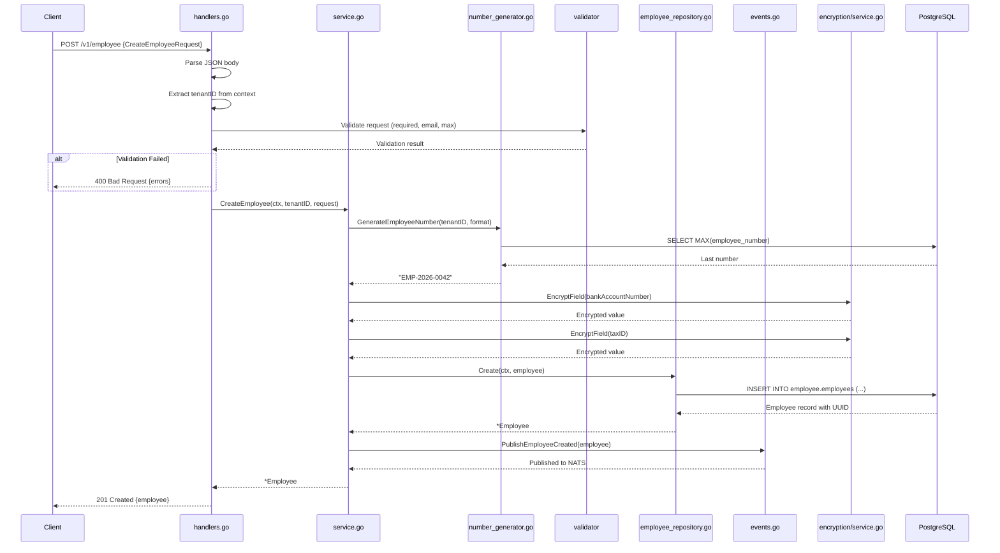
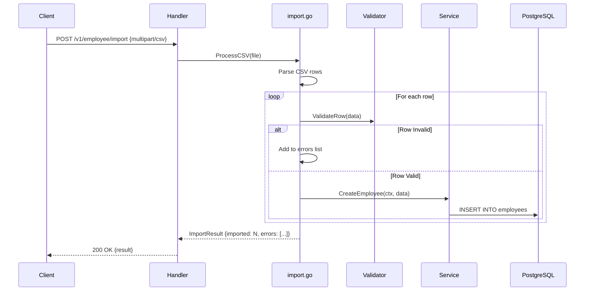
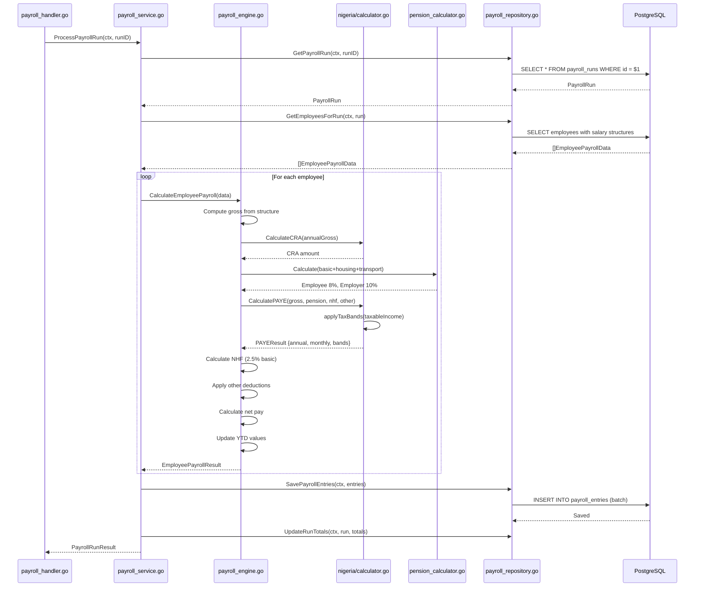
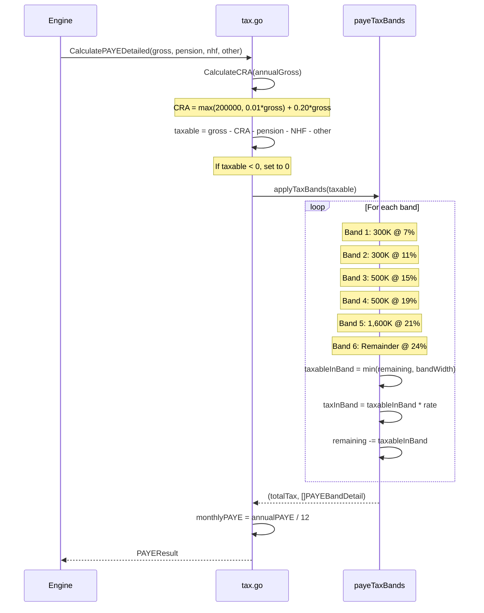
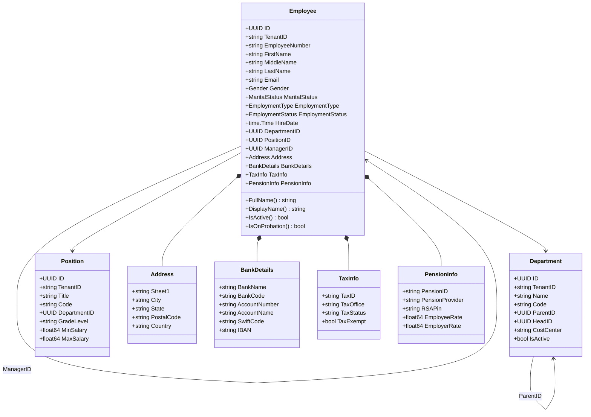
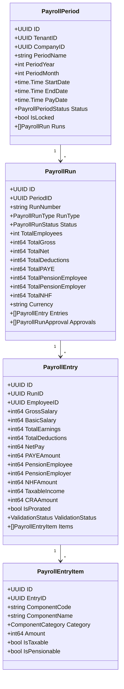

# ERP-HCM Low-Level Design (LLD)

## Version 1.0.0 | Date: 2026-02-23

---

## 1. Employee Service - Sequence Diagrams

### 1.1 Create Employee



### 1.2 Bulk Import Employees



---

## 2. Payroll Service - Sequence Diagrams

### 2.1 Process Payroll Run



### 2.2 PAYE Tax Calculation Detail



---

## 3. Class Diagrams

### 3.1 Employee Domain Model



### 3.2 Payroll Domain Model



---

## 4. Database Schema (Key Tables)

### 4.1 Employee Schema

```sql
-- employee.legal_entities
CREATE TABLE employee.legal_entities (
    id UUID PRIMARY KEY DEFAULT gen_random_uuid(),
    parent_entity_id UUID REFERENCES employee.legal_entities(id),
    code VARCHAR(50) NOT NULL UNIQUE,
    name VARCHAR(255) NOT NULL,
    country_code VARCHAR(3) NOT NULL DEFAULT 'NGA',
    currency_code VARCHAR(3) NOT NULL DEFAULT 'NGN',
    is_active BOOLEAN NOT NULL DEFAULT true,
    created_at TIMESTAMPTZ NOT NULL DEFAULT NOW()
);

-- employee.departments
CREATE TABLE employee.departments (
    id UUID PRIMARY KEY DEFAULT gen_random_uuid(),
    tenant_id UUID NOT NULL,
    legal_entity_id UUID REFERENCES employee.legal_entities(id),
    parent_id UUID REFERENCES employee.departments(id),
    code VARCHAR(50) NOT NULL,
    name VARCHAR(255) NOT NULL,
    head_id UUID,
    cost_center VARCHAR(50),
    is_active BOOLEAN DEFAULT true,
    UNIQUE(tenant_id, code)
);

-- employee.employees (core table)
CREATE TABLE employee.employees (
    id UUID PRIMARY KEY DEFAULT gen_random_uuid(),
    tenant_id UUID NOT NULL,
    employee_number VARCHAR(50) NOT NULL,
    first_name VARCHAR(100) NOT NULL,
    last_name VARCHAR(100) NOT NULL,
    email VARCHAR(255) NOT NULL,
    department_id UUID REFERENCES employee.departments(id),
    position_id UUID,
    manager_id UUID REFERENCES employee.employees(id),
    employment_type VARCHAR(20) NOT NULL,
    employment_status VARCHAR(20) NOT NULL DEFAULT 'active',
    hire_date DATE NOT NULL,
    bank_details_encrypted BYTEA,
    tax_info_encrypted BYTEA,
    custom_fields JSONB DEFAULT '{}',
    created_at TIMESTAMPTZ NOT NULL DEFAULT NOW(),
    updated_at TIMESTAMPTZ NOT NULL DEFAULT NOW(),
    deleted_at TIMESTAMPTZ,
    UNIQUE(tenant_id, employee_number),
    UNIQUE(tenant_id, email)
);
```

### 4.2 Payroll Schema

```sql
-- pay_grades
CREATE TABLE pay_grades (
    id UUID PRIMARY KEY DEFAULT gen_random_uuid(),
    company_id UUID NOT NULL,
    code VARCHAR(20) NOT NULL,
    name VARCHAR(100) NOT NULL,
    min_salary DECIMAL(18,2) NOT NULL,
    max_salary DECIMAL(18,2) NOT NULL,
    currency VARCHAR(3) DEFAULT 'NGN',
    UNIQUE(company_id, code)
);

-- payroll_periods
CREATE TABLE payroll_periods (
    id UUID PRIMARY KEY DEFAULT gen_random_uuid(),
    tenant_id UUID NOT NULL,
    company_id UUID NOT NULL,
    period_year INT NOT NULL,
    period_month INT NOT NULL,
    start_date DATE NOT NULL,
    end_date DATE NOT NULL,
    pay_date DATE NOT NULL,
    status VARCHAR(20) NOT NULL DEFAULT 'open',
    is_locked BOOLEAN DEFAULT false
);

-- payroll_runs
CREATE TABLE payroll_runs (
    id UUID PRIMARY KEY DEFAULT gen_random_uuid(),
    tenant_id UUID NOT NULL,
    period_id UUID NOT NULL REFERENCES payroll_periods(id),
    run_type VARCHAR(20) NOT NULL DEFAULT 'regular',
    status VARCHAR(30) NOT NULL DEFAULT 'draft',
    total_employees INT DEFAULT 0,
    total_gross BIGINT DEFAULT 0,
    total_net BIGINT DEFAULT 0,
    total_paye BIGINT DEFAULT 0,
    total_pension_employee BIGINT DEFAULT 0,
    total_pension_employer BIGINT DEFAULT 0,
    total_nhf BIGINT DEFAULT 0,
    currency VARCHAR(3) DEFAULT 'NGN',
    created_by UUID NOT NULL,
    created_at TIMESTAMPTZ NOT NULL DEFAULT NOW()
);

-- payroll_entries (one per employee per run)
CREATE TABLE payroll_entries (
    id UUID PRIMARY KEY DEFAULT gen_random_uuid(),
    tenant_id UUID NOT NULL,
    run_id UUID NOT NULL REFERENCES payroll_runs(id),
    employee_id UUID NOT NULL,
    gross_salary BIGINT NOT NULL,
    basic_salary BIGINT NOT NULL,
    total_earnings BIGINT NOT NULL,
    total_deductions BIGINT NOT NULL,
    net_pay BIGINT NOT NULL,
    paye_amount BIGINT DEFAULT 0,
    pension_employee BIGINT DEFAULT 0,
    pension_employer BIGINT DEFAULT 0,
    nhf_amount BIGINT DEFAULT 0,
    taxable_income BIGINT DEFAULT 0,
    cra_amount BIGINT DEFAULT 0,
    status VARCHAR(20) NOT NULL DEFAULT 'draft',
    created_at TIMESTAMPTZ NOT NULL DEFAULT NOW()
);
```

---

## 5. API Endpoint Specifications

### 5.1 Employee Endpoints

| Method | Path | Description | Auth |
|--------|------|-------------|------|
| GET | `/v1/employee` | List employees (paginated) | JWT + Tenant |
| POST | `/v1/employee` | Create employee | JWT + Tenant + HR role |
| GET | `/v1/employee/{id}` | Get employee by ID | JWT + Tenant |
| PUT | `/v1/employee/{id}` | Update employee | JWT + Tenant + HR role |
| DELETE | `/v1/employee/{id}` | Soft-delete employee | JWT + Tenant + Admin |
| POST | `/v1/employee/import` | Bulk import via CSV | JWT + Tenant + HR role |
| GET | `/v1/employee/{id}/history` | Get change history | JWT + Tenant |
| GET | `/v1/employee/statistics` | Get workforce stats | JWT + Tenant |

### 5.2 Payroll Endpoints

| Method | Path | Description | Auth |
|--------|------|-------------|------|
| POST | `/v1/payroll/periods` | Create period | JWT + Payroll role |
| GET | `/v1/payroll/periods` | List periods | JWT + Payroll role |
| POST | `/v1/payroll/runs` | Initiate run | JWT + Payroll role |
| POST | `/v1/payroll/runs/{id}/process` | Process run | JWT + Payroll role |
| POST | `/v1/payroll/runs/{id}/approve` | Approve run | JWT + Approver role |
| GET | `/v1/payroll/runs/{id}/summary` | Get run summary | JWT + Payroll role |
| GET | `/v1/payroll/entries/{id}/payslip` | Get payslip PDF | JWT + Tenant |
| POST | `/v1/payroll/runs/{id}/bank-file` | Generate bank file | JWT + Payroll role |

---

## 6. Error Handling

```mermaid
flowchart TB
    ERR[Error Occurs] --> TYPE{Error Type}
    TYPE -->|Validation| V400[400 Bad Request<br/>{code, message, fields}]
    TYPE -->|Auth| V401[401 Unauthorized<br/>{code, message}]
    TYPE -->|Forbidden| V403[403 Forbidden<br/>{code, message}]
    TYPE -->|Not Found| V404[404 Not Found<br/>{code, message}]
    TYPE -->|Rate Limit| V429[429 Too Many Requests<br/>{retry_after}]
    TYPE -->|Internal| V500[500 Internal Server Error<br/>{code, request_id}]

    V500 --> LOG[Log with zerolog<br/>Stack trace, request_id]
    V500 --> ALERT[Alert via Prometheus<br/>5xx counter increment]
```
