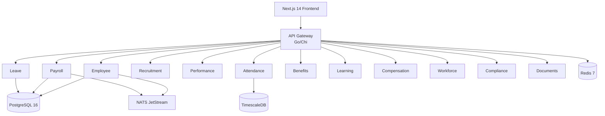

# ERP-HCM

**Human Capital Management** -- A comprehensive, multi-tenant HCM platform for the complete hire-to-retire employee lifecycle.

```
Module: ERP-HCM | SKU: erp.hcm | Go 1.24+ | Next.js 14
```

---

## Overview

ERP-HCM consolidates six HR-related repositories into a unified microservices platform delivering: employee lifecycle management, multi-country payroll (Nigerian PAYE/NHF/Pension-first), recruitment (ATS), performance (OKR/KPI/360), time and attendance (geofence/biometric), leave management, benefits enrollment, LMS (SCORM/xAPI), workforce planning, compensation management, document management (digital signatures), and compliance automation (GDPR/NDPR/SOC 2).

### Architecture



### Services (14)

| Service | API Prefix | Description |
|---------|------------|-------------|
| employee-service | `/v1/employee` | Employee lifecycle, onboarding, org chart |
| payroll-service | `/v1/payroll` | Multi-country payroll engine |
| leave-service | `/v1/leave` | Leave management and approvals |
| recruitment-service | `/v1/recruitment` | ATS and candidate pipeline |
| performance-service | `/v1/performance` | OKR, KPI, 360 reviews |
| time-attendance-service | `/v1/time-attendance` | Geofenced clock-in/out |
| benefits-service | `/v1/benefits` | Benefits and EWA |
| learning-service | `/v1/learning` | LMS with SCORM |
| compensation-service | `/v1/compensation` | Salary bands and cycles |
| workforce-planning-service | `/v1/workforce-planning` | Headcount planning |
| compliance-service | `/v1/compliance` | Labor law and data protection |
| document-service | `/v1/document` | Document management |
| facilities-service | `/v1/facilities` | Room/desk booking |
| facilities-management | (standalone) | Facilities operations |

---

## Quick Start

### Prerequisites

- Go 1.24+
- PostgreSQL 16+
- Redis 7+
- NATS Server 2.10+ (JetStream enabled)
- Node.js 20 LTS (for frontend)

### Backend

```bash
# Clone the repository
git clone https://github.com/your-org/ERP-HCM.git
cd ERP-HCM

# Run the gateway server
go run cmd/server/main.go

# Or build and run
make build
./server
```

### Individual Services

```bash
# Run a specific service
cd services/employee-service
PORT=8081 go run main.go

# Or with Docker
docker build -t erp-hcm-employee -f services/employee-service/Dockerfile services/employee-service/
docker run -p 8081:8080 -e PORT=8080 erp-hcm-employee
```

### Frontend

```bash
cd imports/hrms_core/web/frontend
npm install
npm run dev
# Open http://localhost:3000
```

---

## API

### Core Endpoints

```
GET  /healthz              # Health check
GET  /v1/capabilities      # Module capabilities
```

### Business Endpoints

All business endpoints require:
- `Authorization: Bearer <JWT>` header
- `X-Tenant-ID: <UUID>` header

```
# Employee
GET    /v1/employee         # List employees
POST   /v1/employee         # Create employee
GET    /v1/employee/{id}    # Get employee
PUT    /v1/employee/{id}    # Update employee
DELETE /v1/employee/{id}    # Delete employee

# Payroll
POST   /v1/payroll/periods              # Create period
POST   /v1/payroll/runs                 # Initiate run
POST   /v1/payroll/runs/{id}/process    # Process run
POST   /v1/payroll/runs/{id}/approve    # Approve run

# Leave
POST   /v1/leave/requests              # Submit request
PUT    /v1/leave/requests/{id}/approve  # Approve request
GET    /v1/leave/balances/{employeeId}  # Get balances

# (Similar patterns for all 14 services)
```

---

## Configuration

Configuration is via environment variables with `PF_` prefix:

```bash
# Server
export PF_SERVER_PORT=8080

# Database
export PF_DATABASE_HOST=localhost
export PF_DATABASE_PORT=5432
export PF_DATABASE_USER=peopleforce
export PF_DATABASE_PASSWORD=secret
export PF_DATABASE_DATABASE=peopleforce

# Redis
export PF_REDIS_HOST=localhost
export PF_REDIS_PORT=6379

# NATS
export PF_NATS_URL=nats://localhost:4222

# Auth
export PF_AUTH_JWT_ISSUER=peopleforce
export PF_AUTH_ACCESS_TOKEN_EXPIRY=15m
```

---

## Project Structure

```
ERP-HCM/
  cmd/server/main.go              # Gateway entry point
  configs/capabilities.json       # Module capabilities
  erp/
    module.manifest.yaml           # Module manifest
    aidd.guardrails.yaml           # AIDD guardrails
  services/                        # 14 microservices
    employee-service/
    payroll-service/
    leave-service/
    recruitment-service/
    performance-service/
    time-attendance-service/
    benefits-service/
    learning-service/
    compensation-service/
    workforce-planning-service/
    compliance-service/
    document-service/
    facilities-service/
    facilities-management/
  imports/hrms_core/               # Deep-merged core implementation
    cmd/                           # Service entry points
    internal/                      # 40+ domain packages
      employee/                    # Employee domain
      payroll/                     # Payroll domain
      leave/                       # Leave domain
      recruitment/                 # Recruitment domain
      performance/                 # Performance domain
      attendance/                  # Attendance domain
      benefits/                    # Benefits domain
      lms/                         # LMS domain
      ...
    migrations/                    # 47 SQL migration files
    web/frontend/                  # Next.js 14 application
  merge/                           # Consolidation metadata
    MERGE_MANIFEST.yaml
    source-snapshots/              # Source repo snapshots
  docs/                            # Architecture documentation
```

---

## Testing

```bash
# Unit tests
make test

# Integration tests (requires Docker for testcontainers)
make test-integration

# E2E tests
make test-e2e

# Frontend tests
cd imports/hrms_core/web/frontend
npm test               # Jest unit tests
npm run test:e2e       # Playwright E2E tests
```

---

## Consolidation History

ERP-HCM was formed by merging:
- ERP-HRMS
- HRMS/HRMS
- ERP-opensase-hr
- ERP-Workforce-Management
- Workforce Management Platform/Time-Attendant-Software
- ERP-opensase-scheduling

Source snapshots are preserved under `merge/source-snapshots/` for audit traceability.

---

## Integration

ERP-HCM operates as part of the ERP suite:
- **Control Plane**: ERP-Platform (entitlements)
- **Identity**: ERP-Directory / ERP-IAM (OIDC/JWT)
- **Event Backbone**: NATS JetStream
- **Mode**: `standalone_plus_suite`

---

## License

Proprietary. See LICENSE for terms.
