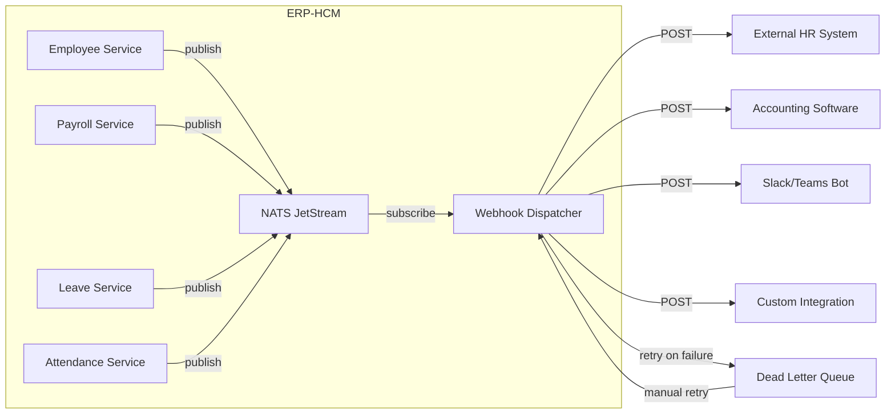

# ERP-HCM Webhook Specifications

## Event-Driven Integration via NATS JetStream and HTTP Webhooks

---

## 1. Overview

ERP-HCM uses a dual-layer event system: an internal NATS JetStream backbone for inter-service communication and an external HTTP webhook system for third-party integrations. All events follow the CloudEvents v1.0 specification.

### 1.1 Architecture



---

## 2. CloudEvents Envelope

Every event published to NATS JetStream and delivered via webhook follows the CloudEvents v1.0 specification.

### 2.1 Envelope Format

```json
{
  "specversion": "1.0",
  "id": "evt-550e8400-e29b-41d4-a716-446655440000",
  "source": "erp.hcm.employee-service",
  "type": "erp.hcm.employee.created",
  "time": "2026-02-23T14:30:00Z",
  "datacontenttype": "application/json",
  "subject": "550e8400-e29b-41d4-a716-446655440001",
  "tenantid": "00000000-0000-0000-0000-000000000001",
  "data": {
    "employee_id": "550e8400-e29b-41d4-a716-446655440001",
    "employee_number": "EMP-143",
    "first_name": "Adebayo",
    "last_name": "Okonkwo",
    "status": "pre_boarding",
    "hire_date": "2026-03-01"
  }
}
```

### 2.2 Envelope Fields

| Field | Type | Required | Description |
|-------|------|----------|-------------|
| specversion | string | Yes | CloudEvents version (`1.0`) |
| id | string | Yes | Unique event ID (UUID prefixed with `evt-`) |
| source | string | Yes | Service that generated the event |
| type | string | Yes | Event type following `erp.hcm.<entity>.<action>` |
| time | string | Yes | ISO 8601 timestamp of event generation |
| datacontenttype | string | Yes | Always `application/json` |
| subject | string | No | Primary entity ID |
| tenantid | string | Yes | Tenant UUID (custom extension) |
| data | object | Yes | Event payload |

---

## 3. Event Catalog

### 3.1 Employee Events

| Event Type | Trigger | Payload |
|-----------|---------|---------|
| `erp.hcm.employee.created` | New employee added | employee_id, employee_number, name, status, hire_date |
| `erp.hcm.employee.updated` | Employee record modified | employee_id, changed_fields, old_values, new_values |
| `erp.hcm.employee.deleted` | Employee soft-deleted | employee_id, deleted_at, reason |
| `erp.hcm.employee.status_changed` | Status transition | employee_id, old_status, new_status |
| `erp.hcm.employee.promoted` | Job change approved | employee_id, old_title, new_title, effective_date |
| `erp.hcm.employee.transferred` | Department/location change | employee_id, old_department, new_department |
| `erp.hcm.employee.onboarding.started` | Onboarding initiated | employee_id, template_id, total_items |
| `erp.hcm.employee.onboarding.completed` | Onboarding finished | employee_id, completion_date |
| `erp.hcm.employee.offboarding.started` | Offboarding initiated | employee_id, exit_type, last_working_date |
| `erp.hcm.employee.offboarding.completed` | Offboarding finished | employee_id, clearance_status |

### 3.2 Payroll Events

| Event Type | Trigger | Payload |
|-----------|---------|---------|
| `erp.hcm.payroll.run.created` | Payroll run initiated | run_id, period, run_type, total_employees |
| `erp.hcm.payroll.run.processed` | Calculations complete | run_id, total_gross, total_net, total_paye |
| `erp.hcm.payroll.run.approved` | Run approved | run_id, approved_by, approved_at |
| `erp.hcm.payroll.run.paid` | Payments disbursed | run_id, payment_reference, paid_at |
| `erp.hcm.payroll.run.reversed` | Run reversed | run_id, reversal_reason, reversed_by |
| `erp.hcm.payroll.payslip.generated` | Payslip created | entry_id, employee_id, period, net_pay |
| `erp.hcm.payroll.payment.success` | Bank transfer success | entry_id, employee_id, amount, reference |
| `erp.hcm.payroll.payment.failed` | Bank transfer failed | entry_id, employee_id, error_code, error_message |

### 3.3 Leave Events

| Event Type | Trigger | Payload |
|-----------|---------|---------|
| `erp.hcm.leave.request.created` | Leave request submitted | request_id, employee_id, leave_type, dates |
| `erp.hcm.leave.request.approved` | Leave approved | request_id, approved_by, approved_at |
| `erp.hcm.leave.request.rejected` | Leave rejected | request_id, rejected_by, reason |
| `erp.hcm.leave.request.cancelled` | Leave cancelled | request_id, cancelled_by |
| `erp.hcm.leave.balance.updated` | Balance changed | employee_id, leave_type, new_balance |

### 3.4 Attendance Events

| Event Type | Trigger | Payload |
|-----------|---------|---------|
| `erp.hcm.attendance.clock_in` | Employee clocked in | record_id, employee_id, time, location |
| `erp.hcm.attendance.clock_out` | Employee clocked out | record_id, employee_id, time, hours_worked |
| `erp.hcm.attendance.geofence.violation` | Outside geofence | employee_id, distance_meters, office_id |
| `erp.hcm.attendance.spoofing.detected` | Anti-spoofing alert | employee_id, detection_type, details |

### 3.5 Recruitment Events

| Event Type | Trigger | Payload |
|-----------|---------|---------|
| `erp.hcm.recruitment.requisition.created` | Job requisition created | requisition_id, title, department |
| `erp.hcm.recruitment.application.received` | Candidate applied | application_id, candidate_id, requisition_id |
| `erp.hcm.recruitment.stage.changed` | Pipeline stage moved | application_id, old_stage, new_stage |
| `erp.hcm.recruitment.offer.accepted` | Offer accepted | application_id, candidate_id, start_date |

### 3.6 Performance Events

| Event Type | Trigger | Payload |
|-----------|---------|---------|
| `erp.hcm.performance.review.started` | Review cycle opened | cycle_id, review_type, deadline |
| `erp.hcm.performance.review.submitted` | Review submitted | review_id, reviewer_id, reviewee_id |
| `erp.hcm.performance.okr.progress` | Key result updated | objective_id, key_result_id, progress |

### 3.7 Benefits Events

| Event Type | Trigger | Payload |
|-----------|---------|---------|
| `erp.hcm.benefits.enrollment.created` | Benefits enrollment | enrollment_id, plan_id, employee_id |
| `erp.hcm.benefits.claim.submitted` | Claim submitted | claim_id, employee_id, amount |
| `erp.hcm.benefits.ewa.disbursed` | EWA paid out | transaction_id, employee_id, amount |

---

## 4. Webhook Configuration API

### 4.1 Register Webhook

```
POST /v1/webhooks
```

**Request Body**:
```json
{
  "url": "https://your-app.com/webhooks/erp-hcm",
  "events": [
    "erp.hcm.employee.created",
    "erp.hcm.employee.updated",
    "erp.hcm.payroll.run.paid"
  ],
  "secret": "whsec_your_signing_secret_here",
  "description": "HR system sync webhook",
  "is_active": true
}
```

**Response** `201 Created`:
```json
{
  "id": "whk-550e8400-e29b-41d4-a716-446655440000",
  "url": "https://your-app.com/webhooks/erp-hcm",
  "events": ["erp.hcm.employee.created", "erp.hcm.employee.updated", "erp.hcm.payroll.run.paid"],
  "signing_key": "whsec_your_signing_secret_here",
  "status": "active",
  "created_at": "2026-02-23T14:30:00Z"
}
```

### 4.2 List Webhooks

```
GET /v1/webhooks
```

### 4.3 Update Webhook

```
PUT /v1/webhooks/{id}
```

### 4.4 Delete Webhook

```
DELETE /v1/webhooks/{id}
```

### 4.5 Test Webhook

```
POST /v1/webhooks/{id}/test
```

Sends a test event to the configured URL.

---

## 5. Webhook Delivery

### 5.1 HTTP Delivery

Webhooks are delivered as HTTP POST requests:

```http
POST /webhooks/erp-hcm HTTP/1.1
Host: your-app.com
Content-Type: application/json
X-Webhook-ID: whk-550e8400-e29b-41d4-a716-446655440000
X-Webhook-Signature: sha256=a1b2c3d4e5f6...
X-Webhook-Timestamp: 1708700400
X-Event-Type: erp.hcm.employee.created
X-Delivery-ID: del-550e8400-e29b-41d4-a716-446655440100
X-Delivery-Attempt: 1
User-Agent: ERP-HCM-Webhook/1.0

{
  "specversion": "1.0",
  "id": "evt-550e8400-e29b-41d4-a716-446655440000",
  "source": "erp.hcm.employee-service",
  "type": "erp.hcm.employee.created",
  "time": "2026-02-23T14:30:00Z",
  "datacontenttype": "application/json",
  "tenantid": "00000000-0000-0000-0000-000000000001",
  "data": {
    "employee_id": "550e8400-e29b-41d4-a716-446655440001",
    "employee_number": "EMP-143",
    "first_name": "Adebayo",
    "last_name": "Okonkwo"
  }
}
```

### 5.2 Signature Verification

The `X-Webhook-Signature` header contains an HMAC-SHA256 signature. Verify it as follows:

```go
func verifyWebhookSignature(payload []byte, signature string, secret string) bool {
    mac := hmac.New(sha256.New, []byte(secret))
    mac.Write(payload)
    expectedMAC := hex.EncodeToString(mac.Sum(nil))
    return hmac.Equal([]byte("sha256="+expectedMAC), []byte(signature))
}
```

```javascript
const crypto = require('crypto');

function verifySignature(payload, signature, secret) {
    const expectedSig = 'sha256=' + crypto
        .createHmac('sha256', secret)
        .update(payload)
        .digest('hex');
    return crypto.timingSafeEqual(
        Buffer.from(signature),
        Buffer.from(expectedSig)
    );
}
```

### 5.3 Idempotency

Each delivery includes a unique `X-Delivery-ID`. Consumers should store processed delivery IDs and skip duplicates. The event `id` field is also unique and can be used for deduplication.

---

## 6. Retry Policy

### 6.1 Retry Schedule

Failed deliveries (non-2xx responses or timeouts) are retried with exponential backoff:

| Attempt | Delay | Cumulative Time |
|---------|-------|----------------|
| 1 | Immediate | 0s |
| 2 | 30 seconds | 30s |
| 3 | 2 minutes | 2m 30s |
| 4 | 15 minutes | 17m 30s |
| 5 | 1 hour | 1h 17m 30s |
| 6 | 4 hours | 5h 17m 30s |
| 7 | 12 hours | 17h 17m 30s |
| 8 | 24 hours | 41h 17m 30s |

After 8 failed attempts, the event is moved to the dead letter queue.

### 6.2 Retry Conditions

| Response | Action |
|----------|--------|
| 2xx | Success, no retry |
| 3xx | Follow redirect (max 3), then fail |
| 4xx (except 429) | Permanent failure, no retry |
| 429 | Retry with `Retry-After` header |
| 5xx | Retry with backoff |
| Timeout (30s) | Retry with backoff |
| Connection error | Retry with backoff |

### 6.3 Dead Letter Queue

Events that exhaust all retries are stored in the dead letter queue for manual review:

```
GET /v1/webhooks/dead-letter-queue
POST /v1/webhooks/dead-letter-queue/{id}/retry
DELETE /v1/webhooks/dead-letter-queue/{id}
```

---

## 7. NATS JetStream Configuration

### 7.1 Stream Configuration

```yaml
stream:
  name: ERP_HCM_EVENTS
  subjects:
    - "erp.hcm.>"
  retention: limits
  max_msgs: 10000000
  max_bytes: 10737418240  # 10 GB
  max_age: 2592000000000000  # 30 days in nanoseconds
  storage: file
  num_replicas: 3
  discard: old
```

### 7.2 Consumer Configuration

```yaml
consumers:
  - name: webhook-dispatcher
    durable_name: webhook-dispatcher
    deliver_subject: _INBOX.webhook
    filter_subject: "erp.hcm.>"
    ack_policy: explicit
    ack_wait: 30000000000  # 30 seconds
    max_deliver: 8
    max_ack_pending: 1000

  - name: payroll-processor
    durable_name: payroll-processor
    filter_subject: "erp.hcm.employee.>"
    ack_policy: explicit
    deliver_group: payroll-workers
```

---

## 8. Payment Webhook Events

### 8.1 Flutterwave Payment Callback

```json
{
  "type": "erp.hcm.payroll.payment.success",
  "data": {
    "provider": "flutterwave",
    "transaction_id": "FLW-123456",
    "payment_reference": "PAY-2026-02-001",
    "employee_id": "550e8400-e29b-41d4-a716-446655440001",
    "amount": 425000000,
    "currency": "NGN",
    "status": "successful",
    "bank_name": "GTBank",
    "account_number": "****5678",
    "completed_at": "2026-02-28T15:30:00Z"
  }
}
```

### 8.2 Remita Payment Callback

```json
{
  "type": "erp.hcm.payroll.payment.success",
  "data": {
    "provider": "remita",
    "rrr": "290007188209",
    "payment_reference": "PAY-2026-02-001",
    "employee_id": "550e8400-e29b-41d4-a716-446655440001",
    "amount": 425000000,
    "currency": "NGN",
    "status": "successful",
    "completed_at": "2026-02-28T16:00:00Z"
  }
}
```

---

## 9. Security Considerations

1. **Always verify signatures** before processing webhook payloads
2. **Use HTTPS** endpoints for webhook URLs
3. **Implement idempotency** using the `X-Delivery-ID` header
4. **Set short timeouts** (30 seconds max) for webhook handlers
5. **Queue heavy processing** -- acknowledge the webhook quickly and process asynchronously
6. **Rotate signing secrets** periodically via the webhook update API
7. **Monitor delivery failures** via the dead letter queue
8. **IP whitelist** ERP-HCM webhook source IPs if possible
