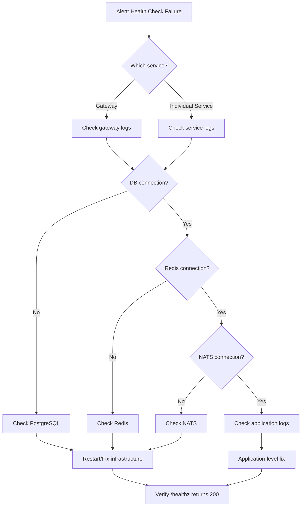

# ERP-HCM Operational Runbooks

## Standard Operating Procedures for Production Operations

---

## 1. Overview

This document provides step-by-step runbooks for common operational tasks, incident response, and maintenance procedures for the ERP-HCM platform. Each runbook includes prerequisites, procedures, verification steps, and rollback instructions.

### 1.1 Severity Levels

| Severity | Description | Response Time | Examples |
|----------|-------------|---------------|----------|
| SEV-1 | Critical: Complete service outage | 15 minutes | All services down, data loss |
| SEV-2 | Major: Core functionality degraded | 30 minutes | Payroll processing failure, auth down |
| SEV-3 | Minor: Non-critical feature affected | 2 hours | Report generation slow, webhook delays |
| SEV-4 | Low: Cosmetic or minor issue | Next business day | UI alignment, log noise |

---

## 2. Incident Response

### 2.1 RB-001: Service Health Check Failure

**Severity**: SEV-1 / SEV-2
**Trigger**: `/healthz` returns non-200 or monitoring alert fires



**Procedure**:

1. **Identify affected service**:
   ```bash
   # Check all services
   for port in 8090 8081 8082 8083 8084 8085 8086; do
     echo "Port $port: $(curl -s -o /dev/null -w '%{http_code}' http://localhost:$port/healthz)"
   done
   ```

2. **Check container status** (if Dockerized):
   ```bash
   docker compose ps
   docker compose logs --tail=50 <service-name>
   ```

3. **Check infrastructure dependencies**:
   ```bash
   # PostgreSQL
   psql -h localhost -U peopleforce -d peopleforce -c "SELECT 1;"

   # Redis
   redis-cli ping

   # NATS
   curl -s http://localhost:8222/healthz
   ```

4. **Restart service**:
   ```bash
   # Docker
   docker compose restart <service-name>

   # Systemd
   sudo systemctl restart erp-hcm-<service-name>
   ```

5. **Verify recovery**:
   ```bash
   curl http://localhost:8090/healthz
   # Expect: {"status":"ok","module":"ERP-HCM"}
   ```

---

### 2.2 RB-002: Database Connection Pool Exhaustion

**Severity**: SEV-1
**Trigger**: `too many clients` error in logs, connection timeouts

**Procedure**:

1. **Check active connections**:
   ```sql
   SELECT count(*) as total,
          state,
          usename,
          application_name
   FROM pg_stat_activity
   WHERE datname = 'peopleforce'
   GROUP BY state, usename, application_name
   ORDER BY total DESC;
   ```

2. **Identify idle connections**:
   ```sql
   SELECT pid, now() - pg_stat_activity.query_start AS duration, query, state
   FROM pg_stat_activity
   WHERE state = 'idle in transaction'
     AND now() - pg_stat_activity.query_start > interval '5 minutes';
   ```

3. **Terminate stuck connections**:
   ```sql
   -- Terminate idle-in-transaction connections older than 5 minutes
   SELECT pg_terminate_backend(pid)
   FROM pg_stat_activity
   WHERE state = 'idle in transaction'
     AND now() - query_start > interval '5 minutes';
   ```

4. **Adjust pool settings** (if needed):
   ```bash
   # Current config: PF_DATABASE_MAX_OPEN_CONNS=100, PF_DATABASE_MAX_IDLE_CONNS=25
   export PF_DATABASE_MAX_OPEN_CONNS=150
   export PF_DATABASE_MAX_IDLE_CONNS=50
   ```

5. **Restart affected services**

6. **Long-term**: Review query performance and connection lifecycle

---

### 2.3 RB-003: Payroll Processing Failure

**Severity**: SEV-2
**Trigger**: Payroll run status is `validation_failed` or `processing_errors`

**Procedure**:

1. **Identify the failed run**:
   ```sql
   SELECT id, run_number, status, total_employees, failed_employees,
          validation_errors, processing_errors
   FROM payroll_runs
   WHERE status IN ('validation_failed', 'processing')
     AND tenant_id = '<tenant_id>'
   ORDER BY created_at DESC LIMIT 5;
   ```

2. **Check individual entry failures**:
   ```sql
   SELECT pe.employee_id, pe.employee_name, pe.validation_status,
          pe.validation_errors, pe.validation_warnings
   FROM payroll_entries pe
   WHERE pe.run_id = '<run_id>'
     AND pe.validation_status = 'failed';
   ```

3. **Common failure causes and fixes**:

   | Error | Fix |
   |-------|-----|
   | Missing tax state | Update employee_payroll_configs.tax_state |
   | Invalid RSA PIN | Verify pension info in employee_pension_info |
   | No salary configured | Create employee_payroll_configs entry |
   | Missing bank account | Add bank account to employee_bank_accounts |

4. **Fix data and reprocess**:
   ```sql
   -- Reset run status
   UPDATE payroll_runs SET status = 'draft' WHERE id = '<run_id>';

   -- Clear failed entries
   DELETE FROM payroll_entry_items WHERE entry_id IN (
     SELECT id FROM payroll_entries WHERE run_id = '<run_id>'
   );
   DELETE FROM payroll_entries WHERE run_id = '<run_id>';
   ```

5. **Trigger reprocessing** via API:
   ```bash
   curl -X POST "http://localhost:8090/v1/payroll/runs/<run_id>/process" \
     -H "Authorization: Bearer <token>" \
     -H "X-Tenant-ID: <tenant_id>"
   ```

---

### 2.4 RB-004: JWT Authentication Failures

**Severity**: SEV-1 (if widespread)
**Trigger**: All API requests returning 401

**Procedure**:

1. **Verify RSA keys are loaded**:
   ```bash
   # Check if PF_AUTH_RSA_PRIVATE_KEY is set
   env | grep PF_AUTH_RSA_PRIVATE_KEY | head -c 50

   # Check if PF_AUTH_RSA_PUBLIC_KEY is set
   env | grep PF_AUTH_RSA_PUBLIC_KEY | head -c 50
   ```

2. **Verify key validity**:
   ```bash
   # Test key parsing
   openssl rsa -in private.pem -check
   openssl rsa -in private.pem -pubout | diff - public.pem
   ```

3. **Check token expiry settings**:
   ```bash
   # Default: 15m access, 7d refresh
   echo "PF_AUTH_ACCESS_TOKEN_EXPIRY=$PF_AUTH_ACCESS_TOKEN_EXPIRY"
   echo "PF_AUTH_REFRESH_TOKEN_EXPIRY=$PF_AUTH_REFRESH_TOKEN_EXPIRY"
   ```

4. **Decode a failing token** (do NOT use in production with real tokens):
   ```bash
   # Decode JWT header and payload (base64)
   echo "<token>" | cut -d'.' -f2 | base64 -d 2>/dev/null | jq .
   ```

5. **Regenerate keys if compromised**:
   ```bash
   openssl genrsa -out private.pem 2048
   openssl rsa -in private.pem -pubout -out public.pem
   # Update environment variables
   # Restart all services (existing tokens will be invalidated)
   ```

---

## 3. Maintenance Runbooks

### 3.1 RB-010: Database Migration

**Frequency**: As needed with releases

**Procedure**:

1. **Pre-migration checks**:
   ```bash
   # Verify current migration state
   psql -h localhost -U peopleforce -d peopleforce \
     -c "SELECT version, dirty FROM schema_migrations ORDER BY version DESC LIMIT 5;"

   # Create backup
   pg_dump -h localhost -U peopleforce -d peopleforce -F c -f backup_$(date +%Y%m%d_%H%M%S).dump
   ```

2. **Run migrations**:
   ```bash
   cd imports/hrms_core/migrations

   # Run specific migration
   psql -h localhost -U peopleforce -d peopleforce -f <schema>/<migration>.up.sql

   # Verify
   psql -h localhost -U peopleforce -d peopleforce \
     -c "\dt <schema>.*"
   ```

3. **Rollback if needed**:
   ```bash
   psql -h localhost -U peopleforce -d peopleforce -f <schema>/<migration>.down.sql

   # Or restore from backup
   pg_restore -h localhost -U peopleforce -d peopleforce --clean backup.dump
   ```

---

### 3.2 RB-011: Encryption Key Rotation

**Frequency**: Every 90 days (configurable via `KeyRotationDays`)

**Procedure**:

1. **Check current key status**:
   ```sql
   SELECT id, key_purpose, key_version, status, created_at,
          (created_at + (rotation_days || ' days')::interval) as next_rotation
   FROM encryption_keys
   WHERE status = 'active'
   ORDER BY created_at;
   ```

2. **Trigger rotation** via API or service call:
   ```bash
   curl -X POST "http://localhost:8090/v1/admin/encryption/rotate-key" \
     -H "Authorization: Bearer <admin_token>" \
     -H "X-Tenant-ID: <tenant_id>" \
     -d '{"key_id": "<current_key_id>"}'
   ```

3. **Verify new key is active**:
   ```sql
   SELECT id, key_version, status, created_at
   FROM encryption_keys
   WHERE key_purpose = 'field_encryption'
   ORDER BY created_at DESC LIMIT 2;
   -- New key should be active, old key should be deprecated
   ```

4. **Re-encrypt data with new key** (background job):
   ```bash
   # This runs as a background task
   curl -X POST "http://localhost:8090/v1/admin/encryption/re-encrypt" \
     -H "Authorization: Bearer <admin_token>" \
     -d '{"old_key_id": "<old>", "new_key_id": "<new>"}'
   ```

---

### 3.3 RB-012: Redis Cache Flush

**Frequency**: As needed (after deployments or data inconsistencies)

**Procedure**:

1. **Selective flush** (preferred):
   ```bash
   # Flush specific cache patterns
   redis-cli --scan --pattern "session:*" | xargs redis-cli DEL
   redis-cli --scan --pattern "employee:cache:*" | xargs redis-cli DEL
   redis-cli --scan --pattern "payroll:cache:*" | xargs redis-cli DEL
   ```

2. **Full flush** (use sparingly):
   ```bash
   redis-cli FLUSHDB
   ```

3. **Verify cache is repopulating**:
   ```bash
   redis-cli INFO keyspace
   # db0:keys=X should be increasing
   ```

---

### 3.4 RB-013: NATS JetStream Maintenance

**Frequency**: Monthly or after event processing issues

**Procedure**:

1. **Check stream health**:
   ```bash
   nats stream ls
   nats stream info ERP_HCM_EVENTS
   ```

2. **Check consumer lag**:
   ```bash
   nats consumer ls ERP_HCM_EVENTS
   nats consumer info ERP_HCM_EVENTS webhook-dispatcher
   # Check num_pending for backlog
   ```

3. **Purge old messages** (if storage pressure):
   ```bash
   # Purge messages older than 7 days
   nats stream purge ERP_HCM_EVENTS --keep=0 --seq=<sequence_number>
   ```

4. **Replay events** (for reprocessing):
   ```bash
   nats consumer add ERP_HCM_EVENTS replay-consumer \
     --deliver-all \
     --filter "erp.hcm.payroll.>" \
     --pull
   ```

---

## 4. Scaling Runbooks

### 4.1 RB-020: Horizontal Scaling

**Trigger**: CPU > 80% or response latency > 500ms

```bash
# Kubernetes
kubectl scale deployment erp-hcm-employee-service --replicas=5
kubectl scale deployment erp-hcm-payroll-service --replicas=3

# Docker Compose
docker compose up -d --scale employee-service=5 --scale payroll-service=3

# Verify
kubectl get pods -l app=erp-hcm-employee-service
```

### 4.2 RB-021: Database Read Replica Setup

**Trigger**: Read query latency consistently > 100ms

```bash
# Configure read replica connection
export PF_DATABASE_READ_HOST=replica.db.internal
export PF_DATABASE_READ_PORT=5432

# Verify replication lag
psql -h replica.db.internal -U peopleforce -c \
  "SELECT EXTRACT(EPOCH FROM (now() - pg_last_xact_replay_timestamp())) AS lag_seconds;"
```

---

## 5. Backup and Recovery

### 5.1 RB-030: Database Backup

**Frequency**: Daily automated, manual before migrations

```bash
# Full backup
pg_dump -h localhost -U peopleforce -d peopleforce \
  -F c --compress=9 \
  -f /backups/peopleforce_$(date +%Y%m%d_%H%M%S).dump

# Schema-only backup
pg_dump -h localhost -U peopleforce -d peopleforce \
  --schema-only -f /backups/schema_$(date +%Y%m%d).sql

# Verify backup
pg_restore --list /backups/peopleforce_*.dump | head -20
```

### 5.2 RB-031: Database Restore

```bash
# Stop application services first
docker compose stop employee-service payroll-service leave-service

# Drop and recreate database
dropdb -h localhost -U peopleforce peopleforce
createdb -h localhost -U peopleforce -O peopleforce peopleforce

# Restore
pg_restore -h localhost -U peopleforce -d peopleforce \
  --clean --if-exists /backups/peopleforce_YYYYMMDD_HHMMSS.dump

# Restart services
docker compose start employee-service payroll-service leave-service

# Verify
curl http://localhost:8090/healthz
```

---

## 6. Monitoring Dashboards

### 6.1 Key Metrics

| Metric | Alert Threshold | Dashboard |
|--------|----------------|-----------|
| HTTP response time (p99) | > 500ms | Grafana: ERP-HCM Overview |
| Error rate (5xx) | > 1% | Grafana: ERP-HCM Errors |
| Database connection pool usage | > 80% | Grafana: PostgreSQL |
| Redis memory usage | > 80% | Grafana: Redis |
| NATS consumer pending | > 10,000 | Grafana: NATS JetStream |
| Payroll processing duration | > 5 min (10K employees) | Grafana: Payroll |
| JWT validation failures | > 50/min | Grafana: Auth |
| Geofence violations | > 10% of clock-ins | Grafana: Attendance |

### 6.2 Log Queries

```bash
# Search for errors in all services
docker compose logs --since=1h | grep -i "error"

# Payroll-specific errors
docker compose logs payroll-service --since=1h | grep -E "(error|panic|PAYE|pension)"

# Auth failures
docker compose logs gateway --since=1h | grep "401\|403\|unauthorized"
```

---

## 7. Emergency Contacts

| Role | Contact | Escalation |
|------|---------|------------|
| On-Call Engineer | PagerDuty rotation | SEV-1/2 |
| Platform Lead | Platform team lead | SEV-1 after 30min |
| Database Admin | DBA team | Database-related SEV-1/2 |
| Security Team | Security on-call | Auth/encryption incidents |
| VP Engineering | Engineering leadership | SEV-1 after 1 hour |
