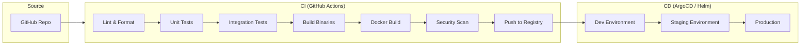
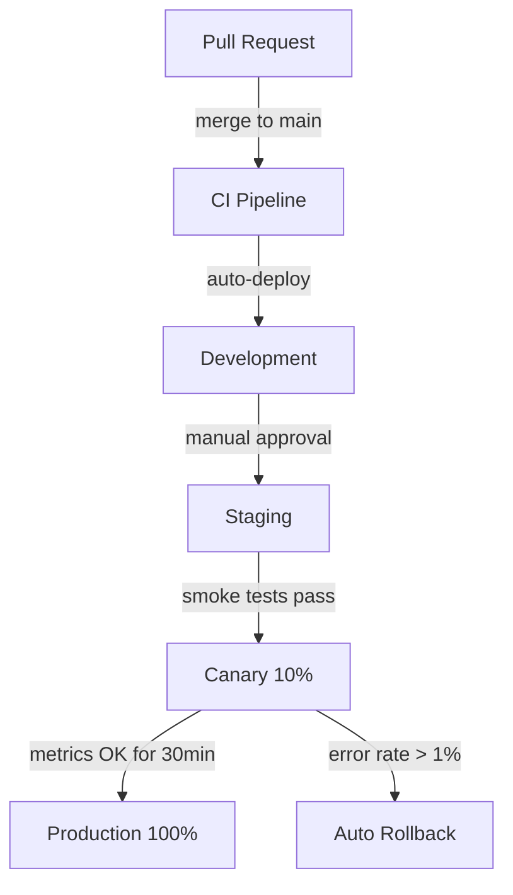
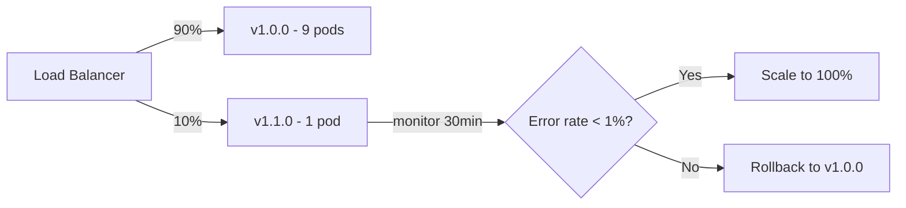
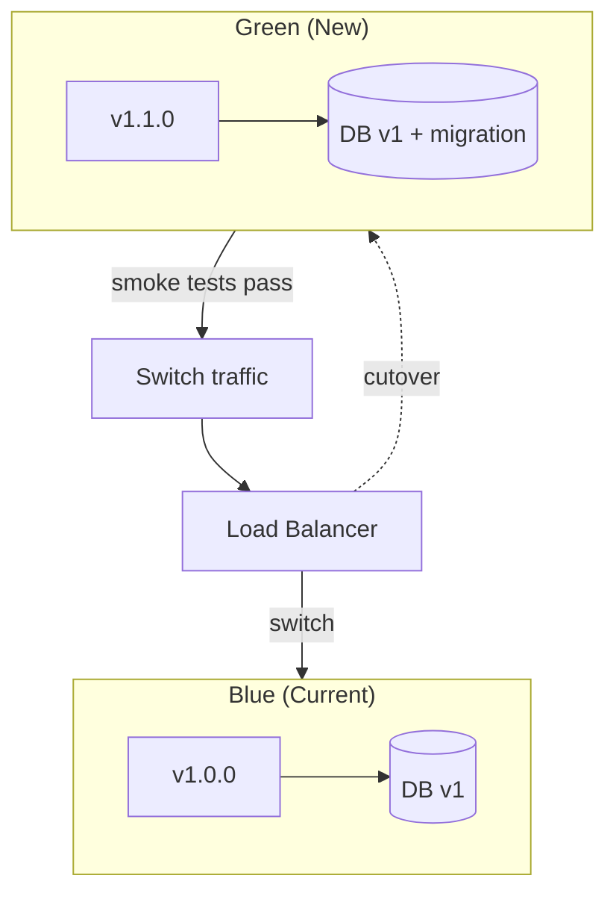

# ERP-HCM Deployment Pipeline

## CI/CD Configuration and Deployment Strategy

---

## 1. Pipeline Overview

ERP-HCM uses a multi-stage CI/CD pipeline that builds, tests, and deploys 14 microservices and a Next.js frontend. The pipeline enforces quality gates at each stage before promoting artifacts to production.

### 1.1 Pipeline Architecture



### 1.2 Environment Promotion Flow



---

## 2. CI Pipeline Stages

### 2.1 Stage 1: Lint and Format

```yaml
# .github/workflows/ci.yml
name: CI Pipeline

on:
  push:
    branches: [main, release/*]
  pull_request:
    branches: [main]

jobs:
  lint:
    runs-on: ubuntu-latest
    steps:
      - uses: actions/checkout@v4

      - uses: actions/setup-go@v5
        with:
          go-version: '1.24'

      - name: Go vet
        run: go vet ./...
        working-directory: imports/hrms_core

      - name: Go fmt check
        run: |
          gofmt_output=$(gofmt -l .)
          if [ -n "$gofmt_output" ]; then
            echo "Files not formatted:"
            echo "$gofmt_output"
            exit 1
          fi
        working-directory: imports/hrms_core

      - name: golangci-lint
        uses: golangci/golangci-lint-action@v4
        with:
          version: latest
          working-directory: imports/hrms_core

      - name: Frontend lint
        run: |
          npm ci
          npm run lint
          npm run type-check
        working-directory: imports/hrms_core/web/frontend
```

### 2.2 Stage 2: Unit Tests

```yaml
  test:
    runs-on: ubuntu-latest
    needs: lint
    steps:
      - uses: actions/checkout@v4

      - uses: actions/setup-go@v5
        with:
          go-version: '1.24'

      - name: Run Go unit tests
        run: |
          go test -v -race -coverprofile=coverage.out \
            ./internal/payroll/engine/nigeria/... \
            ./internal/attendance/domain/... \
            ./internal/employee/domain/... \
            ./internal/security/encryption/...
        working-directory: imports/hrms_core

      - name: Check coverage threshold
        run: |
          COVERAGE=$(go tool cover -func=coverage.out | grep total | awk '{print $3}' | sed 's/%//')
          echo "Total coverage: ${COVERAGE}%"
          if (( $(echo "$COVERAGE < 70" | bc -l) )); then
            echo "Coverage below 70% threshold"
            exit 1
          fi
        working-directory: imports/hrms_core

      - name: Upload coverage
        uses: codecov/codecov-action@v4
        with:
          file: imports/hrms_core/coverage.out

      - name: Frontend unit tests
        run: |
          npm ci
          npm test -- --coverage --watchAll=false
        working-directory: imports/hrms_core/web/frontend
```

### 2.3 Stage 3: Integration Tests

```yaml
  integration-test:
    runs-on: ubuntu-latest
    needs: test
    services:
      postgres:
        image: postgres:16-alpine
        env:
          POSTGRES_USER: peopleforce
          POSTGRES_PASSWORD: testpass
          POSTGRES_DB: peopleforce_test
        ports:
          - 5432:5432
        options: >-
          --health-cmd pg_isready
          --health-interval 10s
          --health-timeout 5s
          --health-retries 5

      redis:
        image: redis:7-alpine
        ports:
          - 6379:6379

      nats:
        image: nats:2.10-alpine
        ports:
          - 4222:4222
        options: >-
          --entrypoint nats-server -- --jetstream

    steps:
      - uses: actions/checkout@v4

      - uses: actions/setup-go@v5
        with:
          go-version: '1.24'

      - name: Run migrations
        run: |
          for f in imports/hrms_core/migrations/core/*.up.sql; do
            psql -h localhost -U peopleforce -d peopleforce_test -f "$f"
          done
          for f in imports/hrms_core/migrations/employee/*.up.sql; do
            psql -h localhost -U peopleforce -d peopleforce_test -f "$f"
          done
          for f in imports/hrms_core/migrations/payroll/*.up.sql; do
            psql -h localhost -U peopleforce -d peopleforce_test -f "$f"
          done
        env:
          PGPASSWORD: testpass

      - name: Run integration tests
        run: |
          go test -v -tags=integration \
            ./internal/payroll/repository/... \
            ./internal/employee/repository/...
        working-directory: imports/hrms_core
        env:
          PF_DATABASE_HOST: localhost
          PF_DATABASE_PORT: 5432
          PF_DATABASE_USER: peopleforce
          PF_DATABASE_PASSWORD: testpass
          PF_DATABASE_DATABASE: peopleforce_test
          PF_REDIS_HOST: localhost
          PF_REDIS_PORT: 6379
          PF_NATS_URL: nats://localhost:4222
```

### 2.4 Stage 4: Build and Docker

```yaml
  build:
    runs-on: ubuntu-latest
    needs: integration-test
    strategy:
      matrix:
        service:
          - employee-service
          - payroll-service
          - leave-service
          - recruitment-service
          - performance-service
          - time-attendance-service
          - benefits-service
          - learning-service
          - compensation-service
          - workforce-planning-service
          - compliance-service
          - document-service
          - facilities-service
          - facilities-management

    steps:
      - uses: actions/checkout@v4

      - name: Set up Docker Buildx
        uses: docker/setup-buildx-action@v3

      - name: Login to container registry
        uses: docker/login-action@v3
        with:
          registry: ghcr.io
          username: ${{ github.actor }}
          password: ${{ secrets.GITHUB_TOKEN }}

      - name: Build and push
        uses: docker/build-push-action@v5
        with:
          context: services/${{ matrix.service }}
          push: true
          tags: |
            ghcr.io/${{ github.repository }}/${{ matrix.service }}:${{ github.sha }}
            ghcr.io/${{ github.repository }}/${{ matrix.service }}:latest
          cache-from: type=gha
          cache-to: type=gha,mode=max

  build-gateway:
    runs-on: ubuntu-latest
    needs: integration-test
    steps:
      - uses: actions/checkout@v4

      - name: Build gateway
        uses: docker/build-push-action@v5
        with:
          context: .
          file: Dockerfile
          push: true
          tags: |
            ghcr.io/${{ github.repository }}/gateway:${{ github.sha }}
            ghcr.io/${{ github.repository }}/gateway:latest

  build-frontend:
    runs-on: ubuntu-latest
    needs: integration-test
    steps:
      - uses: actions/checkout@v4

      - name: Build frontend
        uses: docker/build-push-action@v5
        with:
          context: imports/hrms_core/web/frontend
          push: true
          tags: |
            ghcr.io/${{ github.repository }}/frontend:${{ github.sha }}
            ghcr.io/${{ github.repository }}/frontend:latest
          build-args: |
            NEXT_PUBLIC_API_URL=${{ vars.API_URL }}
```

### 2.5 Stage 5: Security Scan

```yaml
  security-scan:
    runs-on: ubuntu-latest
    needs: build
    steps:
      - name: Trivy vulnerability scan
        uses: aquasecurity/trivy-action@master
        with:
          image-ref: ghcr.io/${{ github.repository }}/gateway:${{ github.sha }}
          format: 'sarif'
          output: 'trivy-results.sarif'
          severity: 'CRITICAL,HIGH'

      - name: Upload scan results
        uses: github/codeql-action/upload-sarif@v3
        with:
          sarif_file: 'trivy-results.sarif'

      - name: Go vulnerability check
        run: |
          go install golang.org/x/vuln/cmd/govulncheck@latest
          govulncheck ./...
        working-directory: imports/hrms_core
```

---

## 3. Docker Build Strategy

### 3.1 Multi-Stage Dockerfile

Based on the actual Dockerfile in the repository:

```dockerfile
# Stage 1: Build
FROM golang:1.22-alpine AS builder

RUN apk add --no-cache git ca-certificates tzdata

WORKDIR /app

COPY go.mod go.sum ./
RUN go mod download

COPY . .
RUN CGO_ENABLED=0 GOOS=linux GOARCH=amd64 \
    go build -ldflags="-s -w -X main.version=${VERSION}" \
    -o /app/server ./main.go

# Stage 2: Runtime
FROM alpine:3.20

RUN apk add --no-cache ca-certificates tzdata
RUN adduser -D -g '' appuser

COPY --from=builder /app/server /usr/local/bin/server

USER appuser
EXPOSE 8080

HEALTHCHECK --interval=30s --timeout=3s --retries=3 \
  CMD wget -qO- http://localhost:8080/healthz || exit 1

ENTRYPOINT ["server"]
```

### 3.2 Image Size Targets

| Image | Target Size | Actual |
|-------|-----------|--------|
| Gateway | < 25 MB | ~18 MB |
| Service (each) | < 20 MB | ~15 MB |
| Frontend | < 100 MB | ~85 MB |

---

## 4. CD Pipeline

### 4.1 Helm Chart Structure

```
helm/erp-hcm/
  Chart.yaml
  values.yaml
  values-dev.yaml
  values-staging.yaml
  values-production.yaml
  templates/
    deployment.yaml
    service.yaml
    ingress.yaml
    configmap.yaml
    secrets.yaml
    hpa.yaml
```

### 4.2 Kubernetes Deployment

```yaml
# templates/deployment.yaml (simplified)
apiVersion: apps/v1
kind: Deployment
metadata:
  name: {{ .Values.service.name }}
  labels:
    app: erp-hcm
    service: {{ .Values.service.name }}
spec:
  replicas: {{ .Values.service.replicas }}
  strategy:
    type: RollingUpdate
    rollingUpdate:
      maxSurge: 25%
      maxUnavailable: 0
  template:
    spec:
      containers:
        - name: {{ .Values.service.name }}
          image: "{{ .Values.image.repository }}:{{ .Values.image.tag }}"
          ports:
            - containerPort: 8080
          env:
            - name: PF_DATABASE_HOST
              valueFrom:
                secretKeyRef:
                  name: erp-hcm-db
                  key: host
            - name: PF_DATABASE_PASSWORD
              valueFrom:
                secretKeyRef:
                  name: erp-hcm-db
                  key: password
          livenessProbe:
            httpGet:
              path: /healthz
              port: 8080
            initialDelaySeconds: 10
            periodSeconds: 30
          readinessProbe:
            httpGet:
              path: /healthz
              port: 8080
            initialDelaySeconds: 5
            periodSeconds: 10
          resources:
            requests:
              cpu: 100m
              memory: 128Mi
            limits:
              cpu: 500m
              memory: 512Mi
```

### 4.3 Environment-Specific Values

```yaml
# values-production.yaml
gateway:
  replicas: 3
  resources:
    requests:
      cpu: 250m
      memory: 256Mi
    limits:
      cpu: 1000m
      memory: 1Gi

employeeService:
  replicas: 3

payrollService:
  replicas: 2

leaveService:
  replicas: 2

database:
  maxOpenConns: 100
  maxIdleConns: 25

redis:
  poolSize: 100

autoscaling:
  enabled: true
  minReplicas: 2
  maxReplicas: 10
  targetCPUUtilization: 70
```

---

## 5. Deployment Strategies

### 5.1 Canary Deployment



### 5.2 Blue-Green Deployment (for database migrations)



---

## 6. Rollback Procedures

### 6.1 Application Rollback

```bash
# Kubernetes
kubectl rollout undo deployment/erp-hcm-gateway
kubectl rollout undo deployment/erp-hcm-employee-service

# Or to specific revision
kubectl rollout undo deployment/erp-hcm-gateway --to-revision=3

# Verify
kubectl rollout status deployment/erp-hcm-gateway
```

### 6.2 Database Rollback

```bash
# Run down migration
psql -h $DB_HOST -U peopleforce -d peopleforce \
  -f imports/hrms_core/migrations/<schema>/<migration>.down.sql

# Or restore from backup
pg_restore -h $DB_HOST -U peopleforce -d peopleforce \
  --clean --if-exists /backups/pre_migration.dump
```

---

## 7. Quality Gates

| Gate | Criteria | Blocking |
|------|----------|----------|
| Lint | Zero Go vet/fmt issues | Yes |
| Type Check | Zero TypeScript errors | Yes |
| Unit Tests | 100% pass, 70%+ coverage | Yes |
| Integration Tests | 100% pass | Yes |
| Security Scan | Zero CRITICAL vulnerabilities | Yes |
| Image Size | < 25 MB per service | No (warning) |
| Performance | p99 < 500ms on staging | Yes for production |
| Approval | Manual approval for production | Yes |

---

## 8. Environment Configuration

| Environment | URL | Deployment | Approval |
|-------------|-----|------------|----------|
| Development | dev.peopleforce.io | Auto on merge to main | None |
| Staging | staging.peopleforce.io | Auto after dev success | None |
| Production | api.peopleforce.io | Manual approval | 2 approvers |
