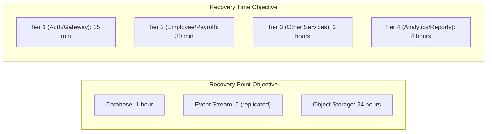
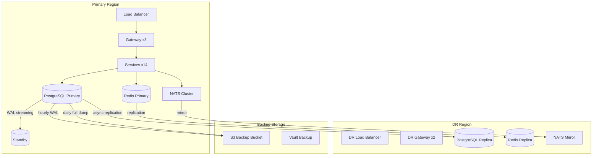
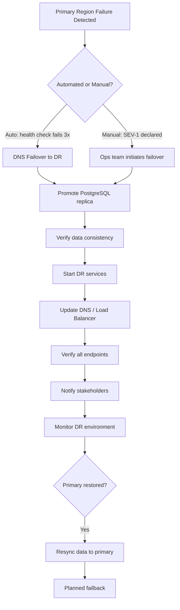

# ERP-HCM Disaster Recovery Plan

## Business Continuity and Disaster Recovery Strategy

---

## 1. Overview

This document defines the disaster recovery (DR) strategy for ERP-HCM, including Recovery Point Objectives (RPO), Recovery Time Objectives (RTO), backup procedures, failover mechanisms, and testing schedules. ERP-HCM processes sensitive employee data and financial transactions (payroll), requiring stringent recovery capabilities.

### 1.1 DR Objectives



---

## 2. Service Tier Classification

| Tier | Services | RTO | RPO | Impact if Down |
|------|----------|-----|-----|----------------|
| 1 - Critical | Gateway, Auth | 15 min | 0 | Complete platform outage |
| 2 - Essential | Employee, Payroll, Leave | 30 min | 1 hour | Core HR operations halted |
| 3 - Important | Attendance, Recruitment, Performance, Benefits | 2 hours | 1 hour | Specific workflows unavailable |
| 4 - Standard | Learning, Compensation, Workforce, Compliance, Docs, Facilities | 4 hours | 24 hours | Non-critical features unavailable |

---

## 3. Infrastructure Components

### 3.1 Component Criticality Matrix

| Component | Criticality | HA Strategy | Backup Strategy |
|-----------|------------|-------------|-----------------|
| PostgreSQL 16 | Critical | Primary-Standby replication | Hourly WAL archiving + Daily full backup |
| Redis 7 | High | Redis Sentinel (3 nodes) | RDB snapshots every 15 min |
| NATS JetStream | High | 3-node cluster | Stream replication (R=3) |
| Object Storage (S3) | Medium | Cross-region replication | Versioning enabled |
| Docker Images | Medium | Multi-registry push | Stored in GHCR + backup registry |
| Encryption Keys (Vault) | Critical | HA Vault cluster (3 nodes) | Encrypted backup + sealed key shards |

### 3.2 Architecture with DR



---

## 4. Backup Procedures

### 4.1 PostgreSQL Backups

**Continuous WAL Archiving** (RPO: near-zero for committed transactions):

```bash
# postgresql.conf
archive_mode = on
archive_command = 'aws s3 cp %p s3://erp-hcm-backups/wal/%f'
wal_level = replica
max_wal_senders = 5
```

**Hourly Base Backup**:

```bash
#!/bin/bash
# /opt/scripts/hourly_backup.sh
TIMESTAMP=$(date +%Y%m%d_%H%M%S)
BACKUP_DIR="/backups/postgresql"
S3_BUCKET="s3://erp-hcm-backups/db"

pg_basebackup -h localhost -U replicator \
  -D "$BACKUP_DIR/$TIMESTAMP" \
  -Ft -z -P --checkpoint=fast

aws s3 cp "$BACKUP_DIR/$TIMESTAMP" "$S3_BUCKET/$TIMESTAMP/" --recursive

# Retain last 72 hours locally
find $BACKUP_DIR -maxdepth 1 -type d -mtime +3 -exec rm -rf {} \;
```

**Daily Logical Backup** (for cross-version restore):

```bash
#!/bin/bash
# /opt/scripts/daily_backup.sh
TIMESTAMP=$(date +%Y%m%d)

pg_dump -h localhost -U peopleforce -d peopleforce \
  -F c --compress=9 \
  -f "/backups/logical/peopleforce_${TIMESTAMP}.dump"

aws s3 cp "/backups/logical/peopleforce_${TIMESTAMP}.dump" \
  "s3://erp-hcm-backups/logical/"

# Retain 30 days
aws s3 ls s3://erp-hcm-backups/logical/ | \
  awk '{print $4}' | sort | head -n -30 | \
  xargs -I {} aws s3 rm "s3://erp-hcm-backups/logical/{}"
```

### 4.2 Redis Backups

```bash
# redis.conf
save 900 1      # After 900 sec if 1 key changed
save 300 10     # After 300 sec if 10 keys changed
save 60 10000   # After 60 sec if 10000 keys changed

dir /var/lib/redis
dbfilename dump.rdb
```

Redis data is treated as cache; full recovery is not required. Session data is reconstructed via JWT refresh.

### 4.3 NATS JetStream Backups

JetStream streams are replicated across 3 nodes with R=3. The `ERP_HCM_EVENTS` stream retains 30 days of events with file-based storage.

```yaml
# Stream configuration
stream:
  name: ERP_HCM_EVENTS
  num_replicas: 3
  storage: file
  max_age: 2592000000000000  # 30 days
```

### 4.4 Encryption Key Backups

```bash
# Vault auto-unseal with AWS KMS
# Backup encrypted Vault data
vault operator raft snapshot save /backups/vault/vault_$(date +%Y%m%d).snap
aws s3 cp /backups/vault/vault_*.snap s3://erp-hcm-backups/vault/
```

---

## 5. Recovery Procedures

### 5.1 PostgreSQL Point-in-Time Recovery (PITR)

```bash
# 1. Stop the failed primary
pg_ctl -D /var/lib/postgresql/16/main stop

# 2. Restore from base backup
rm -rf /var/lib/postgresql/16/main/*
aws s3 cp s3://erp-hcm-backups/db/YYYYMMDD_HHMMSS/ \
  /var/lib/postgresql/16/main/ --recursive
tar -xzf /var/lib/postgresql/16/main/base.tar.gz

# 3. Create recovery.signal for PITR
cat > /var/lib/postgresql/16/main/postgresql.auto.conf << EOF
restore_command = 'aws s3 cp s3://erp-hcm-backups/wal/%f %p'
recovery_target_time = '2026-02-23 14:00:00+00'
recovery_target_action = 'promote'
EOF

touch /var/lib/postgresql/16/main/recovery.signal

# 4. Start PostgreSQL
pg_ctl -D /var/lib/postgresql/16/main start

# 5. Verify recovery
psql -c "SELECT pg_is_in_recovery();"
# Should return 'f' (false) after promotion
```

### 5.2 Full Region Failover



**Step-by-step**:

1. **Detect failure**: Monitoring alerts on primary health checks
2. **Promote DR database**: `pg_ctl promote -D /var/lib/postgresql/16/main`
3. **Start DR services**: `kubectl apply -f k8s/dr-deployment.yaml`
4. **Update DNS**: Route53 health check failover or manual CNAME update
5. **Verify**: Test all /healthz endpoints and critical flows
6. **Communicate**: Notify users of degraded performance

### 5.3 Individual Service Recovery

```bash
# 1. Identify failed service
kubectl get pods -l app=erp-hcm | grep -v Running

# 2. Check logs
kubectl logs -l service=employee-service --tail=100

# 3. Restart
kubectl rollout restart deployment/erp-hcm-employee-service

# 4. If persistent failure, rollback
kubectl rollout undo deployment/erp-hcm-employee-service

# 5. Verify
kubectl rollout status deployment/erp-hcm-employee-service
curl http://employee-service:8080/healthz
```

---

## 6. Data Protection

### 6.1 Sensitive Data Classification

| Classification | Examples | Backup Encryption | Retention |
|---------------|---------|-------------------|-----------|
| Critical | Passwords, RSA keys, Vault tokens | AES-256 + KMS | 7 days |
| Sensitive | Bank accounts, NIN, BVN, TIN, RSA PIN | AES-256-GCM (field-level) | 7 years |
| Internal | Employee names, emails, salaries | AES-256 (backup-level) | 7 years |
| Public | Company name, department names | Standard | 7 years |

### 6.2 Backup Encryption

All backups are encrypted at rest using AWS S3 server-side encryption (SSE-KMS):

```bash
aws s3 cp backup.dump s3://erp-hcm-backups/ \
  --sse aws:kms \
  --sse-kms-key-id "arn:aws:kms:region:account:key/key-id"
```

### 6.3 Backup Retention

| Backup Type | Frequency | Retention |
|-------------|-----------|-----------|
| WAL Archive | Continuous | 7 days |
| Base Backup | Hourly | 72 hours |
| Logical Dump | Daily | 30 days |
| Monthly Backup | Monthly | 1 year |
| Annual Backup | Yearly | 7 years (regulatory) |

---

## 7. Testing Schedule

### 7.1 DR Test Types

| Test Type | Frequency | Duration | Scope |
|-----------|-----------|----------|-------|
| Backup verification | Weekly | 1 hour | Verify backups are restorable |
| Service failover | Monthly | 2 hours | Individual service restart and recovery |
| Database PITR | Quarterly | 4 hours | Full PITR to a test environment |
| Full DR failover | Semi-annually | 8 hours | Complete region failover exercise |
| Chaos engineering | Monthly | 2 hours | Random failure injection |

### 7.2 DR Test Checklist

- [ ] Restore latest backup to test environment
- [ ] Verify all 47 migration files apply cleanly
- [ ] Verify employee data integrity (row counts match)
- [ ] Verify payroll calculations produce consistent results
- [ ] Verify encrypted PII fields decrypt correctly with backup keys
- [ ] Verify authentication works with restored RSA keys
- [ ] Verify NATS event replay produces correct results
- [ ] Measure actual RTO and compare to targets
- [ ] Document any gaps and create remediation plan

---

## 8. Communication Plan

### 8.1 Incident Communication

| Phase | Action | Channel |
|-------|--------|---------|
| Detection | Alert on-call engineer | PagerDuty |
| Assessment (15 min) | Classify severity, assemble team | Slack #incident |
| Communication (30 min) | Status page update | StatusPage |
| Updates | Every 30 min during SEV-1 | StatusPage + Email |
| Resolution | Root cause analysis | Confluence + Email |
| Post-mortem | Blameless review within 48h | Meeting + Doc |

### 8.2 Stakeholder Notification

| Stakeholder | SEV-1 | SEV-2 | SEV-3 |
|------------|-------|-------|-------|
| Engineering | Immediate | 15 min | 2 hours |
| Product | 15 min | 1 hour | Next standup |
| Customer Success | 30 min | 2 hours | 4 hours |
| Customers | 1 hour | As needed | N/A |
| Executive | 1 hour | 4 hours | N/A |

---

## 9. Compliance Requirements

| Regulation | Requirement | Implementation |
|-----------|-------------|----------------|
| NDPR | Data must be recoverable | Hourly backups + PITR |
| GDPR | Right to erasure must be honored in backups | Crypto-shredding via key destruction |
| SOC 2 | Backup testing evidence | Quarterly DR test reports |
| PCI DSS | Encrypted backups for financial data | AES-256 + KMS encryption |
| NDPR | Data residency | Primary and DR in same jurisdiction |

---

## 10. Recovery Runbook Summary

| Scenario | RPO | RTO | Procedure |
|----------|-----|-----|-----------|
| Single service crash | 0 | 5 min | Kubernetes auto-restart |
| Database primary failure | ~0 | 15 min | Promote standby, update connection |
| Redis failure | N/A | 5 min | Restart, cache rebuilds automatically |
| NATS failure | 0 | 10 min | Cluster self-heals (R=3) |
| Encryption key loss | 0 | 30 min | Restore from Vault backup |
| Full region failure | 1 hour | 30-60 min | DR failover procedure |
| Data corruption | 1 hour | 2-4 hours | PITR to pre-corruption point |
| Ransomware | 1 hour | 4-8 hours | Clean restore from isolated backups |
