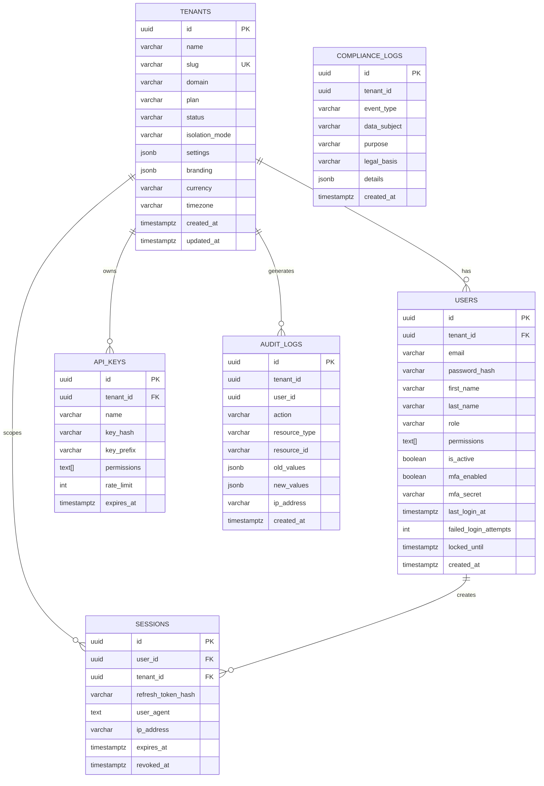
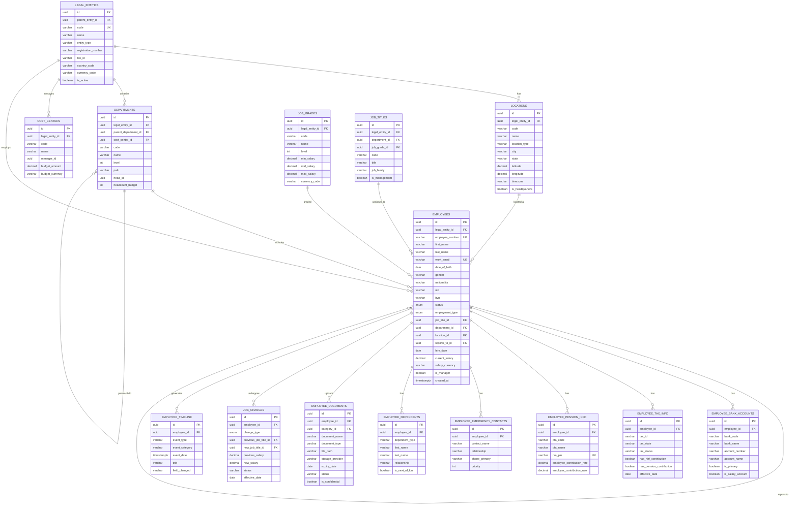
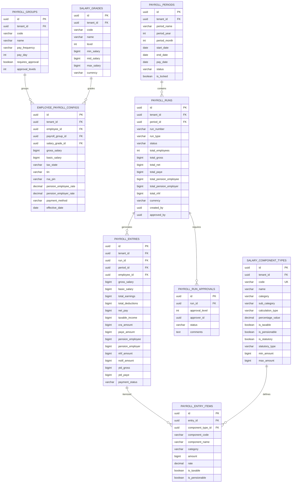
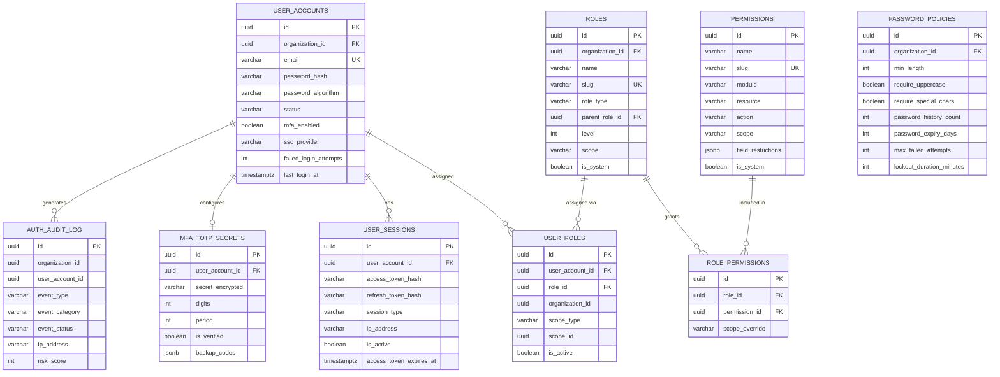
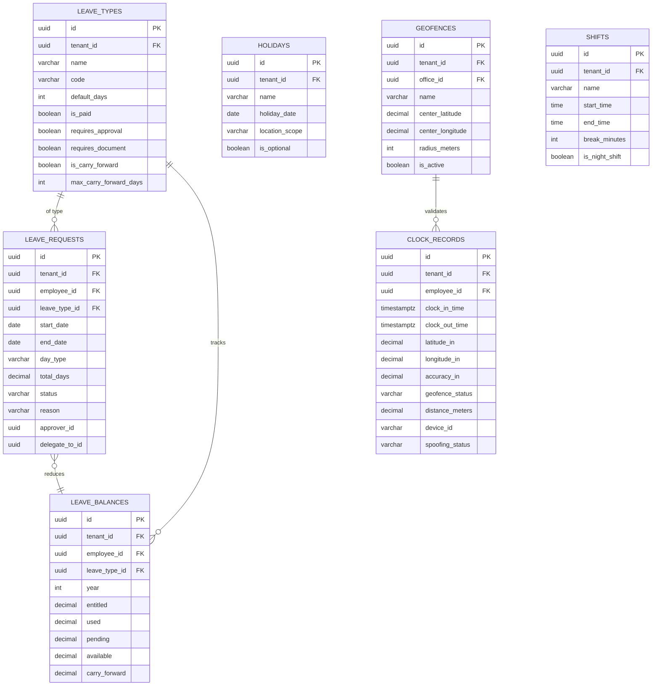
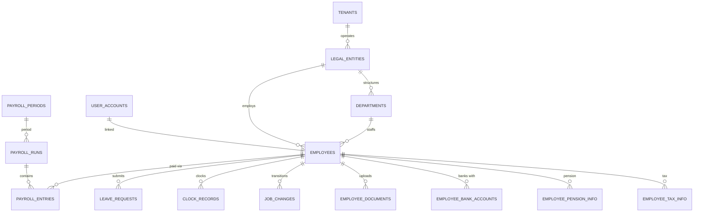

# ERP-HCM Entity-Relationship Diagram

## Database Schema Documentation

---

## 1. Overview

ERP-HCM uses PostgreSQL 16 with schema-per-domain isolation. The database contains 30+ schemas with 47 migration files defining 80+ tables. All tables use UUID primary keys, `TIMESTAMPTZ` for timestamps, and include `tenant_id` for multi-tenancy (shared database, shared schema pattern with the `core` schema; the `employee` schema uses `legal_entity_id` as the scoping column).

### 1.1 Schema Organization

| Schema | Domain | Key Tables |
|--------|--------|------------|
| core | Multi-tenancy, Auth, Audit | tenants, users, sessions, audit_logs |
| employee | Employee Lifecycle | employees, departments, locations, legal_entities |
| payroll | Payroll Engine | payroll_runs, payroll_entries, salary_components |
| leave | Leave Management | leave_requests, leave_balances, leave_types |
| attendance | Time & Attendance | clock_records, geofences, shifts |
| auth | Authentication | user_accounts, roles, permissions, sessions |
| recruitment | ATS | job_requisitions, candidates, applications |
| performance | Performance Mgmt | okr_cycles, objectives, review_cycles, reviews |
| benefits | Benefits & EWA | plans, enrollments, claims, ewa_transactions |
| lms | Learning | courses, modules, enrollments, certificates |
| workforce | Workforce Planning | headcount_plans, scenarios |
| dms | Document Mgmt | documents, signatures |
| communication | Internal Comms | messages, channels |
| analytics | Analytics | dashboards, reports |
| notification | Notifications | templates, delivery_log |

---

## 2. Core Schema ERD



---

## 3. Employee Schema ERD



---

## 4. Payroll Schema ERD



---

## 5. Auth Schema ERD



---

## 6. Leave & Attendance Schema ERD



---

## 7. Cross-Domain Relationships



---

## 8. Database Extensions

| Extension | Purpose |
|-----------|---------|
| uuid-ossp | UUID v4 generation (`uuid_generate_v4()`) |
| pgcrypto | Cryptographic functions (`gen_random_uuid()`) |
| pg_trgm | Trigram-based text search (full-name search) |
| TimescaleDB | Time-series hypertable for attendance data (optional) |

---

## 9. Indexing Strategy

### 9.1 Composite Indexes (Multi-Tenant)

All tables with `tenant_id` have composite indexes:
```sql
CREATE INDEX idx_employees_entity ON employee.employees(legal_entity_id);
CREATE INDEX idx_payroll_entries_employee ON payroll_entries(tenant_id, employee_id);
CREATE INDEX idx_payroll_periods_company ON payroll_periods(tenant_id, company_id);
```

### 9.2 Partial Indexes

```sql
CREATE INDEX idx_employees_active ON employee.employees(status) WHERE status = 'active';
CREATE INDEX idx_employees_deleted ON employee.employees(deleted_at) WHERE deleted_at IS NULL;
CREATE INDEX idx_employee_bank_accounts_primary ON employee.employee_bank_accounts(employee_id, is_primary) WHERE is_primary = true;
```

### 9.3 Full-Text Search Indexes

```sql
CREATE INDEX idx_employees_full_name ON employee.employees USING gin(to_tsvector('english', full_name));
```
