# Product Requirements Document (PRD) - AfriHealth ERP-Healthcare

## Document Control
| Field | Value |
|-------|-------|
| Module | ERP-Healthcare (AfriHealth) |
| Version | 2.0.0 |
| Last Updated | 2026-02-23 |
| Status | Active |
| Owner | Product Engineering |

---

## 1. Executive Summary

AfriHealth is a pan-African, enterprise-grade healthcare platform designed to digitize and optimize the entire spectrum of healthcare delivery across the continent. Built on a microservices architecture with 33 Go backend services, 11 Python AI/ML services, 4 React/TypeScript frontends, and native mobile applications, AfriHealth provides comprehensive electronic health records (EHR), hospital information management (HIMS), revenue cycle management (RCM), laboratory information management (LIMS), pharmacy management, telemedicine, AI-powered diagnostics, and public health surveillance -- all unified under a single multi-tenant platform.

### 1.1 Vision Statement
To become the definitive healthcare technology platform for Africa, replacing fragmented legacy systems with a unified, interoperable, AI-enhanced solution that meets international standards while addressing the unique challenges of African healthcare delivery.

### 1.2 Problem Statement
African healthcare systems face critical challenges:
- **Fragmented records**: Patient data scattered across paper files and disconnected systems
- **Limited access**: Rural populations lack access to specialist care
- **Drug counterfeiting**: Up to 30% of medicines in sub-Saharan Africa are counterfeit
- **Disease surveillance gaps**: Delayed outbreak detection costs lives
- **Revenue leakage**: Hospitals lose 10-25% of revenue due to manual billing processes
- **Mental health crisis**: Less than 1 psychiatrist per 500,000 people in many African countries

---

## 2. Competitive Landscape Analysis

### 2.1 Comparison Matrix: AfriHealth vs Industry Leaders

| Capability | AfriHealth | Epic | Cerner (Oracle Health) | Allscripts | OpenMRS |
|---|---|---|---|---|---|
| **EHR/EMR** | Full FHIR R4 | Gold standard | Strong | Moderate | Basic |
| **Multi-tenant SaaS** | Native | Limited | Partial | No | No |
| **African Market Focus** | Core design | None | Minimal | None | Moderate |
| **AI/ML Integration** | 11 services (TB, sepsis, mental health, voice) | CDS hooks | Basic ML | Limited | None |
| **Blockchain (Consent/Supply)** | Hyperledger Fabric | None | None | None | None |
| **Telemedicine (Built-in)** | Video/Audio/Chat | Third-party | Third-party | Third-party | None |
| **Mobile Money Payments** | Paystack/Flutterwave/M-Pesa | No | No | No | No |
| **Mental Health AI** | MindCare chatbot + voice biomarkers | None | None | None | None |
| **Disease Surveillance** | Real-time + climate-health correlation | Limited | Limited | None | Basic |
| **Offline Capability** | Flutter + native sync | No | No | No | Partial |
| **Deployment Cost** | Low (K8s/cloud-native) | $5M-$500M | $2M-$100M | $500K-$10M | Free (no support) |
| **ICD-10/11 + SNOMED CT** | Full | Full | Full | Partial | Partial |
| **LOINC Integration** | Full | Full | Full | Partial | None |
| **DICOM Support** | Full (imaging AI) | Full | Full | Partial | None |
| **Drug Supply Chain** | Blockchain-verified | None | None | None | None |
| **Multi-language** | EN, FR, SW, YO, HA, AM, ZU | EN | EN | EN | EN, FR |
| **Regulatory Compliance** | HIPAA + GDPR + NDPA + POPIA | HIPAA | HIPAA | HIPAA | None |
| **Population Health** | Built-in analytics + MCH | Module | Module | None | None |
| **IoT Medical Devices** | Real-time ingestion | Limited | Limited | None | None |

### 2.2 Key Differentiators vs Epic
- **Cost**: AfriHealth targets 90% lower total cost of ownership
- **Africa-specific**: Built for low-bandwidth, mobile-first, multi-language African healthcare contexts
- **AI for TB**: EfficientNetB4-based chest X-ray screening (96.8% sensitivity) critical for the continent with the highest TB burden
- **Blockchain drug verification**: Combats counterfeit medicines endemic to African supply chains
- **Climate-health correlation**: AI service linking climate data to disease outbreak prediction

### 2.3 Key Differentiators vs Cerner (Oracle Health)
- **Multi-tenancy**: True SaaS architecture vs. single-instance deployments
- **Mental health AI**: Voice biomarker analysis for depression/anxiety screening with MindCare chatbot
- **Maternal/Child Health (MCH)**: Dedicated service for antenatal care tracking, immunization schedules
- **Mobile money**: Native integration with African payment providers

### 2.4 Key Differentiators vs OpenMRS
- **Enterprise scale**: 33 microservices vs. monolithic Java application
- **AI/ML**: 11 Python AI services vs. no AI capability
- **Full RCM**: Revenue cycle management, billing, claims processing
- **Modern stack**: Go + React + Flutter vs. Java + JSP
- **Event-driven**: Redpanda streaming vs. synchronous processing

---

## 3. Product Architecture Overview

```mermaid
graph TB
    subgraph "Client Layer"
        AD[Admin Dashboard<br/>React/TS]
        PP[Provider Portal<br/>React/TS]
        CC[Call Center Desktop<br/>React/TS]
        HP[HIMS Portal<br/>React/TS]
        MA[Mobile App<br/>Flutter + iOS + Android]
    end

    subgraph "API Gateway Layer"
        GW[API Gateway<br/>Go - Auth/Rate/Route]
    end

    subgraph "Core Clinical Services"
        PS[Patient Service]
        AS[Appointment Service]
        LS[Lab Service]
        PHS[Pharmacy Service]
        TM[Telemedicine Service]
        HS[Hospital Service]
        EHR[EHR Service]
    end

    subgraph "Financial Services"
        PAY[Payment Service]
        HMO[HMO/Insurance Service]
        RCM[RCM Service]
    end

    subgraph "Public Health Services"
        IMM[Immunization Service]
        SUR[Surveillance Service]
        MCH[MCH Service]
        POP[Population Health]
    end

    subgraph "AI/ML Services"
        AID[AI Diagnosis]
        IMG[Imaging AI - TB Detection]
        VMH[Voice Mental Health]
        CAI[Clinical AI - CDSS]
        MHA[Mental Health AI]
        CLH[Climate Health]
        DIS[Disease Prediction]
    end

    subgraph "Platform Services"
        TEN[Tenant Service]
        NOT[Notification Service]
        CB[Chatbot Service]
        FF[Feature Flag]
        ANA[Analytics Service]
        ML[ML Service]
        BLK[Blockchain Service]
        IOT[IoT Service]
        SC[Supply Chain]
        MKT[Marketplace]
        AM[Asset Management]
        HIE[HIE Service]
        ORG[Organization Service]
        CMP[Compliance Service]
        QM[Quality Metrics]
    end

    subgraph "Data Layer"
        PG[(PostgreSQL<br/>8 Domain Schemas)]
        RD[(Redis<br/>Cache)]
        RP[(Redpanda<br/>Event Streaming)]
        ES[(Elasticsearch<br/>Search)]
        HF[(Hyperledger Fabric<br/>Blockchain)]
    end

    AD & PP & CC & HP & MA --> GW
    GW --> PS & AS & LS & PHS & TM & HS & EHR
    GW --> PAY & HMO & RCM
    GW --> IMM & SUR & MCH & POP
    GW --> AID & CAI
    GW --> TEN & NOT & CB & FF & ANA & ML & BLK & IOT & SC & MKT & AM & HIE & ORG & CMP & QM
    PS & AS & LS --> PG
    PS & AS --> RD
    NOT --> RP
    BLK --> HF
    AID & IMG --> PG
```

---

## 4. Core Functional Requirements

### 4.1 Patient Management (FR-PAT)
- **FR-PAT-001**: Register patients with demographics, biometrics (fingerprint hash), national ID, emergency contacts
- **FR-PAT-002**: Full-text search across patient names, MRN, phone, national ID with PostgreSQL tsvector
- **FR-PAT-003**: Track allergies (drug/food/environmental) with severity and reaction history
- **FR-PAT-004**: Manage chronic conditions with ICD-10 coding and status tracking
- **FR-PAT-005**: Multi-tenant patient isolation with tenant_id on every record
- **FR-PAT-006**: Patient merge/deduplication using biometric and demographic matching
- **FR-PAT-007**: FHIR R4 Patient resource export/import
- **FR-PAT-008**: Patient portal self-service (appointment booking, lab results, messaging)

### 4.2 Clinical Documentation (FR-CLN)
- **FR-CLN-001**: SOAP note creation (Subjective, Objective, Assessment, Plan) with full-text search
- **FR-CLN-002**: AI-assisted clinical note generation from provider transcripts
- **FR-CLN-003**: Encounter management (inpatient, outpatient, emergency, virtual, home health)
- **FR-CLN-004**: Diagnosis tracking with ICD-10/ICD-11 coding, severity, clinical status
- **FR-CLN-005**: Medication management with drug interaction checking, allergy cross-reference
- **FR-CLN-006**: Vital signs recording (temperature, BP, HR, RR, SpO2, GCS, pain score)
- **FR-CLN-007**: Care plan management with goals, activities, and patient engagement tracking
- **FR-CLN-008**: Clinical decision support (CDSS) alerts integrated into note workflow

### 4.3 Laboratory Information System (FR-LAB)
- **FR-LAB-001**: Test ordering with LOINC codes, priority levels (stat/urgent/routine/timed)
- **FR-LAB-002**: Specimen tracking from collection through processing to result
- **FR-LAB-003**: Result entry with reference ranges, abnormal flags, critical value alerts
- **FR-LAB-004**: Test panel management (CBC, CMP, BMP, Lipid Panel, etc.)
- **FR-LAB-005**: Equipment calibration tracking and maintenance scheduling
- **FR-LAB-006**: Quality control with Westgard rules
- **FR-LAB-007**: Critical result notification with mandatory read-back confirmation
- **FR-LAB-008**: Interfacing with laboratory analyzers (LIS integration)

### 4.4 Pharmacy Management (FR-PHR)
- **FR-PHR-001**: Drug catalog with generic/brand names, categories, contraindications
- **FR-PHR-002**: Inventory management with batch tracking, expiry alerts, reorder points
- **FR-PHR-003**: Prescription creation with dosage, duration, substitutability flags
- **FR-PHR-004**: Dispensing workflow with pharmacist verification, patient identification
- **FR-PHR-005**: Blockchain-based drug authentication (Hyperledger Fabric)
- **FR-PHR-006**: Controlled substance tracking and DEA compliance
- **FR-PHR-007**: Drug-drug interaction checking at order and dispense time
- **FR-PHR-008**: Formulary management with insurance-specific formularies

### 4.5 Telemedicine (FR-TEL)
- **FR-TEL-001**: Video, audio, and chat consultation modalities
- **FR-TEL-002**: Provider availability and scheduling with slot duration management
- **FR-TEL-003**: Real-time vital signs capture during virtual visits
- **FR-TEL-004**: In-session prescribing with e-prescribing to pharmacies
- **FR-TEL-005**: Session recording with consent management
- **FR-TEL-006**: Patient satisfaction rating (1-5 stars) and feedback
- **FR-TEL-007**: WebRTC-based video with unique room IDs and session tokens
- **FR-TEL-008**: Waiting room management with queue position updates

### 4.6 Insurance/HMO Management (FR-HMO)
- **FR-HMO-001**: Insurance provider management (HMO, PPO, government, private)
- **FR-HMO-002**: Plan creation with coverage limits, deductibles, copayments, coinsurance
- **FR-HMO-003**: Patient enrollment with policy numbers, group numbers, member types
- **FR-HMO-004**: Real-time eligibility verification (pre-auth, eligibility, claim types)
- **FR-HMO-005**: Claims submission with ICD-10 diagnosis and CPT procedure coding
- **FR-HMO-006**: Claims adjudication with approval, rejection, partial payment workflows
- **FR-HMO-007**: Provider network management (in-network/out-of-network)
- **FR-HMO-008**: Utilization tracking with remaining balance calculations

### 4.7 Revenue Cycle Management (FR-RCM)
- **FR-RCM-001**: Patient account management with aging buckets (0-30, 31-60, 61-90, 91+)
- **FR-RCM-002**: Charge capture with automatic CPT/HCPCS code suggestions
- **FR-RCM-003**: Bill generation with line items (consultation, procedure, drug, test, bed)
- **FR-RCM-004**: Multi-provider payment support (Paystack, Flutterwave, Stripe, mobile money, cash)
- **FR-RCM-005**: Electronic claims submission with clearinghouse integration
- **FR-RCM-006**: Payment plan management and financial assistance programs
- **FR-RCM-007**: Refund processing with audit trail
- **FR-RCM-008**: Revenue analytics and reporting dashboards

### 4.8 AI/ML Services (FR-AI)
- **FR-AI-001**: TB detection from chest X-rays (EfficientNetB4, target 96.8% sensitivity)
- **FR-AI-002**: Sepsis early warning with SOFA/qSOFA scoring and ML prediction
- **FR-AI-003**: Drug interaction prediction using AI-powered safety analysis
- **FR-AI-004**: Differential diagnosis generation from symptoms and clinical context
- **FR-AI-005**: Clinical note generation from ambient voice transcripts
- **FR-AI-006**: Voice biomarker analysis for depression/anxiety screening
- **FR-AI-007**: Climate-health correlation for disease outbreak prediction
- **FR-AI-008**: Mental health chatbot (MindCare) with PHQ-9, GAD-7 assessments

### 4.9 Public Health (FR-PH)
- **FR-PH-001**: Immunization tracking with CVX codes, series management, registry reporting
- **FR-PH-002**: Disease surveillance with real-time case reporting
- **FR-PH-003**: Maternal/child health tracking (antenatal visits, growth monitoring)
- **FR-PH-004**: Population health analytics with risk stratification
- **FR-PH-005**: Infection surveillance (CLABSI, CAUTI, SSI, VAP, CDI tracking)
- **FR-PH-006**: Outbreak detection and response coordination

### 4.10 Hospital Operations (FR-HOS)
- **FR-HOS-001**: Facility management (hospitals, clinics, diagnostic centers)
- **FR-HOS-002**: Department and ward management with bed tracking
- **FR-HOS-003**: Staff management with roles, specializations, licensing
- **FR-HOS-004**: Medical asset management (equipment, maintenance, calibration)
- **FR-HOS-005**: Bed management (admission, discharge, transfer - ADT)
- **FR-HOS-006**: Operating room scheduling
- **FR-HOS-007**: Quality metrics tracking with benchmarking

---

## 5. Non-Functional Requirements

### 5.1 Performance
- API response time: < 200ms (p95) for clinical operations
- Search latency: < 500ms for patient lookup across 10M+ records
- Concurrent users: 50,000+ simultaneous users per tenant
- Event throughput: 100,000+ events/second via Redpanda

### 5.2 Scalability
- Horizontal scaling of all 33 microservices independently
- Database sharding strategy for multi-million patient records
- CDN-backed static assets for global mobile app distribution

### 5.3 Availability
- 99.95% uptime SLA for critical clinical services
- Active-active multi-region deployment (AWS Africa - Cape Town, Lagos)
- Automated failover with < 30 second recovery time

### 5.4 Security & Compliance
- HIPAA, GDPR, NDPA (Nigeria), POPIA (South Africa) compliant
- AES-256 encryption at rest, TLS 1.3 in transit
- Role-based access control (RBAC) with attribute-based extensions
- Complete audit logging of all PHI access
- Blockchain-backed consent management

### 5.5 Interoperability
- HL7 FHIR R4 API for all clinical data exchange
- ICD-10/ICD-11 diagnosis coding
- SNOMED CT clinical terminology
- LOINC laboratory observation codes
- DICOM medical imaging standard
- CPT/HCPCS procedure coding

---

## 6. Technology Stack

| Layer | Technology |
|-------|-----------|
| Backend Services | Go 1.22, Gin Framework, GORM |
| AI/ML Services | Python 3.11, FastAPI, TensorFlow, PyTorch, Transformers |
| Frontend | React 18, TypeScript, Vite, Material UI |
| Mobile | Flutter (cross-platform), Swift (iOS), Kotlin (Android) |
| Database | PostgreSQL 16 (8 domain schemas) |
| Cache | Redis 7 |
| Event Streaming | Redpanda v24.2 (Kafka-compatible) |
| Search | Elasticsearch 8.14 |
| Blockchain | Hyperledger Fabric (consent + drug supply chain) |
| Infrastructure | Kubernetes, Terraform, ArgoCD |
| Monitoring | Prometheus, Grafana, ELK Stack |
| CI/CD | GitHub Actions, ArgoCD |

---

## 7. Success Metrics

| Metric | Target | Measurement |
|--------|--------|-------------|
| Patient registration time | < 2 minutes | Time from start to complete |
| Lab result turnaround | 40% reduction | Specimen collection to result availability |
| Claims processing time | < 24 hours | Submission to adjudication |
| Provider adoption | 80% daily active | Weekly active / total registered |
| TB screening throughput | 500 X-rays/day/site | AI processing pipeline |
| Mental health reach | 100,000 users/year | MindCare chatbot unique users |
| Revenue leakage reduction | 15% improvement | Captured charges vs. expected |
| System uptime | 99.95% | Monthly availability metric |

---

## 8. Release Roadmap

### Phase 1: Foundation (Q1-Q2 2026)
- Core EHR, Patient, Appointment, Lab, Pharmacy services
- Admin Dashboard and Provider Portal
- PostgreSQL schema deployment (8 domains)
- Basic AI diagnosis service

### Phase 2: Financial & Insurance (Q3 2026)
- HMO/Insurance service with claims processing
- Revenue Cycle Management
- Payment integration (Paystack, Flutterwave)
- Call Center Desktop application

### Phase 3: AI & Public Health (Q4 2026)
- TB Detection AI deployment
- Mental Health AI (MindCare) launch
- Disease surveillance and immunization tracking
- MCH and population health services

### Phase 4: Enterprise (Q1-Q2 2027)
- Blockchain consent and drug verification
- IoT medical device integration
- Health Information Exchange (HIE)
- Marketplace for healthcare services
- Full HIMS portal deployment

---

## 9. Stakeholders

| Role | Responsibility |
|------|---------------|
| Chief Medical Officer | Clinical requirements validation |
| VP Engineering | Technical architecture decisions |
| Head of Product | Feature prioritization and roadmap |
| Compliance Officer | Regulatory adherence (HIPAA, GDPR, NDPA, POPIA) |
| Country Managers | Localization and market-specific requirements |
| Hospital IT Directors | Integration and deployment planning |

---

## 10. Risks and Mitigations

| Risk | Impact | Probability | Mitigation |
|------|--------|-------------|-----------|
| Regulatory fragmentation across 54 African countries | High | High | Modular compliance engine with country-specific rule sets |
| Low internet bandwidth in rural areas | High | High | Offline-first mobile app with intelligent sync |
| AI model bias due to underrepresentation in training data | High | Medium | Africa-specific training datasets, continuous validation |
| Blockchain performance at scale | Medium | Medium | Off-chain processing with on-chain verification |
| Talent acquisition for specialized roles | Medium | High | Remote-first engineering, university partnerships |
