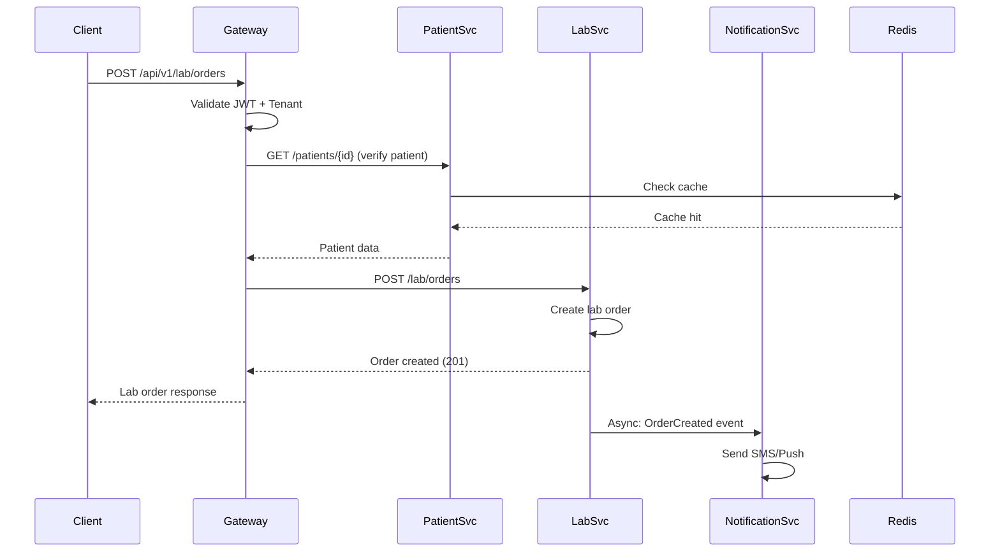
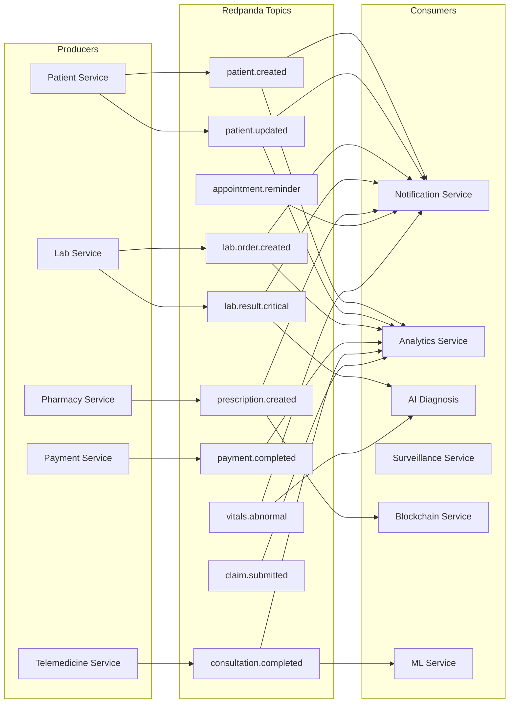
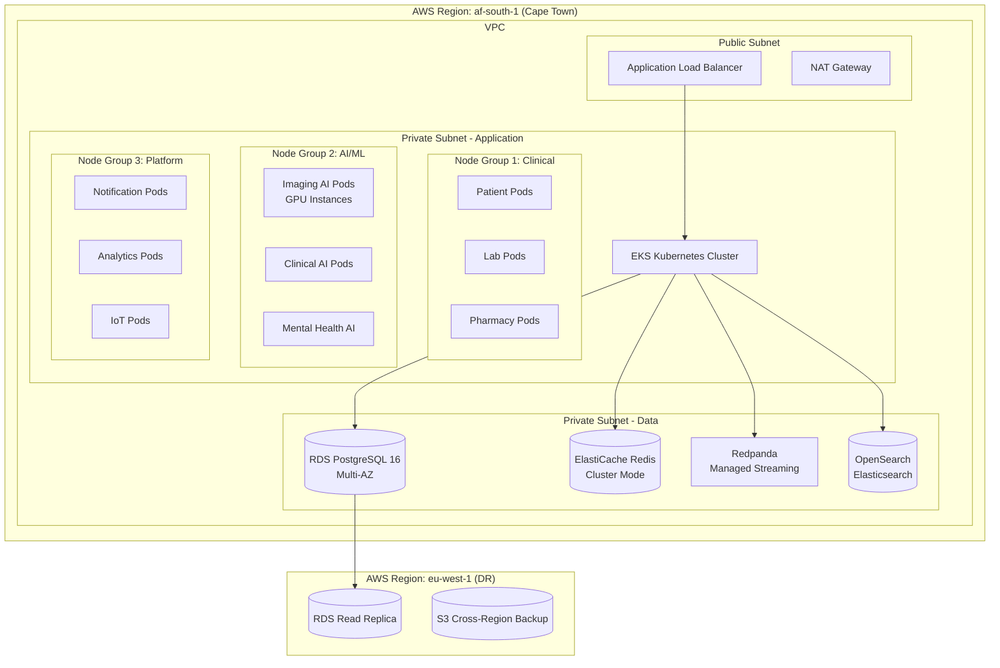

# System Architecture Document - AfriHealth ERP-Healthcare

## 1. Architecture Overview

AfriHealth employs a distributed microservices architecture following domain-driven design principles. The system is decomposed into 33 Go microservices, 11 Python AI/ML services, 4 React/TypeScript frontends, and native mobile applications, all orchestrated via Kubernetes and interconnected through Redpanda event streaming.

### 1.1 Architecture Principles
- **Domain isolation**: Each bounded context owns its data and business logic
- **Event-driven**: Asynchronous communication via Redpanda for loose coupling
- **API-first**: RESTful APIs with FHIR R4 compliance for clinical data
- **Multi-tenant**: Tenant isolation at every layer (API, service, database)
- **Security-by-design**: Zero-trust networking, encryption everywhere, audit everything

---

## 2. High-Level System Architecture

```mermaid
graph TB
    subgraph "Edge Layer"
        CDN[CloudFront CDN]
        WAF[AWS WAF]
        LB[Application Load Balancer]
    end

    subgraph "Frontend Applications"
        FE1[Admin Dashboard<br/>React/TS - Vite]
        FE2[Provider Portal<br/>React/TS - Vite]
        FE3[Call Center Desktop<br/>React/TS - Vite]
        FE4[HIMS Portal<br/>React/TS - Vite]
        FE5[Patient Mobile<br/>Flutter + Native]
    end

    subgraph "API Gateway"
        GW[Gateway Service<br/>Go - Port 8090]
        AUTH[Auth Middleware<br/>JWT + RBAC]
        RL[Rate Limiter<br/>Redis-backed]
        TEN[Tenant Resolver<br/>X-Tenant-ID Header]
    end

    subgraph "Clinical Domain"
        PS[Patient Service]
        EHR[EHR Service]
        APT[Appointment Service]
        LAB[Lab Service]
        PHR[Pharmacy Service]
        TEL[Telemedicine Service]
        HSP[Hospital Service]
    end

    subgraph "Financial Domain"
        PAY[Payment Service<br/>Paystack/Flutterwave]
        HMO[HMO/Insurance Service]
        RCM[RCM Service]
    end

    subgraph "Public Health Domain"
        IMM[Immunization Service]
        SRV[Surveillance Service]
        MCH[MCH Service]
        POP[Population Health]
    end

    subgraph "AI/ML Domain"
        AID[AI Diagnosis<br/>Go]
        AIV[AI Voice<br/>Go]
        IMG[Imaging AI<br/>Python - TB Detection]
        VMH[Voice Mental Health<br/>Python]
        CAI[Clinical AI<br/>Python - FastAPI]
        MHA[Mental Health AI<br/>Python]
        CLH[Climate Health<br/>Python]
        DPR[Disease Prediction<br/>Python]
        API[AI API Gateway<br/>Python]
        MDL[ML Models<br/>Python]
        MIC[Medical Image Classifier<br/>Python]
    end

    subgraph "Platform Domain"
        TNT[Tenant Service]
        NOT[Notification Service]
        CHT[Chatbot Service]
        FFG[Feature Flag Service]
        ANA[Analytics Service]
        MLS[ML Service]
        BLK[Blockchain Service]
        IOT[IoT Service]
        SCM[Supply Chain Service]
        MKT[Marketplace Service]
        ASM[Asset Management]
        HIE[HIE Service]
        ORG[Organization Service]
        CMP[Compliance Service]
        QMT[Quality Metrics]
        CC[Call Center Service]
    end

    subgraph "Data Layer"
        PG[(PostgreSQL 16<br/>8 Schemas)]
        RD[(Redis 7<br/>Cache + Sessions)]
        RP[Redpanda<br/>Event Streaming]
        ES[(Elasticsearch 8.14<br/>Full-Text Search)]
        TS[(TimescaleDB<br/>IoT Time Series)]
        HF[(Hyperledger Fabric<br/>Blockchain)]
    end

    subgraph "Infrastructure"
        K8S[Kubernetes Cluster]
        TF[Terraform IaC]
        ARGO[ArgoCD GitOps]
        PROM[Prometheus + Grafana]
        VAULT[HashiCorp Vault]
    end

    CDN --> WAF --> LB
    FE1 & FE2 & FE3 & FE4 & FE5 --> LB
    LB --> GW
    GW --> AUTH --> RL --> TEN

    TEN --> PS & EHR & APT & LAB & PHR & TEL & HSP
    TEN --> PAY & HMO & RCM
    TEN --> IMM & SRV & MCH & POP
    TEN --> AID & AIV
    TEN --> TNT & NOT & CHT & FFG & ANA & MLS & BLK & IOT & SCM & MKT & ASM & HIE & ORG & CMP & QMT & CC

    AID --> IMG & CAI & MHA & CLH
    PS & LAB & PHR --> PG
    PS & APT --> RD
    NOT & ANA --> RP
    PS --> ES
    IOT --> TS
    BLK --> HF

    K8S --> TF
    ARGO --> K8S
```



---

## 3. Service Communication Patterns

### 3.1 Synchronous Communication (REST/gRPC)
Used for real-time clinical operations where immediate response is required.



### 3.2 Asynchronous Communication (Redpanda Events)
Used for decoupled operations, analytics, and cross-service coordination.



---

## 4. Database Architecture

### 4.1 Eight PostgreSQL Domain Schemas

```mermaid
graph TB
    subgraph "PostgreSQL 16 Instance"
        subgraph "Schema 1: Clinical Core"
            S1[patients<br/>encounters<br/>clinical_notes<br/>diagnoses<br/>medications<br/>allergies<br/>immunizations<br/>vital_signs<br/>procedures<br/>care_plans<br/>consents<br/>audit_log]
        end

        subgraph "Schema 2: HIMS"
            S2[organizations<br/>staff_members<br/>org_departments<br/>org_facilities<br/>org_relationships<br/>org_accreditations<br/>data_exchange_agreements<br/>patient_data_consents<br/>patient_referrals]
        end

        subgraph "Schema 3: Financial/RCM"
            S3[patient_accounts<br/>insurance_plans<br/>charges<br/>payments<br/>bills<br/>bill_items<br/>claims<br/>refunds<br/>fee_schedules<br/>payment_plans]
        end

        subgraph "Schema 4: LIMS"
            S4[laboratory_locations<br/>laboratory_departments<br/>test_catalog<br/>test_panels<br/>specimens<br/>lab_results<br/>lab_equipment<br/>quality_controls<br/>reagent_inventory]
        end

        subgraph "Schema 5: HMO/Insurance"
            S5[insurance_plans<br/>enrollments<br/>verifications<br/>claims<br/>providers<br/>provider_networks<br/>benefit_accumulators]
        end

        subgraph "Schema 6: Mental Health"
            S6[mental_health_patients<br/>assessments<br/>crisis_risk<br/>chatbot_conversations<br/>chatbot_messages<br/>therapy_programs<br/>voice_biomarkers<br/>safety_plans<br/>support_groups<br/>psychiatric_medications]
        end

        subgraph "Schema 7: Pharmacy"
            S7[drugs<br/>inventory<br/>prescriptions<br/>prescription_items<br/>dispense_records<br/>formularies<br/>drug_interactions]
        end

        subgraph "Schema 8: Supply Chain & Assets"
            S8[products<br/>purchase_orders<br/>suppliers<br/>stock_movements<br/>medical_assets<br/>maintenance_work_orders<br/>asset_inspections<br/>calibrations<br/>spare_parts<br/>service_contracts]
        end
    end
```



### 4.2 Multi-Tenant Data Isolation

Every table includes a `tenant_id` column with composite indexes. Row-Level Security (RLS) policies enforce tenant isolation at the database level:

```sql
-- Example RLS policy
CREATE POLICY tenant_isolation ON patients
    USING (tenant_id = current_setting('app.current_tenant')::UUID);
```

---

## 5. Infrastructure Architecture



---

## 6. Security Architecture

```mermaid
graph TB
    subgraph "Authentication & Authorization"
        JWT[JWT Token<br/>RS256 Signed]
        RBAC[Role-Based Access Control]
        ABAC[Attribute-Based Access<br/>Tenant + Department + Role]
    end

    subgraph "Data Protection"
        TLS[TLS 1.3 In Transit]
        AES[AES-256 At Rest]
        KMS[AWS KMS<br/>Key Management]
        VAULT[HashiCorp Vault<br/>Secrets Management]
        PHI[PHI Encryption<br/>Field-Level]
    end

    subgraph "Network Security"
        WAF[AWS WAF<br/>OWASP Top 10]
        SG[Security Groups]
        NACL[Network ACLs]
        VPN[Site-to-Site VPN]
    end

    subgraph "Audit & Compliance"
        AUDIT[Audit Log Service<br/>All PHI Access]
        SIEM[SIEM Integration]
        CONSENT[Blockchain Consent<br/>Hyperledger Fabric]
    end

    JWT --> RBAC --> ABAC
    TLS --> AES --> KMS --> VAULT
    WAF --> SG --> NACL
    AUDIT --> SIEM
    CONSENT --> AUDIT
```



---

## 7. Deployment Architecture

All services are containerized and deployed via Kubernetes with ArgoCD GitOps:

```yaml
# Example service deployment pattern
apiVersion: apps/v1
kind: Deployment
metadata:
  name: patient-service
spec:
  replicas: 3
  strategy:
    type: RollingUpdate
    rollingUpdate:
      maxSurge: 1
      maxUnavailable: 0
  template:
    spec:
      containers:
      - name: patient-service
        image: afrihealth/patient-service:v2.0.0
        env:
        - name: DB_HOST
          valueFrom:
            secretKeyRef:
              name: db-credentials
              key: host
        - name: X_TENANT_REQUIRED
          value: "true"
        resources:
          requests:
            memory: "256Mi"
            cpu: "250m"
          limits:
            memory: "512Mi"
            cpu: "500m"
        livenessProbe:
          httpGet:
            path: /health
            port: 8080
        readinessProbe:
          httpGet:
            path: /ready
            port: 8080
```

---

## 8. Service Catalog

| Service | Language | Port | Database | Events (Produces) | Events (Consumes) |
|---------|----------|------|----------|-------------------|-------------------|
| patient-service | Go | 8080 | Clinical | patient.created/updated | - |
| appointment-service | Go | 8080 | Clinical | appointment.* | patient.* |
| lab-service | Go | 8080 | LIMS | lab.order.*, lab.result.* | patient.* |
| pharmacy-service | Go | 8080 | Pharmacy | prescription.*, dispense.* | lab.result.* |
| telemedicine-service | Go | 8080 | Clinical | consultation.* | appointment.* |
| hospital-service | Go | 8080 | HIMS | admission.*, discharge.* | patient.* |
| payment-service | Go | 8080 | Financial | payment.* | bill.created |
| hmo-service | Go | 8080 | HMO | claim.*, enrollment.* | payment.* |
| notification-service | Go | 8080 | Platform | notification.sent | ALL events |
| supply-chain-service | Go | 8080 | Supply Chain | order.*, stock.* | - |
| blockchain-service | Go | 8080 | Hyperledger | consent.*, drug.verified | consent.*, drug.* |
| ai-diagnosis-service | Go | 8080 | Clinical | diagnosis.suggested | vitals.*, lab.result.* |
| imaging-ai | Python | 8000 | - | tb.detection.result | imaging.request |
| clinical-ai | Python | 8000 | - | cdss.alert | medication.ordered |
| mental-health-ai | Python | 8000 | Mental Health | crisis.detected | chat.message |
| tenant-service | Go | 8080 | Platform | tenant.* | - |
| iot-service | Go | 8080 | TimescaleDB | device.reading | - |
