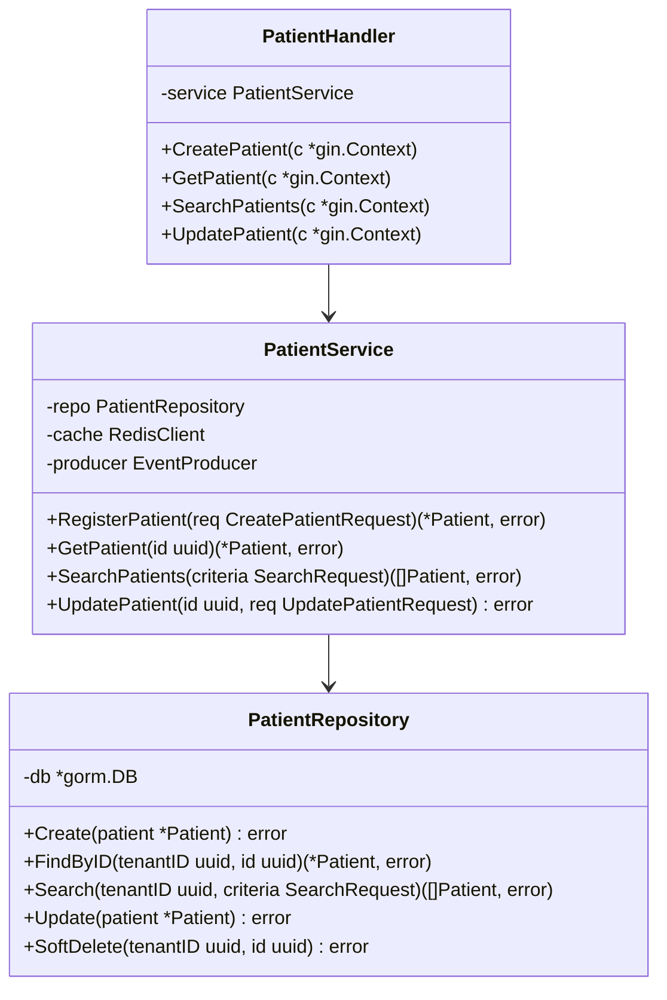
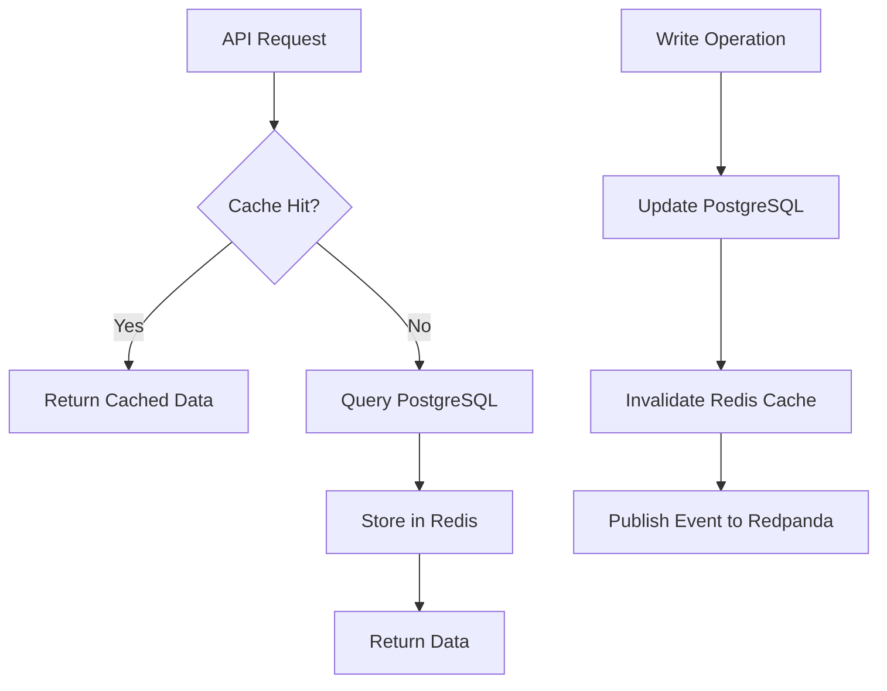
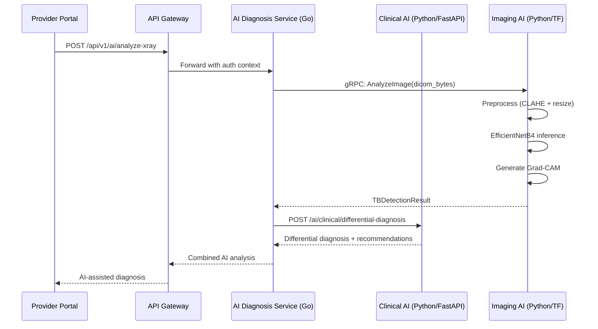
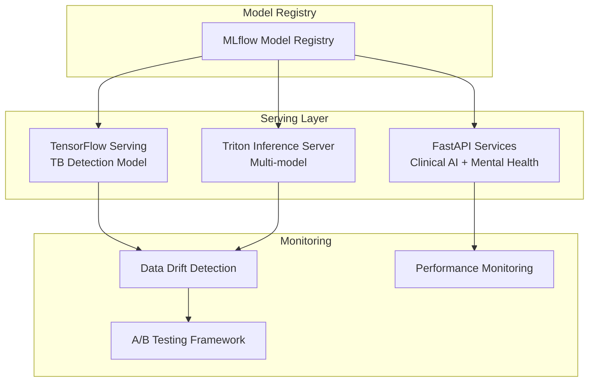
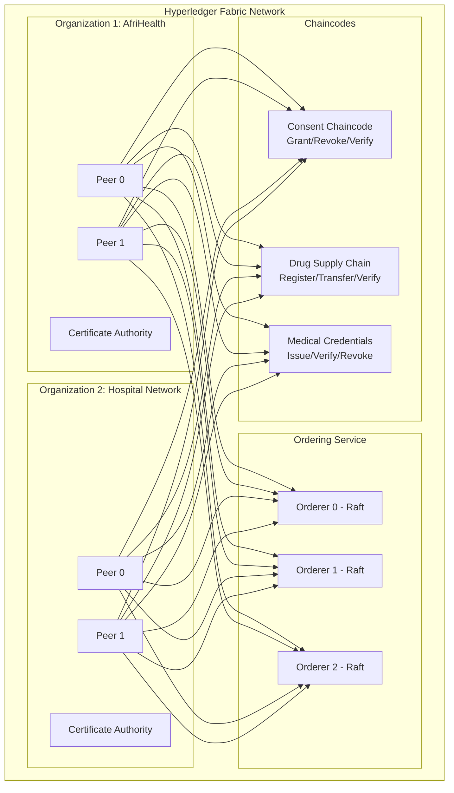
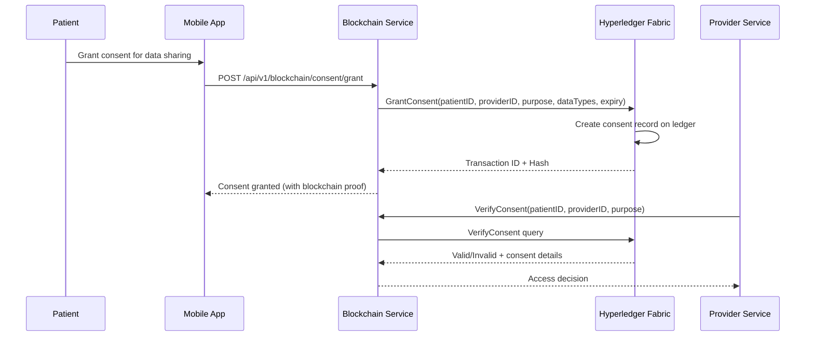
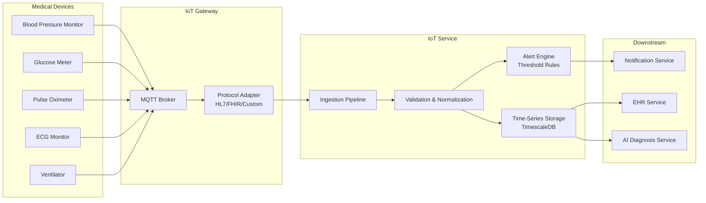
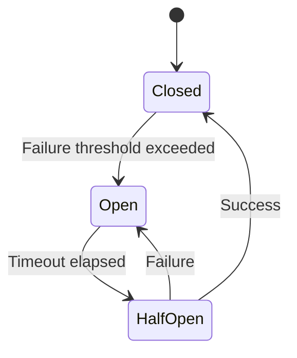
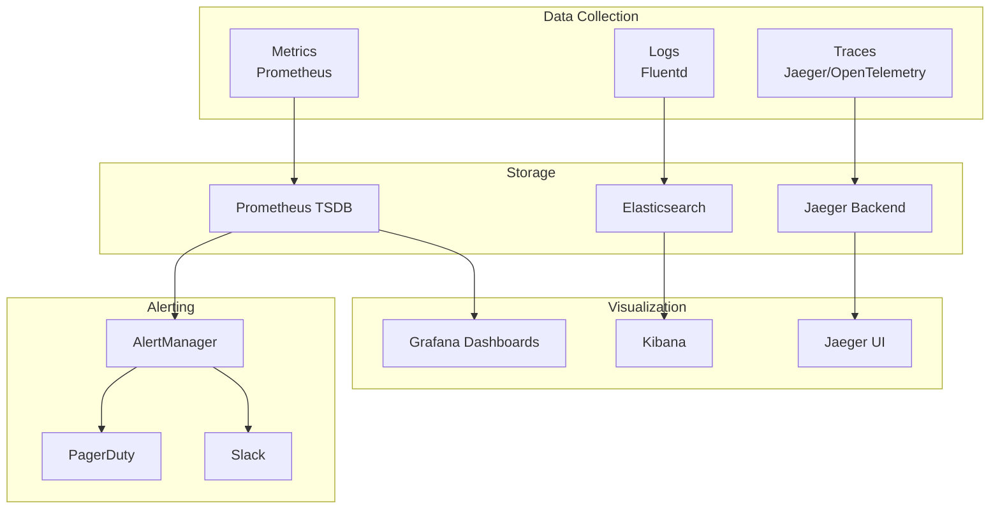

# Technical Design Document - AfriHealth ERP-Healthcare

## 1. Overview

This document details the technical design decisions, patterns, and implementation specifics for the AfriHealth healthcare platform. It covers service design, data modeling patterns, API design conventions, event-driven architecture, and cross-cutting concerns.

---

## 2. Service Design Patterns

### 2.1 Standard Go Microservice Structure

Every Go microservice follows a consistent hexagonal architecture:

```
service-name/
  cmd/
    main.go              # Entry point, dependency injection
  config/
    config.go            # Configuration loading (env vars)
  models/
    <domain>.go          # GORM models + request/response DTOs
  repository/
    <domain>_repository.go  # Database access layer
  service/
    <domain>_service.go     # Business logic
    <domain>_service_test.go
  handlers/
    <domain>_handler.go     # HTTP handlers (Gin)
  events/
    redpanda_consumer.go    # Event consumers
    redpanda_producer.go    # Event producers
  middleware/
    auth.go              # JWT validation
    tenant.go            # Tenant extraction
  tests/
    integration_test.go
  Dockerfile
  main.go               # Simplified entry point
```

### 2.2 Dependency Injection Pattern

```go
func main() {
    // Load configuration
    cfg := config.Load()

    // Initialize database
    db := database.Connect(cfg.DatabaseURL)

    // Initialize Redis
    redis := cache.NewRedisClient(cfg.RedisAddr)

    // Initialize Redpanda producer
    producer := events.NewProducer(cfg.KafkaBrokers)

    // Wire dependencies
    repo := repository.NewPatientRepository(db)
    svc := service.NewPatientService(repo, redis, producer)
    handler := handlers.NewPatientHandler(svc)

    // Setup router
    router := gin.Default()
    handler.RegisterRoutes(router)

    router.Run(fmt.Sprintf(":%s", cfg.Port))
}
```

### 2.3 Multi-Tenant Middleware

```go
func TenantMiddleware() gin.HandlerFunc {
    return func(c *gin.Context) {
        tenantID := c.GetHeader("X-Tenant-ID")
        if tenantID == "" {
            c.AbortWithStatusJSON(400, gin.H{"error": "X-Tenant-ID header required"})
            return
        }

        tenantUUID, err := uuid.Parse(tenantID)
        if err != nil {
            c.AbortWithStatusJSON(400, gin.H{"error": "Invalid tenant ID"})
            return
        }

        c.Set("tenant_id", tenantUUID)
        c.Next()
    }
}
```

---

## 3. Data Access Patterns

### 3.1 Repository Pattern with GORM

All database access is encapsulated in repository structs with tenant-scoped queries:



### 3.2 Caching Strategy



Cache TTL guidelines:
- Patient demographics: 5 minutes
- Lab results: 1 minute (critical data)
- Drug catalog: 1 hour
- Insurance plans: 30 minutes
- Hospital facility data: 15 minutes

---

## 4. Event-Driven Architecture

### 4.1 Event Schema Standard

All events follow a standardized envelope:

```json
{
    "event_id": "uuid-v4",
    "event_type": "patient.created",
    "event_version": "1.0",
    "tenant_id": "uuid-v4",
    "source": "patient-service",
    "timestamp": "2026-02-23T10:30:00Z",
    "correlation_id": "uuid-v4",
    "data": {
        "patient_id": "uuid-v4",
        "first_name": "Amara",
        "last_name": "Okafor"
    },
    "metadata": {
        "user_id": "uuid-v4",
        "ip_address": "10.0.1.50"
    }
}
```

### 4.2 Topic Naming Convention

```
{domain}.{entity}.{action}

Examples:
- clinical.patient.created
- clinical.patient.updated
- clinical.lab.order.created
- clinical.lab.result.critical
- financial.payment.completed
- financial.claim.submitted
- ai.tb.detection.completed
- ai.crisis.detected
- platform.notification.sent
```

### 4.3 Redpanda Consumer Pattern

```go
// Event consumer with dead-letter queue
func (c *Consumer) ProcessEvent(msg *kafka.Message) error {
    var event EventEnvelope
    if err := json.Unmarshal(msg.Value, &event); err != nil {
        return c.sendToDeadLetter(msg, err)
    }

    switch event.EventType {
    case "clinical.lab.result.critical":
        return c.handleCriticalLabResult(event)
    case "clinical.patient.created":
        return c.handlePatientCreated(event)
    default:
        log.Warnf("Unknown event type: %s", event.EventType)
        return nil
    }
}
```

---

## 5. AI/ML Service Integration

### 5.1 AI Service Communication Flow



### 5.2 Model Serving Architecture



---

## 6. Blockchain Integration Design

### 6.1 Hyperledger Fabric Network Topology



### 6.2 Consent Management Flow



---

## 7. IoT Medical Device Integration



---

## 8. Performance Optimization Strategies

### 8.1 Database Optimization
- **Materialized views**: `patient_summary` and `mv_patient_mental_health_summary` for dashboard queries
- **Full-text search**: PostgreSQL tsvector with weighted columns (name = A, MRN = B, phone = C)
- **Partial indexes**: `WHERE is_active = true`, `WHERE status = 'active'`
- **Connection pooling**: PgBouncer with 100 connections per service
- **Read replicas**: For analytics and reporting queries

### 8.2 Application-Level Optimization
- **Redis caching**: Multi-level cache with TTL-based invalidation
- **Batch processing**: Lab results processing in batches of 100
- **Pagination**: Cursor-based pagination for large result sets
- **Compression**: gzip response compression for API responses > 1KB
- **Connection reuse**: HTTP/2 connection multiplexing between services

### 8.3 AI/ML Optimization
- **Model quantization**: INT8 quantization for TB detection model (2x inference speedup)
- **Batch inference**: Process multiple X-rays per GPU batch
- **Model caching**: Keep models warm in GPU memory
- **Async processing**: Non-blocking AI analysis with callback notifications

---

## 9. Error Handling and Resilience

### 9.1 Circuit Breaker Pattern



### 9.2 Retry Strategy
- **API calls**: Exponential backoff (100ms, 200ms, 400ms, max 3 retries)
- **Event processing**: Dead-letter queue after 5 failed attempts
- **Database operations**: Immediate retry once, then fail
- **External payments**: Idempotency keys to prevent duplicate charges

---

## 10. Monitoring and Observability



Key metrics monitored:
- Request latency (p50, p95, p99) per service
- Error rate per endpoint
- Database query duration
- Redpanda consumer lag
- AI model inference time
- Cache hit/miss ratio
- Active WebSocket connections (telemedicine)
