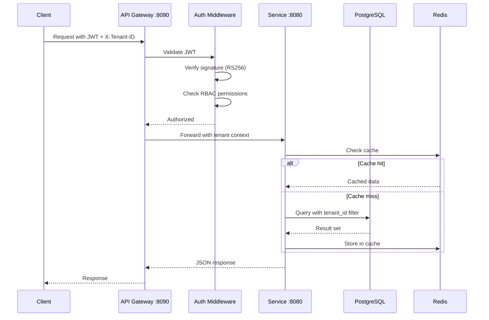

# API Reference - AfriHealth ERP-Healthcare

## 1. API Design Principles

All AfriHealth APIs follow RESTful conventions with FHIR R4 compliance for clinical data endpoints. Every request requires the `X-Tenant-ID` header and a valid JWT `Authorization` bearer token.

### Base URL
```
Production: https://api.afrihealth.com/api/v1
Staging:    https://api-staging.afrihealth.com/api/v1
```

### Common Headers
| Header | Required | Description |
|--------|----------|-------------|
| `Authorization` | Yes | `Bearer <JWT>` |
| `X-Tenant-ID` | Yes | UUID of the tenant organization |
| `Content-Type` | Yes | `application/json` |
| `X-Request-ID` | No | UUID for request tracing |

### Standard Response Envelope
```json
{
    "success": true,
    "data": {},
    "message": "Operation successful",
    "meta": {
        "page": 1,
        "page_size": 20,
        "total": 150,
        "total_pages": 8
    }
}
```

---

## 2. API Flow Architecture



---

## 3. Patient Service API

### 3.1 Create Patient
```
POST /api/v1/patients
```

**Request Body:**
```json
{
    "first_name": "Amara",
    "last_name": "Okafor",
    "middle_name": "Chidinma",
    "date_of_birth": "1990-05-15",
    "gender": "female",
    "phone_number": "+2348012345678",
    "email": "amara.okafor@email.com",
    "national_id": "NGA-12345678",
    "blood_type": "O+",
    "address": {
        "street": "15 Marina Road",
        "city": "Lagos",
        "state": "Lagos",
        "country": "NG",
        "postal_code": "100001"
    },
    "emergency_contact": {
        "name": "Chidi Okafor",
        "relationship": "spouse",
        "phone_number": "+2348098765432"
    }
}
```

**Response (201):**
```json
{
    "success": true,
    "data": {
        "id": "a1b2c3d4-e5f6-7890-abcd-ef1234567890",
        "tenant_id": "t1t2t3t4-...",
        "national_id": "NGA-12345678",
        "first_name": "Amara",
        "last_name": "Okafor",
        "created_at": "2026-02-23T10:00:00Z"
    }
}
```

### 3.2 Search Patients
```
GET /api/v1/patients/search?first_name=Amara&last_name=Okafor&limit=20&offset=0
```

### 3.3 Get Patient by ID
```
GET /api/v1/patients/{patient_id}
```

### 3.4 Update Patient
```
PATCH /api/v1/patients/{patient_id}
```

---

## 4. Appointment Service API

### 4.1 Create Appointment
```
POST /api/v1/appointments
```

**Request Body:**
```json
{
    "patient_id": "uuid",
    "doctor_id": "uuid",
    "appointment_date": "2026-03-15T09:00:00Z",
    "start_time": "2026-03-15T09:00:00Z",
    "duration": 30,
    "type": "consultation",
    "reason": "Follow-up for hypertension management",
    "notes": "Patient requested morning appointment"
}
```

### 4.2 Get Appointment Stats
```
GET /api/v1/appointments/stats?date_from=2026-01-01&date_to=2026-12-31
```

---

## 5. Lab Service API

### 5.1 Order Lab Test
```
POST /api/v1/lab/orders
```
```json
{
    "patient_id": "uuid",
    "doctor_id": "uuid",
    "encounter_id": "uuid",
    "test_codes": ["CBC", "CMP", "HbA1c"],
    "priority": "urgent",
    "specimen_type": "blood",
    "clinical_info": "Diabetic patient for routine monitoring"
}
```

### 5.2 Submit Lab Results
```
POST /api/v1/lab/tests/{test_id}/results
```
```json
{
    "verified_by": "Dr. Abiola Ogunsakin",
    "performed_by": "Lab Tech: Fatima Hassan",
    "results": [
        {
            "parameter_name": "Hemoglobin",
            "parameter_code": "718-7",
            "value": "14.2",
            "unit": "g/dL",
            "reference_range": "12.0-17.5",
            "is_abnormal": false,
            "flag": "N"
        },
        {
            "parameter_name": "White Blood Cell Count",
            "parameter_code": "6690-2",
            "value": "15.8",
            "unit": "10^3/uL",
            "reference_range": "4.5-11.0",
            "is_abnormal": true,
            "is_critical": false,
            "flag": "H"
        }
    ]
}
```

---

## 6. Pharmacy Service API

### 6.1 Create Prescription
```
POST /api/v1/pharmacy/prescriptions
```
```json
{
    "patient_id": "uuid",
    "doctor_id": "uuid",
    "hospital_id": "uuid",
    "diagnosis": "Essential hypertension (I10)",
    "valid_until": "2026-05-23",
    "items": [
        {
            "drug_id": "uuid",
            "dosage": "10mg once daily",
            "quantity": 30,
            "duration": 30,
            "instructions": "Take in the morning with water",
            "substitutable": true
        }
    ]
}
```

### 6.2 Dispense Prescription
```
POST /api/v1/pharmacy/prescriptions/{id}/dispense
```

---

## 7. Telemedicine Service API

### 7.1 Create Consultation
```
POST /api/v1/telemedicine/consultations
```
```json
{
    "patient_id": "uuid",
    "doctor_id": "uuid",
    "consultation_type": "video",
    "scheduled_start_time": "2026-03-15T14:00:00Z",
    "duration": 30,
    "chief_complaint": "Persistent cough for 2 weeks",
    "total_cost": 5000.00
}
```

### 7.2 Join Consultation (WebRTC Session)
```
POST /api/v1/telemedicine/consultations/{id}/join
```

### 7.3 Complete Consultation with Diagnosis
```
POST /api/v1/telemedicine/consultations/{id}/complete
```

---

## 8. HMO/Insurance Service API

### 8.1 Enroll Patient
```
POST /api/v1/hmo/enrollments
```

### 8.2 Verify Insurance
```
POST /api/v1/hmo/verify
```

### 8.3 Submit Claim
```
POST /api/v1/hmo/claims
```

### 8.4 Approve/Reject Claim
```
PUT /api/v1/hmo/claims/{claim_id}/approve
PUT /api/v1/hmo/claims/{claim_id}/reject
```

---

## 9. Payment Service API

### 9.1 Create Payment
```
POST /api/v1/payments
```
```json
{
    "patient_id": "uuid",
    "bill_id": "uuid",
    "amount": 15000.00,
    "currency": "NGN",
    "payment_method": "card",
    "payment_provider": "paystack",
    "description": "Lab test payment"
}
```

### 9.2 Create Bill
```
POST /api/v1/payments/bills
```

---

## 10. AI Services API

### 10.1 Analyze Chest X-Ray for TB
```
POST /api/v1/ai/imaging/tb-detection
Content-Type: multipart/form-data
```

### 10.2 Medication Safety Analysis
```
POST /api/v1/ai/clinical/analyze
```

### 10.3 Sepsis Risk Prediction
```
POST /api/v1/ai/clinical/predict-sepsis
```

### 10.4 Differential Diagnosis
```
POST /api/v1/ai/clinical/differential-diagnosis
```

---

## 11. Notification Service API

### 11.1 Send Notification
```
POST /api/v1/notifications/send
```
```json
{
    "recipient": "+2348012345678",
    "type": "sms",
    "subject": "Appointment Reminder",
    "message": "Your appointment with Dr. Okafor is tomorrow at 9:00 AM",
    "priority": "high"
}
```

### 11.2 Bulk Notification
```
POST /api/v1/notifications/bulk
```

---

## 12. Blockchain Service API

### 12.1 Grant Consent
```
POST /api/v1/blockchain/consent/grant
```

### 12.2 Verify Drug Authenticity
```
POST /api/v1/blockchain/drugs/verify/{drug_id}
```

### 12.3 Issue Medical Credential
```
POST /api/v1/blockchain/credentials/issue
```

---

## 13. Error Codes

| Code | HTTP Status | Description |
|------|-------------|-------------|
| `PATIENT_NOT_FOUND` | 404 | Patient with given ID does not exist |
| `DUPLICATE_MRN` | 409 | Medical record number already exists |
| `INVALID_TENANT` | 400 | Missing or invalid X-Tenant-ID |
| `UNAUTHORIZED` | 401 | Invalid or expired JWT |
| `FORBIDDEN` | 403 | Insufficient RBAC permissions |
| `CONSENT_REQUIRED` | 403 | Patient consent not found on blockchain |
| `INSURANCE_EXPIRED` | 422 | Insurance enrollment has expired |
| `DRUG_COUNTERFEIT` | 422 | Drug verification failed on blockchain |
| `CRITICAL_RESULT` | 200 | Lab result flagged as critical (special handling) |
| `AI_MODEL_ERROR` | 503 | AI model inference failed |
