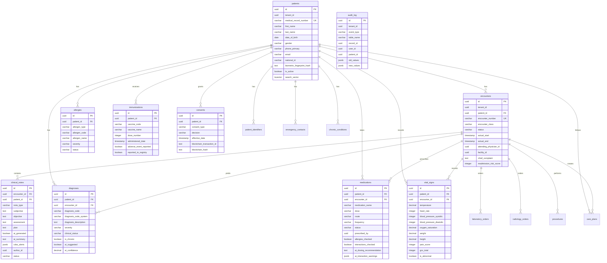
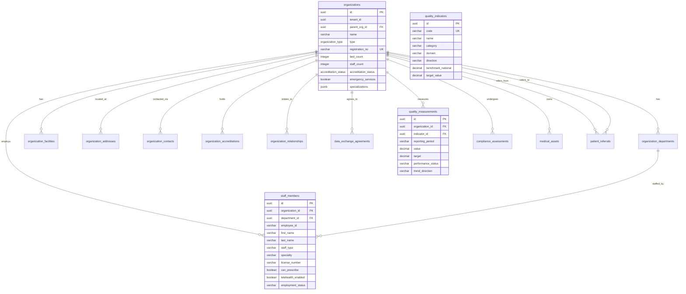
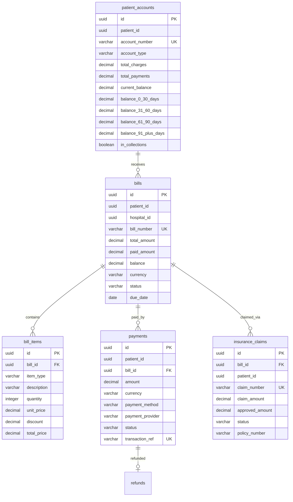
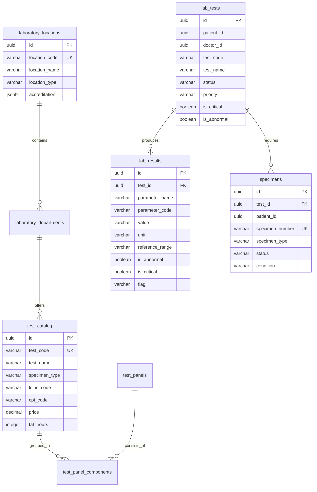
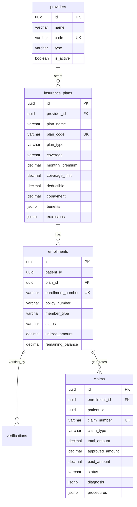
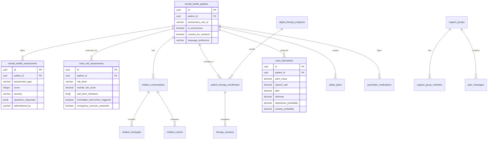
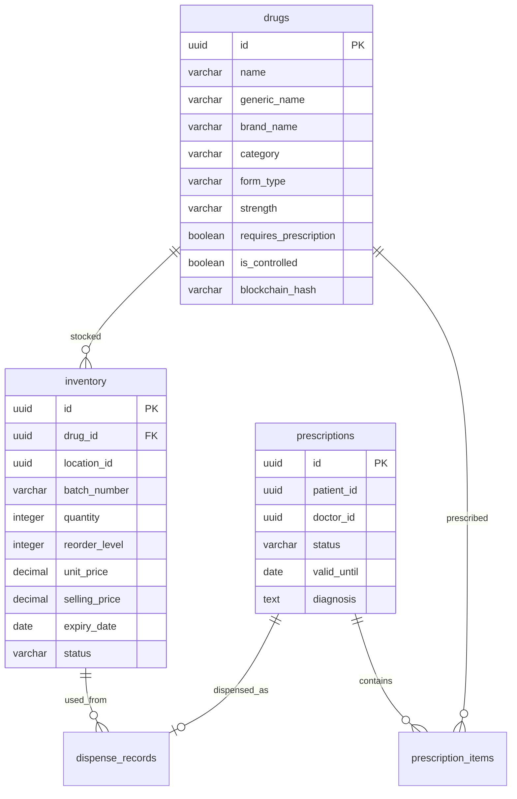
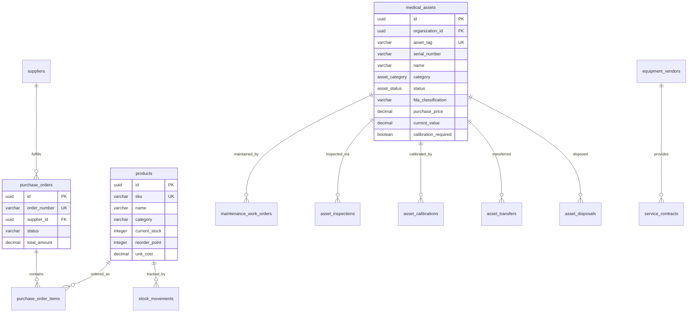
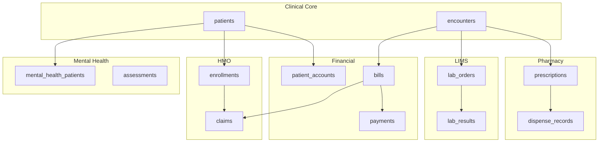

# Entity Relationship Diagram (ERD) - AfriHealth ERP-Healthcare

## 1. Overview

AfriHealth uses 8 PostgreSQL domain schemas containing 100+ tables. This document presents the entity relationships across all domains.

---

## 2. Schema 1: Clinical Core ERD

---

## 3. Schema 2: HIMS ERD

---

## 4. Schema 3: Financial/RCM ERD

---

## 5. Schema 4: LIMS ERD

---

## 6. Schema 5: HMO/Insurance ERD

---

## 7. Schema 6: Mental Health ERD

---

## 8. Schema 7: Pharmacy ERD

---

## 9. Schema 8: Supply Chain and Assets ERD

---

## 10. Cross-Schema Relationships

