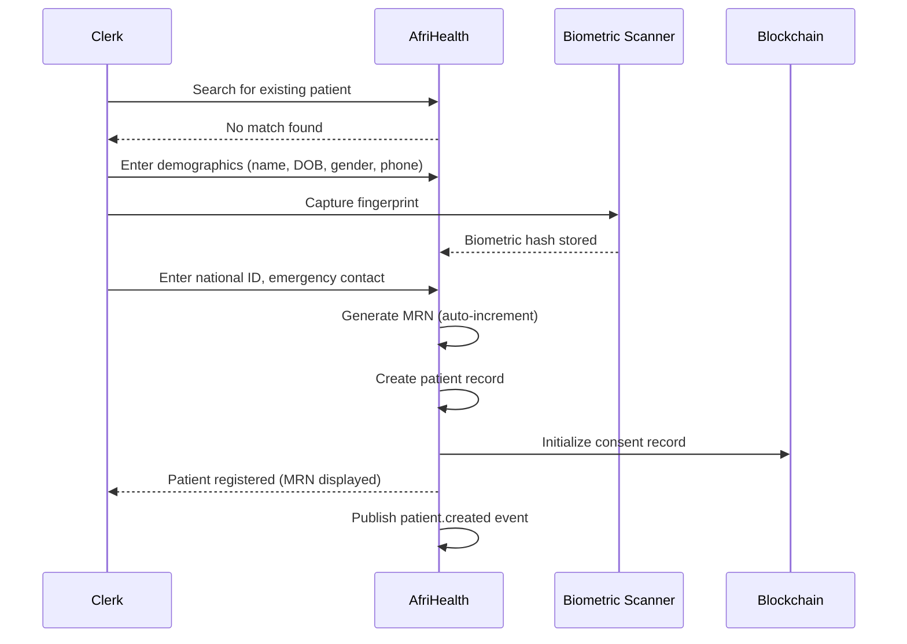
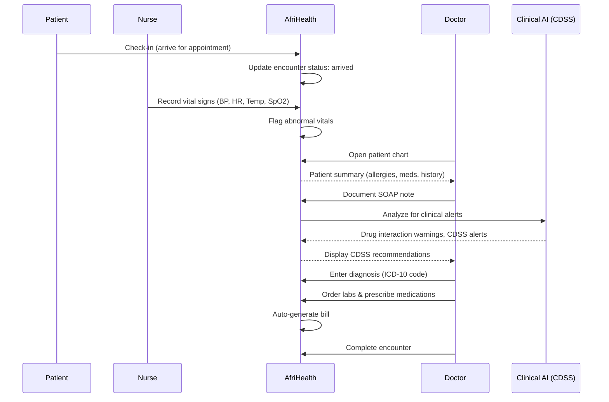
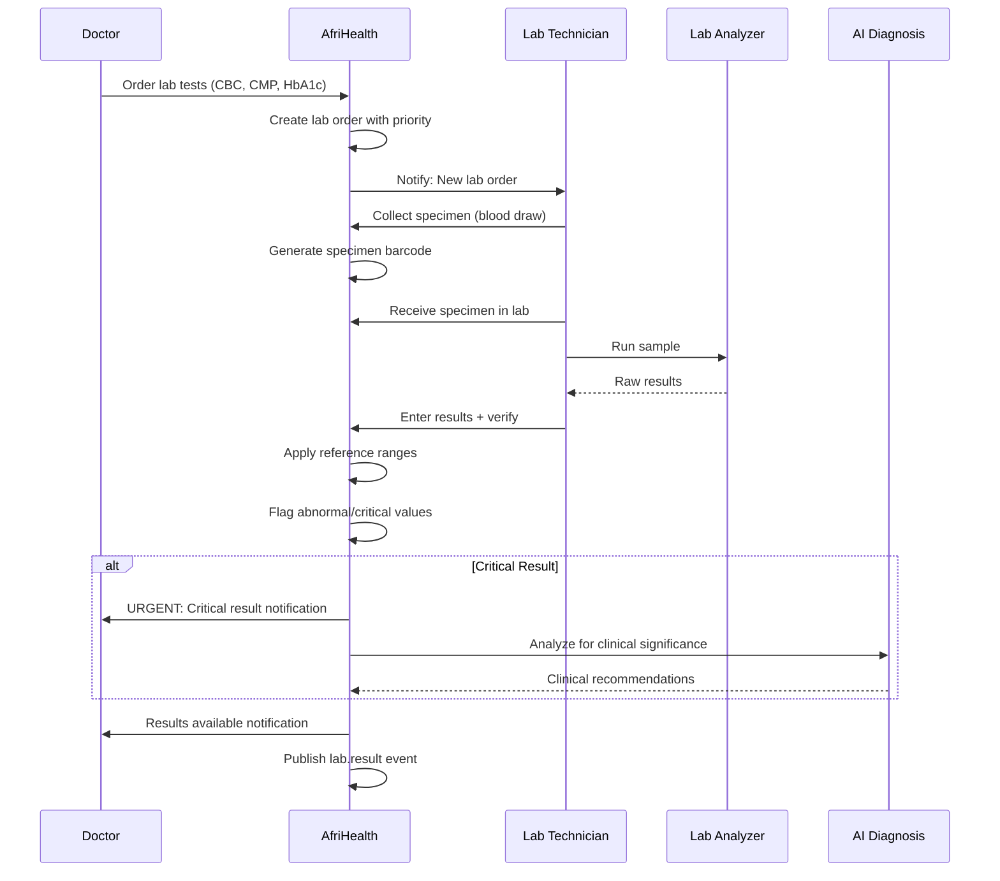
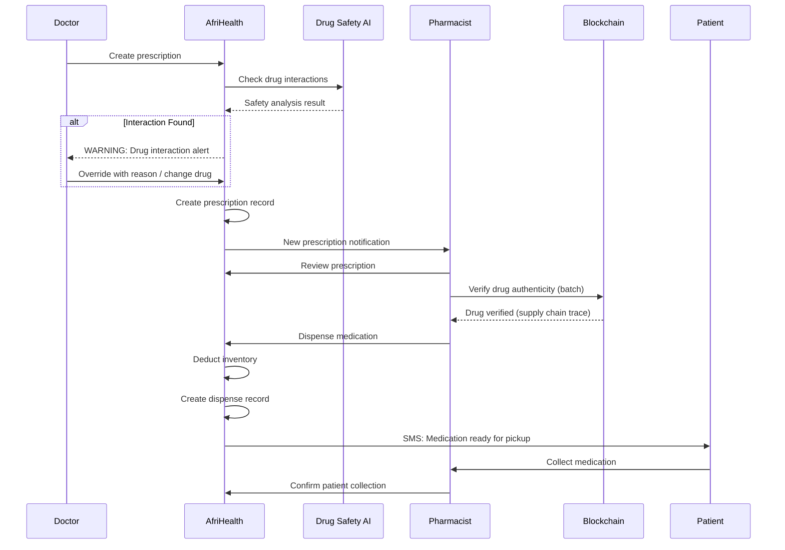
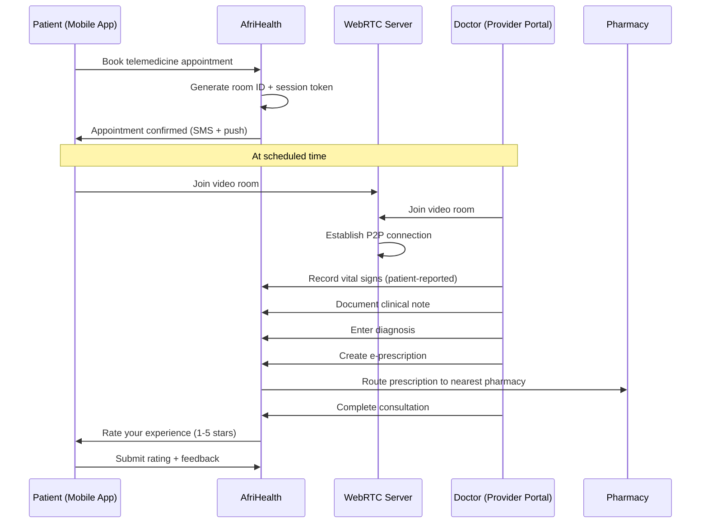
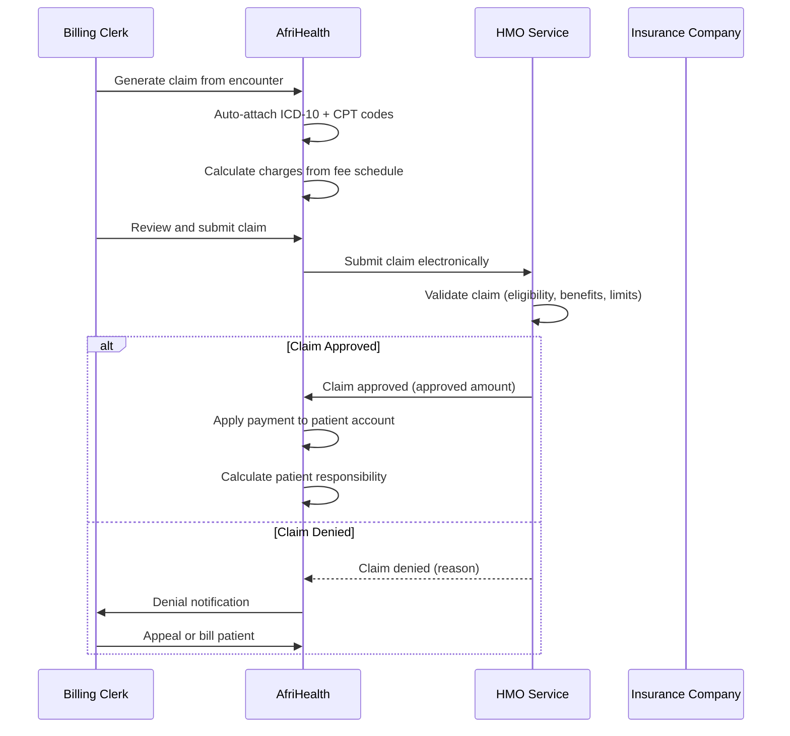
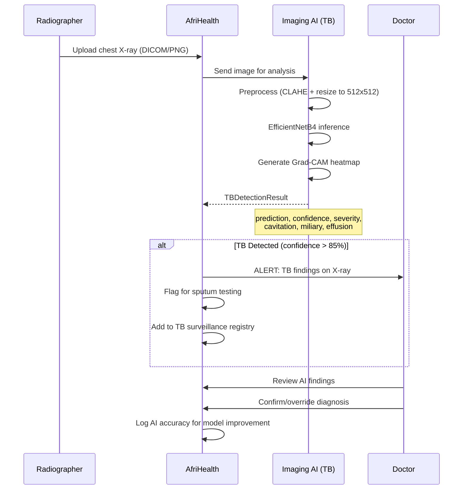
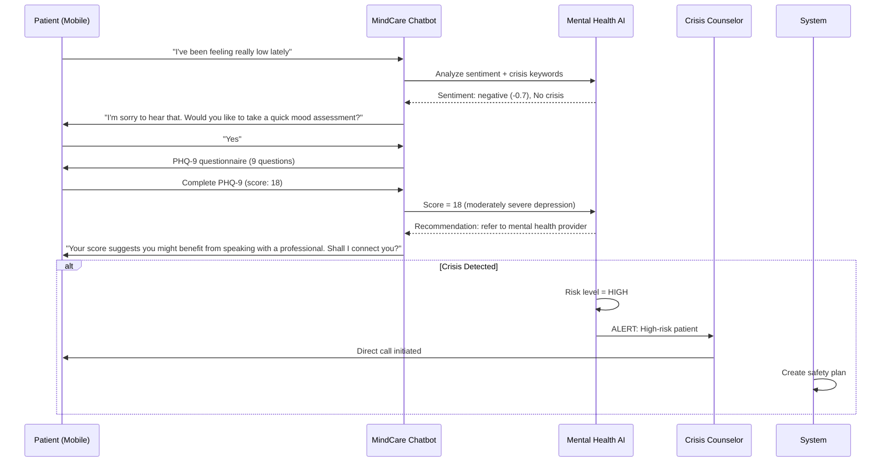

# Use Cases Document - AfriHealth ERP-Healthcare

## 1. Overview

This document defines 30 clinical workflows covering the complete patient journey through the AfriHealth platform. Each use case includes actors, preconditions, flow, and system interactions.

---

## 2. Use Case Diagram

```mermaid
graph TB
    subgraph "Actors"
        PAT[Patient]
        DOC[Doctor/Provider]
        NUR[Nurse]
        LAB[Lab Technician]
        PHR[Pharmacist]
        ADM[Hospital Admin]
        HMO[HMO Officer]
        CC[Call Center Agent]
        PH[Public Health Officer]
    end

    subgraph "Clinical Workflows"
        UC1[UC-01: Patient Registration]
        UC2[UC-02: Outpatient Visit]
        UC3[UC-03: Lab Order & Results]
        UC4[UC-04: Prescription & Dispensing]
        UC5[UC-05: Telemedicine Consultation]
        UC6[UC-06: Emergency Admission]
        UC7[UC-07: Insurance Verification]
        UC8[UC-08: Claims Processing]
        UC9[UC-09: Bill Payment]
        UC10[UC-10: Appointment Scheduling]
    end

    subgraph "AI Workflows"
        UC11[UC-11: AI TB Screening]
        UC12[UC-12: Sepsis Early Warning]
        UC13[UC-13: Drug Safety Check]
        UC14[UC-14: Mental Health Screening]
        UC15[UC-15: AI Clinical Note]
    end

    subgraph "Public Health"
        UC16[UC-16: Immunization Recording]
        UC17[UC-17: Disease Surveillance]
        UC18[UC-18: MCH Antenatal Visit]
        UC19[UC-19: Outbreak Detection]
    end

    subgraph "Operations"
        UC20[UC-20: Bed Management]
        UC21[UC-21: Supply Chain Order]
        UC22[UC-22: Asset Maintenance]
        UC23[UC-23: Staff Scheduling]
        UC24[UC-24: Quality Reporting]
        UC25[UC-25: Compliance Audit]
    end

    PAT --> UC1 & UC5 & UC9 & UC10 & UC14
    DOC --> UC2 & UC3 & UC4 & UC5 & UC11 & UC12 & UC13 & UC15
    NUR --> UC6 & UC16 & UC18 & UC20
    LAB --> UC3
    PHR --> UC4
    ADM --> UC20 & UC21 & UC22 & UC23 & UC24 & UC25
    HMO --> UC7 & UC8
    CC --> UC10
    PH --> UC17 & UC19
```

---

## 3. Detailed Use Cases

### UC-01: Patient Registration

**Actors:** Registration Clerk, Patient
**Preconditions:** Patient arrives at facility for the first time

**Flow:**
1. Clerk searches by name, phone, or national ID to check for duplicates
2. If no match, clerk enters patient demographics
3. Biometric fingerprint is captured and stored as hash
4. System generates unique Medical Record Number (MRN)
5. Patient consents are initialized on blockchain
6. SMS confirmation sent to patient's phone

---

### UC-02: Outpatient Visit (Clinical Encounter)

**Actors:** Patient, Doctor, Nurse

---

### UC-03: Lab Order, Specimen Collection, and Results

**Actors:** Doctor, Lab Technician, Patient

---

### UC-04: Prescription and Pharmacy Dispensing

**Actors:** Doctor, Pharmacist, Patient

---

### UC-05: Telemedicine Video Consultation

**Actors:** Patient, Doctor

---

### UC-06: Emergency Department Admission

**Actors:** Triage Nurse, Emergency Physician, Patient

**Flow:**
1. Patient arrives at ED, triage nurse performs initial assessment
2. System assigns ESI (Emergency Severity Index) level
3. Nurse records vital signs, chief complaint
4. System triggers sepsis screening if criteria met (AI)
5. Emergency physician evaluates and documents
6. Orders placed (labs, imaging, medications)
7. If admission needed, bed management system assigns bed
8. Transfer to inpatient ward with handoff note

---

### UC-07: Insurance Eligibility Verification

**Actors:** Registration Clerk, HMO Officer

**Flow:**
1. Patient presents insurance card at registration
2. Clerk enters policy number in system
3. System sends real-time eligibility check to HMO service
4. HMO service verifies: enrollment active, benefits remaining, pre-auth requirements
5. System displays coverage details (copay, deductible status, covered services)
6. If pre-authorization required, system initiates pre-auth request
7. HMO officer reviews and approves/denies within SLA

---

### UC-08: Insurance Claims Processing

**Actors:** Billing Clerk, HMO Officer

---

### UC-09: Patient Bill Payment

**Actors:** Patient, Cashier

**Flow:**
1. Patient receives bill (consultation + tests + medications)
2. System checks insurance coverage and calculates patient share
3. Patient chooses payment method (card, mobile money, cash, bank transfer)
4. For card/mobile money: System initiates Paystack/Flutterwave transaction
5. Payment provider processes and returns confirmation
6. System records payment, updates bill status
7. Receipt sent via SMS/email
8. If partial payment, remaining balance tracked in aging buckets

---

### UC-10: Appointment Scheduling via Call Center

**Actors:** Call Center Agent, Patient

**Flow:**
1. Patient calls healthcare facility
2. Call center agent searches for patient by phone/name
3. Agent checks doctor availability for requested date/specialty
4. System shows available slots
5. Agent books appointment
6. System sends SMS confirmation with date, time, location
7. System schedules reminder 24 hours before
8. If patient is a no-show, system records and tracks no-show pattern

---

### UC-11: AI-Assisted TB Screening

**Actors:** Radiographer, AI System, Physician

---

### UC-12: Sepsis Early Warning System

**Actors:** Nurse, AI System, Physician

**Flow:**
1. Nurse records vital signs (temp, HR, RR, BP, SpO2)
2. System sends vitals to Clinical AI service
3. AI calculates qSOFA score (3 criteria: RR >= 22, SBP <= 100, altered mental status)
4. AI calculates full SOFA score with available lab values
5. If risk score >= 70: SEPSIS ALERT triggered
6. Notification sent to attending physician (push + SMS)
7. System recommends: blood cultures, lactate, broad-spectrum antibiotics
8. System tracks response time from alert to treatment

---

### UC-13: AI-Powered Drug Safety Analysis

**Actors:** Doctor, AI System

**Flow:**
1. Doctor prescribes medication
2. System sends prescription to Clinical AI safety analyzer
3. AI checks: drug-drug interactions, drug-allergy cross-reactivity, age appropriateness (Beers criteria for elderly), weight-based dosing, disease contraindications
4. Alerts classified by severity (critical, major, warning, info)
5. If critical alerts exist: prescription blocked until override
6. System suggests safer alternatives if issues found
7. Doctor acknowledges alerts and proceeds or modifies

---

### UC-14: Mental Health Chatbot Screening (MindCare)

**Actors:** Patient, AI Chatbot, Crisis Counselor

---

### UC-15: AI-Generated Clinical Note from Ambient Voice

**Actors:** Doctor, AI System

**Flow:**
1. Doctor activates ambient listening during patient encounter
2. System records conversation (with patient consent)
3. AI transcribes audio to text
4. Clinical NLP extracts SOAP components (Subjective, Objective, Assessment, Plan)
5. AI suggests ICD-10 codes from assessment text
6. AI suggests CPT codes from documented procedures
7. Doctor reviews, edits, and signs note
8. System marks note as AI-generated with confidence score

---

### UC-16 through UC-25: Additional Use Cases

**UC-16: Immunization Recording** - Nurse administers vaccine, records CVX code, lot number, site, and reports to national registry.

**UC-17: Disease Surveillance** - System detects unusual disease patterns from encounter data and automatically generates surveillance reports for public health authorities.

**UC-18: MCH Antenatal Visit** - Midwife records gestational age, fundal height, fetal heart rate, blood pressure, urine analysis, and generates risk score.

**UC-19: Outbreak Detection** - Climate health AI correlates weather data with disease incidence to predict potential outbreaks.

**UC-20: Bed Management (ADT)** - Admission: find available bed by ward type, assign patient. Transfer: move between wards. Discharge: release bed, generate discharge summary.

**UC-21: Supply Chain Order** - Inventory drops below reorder point, system auto-generates purchase order to preferred supplier.

**UC-22: Asset Maintenance** - Preventive maintenance schedule triggers work order for medical equipment calibration.

**UC-23: Staff Scheduling** - Department head creates staff schedule considering specializations, certifications, and availability.

**UC-24: Quality Reporting** - System automatically calculates quality indicators (infection rates, readmission rates, mortality) and benchmarks against national standards.

**UC-25: Compliance Audit** - Compliance officer conducts HIPAA/NDPA assessment using system-guided checklist with evidence collection.

---

### UC-26: Health Information Exchange (HIE)

**Flow:**
1. Referring hospital initiates data exchange request
2. System verifies patient consent on blockchain
3. FHIR R4 bundle created with requested data types
4. Data encrypted and transmitted to receiving organization
5. Transaction logged in HIE audit trail
6. Blockchain hash recorded for non-repudiation

### UC-27: Drug Supply Chain Verification

**Flow:**
1. Drug shipment arrives at hospital pharmacy
2. Pharmacist scans drug barcode/QR code
3. System queries blockchain for drug record
4. Complete supply chain history displayed (manufacturer -> distributor -> hospital)
5. If verified: accepted into inventory
6. If counterfeit: alert generated, quarantine procedure initiated

### UC-28: IoT Vital Signs Monitoring

**Flow:**
1. Connected medical device (pulse oximeter, BP monitor) captures reading
2. Device sends data via MQTT to IoT gateway
3. IoT service validates and normalizes data
4. Data stored in TimescaleDB time-series database
5. Alert engine checks against patient-specific thresholds
6. If abnormal: immediate notification to attending nurse/physician

### UC-29: Patient Self-Service Portal

**Flow:**
1. Patient logs into mobile app
2. Views upcoming appointments, lab results, medications
3. Books new appointment with preferred doctor
4. Completes pre-visit questionnaire
5. Views and pays outstanding bills (mobile money)
6. Requests prescription refill
7. Messages care team securely

### UC-30: Multi-Tenant Organization Onboarding

**Flow:**
1. New hospital organization created in tenant service
2. System provisions tenant-specific database schemas
3. Admin users created with RBAC roles
4. Feature flags configured for tenant
5. Organization details entered (facility code, departments, staff)
6. Insurance provider integrations configured
7. Lab test catalog customized
8. System ready for patient registration
