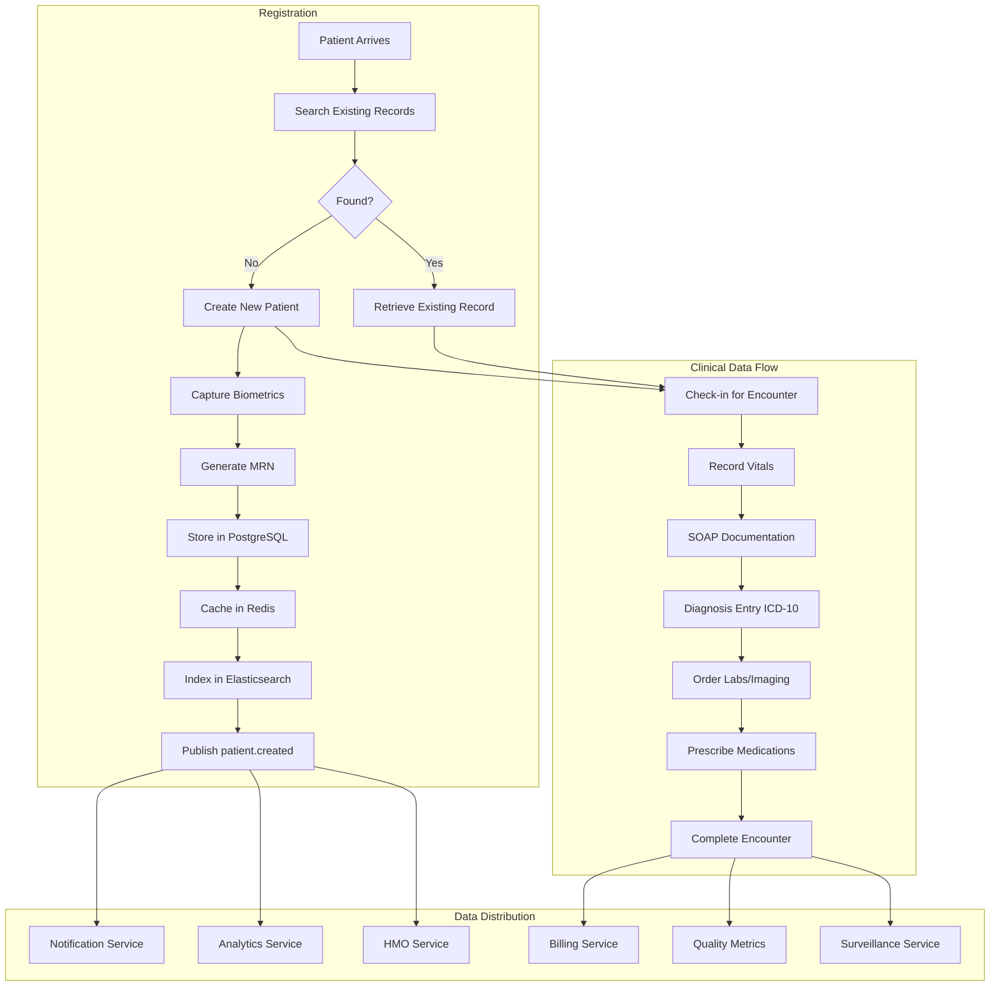
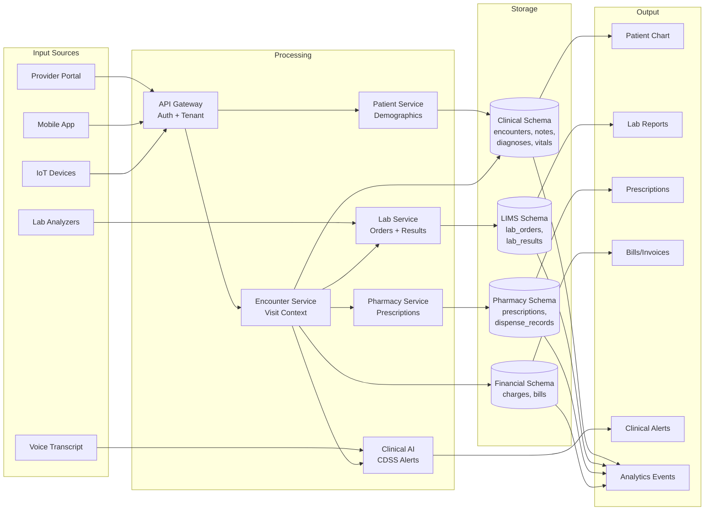
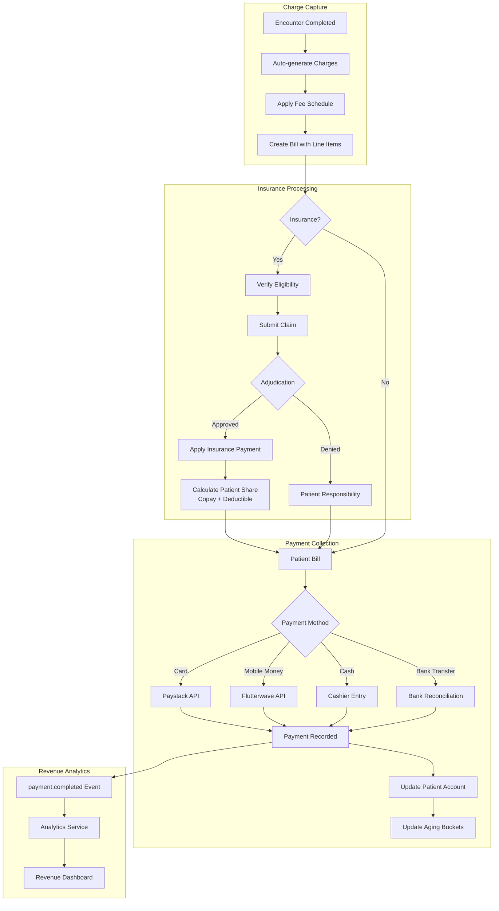
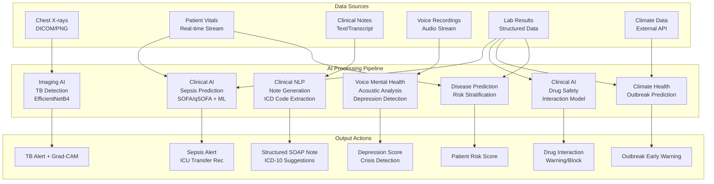
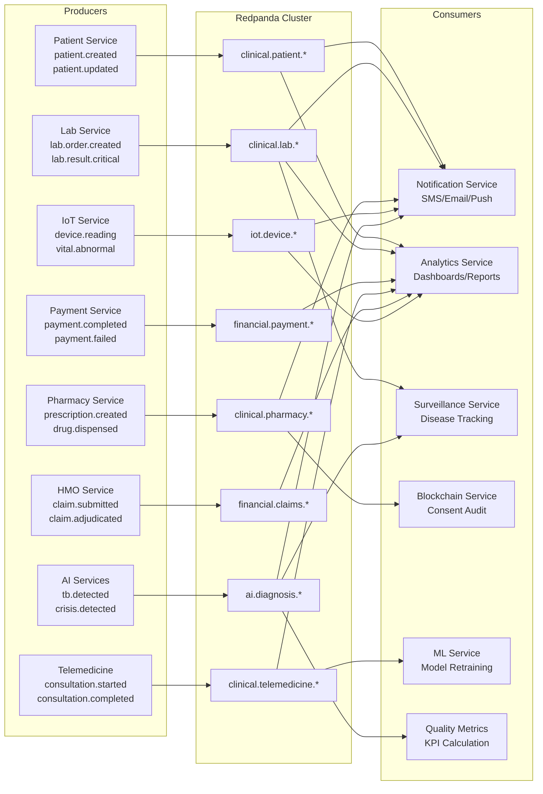
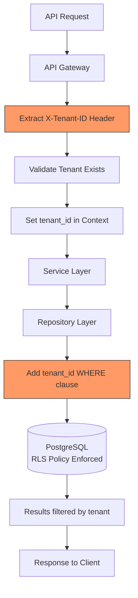
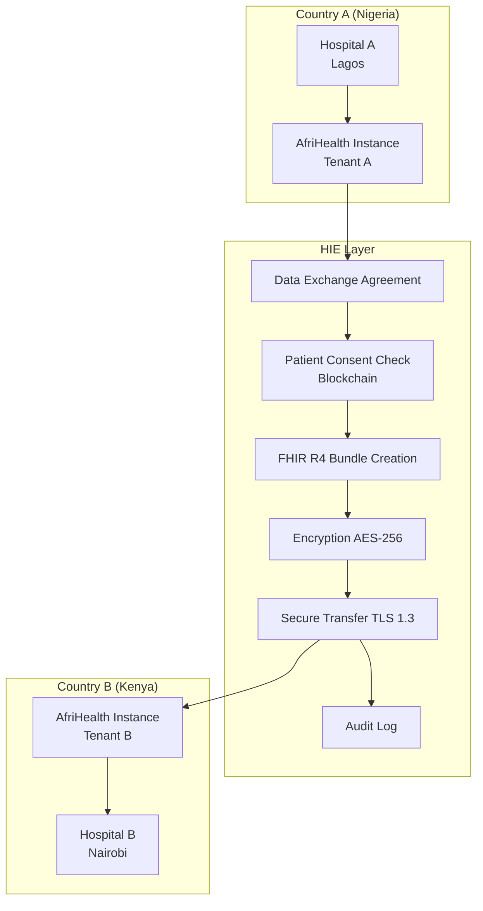

# Data Flow Document - AfriHealth ERP-Healthcare

## 1. Overview

This document maps the data flows across all AfriHealth services, covering patient data lifecycle, clinical workflow data, financial transactions, AI/ML data pipelines, and inter-service event flows.

---

## 2. Patient Data Lifecycle

---

## 3. Clinical Encounter Data Flow

---

## 4. Financial Data Flow

---

## 5. AI/ML Data Pipeline

---

## 6. Event Streaming Data Flow (Redpanda)

---

## 7. Blockchain Data Flow

```mermaid
flowchart TB
    subgraph "Consent Management"
        A1[Patient Grants Consent] --> A2[Blockchain Service]
        A2 --> A3[Hyperledger Fabric<br/>ConsentContract.GrantConsent]
        A3 --> A4[Consent Stored on Ledger]
        A5[Provider Requests Data] --> A6[Blockchain Service]
        A6 --> A7[ConsentContract.VerifyConsent]
        A7 --> A8{Valid?}
        A8 -->|Yes| A9[Allow Data Access]
        A8 -->|No| A10[Deny Access]
    end

    subgraph "Drug Supply Chain"
        B1[Manufacturer Registers Drug] --> B2[RegisterDrug on Ledger]
        B2 --> B3[Drug at Manufacturer]
        B3 --> B4[TransferDrug to Distributor]
        B4 --> B5[TransferDrug to Hospital]
        B5 --> B6[Pharmacist Verifies]
        B6 --> B7[VerifyDrug on Ledger]
        B7 --> B8{Authentic?}
        B8 -->|Yes| B9[Accept into Inventory]
        B8 -->|No| B10[ALERT: Counterfeit]
    end

    subgraph "Medical Credentials"
        C1[Issue Credential NFT] --> C2[IssueCredential on Ledger]
        C2 --> C3[Credential Active]
        C4[Verify Provider] --> C5[VerifyCredential]
        C5 --> C6{Valid + Not Expired?}
        C6 -->|Yes| C7[Provider Authorized]
        C6 -->|No| C8[Provider Not Authorized]
    end
```

---

## 8. Multi-Tenant Data Isolation Flow

---

## 9. Cross-Border Health Data Exchange

