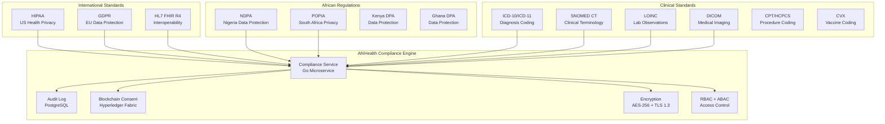
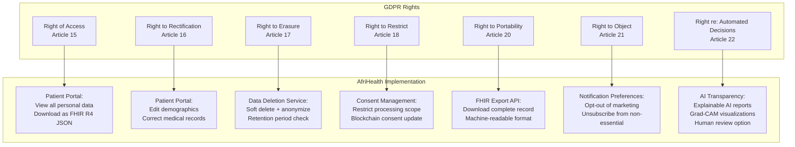
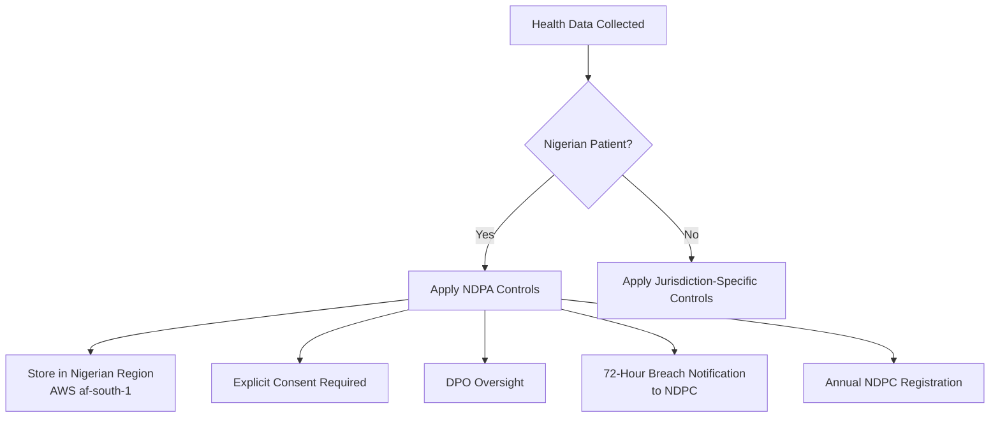
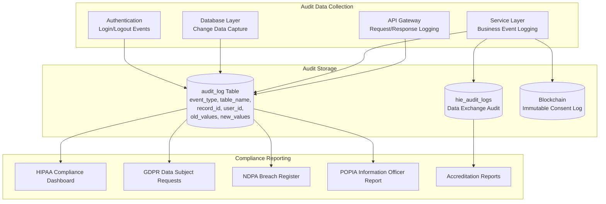

# Compliance and Regulatory Document - AfriHealth ERP-Healthcare

## 1. Overview

AfriHealth operates under a comprehensive multi-jurisdictional compliance framework covering healthcare data privacy, interoperability standards, and clinical coding systems across African and international regulatory landscapes.

---

## 2. Regulatory Framework Map

---

## 3. HIPAA Compliance

### 3.1 Administrative Safeguards (45 CFR 164.308)

| HIPAA Requirement | AfriHealth Implementation |
|---|---|
| Security Management Process | Risk assessments stored in `compliance_assessments` table; automated vulnerability scanning |
| Assigned Security Responsibility | Security Officer role in RBAC; compliance_policies table tracks ownership |
| Workforce Security | Staff background checks tracked in `staff_members.certifications`; termination access revocation |
| Information Access Management | Role-based access control with tenant + department + role granularity |
| Security Awareness Training | `compliance_trainings` table with mandatory HIPAA modules; `training_completions` tracking |
| Security Incident Procedures | `patient_safety_events` table; automated incident response workflows |
| Contingency Plan | Disaster recovery via Terraform; cross-region RDS replicas; automated backups |
| Evaluation | `compliance_audits` table; regular internal/external assessments |

### 3.2 Technical Safeguards (45 CFR 164.312)

| HIPAA Requirement | AfriHealth Implementation |
|---|---|
| Access Control (Unique User ID) | UUID-based user identification; JWT tokens with RS256 signing |
| Access Control (Emergency Access) | Break-the-glass procedure with mandatory audit logging and justification |
| Audit Controls | `audit_log` table captures ALL PHI access: event_type, table_name, record_id, user_id, old_values, new_values, ip_address |
| Integrity Controls | Database checksums; GORM hooks for version tracking; blockchain hash for critical records |
| Transmission Security | TLS 1.3 for all API communication; mTLS between microservices; VPN for site-to-site |
| Encryption | AES-256 at rest (RDS encryption); field-level encryption for SSN/national_id; biometric hash (one-way) |
| Authentication | Multi-factor authentication; JWT with 15-minute expiry; refresh token rotation |

### 3.3 Physical Safeguards (45 CFR 164.310)

| HIPAA Requirement | AfriHealth Implementation |
|---|---|
| Facility Access Controls | AWS data centers (SOC 2 certified); VPC with private subnets |
| Workstation Security | Client-side encryption; session timeout; remote wipe for mobile |
| Device and Media Controls | Encrypted EBS volumes; secure S3 bucket policies; data wipe procedures in `asset_disposals` |

### 3.4 Breach Notification (45 CFR 164.400)

- Automated breach detection through anomaly monitoring
- 72-hour notification workflow for affected individuals
- HHS notification for breaches affecting 500+ individuals
- `patient_safety_events` table tracks breach incidents
- Blockchain-backed audit trail provides non-repudiable evidence

---

## 4. GDPR Compliance (EU General Data Protection Regulation)

### 4.1 Lawful Basis for Processing (Article 6)

| Basis | Application in AfriHealth |
|---|---|
| Consent | Explicit consent captured in `consents` table; blockchain-backed in Hyperledger Fabric |
| Contract | Treatment agreement as part of patient enrollment |
| Legal Obligation | Mandatory disease reporting (surveillance-service) |
| Vital Interest | Emergency treatment without prior consent |
| Public Interest | Public health surveillance, immunization tracking |
| Legitimate Interest | Quality improvement, clinical research (with consent) |

### 4.2 Data Subject Rights Implementation

### 4.3 Data Protection Impact Assessment (DPIA)

Required for all AI/ML processing of health data:
- TB Detection AI: DPIA completed for automated medical image analysis
- Mental Health AI: DPIA for automated crisis detection from voice/text
- Clinical AI: DPIA for drug safety and diagnosis suggestions
- All AI outputs include confidence scores and require human verification

### 4.4 Data Processing Records (Article 30)

| Processing Activity | Purpose | Legal Basis | Data Categories | Recipients | Retention | Transfer |
|---|---|---|---|---|---|---|
| Patient Registration | Healthcare delivery | Contract + Consent | Demographics, Biometrics | Hospital staff | Patient lifetime + 10 years | Within tenant |
| Lab Testing | Diagnosis | Contract | Clinical specimens, results | Lab technicians, physicians | 10 years | Within tenant |
| AI TB Screening | Medical diagnosis | Consent + Public interest | Medical images | Radiologists, AI system | 10 years | None |
| Mental Health Chat | Therapeutic support | Explicit consent | Conversation text, mood data | Chatbot, counselors | 5 years or deletion request | None |
| Insurance Claims | Payment processing | Contract | Diagnosis, procedures, costs | Insurance companies | 7 years | To insurer |

---

## 5. Nigeria Data Protection Act (NDPA) 2023

### 5.1 Key Requirements

| NDPA Requirement | AfriHealth Implementation |
|---|---|
| Lawful Processing (Section 25) | Consent management via blockchain; processing registers maintained |
| Data Subject Rights (Section 34-40) | Patient portal with access, correction, deletion capabilities |
| Data Protection Officer (Section 29) | DPO role in organization service; contact details in privacy policy |
| Data Protection Impact Assessment (Section 28) | DPIA templates in compliance service for new AI features |
| Cross-Border Transfer (Section 41) | Data localization in AWS af-south-1; adequacy assessment for transfers |
| Breach Notification (Section 40) | 72-hour notification to NDPC; patient notification workflow |
| Registration with NDPC | Annual registration and renewal tracking in compliance_policies |
| Special Category Data | Health data classified as sensitive; explicit consent required; enhanced security |

### 5.2 NDPA-Specific Controls

---

## 6. POPIA Compliance (South Africa)

### 6.1 Eight Conditions for Lawful Processing

| POPIA Condition | AfriHealth Implementation |
|---|---|
| 1. Accountability | Information Officer designated; compliance policies active |
| 2. Processing Limitation | Purpose limitation enforced; minimum necessary data collection |
| 3. Purpose Specification | Data collected only for stated healthcare purposes |
| 4. Further Processing Limitation | Secondary use requires separate consent |
| 5. Information Quality | Data validation at entry; periodic data quality audits |
| 6. Openness | Privacy policy accessible; PAIA manual published |
| 7. Security Safeguards | AES-256 encryption; access controls; audit logging |
| 8. Data Subject Participation | Full access, correction, deletion via patient portal |

### 6.2 POPIA-Specific Technical Controls

- **Operator agreements**: Data processing agreements in `data_exchange_agreements` table
- **Information Regulator notification**: Registration with South African Information Regulator
- **Prior authorization**: Required for processing health data; tracked in `consents` table
- **Cross-border restrictions**: Section 72 compliance; adequacy assessments documented

---

## 7. HL7 FHIR R4 Compliance

### 7.1 Supported FHIR Resources

```mermaid
graph TB
    subgraph "Clinical Resources"
        P[Patient]
        E[Encounter]
        C[Condition]
        O[Observation]
        MR[MedicationRequest]
        MS[MedicationStatement]
        AP[AllergyIntolerance]
        IM[Immunization]
        PR[Procedure]
        DR[DiagnosticReport]
        CP[CarePlan]
    end

    subgraph "Administrative Resources"
        ORG[Organization]
        PRAC[Practitioner]
        LOC[Location]
        APT[Appointment]
        SCH[Schedule]
        SLT[Slot]
    end

    subgraph "Financial Resources"
        CLM[Claim]
        COV[Coverage]
        EOB[ExplanationOfBenefit]
        INV[Invoice]
    end

    subgraph "AfriHealth Mapping"
        FHIR[FHIR R4 API<br/>/fhir/r4/]
    end

    P & E & C & O & MR & MS & AP & IM & PR & DR & CP --> FHIR
    ORG & PRAC & LOC & APT & SCH & SLT --> FHIR
    CLM & COV & EOB & INV --> FHIR
```

### 7.2 FHIR Data Mapping Examples

| AfriHealth Table | FHIR Resource | Key Mappings |
|---|---|---|
| `patients` | Patient | `medical_record_number` -> `identifier`, `first_name` -> `name.given` |
| `encounters` | Encounter | `encounter_class` -> `class`, `status` -> `status` |
| `diagnoses` | Condition | `diagnosis_code` -> `code`, `severity` -> `severity` |
| `medications` | MedicationRequest | `medication_code` -> `medicationCodeableConcept` |
| `vital_signs` | Observation | `blood_pressure_systolic` -> `component[0].valueQuantity` |
| `laboratory_orders` | ServiceRequest | `test_code` (LOINC) -> `code` |
| `laboratory_results` | DiagnosticReport | `result_value` -> `result.valueQuantity` |
| `allergies` | AllergyIntolerance | `allergen_code` (SNOMED) -> `code` |
| `immunizations` | Immunization | `vaccine_code` (CVX) -> `vaccineCode` |

---

## 8. Clinical Coding Standards

### 8.1 ICD-10/ICD-11

- **Implementation**: `diagnoses.diagnosis_code` field stores ICD-10 codes
- **System support**: `diagnoses.diagnosis_code_system` supports both ICD-10 and ICD-11
- **AI assist**: Clinical AI service suggests ICD codes from clinical text with confidence scores

### 8.2 SNOMED CT

- **Implementation**: Used in `allergies.allergen_code` for standardized allergen identification
- **Cross-mapping**: SNOMED CT to ICD-10 mapping for diagnosis coding
- **Clinical notes**: SNOMED concepts linked to structured clinical findings

### 8.3 LOINC

- **Implementation**: `test_catalog.loinc_code` and `laboratory_orders.test_code` use LOINC identifiers
- **Result reporting**: Lab results mapped to LOINC observation codes for FHIR export
- **Universal lab orders**: Enables interoperability between laboratory systems

### 8.4 DICOM

- **Implementation**: Imaging AI service processes DICOM files (`pydicom.dcmread`)
- **PACS integration**: `radiology_orders.pacs_study_id` links to PACS storage
- **Window/Level**: Automatic DICOM window/level adjustment in TB detection preprocessing

### 8.5 CVX (Vaccine Codes)

- **Implementation**: `immunizations.vaccine_code` stores CVX codes
- **Registry reporting**: CVX codes used for national immunization registry submission

---

## 9. Audit and Compliance Infrastructure

---

## 10. Data Retention Policies

| Data Category | Retention Period | Legal Basis | Disposal Method |
|---|---|---|---|
| Patient demographics | Patient lifetime + 10 years | Healthcare regulations | Anonymization |
| Clinical records (encounters, notes) | 10 years from last encounter | Medical records law | Archival then anonymization |
| Lab results | 10 years | CLIA/CAP requirements | Secure deletion |
| Medical images (DICOM) | 10 years | Radiology standards | Secure deletion |
| Financial records (billing, payments) | 7 years | Tax regulations | Secure deletion |
| Insurance claims | 7 years | Insurance regulations | Secure deletion |
| Audit logs | 7 years | HIPAA/compliance | Read-only archive |
| Mental health conversations | 5 years or upon patient request | GDPR/NDPA | Secure deletion |
| AI model training data | Duration of model use + 2 years | Research/improvement | Anonymization |
| Blockchain records | Permanent | Immutable by design | N/A |
| Consent records | Permanent | Legal requirements | N/A |
