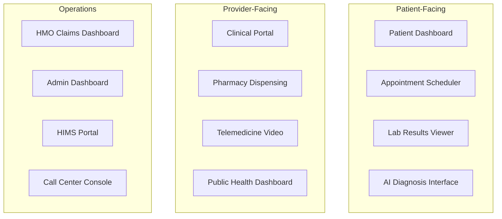

# Figma Design Prompts - AfriHealth ERP-Healthcare

## 1. Overview

This document provides detailed Figma design prompts for 12 key interfaces in the AfriHealth platform. Each prompt includes layout specifications, component hierarchies, interaction patterns, and accessibility requirements. Designs should follow Material Design 3 with AfriHealth brand colors (Primary: #1B5E20 Forest Green, Secondary: #FF6F00 Amber, Accent: #0D47A1 Blue).

---

## 2. Screen Architecture



---

## 3. Prompt 1: Patient Dashboard (Mobile-First)

**Design a mobile-first patient dashboard for AfriHealth's Flutter app.** Layout: Bottom navigation bar with 5 tabs (Home, Appointments, Records, Messages, Profile). Home screen shows: (1) Greeting card with patient name and next appointment countdown, (2) Health summary cards in horizontal scroll -- vitals trend sparkline, active medications count, pending lab results badge, (3) Quick action buttons: Book Appointment, View Results, Start Telemedicine, Refill Prescription, (4) Recent activity timeline showing last 5 events (visit, lab result, prescription, payment). Use card-based design with rounded corners (12dp radius). Color code vital signs: green for normal, amber for borderline, red for abnormal. Include biometric login prompt. Support dark mode. Add emergency SOS floating action button (red) that connects to crisis hotline. Accessibility: minimum 44x44 touch targets, WCAG AA contrast ratios, support for screen readers.

---

## 4. Prompt 2: Clinical Portal (Provider Desktop)

**Design a desktop clinical portal for healthcare providers using React.** Three-panel layout: Left sidebar (240px) with patient list and search, Center panel (flex) with patient chart, Right panel (320px collapsible) with AI assistant and CDSS alerts. Patient chart center panel contains: (a) Patient banner at top with photo, name, MRN, age, gender, allergies (red badges), (b) Tabbed navigation: Summary, Encounters, Problems, Medications, Labs, Imaging, Notes, Care Plans, (c) Summary tab shows problem list, medication list, allergy list, recent vitals chart, and upcoming appointments. AI assistant panel shows: real-time CDSS alerts with severity badges (critical=red, warning=amber, info=blue), drug interaction warnings, AI-suggested diagnoses with confidence percentages, and voice-to-text note input. Include breadcrumb navigation. Support split-screen for comparing encounters. Add keyboard shortcuts overlay (? key).

---

## 5. Prompt 3: Appointment Scheduler

**Design an appointment scheduling interface used by both patients (mobile) and call center agents (desktop).** Calendar view with three modes: Day (vertical timeline 7am-7pm with 15-min slots), Week (7 columns), Month (grid with appointment counts). Each appointment slot shows: patient name, appointment type (color-coded: blue=consultation, green=follow-up, orange=procedure, red=emergency), duration bar, doctor name. Include left sidebar with doctor filter, specialty filter, department filter, and date picker. For booking: slide-up modal with patient search (autocomplete), reason for visit, preferred doctor, preferred time range, and insurance verification status. Show real-time availability with green=available, gray=booked, striped=blocked. Include waitlist management for fully booked slots. Show appointment stats bar: total scheduled, confirmed, pending, cancelled, no-show.

---

## 6. Prompt 4: Lab Results Viewer

**Design a lab results viewer for both patient portal and provider interface.** Two-view toggle: Timeline view and Table view. Timeline view: vertical timeline grouped by date, each result as an expandable card showing test name, value with unit, reference range bar (visual indicator where result falls), abnormal flag (H/L badge), critical flag (red exclamation). Table view: sortable columns (Date, Test, Result, Unit, Range, Status), filterable by category (Chemistry, Hematology, Microbiology), searchable by test name. Detail panel (slide-in from right) shows: complete result with all parameters, trend chart (sparkline of last 6 values for each parameter), reference range visualization (horizontal bar with green zone and current value marker), ordering physician, specimen details, verification status. Include PDF download and FHIR export buttons. For critical results, show red banner with mandatory acknowledgment checkbox.

---

## 7. Prompt 5: Pharmacy Dispensing Interface

**Design a pharmacy dispensing workstation interface for pharmacists.** Three-column layout: (1) Prescription Queue (left, 280px) -- list of pending prescriptions sorted by priority (stat first), each item shows patient name, doctor, urgency badge, time since ordered, (2) Prescription Detail (center) -- full prescription with drug name, dosage, quantity, instructions, substitutability flag, patient allergies alert box, drug interaction check results (from AI), blockchain verification status for each drug batch, (3) Dispensing Panel (right, 300px) -- barcode scanner input, batch selection dropdown, quantity to dispense, patient ID verification (fingerprint or photo match), dispensing notes, and Dispense button. Include inventory sidebar showing stock levels with color-coded bars (green >50%, yellow 20-50%, red <20%). Show controlled substance tracking panel for Schedule II-V drugs. Add batch expiry alerts.

---

## 8. Prompt 6: Telemedicine Video Consultation

**Design a telemedicine video consultation interface.** Full-screen video layout: Main video feed (patient or provider, switchable), Pip video thumbnail (120x90, draggable), Control bar at bottom (microphone toggle, camera toggle, screen share, end call, more options). Right sidebar (collapsible, 360px) with tabs: Chat (real-time messaging with file sharing), Notes (SOAP note entry during call), Prescribe (in-session prescription creation), Vitals (patient-reported vitals entry). Pre-call waiting room: show estimated wait time, connection quality indicator (bars), camera/mic preview with test button, patient intake form completion status. Post-call: rating prompt (5 stars), follow-up scheduling option, prescription summary, visit summary for patient. Include network quality indicator (green/yellow/red), recording consent toggle, interpreter request button. Design for low-bandwidth mode: audio-only fallback with avatar placeholder.

---

## 9. Prompt 7: HMO Claims Dashboard

**Design an insurance claims management dashboard for HMO officers.** Top metrics bar: Total Claims (count), Approved Amount (currency), Pending Review (count), Rejection Rate (percentage with trend arrow). Main content: filterable data table of claims with columns (Claim #, Patient, Hospital, Service Date, Amount, Status badge, Age in days). Status badges: Submitted=blue, Under Review=amber, Approved=green, Rejected=red, Paid=dark green, Partially Paid=teal. Claim detail panel (slide-in): patient demographics, enrollment details with coverage remaining, diagnosis codes (ICD-10 with descriptions), procedure codes (CPT), itemized charges, supporting documents viewer, approval/rejection workflow with reason selection dropdown and notes field. Include batch processing: select multiple claims and approve/reject with bulk action. Analytics tab: claims by type (pie chart), approval rate trend (line chart), average processing time (bar chart), top rejection reasons (horizontal bar).

---

## 10. Prompt 8: Admin Dashboard

**Design an executive admin dashboard for hospital administrators.** Dashboard grid layout with draggable/resizable widgets. Key widgets: (1) Occupancy gauge (circular progress showing bed occupancy %), (2) Revenue KPI cards (Today, This Week, This Month with comparison to previous period), (3) Patient flow funnel (Registration -> Triage -> Consultation -> Discharge), (4) Department performance heatmap (rows=departments, columns=metrics like wait time, satisfaction, throughput), (5) Staff on duty counter by role (doctors, nurses, technicians), (6) Real-time alerts feed (critical lab results, system alerts, compliance deadlines), (7) Appointment volume chart (hourly bars for today), (8) Outstanding bills aging chart (stacked bar 0-30, 31-60, 61-90, 91+). Include date range selector, tenant/facility picker, and export to PDF/Excel. Support fullscreen mode for wall-mounted displays. Dark theme option for 24/7 operations centers.

---

## 11. Prompt 9: HIMS Portal

**Design a Health Information Management System portal for multi-facility healthcare organizations.** Navigation: Left sidebar with Organization tree (hierarchical facility/department/ward view), Top bar with facility selector dropdown. Main sections: (1) Organization Dashboard -- facility map with status indicators, KPIs by facility, (2) Staff Directory -- searchable grid with photo, name, role, department, license status badge, (3) Quality Metrics -- indicator scorecards with traffic light status (red/amber/green), trend sparklines, benchmark comparison, (4) Compliance Center -- framework tabs (HIPAA, NDPA, POPIA), assessment progress rings, upcoming audit dates, policy document library, (5) Asset Management -- equipment inventory grid with maintenance status, calibration due dates, utilization charts, (6) HIE (Health Information Exchange) -- data exchange request management, consent status overview, transaction logs. Include multi-language toggle (EN, FR, SW, HA, YO). Support print-friendly views for regulatory submissions.

---

## 12. Prompt 10: Call Center Console

**Design a call center agent console optimized for rapid patient interaction.** Three-panel workspace: (1) Call controls header bar -- incoming call notification with caller ID, patient lookup result, call timer, hold/transfer/conference buttons, call disposition selector, (2) Patient context panel (left 40%) -- auto-populated patient card when matched by phone, recent encounters timeline, upcoming appointments, outstanding balances, active medications, allergies prominently displayed, (3) Action panel (right 60%) -- tabbed: Schedule Appointment (calendar with availability), Triage (symptom checklist with urgency scoring), Transfer (department directory with availability status), Notes (call notes with template quick-select). Include canned response templates for common queries. Show queue statistics: calls waiting, average wait time, agents available. CTI integration indicators. Support screen-pop on incoming call with patient data pre-loaded.

---

## 13. Prompt 11: Public Health Dashboard

**Design a public health surveillance dashboard for epidemiologists and health officers.** Full-width map-centric layout: (1) Interactive choropleth map of Africa showing disease incidence by region (color intensity), with toggle layers for different diseases (Malaria, TB, COVID, Cholera, Measles), (2) Epidemic curve chart below map (time series of new cases), (3) Right sidebar: Disease selector, date range, geographic filter, (4) Key metrics cards: Active Cases, New Cases (24h), Mortality Rate, Vaccination Coverage %, (5) Outbreak alert banner (red) when statistical threshold exceeded, (6) Immunization coverage heatmap by region, (7) Climate-health correlation panel showing weather data alongside disease trends, (8) Data export for WHO/CDC reporting formats. Include real-time refresh indicator. Support drill-down from country to state to facility level. Add prediction overlay showing AI-forecasted case trends (dashed line with confidence interval shading).

---

## 14. Prompt 12: AI Diagnosis Interface

**Design an AI-assisted diagnosis interface for radiologists and clinicians.** Split-screen layout: Left panel (60%) -- medical image viewer with DICOM support, zoom/pan/window-level controls, measurement tools, annotation capability. Right panel (40%) -- AI analysis results: (1) Primary finding with confidence percentage bar, (2) Severity indicator (Minimal/Moderate/Advanced with color), (3) Detected findings checklist (Cavitation, Miliary Pattern, Pleural Effusion, Lymphadenopathy) with individual confidence scores, (4) Grad-CAM heatmap overlay toggle (shows which regions AI focused on), (5) Affected regions diagram (lung schematic with highlighted zones), (6) AI-generated recommendations list, (7) Differential diagnosis suggestions ranked by probability, (8) Clinical decision: Accept AI Finding / Override with Reason dropdown / Request Second Opinion button. Include comparison view: current image vs. prior study side-by-side. Show model information: model name, version, sensitivity/specificity metrics. Add clinical disclaimer banner. History panel showing previous AI analyses for this patient.

---

## 15. Design System Tokens

```
Colors:
  Primary:    #1B5E20 (Forest Green - Trust, Health)
  Secondary:  #FF6F00 (Amber - Urgency, Attention)
  Accent:     #0D47A1 (Blue - Technology, Reliability)
  Error:      #C62828 (Red)
  Warning:    #E65100 (Orange)
  Success:    #2E7D32 (Green)
  Background: #FAFAFA (Light) / #121212 (Dark)

Typography:
  Headings:   Inter (600, 700)
  Body:       Inter (400, 500)
  Monospace:  JetBrains Mono (lab results, codes)

Spacing:     4px base unit (4, 8, 12, 16, 24, 32, 48, 64)
Border Radius: 4px (buttons), 8px (cards), 12px (modals), 24px (pills)
Elevation:   0dp (flat), 1dp (cards), 4dp (menus), 8dp (modals), 16dp (notifications)
```
