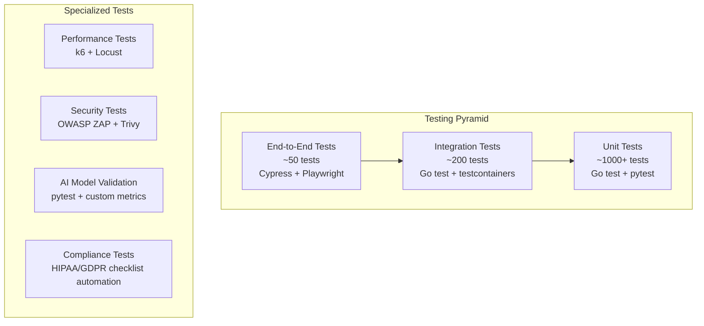
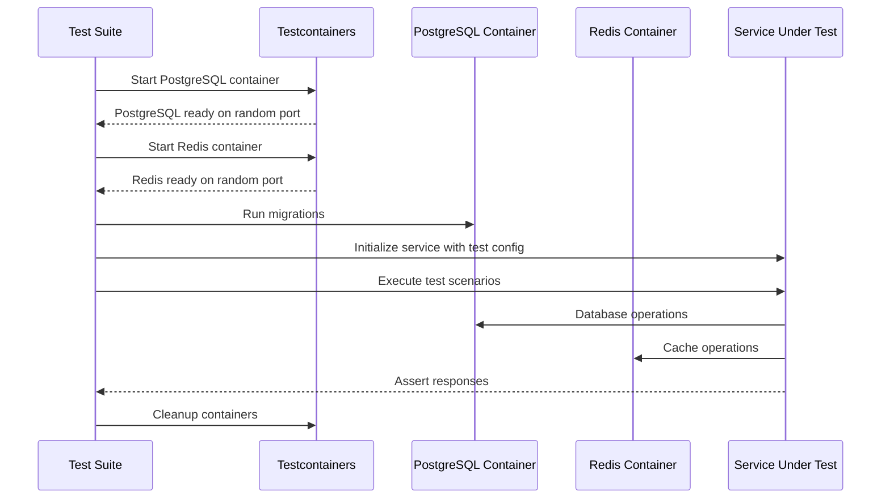
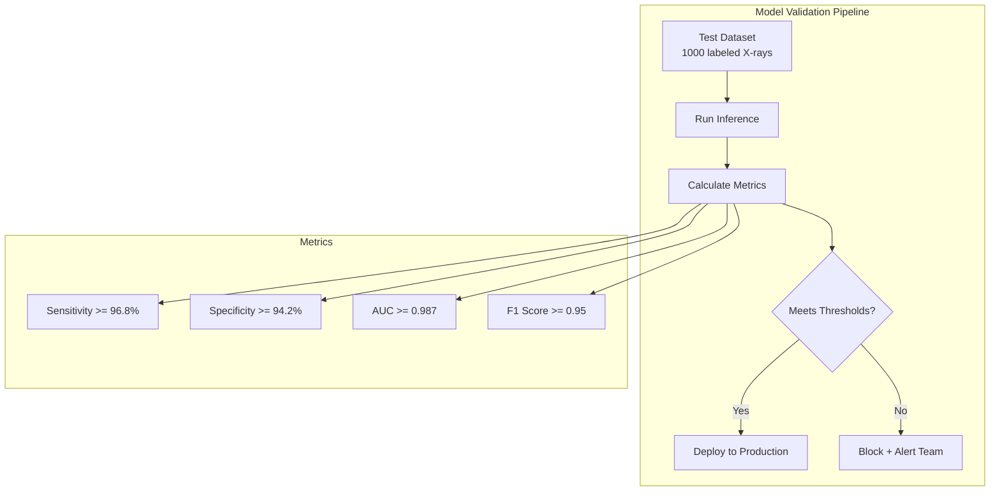

# Testing Strategy Document - AfriHealth ERP-Healthcare

## 1. Overview

AfriHealth employs a comprehensive multi-level testing strategy covering unit tests, integration tests, end-to-end tests, performance tests, security tests, and AI model validation tests.

---

## 2. Testing Pyramid



---

## 3. Unit Testing

### 3.1 Go Services (go test)

```go
// Example: appointment_service_test.go
func TestCreateAppointment_Success(t *testing.T) {
    mockRepo := new(MockAppointmentRepository)
    mockRepo.On("Create", mock.Anything).Return(nil)

    svc := NewAppointmentService(mockRepo, nil, nil)
    req := CreateAppointmentRequest{
        PatientID:       "patient-uuid",
        DoctorID:        "doctor-uuid",
        AppointmentDate: time.Now().Add(24 * time.Hour),
        Duration:        30,
        Type:            "consultation",
        Reason:          "Follow-up",
    }

    apt, err := svc.CreateAppointment(tenantID, req)
    assert.NoError(t, err)
    assert.Equal(t, "scheduled", apt.Status)
    mockRepo.AssertExpectations(t)
}
```

### 3.2 Python AI Services (pytest)

```python
# Example: test_tb_detection.py
def test_tb_detection_normal_xray():
    detector = ChestXRayTBDetector()
    result = detector.detect_tb("test_data/normal_xray.png")
    assert result.prediction == TBPrediction.NORMAL
    assert result.confidence > 0.8
    assert result.tb_probability < 0.2

def test_tb_detection_active_tb():
    detector = ChestXRayTBDetector()
    result = detector.detect_tb("test_data/active_tb.png")
    assert result.prediction == TBPrediction.TB_ACTIVE
    assert result.confidence > 0.85
    assert result.severity is not None
```

---

## 4. Integration Testing



---

## 5. AI Model Validation



---

## 6. Coverage Targets

| Component | Coverage Target | Current |
|-----------|----------------|---------|
| Go Services (business logic) | 80% | Tracked |
| Go Handlers | 70% | Tracked |
| Python AI Services | 85% | Tracked |
| React Components | 75% | Tracked |
| Database Migrations | 100% (all run successfully) | Tracked |
| API Endpoints | 100% (all have integration tests) | Tracked |
