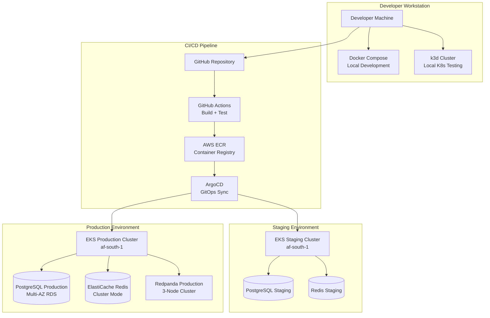
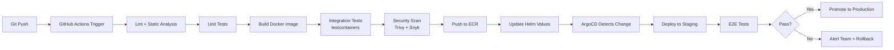
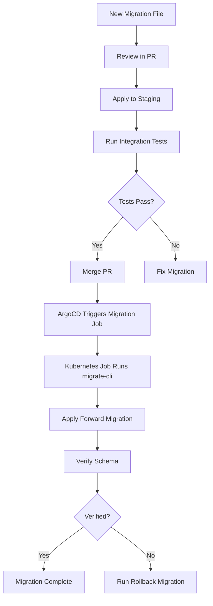
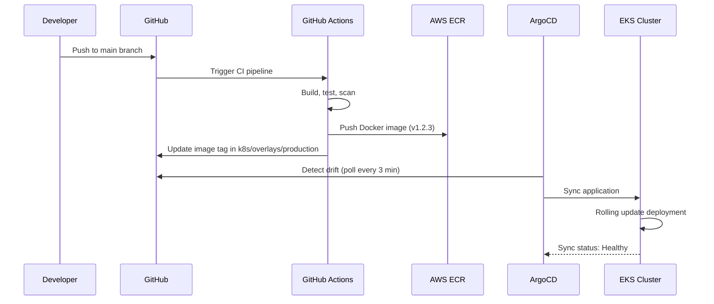

# Deployment Guide - AfriHealth ERP-Healthcare

## 1. Overview

This guide covers the complete deployment lifecycle for AfriHealth, from local development environments to production deployment on AWS infrastructure across African regions. The platform deploys 33 Go microservices, 11 Python AI/ML services, 4 React frontends, Flutter mobile apps, and supporting infrastructure.

---

## 2. Deployment Architecture



---

## 3. Prerequisites

### 3.1 Development Tools

| Tool | Version | Purpose |
|------|---------|---------|
| Go | 1.22+ | Microservice development |
| Python | 3.11+ | AI/ML services |
| Node.js | 20 LTS | React frontends |
| Flutter | 3.19+ | Mobile app development |
| Docker | 24+ | Containerization |
| Docker Compose | 2.24+ | Local orchestration |
| kubectl | 1.29+ | Kubernetes CLI |
| Terraform | 1.7+ | Infrastructure provisioning |
| Helm | 3.14+ | Kubernetes package management |
| ArgoCD CLI | 2.10+ | GitOps deployment |
| AWS CLI | 2.15+ | AWS resource management |

### 3.2 AWS Account Configuration

```bash
# Configure AWS credentials for af-south-1 (Cape Town)
aws configure --profile afrihealth-prod
# AWS Access Key ID: [from IAM]
# AWS Secret Access Key: [from IAM]
# Default region name: af-south-1
# Default output format: json

# Verify access
aws sts get-caller-identity --profile afrihealth-prod
```

---

## 4. Local Development Setup

### 4.1 Docker Compose Environment

```bash
# Clone repository
git clone https://github.com/afrihealth/erp-healthcare.git
cd erp-healthcare

# Start all infrastructure services
docker-compose up -d postgres redis redpanda elasticsearch

# Wait for infrastructure readiness
./scripts/wait-for-infra.sh

# Run database migrations
./scripts/run-migrations.sh

# Start all application services
docker-compose up -d

# Verify all services are running
docker-compose ps
```

### 4.2 Service Port Mapping

| Service | Port | Health Check |
|---------|------|-------------|
| API Gateway | 8080 | /health |
| Patient Service | 8081 | /health |
| Appointment Service | 8082 | /health |
| Lab Service | 8083 | /health |
| Pharmacy Service | 8084 | /health |
| HMO Service | 8085 | /health |
| Payment Service | 8086 | /health |
| Hospital Service | 8087 | /health |
| Telemedicine Service | 8088 | /health |
| Notification Service | 8089 | /health |
| Supply Chain Service | 8090 | /health |
| Imaging AI | 9001 | /health |
| Clinical AI | 9002 | /health |
| Mental Health AI | 9003 | /health |
| PostgreSQL | 5432 | pg_isready |
| Redis | 6379 | PING |
| Redpanda | 9092 | rpk cluster health |
| Elasticsearch | 9200 | /_cluster/health |

### 4.3 Local Kubernetes (k3d)

```bash
# Create local k3d cluster
k3d cluster create afrihealth-dev \
  --servers 1 \
  --agents 3 \
  --port "8080:80@loadbalancer" \
  --port "8443:443@loadbalancer"

# Load local images into k3d
k3d image import afrihealth/patient-service:dev \
  -c afrihealth-dev

# Apply Kubernetes manifests
kubectl apply -k k8s/overlays/development/
```

---

## 5. Container Build Process

### 5.1 Go Service Dockerfile (Multi-stage)

```dockerfile
# Build stage
FROM golang:1.22-alpine AS builder
WORKDIR /app
COPY go.mod go.sum ./
RUN go mod download
COPY . .
RUN CGO_ENABLED=0 GOOS=linux GOARCH=amd64 \
    go build -ldflags="-s -w -X main.version=${VERSION}" \
    -o /bin/service ./cmd/server

# Runtime stage
FROM gcr.io/distroless/static-debian12:nonroot
COPY --from=builder /bin/service /bin/service
COPY --from=builder /app/migrations /migrations
USER nonroot:nonroot
EXPOSE 8080
ENTRYPOINT ["/bin/service"]
```

### 5.2 Python AI Service Dockerfile

```dockerfile
FROM python:3.11-slim AS builder
WORKDIR /app
COPY requirements.txt .
RUN pip install --no-cache-dir --prefix=/install -r requirements.txt

FROM python:3.11-slim
WORKDIR /app
COPY --from=builder /install /usr/local
COPY . .
# Download AI models at build time
RUN python -c "from models import download_models; download_models()"
USER nobody
EXPOSE 8000
CMD ["uvicorn", "main:app", "--host", "0.0.0.0", "--port", "8000"]
```

### 5.3 Build Pipeline



---

## 6. Infrastructure Provisioning (Terraform)

### 6.1 Terraform Module Structure

```
infra/terraform/
├── environments/
│   ├── staging/
│   │   ├── main.tf
│   │   ├── variables.tf
│   │   └── terraform.tfvars
│   └── production/
│       ├── main.tf
│       ├── variables.tf
│       └── terraform.tfvars
├── modules/
│   ├── networking/          # VPC, subnets, NAT, security groups
│   ├── compute/
│   │   ├── kubernetes/      # EKS cluster, node groups
│   │   └── instances/       # Bastion hosts
│   ├── database/
│   │   ├── postgresql/      # RDS PostgreSQL Multi-AZ
│   │   ├── redis/           # ElastiCache Redis cluster
│   │   └── timescaledb/     # TimescaleDB for IoT
│   ├── security/
│   │   ├── kms/             # Encryption keys
│   │   ├── secrets/         # Secrets Manager
│   │   └── iam/             # IAM roles and policies
│   ├── monitoring/          # CloudWatch, Prometheus
│   ├── storage/             # S3 buckets, EFS
│   └── backup/              # Automated backup policies
```

### 6.2 Production Provisioning

```bash
# Initialize Terraform
cd infra/terraform/environments/production
terraform init -backend-config=backend.hcl

# Plan changes
terraform plan -out=production.tfplan

# Apply infrastructure
terraform apply production.tfplan

# Get EKS cluster credentials
aws eks update-kubeconfig \
  --name afrihealth-production \
  --region af-south-1 \
  --profile afrihealth-prod
```

### 6.3 Key Terraform Resources

```hcl
# EKS Cluster Configuration
module "eks" {
  source          = "../../modules/compute/kubernetes"
  cluster_name    = "afrihealth-production"
  cluster_version = "1.29"

  vpc_id     = module.networking.vpc_id
  subnet_ids = module.networking.private_subnet_ids

  node_groups = {
    general = {
      instance_types = ["m6i.xlarge"]
      min_size       = 3
      max_size       = 10
      desired_size   = 5
    }
    ai_workloads = {
      instance_types = ["g5.xlarge"]  # GPU instances
      min_size       = 1
      max_size       = 4
      desired_size   = 2
      labels = { "workload-type" = "ai-inference" }
      taints = [{ key = "nvidia.com/gpu", value = "true", effect = "NO_SCHEDULE" }]
    }
  }
}

# RDS PostgreSQL Multi-AZ
module "postgresql" {
  source              = "../../modules/database/postgresql"
  identifier          = "afrihealth-production"
  engine_version      = "16.2"
  instance_class      = "db.r6g.2xlarge"
  allocated_storage   = 500
  multi_az            = true
  storage_encrypted   = true
  kms_key_id          = module.kms.key_arn
  backup_retention    = 35
  deletion_protection = true
}
```

---

## 7. Kubernetes Deployment

### 7.1 Namespace Organization

```bash
# Create namespaces
kubectl create namespace afrihealth-services
kubectl create namespace afrihealth-ai
kubectl create namespace afrihealth-infra
kubectl create namespace afrihealth-monitoring
kubectl create namespace afrihealth-blockchain
```

### 7.2 Helm Chart Structure

```yaml
# charts/afrihealth/values-production.yaml
global:
  environment: production
  region: af-south-1
  imageRegistry: 123456789.dkr.ecr.af-south-1.amazonaws.com

services:
  patient-service:
    replicas: 3
    resources:
      requests:
        cpu: 500m
        memory: 512Mi
      limits:
        cpu: "1"
        memory: 1Gi
    autoscaling:
      enabled: true
      minReplicas: 3
      maxReplicas: 10
      targetCPUUtilization: 70

  imaging-ai:
    replicas: 2
    resources:
      requests:
        cpu: "2"
        memory: 4Gi
        nvidia.com/gpu: 1
      limits:
        cpu: "4"
        memory: 8Gi
        nvidia.com/gpu: 1
    nodeSelector:
      workload-type: ai-inference
    tolerations:
      - key: nvidia.com/gpu
        operator: Exists
        effect: NoSchedule

database:
  host: afrihealth-production.cluster-xxxxx.af-south-1.rds.amazonaws.com
  port: 5432
  sslMode: require

redis:
  host: afrihealth-production.xxxxx.0001.afs1.cache.amazonaws.com
  port: 6379
  tls: true

redpanda:
  brokers:
    - redpanda-0.redpanda.afrihealth-infra.svc:9092
    - redpanda-1.redpanda.afrihealth-infra.svc:9092
    - redpanda-2.redpanda.afrihealth-infra.svc:9092
```

### 7.3 Service Deployment Manifest

```yaml
apiVersion: apps/v1
kind: Deployment
metadata:
  name: patient-service
  namespace: afrihealth-services
spec:
  replicas: 3
  strategy:
    type: RollingUpdate
    rollingUpdate:
      maxSurge: 1
      maxUnavailable: 0
  selector:
    matchLabels:
      app: patient-service
  template:
    metadata:
      labels:
        app: patient-service
        version: v1
    spec:
      serviceAccountName: patient-service
      containers:
        - name: patient-service
          image: 123456789.dkr.ecr.af-south-1.amazonaws.com/patient-service:v1.2.3
          ports:
            - containerPort: 8080
          envFrom:
            - secretRef:
                name: patient-service-secrets
            - configMapRef:
                name: patient-service-config
          readinessProbe:
            httpGet:
              path: /health
              port: 8080
            initialDelaySeconds: 5
            periodSeconds: 10
          livenessProbe:
            httpGet:
              path: /health
              port: 8080
            initialDelaySeconds: 15
            periodSeconds: 20
          resources:
            requests:
              cpu: 500m
              memory: 512Mi
            limits:
              cpu: "1"
              memory: 1Gi
```

---

## 8. Database Migration Strategy

### 8.1 Migration Workflow



### 8.2 Migration Execution

```bash
# Apply migrations to production (via Kubernetes Job)
kubectl apply -f - <<EOF
apiVersion: batch/v1
kind: Job
metadata:
  name: db-migrate-v1.2.3
  namespace: afrihealth-services
spec:
  template:
    spec:
      containers:
        - name: migrate
          image: 123456789.dkr.ecr.af-south-1.amazonaws.com/db-migrations:v1.2.3
          command: ["migrate", "-path", "/migrations", "-database", "$(DATABASE_URL)", "up"]
          envFrom:
            - secretRef:
                name: database-credentials
      restartPolicy: Never
  backoffLimit: 3
EOF
```

---

## 9. GitOps with ArgoCD

### 9.1 ArgoCD Application

```yaml
apiVersion: argoproj.io/v1alpha1
kind: Application
metadata:
  name: afrihealth-production
  namespace: argocd
spec:
  project: afrihealth
  source:
    repoURL: https://github.com/afrihealth/erp-healthcare.git
    targetRevision: main
    path: k8s/overlays/production
  destination:
    server: https://kubernetes.default.svc
    namespace: afrihealth-services
  syncPolicy:
    automated:
      prune: true
      selfHeal: true
    syncOptions:
      - CreateNamespace=true
      - ApplyOutOfSyncOnly=true
    retry:
      limit: 3
      backoff:
        duration: 5s
        maxDuration: 3m
        factor: 2
```

### 9.2 Deployment Flow



---

## 10. Production Deployment Checklist

### Pre-Deployment

- [ ] All CI tests passing (unit, integration, E2E)
- [ ] Security scan clean (Trivy, Snyk)
- [ ] Database migration tested in staging
- [ ] Performance benchmarks within thresholds
- [ ] Rollback plan documented
- [ ] On-call team notified
- [ ] Change request approved

### During Deployment

- [ ] Monitor deployment progress in ArgoCD
- [ ] Watch Grafana dashboards for anomalies
- [ ] Verify health endpoints for all services
- [ ] Run smoke tests against production
- [ ] Check error rates in Prometheus

### Post-Deployment

- [ ] Verify all services healthy in Kubernetes
- [ ] Confirm database migrations applied
- [ ] Check Redpanda consumer lag
- [ ] Validate AI model endpoints responding
- [ ] Run synthetic monitoring tests
- [ ] Update deployment log
- [ ] Close change request

---

## 11. Rollback Procedures

### 11.1 Service Rollback

```bash
# Rollback to previous revision via kubectl
kubectl rollout undo deployment/patient-service \
  -n afrihealth-services

# Rollback to specific revision
kubectl rollout undo deployment/patient-service \
  -n afrihealth-services --to-revision=3

# Monitor rollback
kubectl rollout status deployment/patient-service \
  -n afrihealth-services
```

### 11.2 Database Rollback

```bash
# Run down migration (revert last migration)
kubectl apply -f - <<EOF
apiVersion: batch/v1
kind: Job
metadata:
  name: db-rollback-v1.2.3
  namespace: afrihealth-services
spec:
  template:
    spec:
      containers:
        - name: migrate
          image: 123456789.dkr.ecr.af-south-1.amazonaws.com/db-migrations:v1.2.3
          command: ["migrate", "-path", "/migrations", "-database", "$(DATABASE_URL)", "down", "1"]
          envFrom:
            - secretRef:
                name: database-credentials
      restartPolicy: Never
  backoffLimit: 1
EOF
```

---

## 12. Environment Configuration

### 12.1 Environment Variables per Service

| Variable | Description | Example |
|----------|-------------|---------|
| `APP_ENV` | Environment name | production |
| `APP_PORT` | Service listen port | 8080 |
| `DB_HOST` | PostgreSQL host | afrihealth-prod.rds.amazonaws.com |
| `DB_PORT` | PostgreSQL port | 5432 |
| `DB_NAME` | Database name | afrihealth |
| `DB_USER` | Database user | afrihealth_app |
| `DB_PASSWORD` | Database password | (from Secrets Manager) |
| `DB_SSL_MODE` | SSL mode | require |
| `REDIS_HOST` | Redis host | afrihealth-prod.cache.amazonaws.com |
| `REDIS_PORT` | Redis port | 6379 |
| `KAFKA_BROKERS` | Redpanda brokers | redpanda-0:9092,redpanda-1:9092 |
| `JWT_SECRET` | JWT signing key | (from Secrets Manager) |
| `X_TENANT_REQUIRED` | Enforce multi-tenancy | true |
| `ENCRYPTION_KEY` | AES-256 key | (from KMS) |
| `AWS_REGION` | AWS region | af-south-1 |
| `S3_BUCKET` | Storage bucket | afrihealth-prod-storage |
| `LOG_LEVEL` | Logging level | info |

### 12.2 Secrets Management

```bash
# Store secrets in AWS Secrets Manager
aws secretsmanager create-secret \
  --name afrihealth/production/database \
  --secret-string '{"username":"afrihealth_app","password":"xxx"}' \
  --region af-south-1

# Kubernetes ExternalSecrets Operator syncs secrets
apiVersion: external-secrets.io/v1beta1
kind: ExternalSecret
metadata:
  name: database-credentials
  namespace: afrihealth-services
spec:
  refreshInterval: 1h
  secretStoreRef:
    name: aws-secrets-manager
    kind: ClusterSecretStore
  target:
    name: database-credentials
  data:
    - secretKey: DB_PASSWORD
      remoteRef:
        key: afrihealth/production/database
        property: password
```
